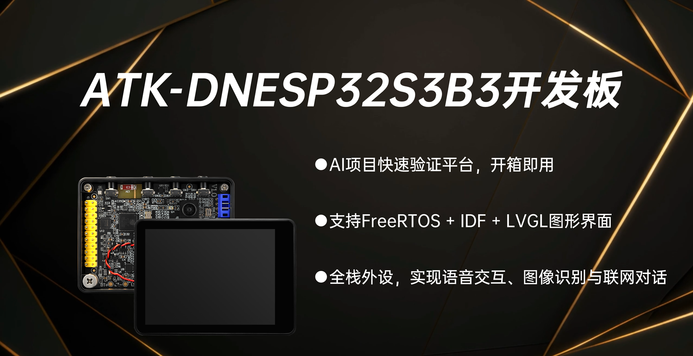

# 目录

- **入门指南**
  - [产品验收](./start-guide/product-acceptance.md)
  - [配套资料下载](./start-guide/download.md)
  - [DNESP32S3 BOX3 介绍](./start-guide/dnesp32s3-box3-introduction.md)
  - [ESP32S3 与 ESP-IDF 介绍](./start-guide/esp32s3-and-idf-introduction.md)
  - [固件烧录](./start-guide/firmware-flash.md)
  - [常见问题汇总（FAQ）](./start-guide/FAQ.md)

- **开发环境搭建**
  - [VSCode IDE 安装](./set-up-development-environment/vscode-ide-install.md)
  - [ESP-IDF 安装](./set-up-development-environment/esp-idf-install.md)

- **IDF基础实验**
  - [按键输入实验](./example-idf/key.md)
  - [外部中断实验](./example-idf/exit.md)
  - [串口实验](./example-idf/uart.md)
  - [ESPTIMER实验](./example-idf/esptimer.md)
  - [TIMG实验](./example-idf/timg.md)
  - [IIC_EXIO实验](./example-idf/iic_exio.md)
  - [SPI-LCD实验](./example-idf/lcd.md)
  - [RTC实验](./example-idf/rtc.md)
  - [ADC实验](./example-idf/adc.md)
  - [RNG随机数实验](./example-idf/rng.md)
  - [内部温湿度传感器实验](./example-idf/internal_temperature.md)
  - [三轴传感器实验](./example-idf/camera.md)
  - [触摸屏实验](./example-idf/touch.md)
  - [照相机实验](./example-idf/audio.md)
  - [SD卡实验](./example-idf/sd_card.md)
  - [文件系统实验](./example-idf/spiffs.md)
  - [汉字实验](./example-idf/chinese.md)
  - [图片实验](./example-idf/picture.md)
  - [音乐播放器实验](./example-idf/music.md)
  - [录音机实验](./example-idf/photo.md)
  - [视频播放器实验](./example-idf/video.md)
  - [USB虚拟串口实验](./example-idf/usb_slave.md)
  - [Flash模拟U盘实验](./example-idf/usb_flash_u.md)
  - [SD卡模拟U盘实验](./example-idf/usb_sd_u.md)

- **扩展实验**
  - [WiFi扫描实验](./example-extension-routine/wifi-scan.md)
  - [WiFi路由实验](./example-extension-routine/wifi-sta.md)
  - [WiFi热点实验](./example-extension-routine/wifi-ap.md)
  - [WiFi一键配网实验](./example-extension-routine/wifi-smartconfig.md)
  - [UDP实验](./example-extension-routine/wifi-udp.md)
  - [TCPClient实验](./example-extension-routine/wifi-tcpclient.md)
  - [TCPServer实验](./example-extension-routine/wifi-tcpserver.md)
  - [基于MQTT协议连接阿里云服务器实验](./example-extension-routine/wifi-mqtt-aliyun.md)
