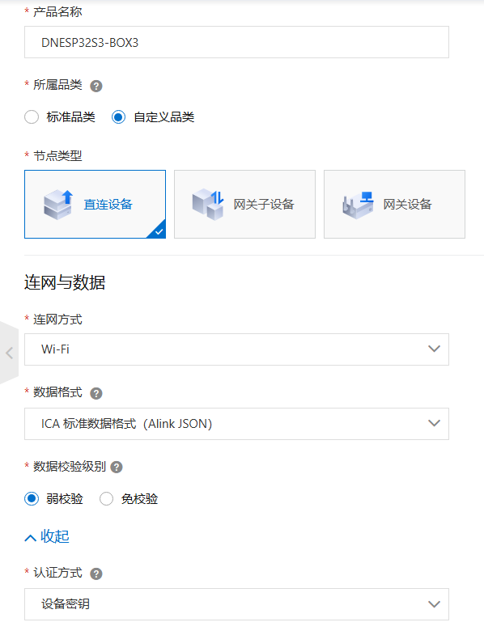
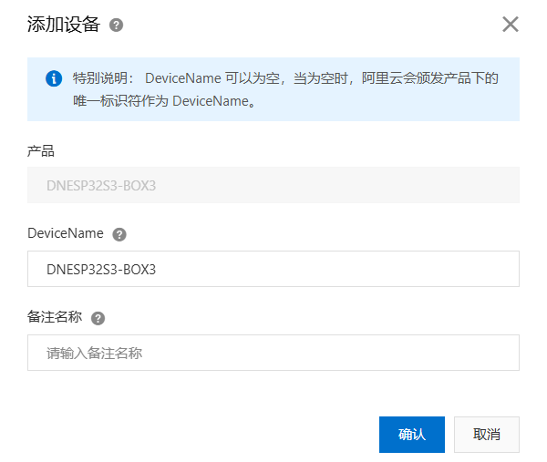
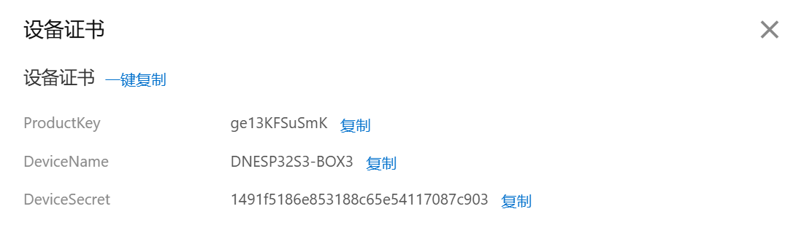
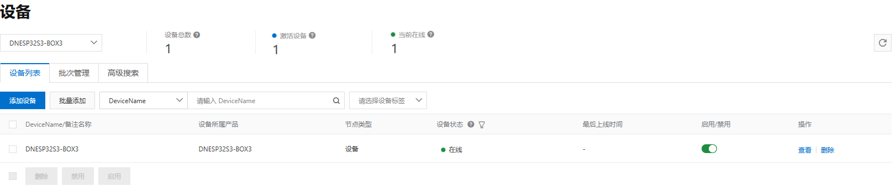

# 基于 MQTT 协议连接阿里云服务器

WIFI MQTT ALIYUN

## 前言

本章主要学习 lwIP 提供的 MQTT 协议文件使用，通过 MQTT 协议将设备连接到阿里云服务器，实现远程互通。由于 MQTT 协议是基于 TCP 的协议实现的，所以我们只需要在单片机端实现 TCP 客户端程序并使用 lwIP 提供的 MQTT 文件来连接阿里云服务器。

:::info[MQTT 协议简介]

1，MQTT（Message Queuing Telemetry Transport，消息队列遥测传输协议），是一种基于发布/订阅（Publish/Subscribe）模式的轻量级通讯协议，该协议构建于 TCP/IP 协议上，由 IBM 在1999 年发布，目前最新版本为 v3.1.1。
 2，MQTT 是一个基于客户端与服务器的消息发布/订阅传输协议。
 3，实现 MQTT 协议需要：客户端和服务器端 MQTT 协议中有三种身份：发布者（Publish）、代理（Broker）（服务器）、订阅者（Subscribe）。
 4，MQTT 传输的消息分为：主题（Topic）和消息的内容（payload）两部分。

:::

本实验对应的工程文件夹为：`<开发板A盘路径>/4，程序源码/v_5.5版本例程/2，扩展例程-IDF版/2，WiFi例程/08_WiFi_MQTT_ALIYUN`。

## 实验准备

1.配置远程服务器

:::tip[启动流程]

第一步：打开[**阿里云物联网平台**](https://www.aliyun.com/product/iot/iot_instc_public_cn?spm=5176.30275541.J_ZGek9Blx07Hclc3Ddt9dg.33.56512f3duwg6oE&scm=20140722.S_product@@%E4%BA%91%E4%BA%A7%E5%93%81@@355110._.ID_product@@%E4%BA%91%E4%BA%A7%E5%93%81@@355110-RL_%E7%89%A9%E8%81%94%E7%BD%91-LOC_2024SPAllResult-OR_ser-PAR1_212ca61617749466718011588d0996-V_4-PAR3_o-RE_new5-P0_0-P1_0)，如下图所示：

:::

:::tip[启动流程]

点击上图中的“管理控制台”按键进去物联网平台页面。
 第二步：在物联网平台页面下点击**公共实例->设备管理->产品->创建产品**，在此界面下填写项目名称等相关信息，如下图所示：

:::

:::tip[启动流程]

注：上图中的节点类型、连网方式、数据格式以及认证模式的选择，其他产品参数根据用户爱好设置。
 第三步：创建产品之后点击**设备管理**添加设备，如下图所示：

:::

:::tip[启动流程]

第四步：进入创建的设备，点击查看**三元组**内容，如下图所示：

:::

:::tip[启动流程]

这三个参数非常重要！！！！！！！！！！在本章实验中会用到。
 第五步：打开**产品->查看->功能定义**路径，在该路径下添加功能定义，如下图所示：

:::

:::tip[启动流程]

第六步：打开自定义功能并发布上线，这里我们添加了两个**CurrentTemperature**和**RelativeHumidity**标签。

:::

2. 硬件设计

:::info[例程功能与硬件资源]

lwIP 连接阿里云实现数据上传至阿里云服务器。
 1，LED(RED) - IO4
 2，正点原子 2.4 寸LCD屏幕
 3，ESP32-S3 内部 WiFi

:::

3.原理图

:::info[原理图]

本章实验使用的 WiFi 为 ESP32-S3 的片上资源，因此并没有相应的连接原理图。

:::

4. 软件设计

:::info[软件设计]

程序启动后初始化并连接网络，创建MQTT句柄与回调事件，开启MQTT。循环检测连接状态，成功则发布数据；事件回调处理连接、订阅、发布、接收及错误事件，实现完整MQTT通信流程。

:::

5. 将对应接口的电源线接入 DNESP32S3 BOX3 开发板底板的 USB Type-C 接口，为其进行供电。

## 实验现象

程序下载成功后，打开阿里云平台的物联网平台设备管理，可以看到此时的设备处于连接状态，如下图所示：

