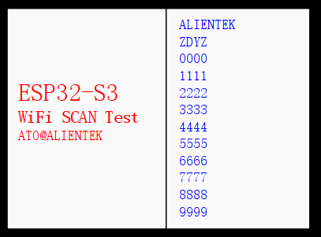

# WIFI扫描实验

WIFI SCAN

## 前言

ESP32-S3的WiFi库支持配置及监控ESP32-S3的Wi-Fi连网功能。本章节的实验是基于乐鑫官方提供的 WiFi 库来实现的，但遗憾的是乐鑫并没有公开 WiFi 库的源码，所以我们只能调用 API 函数实现。

:::info[WiFi 模式概述]

WiFi 主要有两种模式： STA 和 AP 模式。 AP 模式即无线接入点，是我们常说的手机热点，被其他设备连接； STA 模式即 Station，是连接热点的设备。另外， ESP32S3 可支持 STA 和 AP两种模式共存，就像手机那样可以开热点，也可以连接其他热点。

:::

本实验对应的工程文件夹为：`<开发板A盘路径>/4，程序源码/v_5.5版本例程/2，扩展例程-IDF版/2，WiFi例程/01_WiFi_SCAN`。

## 实验准备

1. WiFi-AP 启动流程如下。

:::tip[启动流程]

首先，系统需要对 lwIP 协议栈进行初始化。接着，创建一个任务，该任务将用于触发相应的事件。然后，配置 WiFi 参数和 AP 模式参数。最后，启动 WiFi，从而完成以 AP 模式开启 WiFi 的操作。

:::

2. 硬件设计

:::info[例程功能与硬件资源]

扫描附近的 WIFI 信号，并在 LCD 显示屏右侧显示 12 个 WIFI 名称。
 1，LED(RED) - IO4
 2，正点原子 2.4 寸LCD屏幕
 3，ESP32-S3 内部 WiFi

:::

3.原理图

:::info[原理图]

本章实验使用的 WiFi 为 ESP32-S3 的片上资源，因此并没有相应的连接原理图。

:::

4. 软件设计

:::info[软件设计]

程序启动后初始化NVS和lwIP，创建事件循环，配置STA模式WiFi并启动。同时扫描AP设备，获取数量并显示热点信息，LEDR闪烁，延时500ms后循环扫描。

:::

5. 将对应接口的电源线接入 DNESP32S3 BOX3 开发板底板的 USB Type-C 接口，为其进行供电。

## 实验现象

程序下载成功后，我们可以看到 LCD 显示附近 20 个热点名称，如下图所示：

