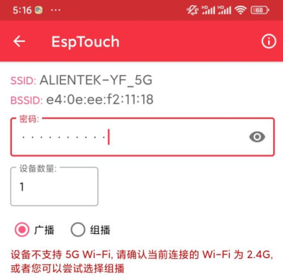
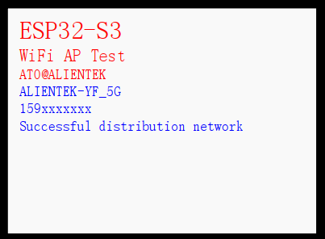

# WIFI一键配网实验

WIFI SMARTCONFIG

## 前言

ESP32-S3的一键配网模式是一种方便快捷的WiFi配置方式。在这种模式下，用户无需手动输入 WiFi 的 SSID 和密码等信息，只需要通过一键操作，即可完成 WiFi 的配置和连接。本章节，作者使用乐鑫官方提供的 SmartConfig 软件一键配置 WiFi 账号与密码。

:::info[主流 WIFI 配网方式简介]

目前主流的 WIFI 配网方式主要有以下三种：
 1,SoftAP 配网
 2,Smartconfig 配网
 3,Airkiss 配网

:::

本实验对应的工程文件夹为：`<开发板A盘路径>/4，程序源码/v_5.5版本例程/2，扩展例程-IDF版/2，WiFi例程/04_WiFi_SmartConfig`。

## 实验准备

1.Smartconfig软件下载 。

:::tip[启动流程]

本实验以 Smartconfig 软件对 ESP32-S3 设备进行一键配网，该软件的安装包可在 [**这里**](https://www.espressif.com.cn/zh-hans/support/download/apps) 下载。我们找到**ESP-TOUCH for Android**和**ESP-TOUCH for iOS**。
下载成功后，需把安装包转移到安卓手机或者苹果手机上安装。

:::

2. 硬件设计

:::info[例程功能与硬件资源]

本章实验功能简介：设备进入初始化状态，开启混监听所有网络数据包，此时 LCD显示"Inthe distribution network......"，表示设备已进入混监听模式。手机连上自己的 WiFi，开启 APP（EspTouch）软件，输入手机所在 WiFi 密码，请求配网，发送 UDP 广播包。 ESP32 -S3 通过 UDP 包（长度）获取配置信息捕捉到路由 SSID 和 PASSWD，连接路由器,此时 LCD 显示路由的账号与密码，表示连接路由成功。
 1，LED(RED) - IO4
 2，正点原子 2.4 寸LCD屏幕
 3，ESP32-S3 内部 WiFi

:::

3.原理图

:::info[原理图]

本章实验使用的 WiFi 为 ESP32-S3 的片上资源，因此并没有相应的连接原理图。

:::

4. 软件设计

:::info[软件设计]

程序启动后初始化NVS、lwIP和事件组，配置STA模式WiFi。通过事件回调判断连接状态，执行配网任务或重新连接，成功则输出信息，失败则显示未配网提示。

:::

5. 将对应接口的电源线接入 DNESP32S3 BOX3 开发板底板的 USB Type-C 接口，为其进行供电。

## 实验现象

程序下载成功后，我们打开“EspTouch”软件，在此软件下点击 “EspTouch”选项，注意：手机必须连接 WiFi，才能一键配网，如下图所示：

此时，我们填写好“ALIENTEK-YF_5G” WiFi密码和传输方式，可按下确定按键发送UDP报文。当 ESP32-S3 设备接收到这个报文时，系统会提取该报文的 SSID 和密码去连接该网络。下图是 ESP32-S3 配网成功效果图。

