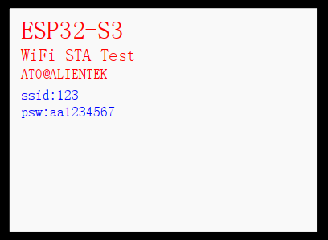

# WIFI路由实验

WIFI STA

## 前言

本章节实验作者把 ESP32-S3配置为 STA 模式，即连接附近的热点。 

本实验对应的工程文件夹为：`<开发板A盘路径>/4，程序源码/v_5.5版本例程/2，扩展例程-IDF版/2，WiFi例程/02_WiFi_STA`。

## 实验准备

1. WiFi-STA 启动流程如下。

:::tip[启动流程]

首先，系统需要对 lwIP 协议栈进行初始化。接着，创建一个任务，该任务将用于触发相应的事件。然后，配置 WiFi 参数和 STA 模式参数。最后，启动 WiFi，从而完成以 STA 模式开启 WiFi 的操作。

:::

2. 硬件设计

:::info[例程功能与硬件资源]

扫描附近的 WIFI 信号，并连接到一个真实存在的 WIFI 热点。
 1，LED(RED) - IO4
 2，正点原子 2.4 寸LCD屏幕
 3，ESP32-S3 内部 WiFi

:::

3.原理图

:::info[原理图]

本章实验使用的 WiFi 为 ESP32-S3 的片上资源，因此并没有相应的连接原理图。

:::

4. 软件设计

:::info[软件设计]

程序启动后初始化NVS、lwIP和事件组，创建event loop并配置STA模式WiFi。通过事件回调处理扫描、连接及失败事件，成功则删除事件组并且LEDR闪烁，失败则显示错误信息，循环等待连接结果。

:::

5. 将对应接口的电源线接入 DNESP32S3 BOX3 开发板底板的 USB Type-C 接口，为其进行供电。

## 实验现象

程序下载成功后，需要利用手机或其他设备创建一个 WiFi 热点。在创建热点时，需要注意提供正确的账号名和密码，以确保程序能够成功连接。同时，确保程序中要连接的热点账号与密码与所创建的热点一致。当 LCD 显示热点的账号名和密码时，此时 ESP32-S3 设备已经与热点连接成功了，否则， LCD 提示连接失败，如下图所示：

