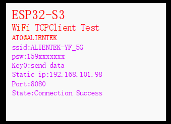
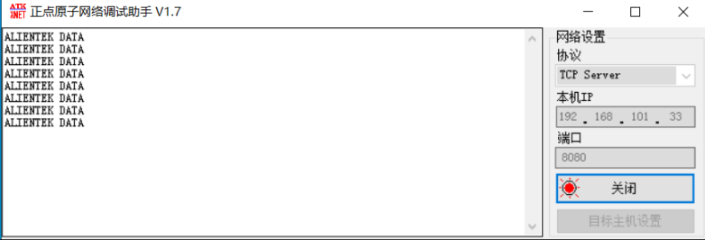
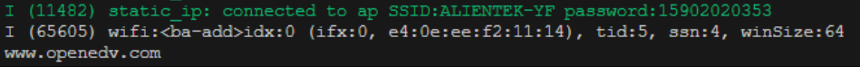

# TCPClient 实验

WIFI TCPCLIENT

## 前言

本章作者讲解 lwIP 的 Socket接口如何配置 TCP客户端，并在此基础上实现收发功能。

本实验对应的工程文件夹为：`<开发板A盘路径>/4，程序源码/v_5.5版本例程/2，扩展例程-IDF版/2，WiFi例程/06_WiFi_TCPClient`。

## 实验准备

1.Socket 编程 TCPServer 连接流程

:::tip[启动流程]

在实现 TCP 协议之前，用户需要按照以下步骤配置结构体 sockaddr_in的成员变量，以便建立 TCPClient 连接：
 1,配置 ESP32-S3 设备连接网络（必须的，因为 WiFi 是无线通信，所以需搭建通信桥梁）。
 2,将 sin_family 设置为 AF_INET，表示使用 IPv4 网络协议。
 3,设置 sin_port 为所需的端口号，例如 8080。
 4,设置 sin_addr.s_addr 为本地 IP 地址。
 5,调用函数 Socket 创建 Socket 连接。请注意，该函数的第二个参数指定连接类型。SOCK_STREAM 表示 TCP 连接，而 SOCK_DGRAM 表示 UDP 连接。
 6,调用函数 connect 连接远程 IP 地址。
 7,调用适当的收发函数来接收或发送数据。

:::

2. 硬件设计

:::info[例程功能与硬件资源]

本实验主要通过 Socket 编程接口实现了一个 TCPClient 客户端。这个客户端具有以下功能：首先，可以通过按键发送 TCPClient 数据发送至服务器。其次，能够接收服务器发送的数据。最后，实时将接收到的数据显示在 LCD 屏幕上。
 1，LED(RED) - IO1_1
 2，正点原子 2.4 寸LCD屏幕
 3，ESP32-S3 内部 WiFi

:::

3.原理图

:::info[原理图]

本章实验使用的 WiFi 为 ESP32-S3 的片上资源，因此并没有相应的连接原理图。

:::

4. 软件设计

:::info[软件设计]

程序启动后初始化并连接网络，创建key、led和send任务。按键触发发送消息，TCP客户端接收数据并串口输出，send任务根据flag状态发送数据并清除标志，LEDR循环闪烁提示状态。

:::

5. 将对应接口的电源线接入 DNESP32S3 BOX3 开发板底板的 USB Type-C 接口，为其进行供电。

## 实验现象

在程序中，首先需要设置好能够连接的网络账号和密码。然后，使用笔记本电脑作为终端，确保它与 ESP32-S3 设备处于同一网络段内。当 ESP32-S3 设备成功连接到网络时，它的 LCD 显示屏上会显示相应的内容：

打开网络调试助手，然后配置网络参数，如 TCPServer 协议、端口号、目标主机设置等，设置内容如下图所示：

在确保网络连接正常后，可以通过按下开发板上的 K1 按键来发送数据至网络调试助手。当网络调试助手接收到“ALIENTEK DATA”字符串时，它会在显示区域展示这个信息。此外，用户还可以在调试助手的发送区域自行输入要发送的数据，然后点击发送键，将数据发送至ESP32-S3 设备。此时， ESP32-S3 的串口将打印接收到的数据，具体操作和输出如下图所示：

