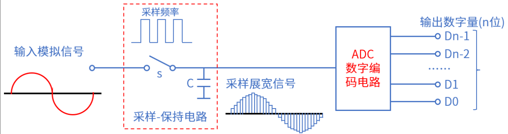
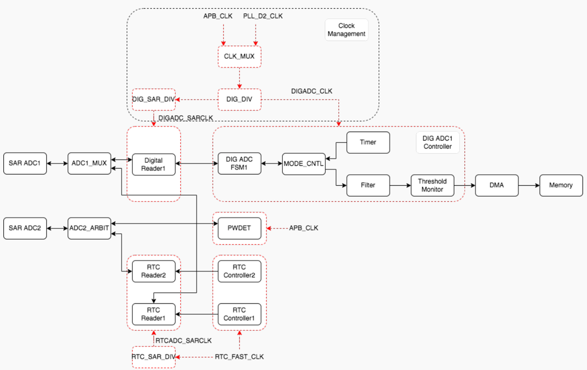
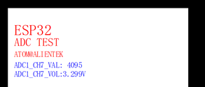

# ADC实验

## 前言

本章介绍使用ESP32-S3模数转换器（ADC）进行带通道的电压采集。通过本章的学习，读者将学习到单通道ADC的使用。

## ADC 介绍

### 1，ADC 简介

生活中接触到的大多数信息是随着时间连续变化的物理量，如声音、温度、压力等。表达这些信息的电信号，称为模拟信号（Analog Signal）。为了方便存储、处理，在计算机系统中，都是数字 0 和 1 信号，将模拟信号（连续信号）转换为数字信号（离散信号）的器件就叫模数转换器（Analog-to-Digital Convert， ADC）。ADC 转换器可分为： 并行比较型 A/D 转换器(FLASH ADC)、逐次比较型 A/D 转换器(SARADC)和双积分式 A/D 转换器(Double Integral ADC)。A/D 转换过程通常为 4 步：采样、保持、量化和编码，如下图所示:



采样：把时间连续变化的信号变换为时间离散的信号。

保持：保持采样信号，使有充分时间转换为数字信号。

量化：把采样保持电路的输出信号用单位量化电压的整数倍表示。

编码：把量化的结果用二进制代码表示。

采样和保持通常是在采样-保持电路中完成，量化和编码通常在 ADC 数字编码电路中完成。

### 2，ESP32-S3 ADC介绍

ESP32-S3集成了两个12位SAR ADC，ADC1和ADC2，支持20个模拟通道输入。下面我们通过分析ESP32-S3 SAR ADC架构图，了解其工作过程。架构图如下图所示：

ESP32-S3 SAR ADC框架包含：SAR ADC1和SAR ADC 2、四个ADC控制器（DIG ADC1、PWDET、RTC Controller1和RTC Controller2）、三个ADC控制器的Reader模块（RTC Reader1/2、Digital Reader1）和时钟管理（Clock Management）。
下面我们分析一下ADC相关的引脚情况。以下这20个模拟通道输入对应着具体的IO，并不是随意的IO都有模拟输入功能，具备模拟输入功能的引脚如下图所示：

ESP32-S3的SAR ADC的分辨率为12位，所以AD转换后的值范围为0~4095，对应的电压范围为0mV ~ Vref。其中，Vref为SAR ADC内部电压。因此转换结果data可以用以下公式转换成模拟电压输出Vdata。这里就会有一个简单的关系，如下所示：


要转换大于Vref电压，需要对输入信号进行衰减。衰减可配置为0db、2.5db、6db和12db。

## 硬件设计

### 例程功能

1. 本章实验功能简介：使用 ADC 采集通道3（IO29）上面的电压，通过串口打印ADC 转换值以及换算成电压后的电压值。 LED闪烁，提示程序运行。
2. LED闪烁，指示程序正在运行。

### 硬件资源

1. LED:
    LED - P1_1
2. LCD
3. ADC:
    ADC1_CHANNEL_0

### 原理图

ADC属于ESP32-S3内部资源，实际上我们只需要软件设置就可以正常工作，另外还需要将待测量的电压源连接到ADC通道上，以便ADC测量。

## 程序设计

### ADC函数解析

ESP-IDF提供了一套API来配置ADC。接下来，作者将介绍一些常用的ADC函数，这些函数的描述及其作用如下：

#### 配置ADC

该函数用于配置ADC各项参数，其函数原型如下所示：

```
esp_err_t adc_digi_controller_configure(const adc_digi_configuration_t *config)
```

该函数的形参描述如下表所示：

| 参数     | 描述                                        |
| ------ | ----------------------------------------- |
| config | 指向ADC配置结构体的指针需自行定义，并根据ADC的配置参数填充结构体中的成员变量 |

【返回值】

返回值：ESP_OK表示配置成功。其他表示配置失败。

#### 读取ADC原始数据

该函数用于读取ADC原始数据，其函数原型如下所示：

```
int adc1_get_raw(adc1_channel_t channel)
```

该函数的形参描述如下表所示：

| 参数      | 描述    |
| ------- | ----- |
| channel | ADC通道 |

【返回值】

1. 无

### ADC驱动解析

在IDF版10_adc例程中，作者在```10_adc \components\BSP```路径下新增了一个ADC文件夹，分别用于存放adc.c、adc.h这两个文件。其中，adc.h文件负责声明ADC相关的函数和变量，而adc.c文件则实现了ADC的驱动代码。下面，我们将详细解析这两个文件的实现内容。

#### 1，adc.h文件

```
/* ADC采集通道定义 */
#define ADC_ADCX_CHY   ADC1_CHANNEL_0 
```

#### 2，adc.c文件

```
adc_oneshot_unit_handle_t adc_handle = NULL;    /* ADC句柄 */

/**
 * @brief       初始化ADC
 * @param       无
 * @retval      无
 */
void adc_init(void)
{
    adc_oneshot_unit_init_cfg_t adc_config = {  /* 初始化配置结构体 */
        .unit_id  = ADC_UNIT_1,                 /* ADC单元:ADC1/ADC2 */
        .ulp_mode = ADC_ULP_MODE_DISABLE,       /* 不支持ADC在ULP模式下工作 */
    };
    ESP_ERROR_CHECK(adc_oneshot_new_unit(&adc_config, &adc_handle));    /* ADC初始化(单次转换模式) */

    /* 配置 ADC */
    adc_oneshot_chan_cfg_t config = {
        .atten    = ADC_ATTEN_DB_12,            /* ADC衰减 */
        .bitwidth = ADC_BITWIDTH_12,            /* ADC分辨率 */
    };
    ESP_ERROR_CHECK(adc_oneshot_config_channel(adc_handle, ADC_CHAN, &config));     /* 配置ADC通道 */
}

#define LOST_VAL    1

/**
 * @brief       获取ADC转换且进行多次采样后排序去除最高和最低值再做均值滤波后的结果
 * @note        ESP32P4 ADC对噪声敏感,可能导致ADC读数出现较大偏差
 * @note        软件上:可通过多次采样进一步降低噪声影响;硬件上:可加旁路电容连在在ADC使用引脚上
 * @param       ch      : 通道号, 0~9
 * @param       times   : 获取次数
 * @retval      通道ch的times次转换结果平均值
 */
uint32_t adc_get_result_average(adc_channel_t ch, uint32_t times)
{
    uint32_t sum = 0;
    uint16_t temp_val = 0;

    /* 申请存放ADC原始数据buffer */
    int *rawdata = heap_caps_malloc(times * sizeof(int), MALLOC_CAP_INTERNAL);     
    if (NULL == rawdata)
    {
        ESP_LOGE("adc", "Memory for adc is not enough");
    }

    for (uint32_t t = 0; t < times; t++)                /* 多次ADC采样 */
    {
        adc_oneshot_read(adc_handle, ch, &rawdata[t]);  /* 读取原始数据 */
        vTaskDelay(pdMS_TO_TICKS(5));
    }

    for (uint16_t i = 0; i < times - 1; i++)            /* 对数据进行排序 */
    {
        for (uint16_t j = i + 1; j < times; j++)
        {
            if (rawdata[i] > rawdata[j])                /* 升序排列 */
            {
                temp_val   = rawdata[i];
                rawdata[i] = rawdata[j];
                rawdata[j] = temp_val;
            }
        }
    }

    for (uint32_t i = LOST_VAL; i < times - LOST_VAL; i++)      /* 去掉两端的丢弃值 */
    {
        sum += rawdata[i];                                      /* 累加去掉丢弃值以后的数据 */
    }

    return sum / (times - 2 * LOST_VAL);                        /* 返回平均值 */
}
```

从上面的代码中可以看出，调用adc3_init()后，ADC将读取GPIO26引脚的模拟信号，并通过通道0转换为数字值。后续可通过adc_read()获取该通道的数据。

### CMakeLists.txt文件

打开本实验的BSP文件夹下的CMakeList.txt文件，其内容如下所示：

```
set(src_dirs
            ADC
            MYIIC
            LCD
            MYSPI
            AW9523B)

set(include_dirs
            ADC
            MYIIC
            LCD
            MYSPI
            AW9523B)

set(requires
            driver
            esp_adc
            esp_lcd)

idf_component_register(SRC_DIRS ${src_dirs} INCLUDE_DIRS ${include_dirs} REQUIRES ${requires})

component_compile_options(-ffast-math -O3 -Wno-error=format=-Wno-format)
```

上述代码中的 ADC 驱动需要由开发者自行添加，以确保 ADC 驱动能够顺利集成到构建系统中。这一步骤是必不可少的，它确保了 ADC 驱动的正确性和可用性，为后续的开发工作提供了坚实的基础。

### 实验应用代码

打开main.c文件，该文件定义了工程入口函数，名为main。该函数代码如下。

```
/**
 * @brief       程序入口
 * @param       无
 * @retval      无
 */
void app_main(void)
{
    esp_err_t ret;
    uint16_t adc_data = 0;
    float adc_vol = 0;

    ret = nvs_flash_init();     /* 初始化NVS */

    if (ret == ESP_ERR_NVS_NO_FREE_PAGES || ret == ESP_ERR_NVS_NEW_VERSION_FOUND)
    {
        ESP_ERROR_CHECK(nvs_flash_erase());
        ESP_ERROR_CHECK(nvs_flash_init());
    }

    my_spi_init();              /* 初始化SPI */
    myiic_init();               /* 初始化IIC */
    aw9523b_init();             /* 初始化AW9523B */
    lcd_init();                 /* 初始化LCD */
    adc_init();                 /* 初始化ADC */

    lcd_show_string(10, 50, 200, 16, 16, "ESP32", RED);
    lcd_show_string(10, 70, 200, 16, 16, "ADC TEST", RED);
    lcd_show_string(10, 90, 200, 16, 16, "ATOM@ALIENTEK", RED);

    lcd_show_string(10, 110, 200, 16, 16, "ADC1_CH0_VAL:0", BLUE);
    lcd_show_string(10, 130, 200, 16, 16, "ADC1_CH0_VOL:0.000V", BLUE);

    while(1)
    {
        adc_data = adc_get_result_average(ADC_CHAN, 20);
        lcd_show_xnum(114, 110, adc_data, 5, 16, 0, BLUE);       /* 显示ADC采样后的原始值 */

        adc_vol = (float)adc_data * (3.3 / 4095);                /* 获取计算后的带小数的实际电压值 */
        adc_data = adc_vol;                                      /* 赋值整数部分给adcx变量 */
        lcd_show_xnum(114, 130, adc_data, 1, 16, 0, BLUE);       /* 显示电压值的整数部分 */

        adc_vol -= adc_data;                                     /* 把已经显示的整数部分去掉，留下小数部分 */ 
        adc_vol *= 1000;                                         /* 小数部分乘以1000 */
        lcd_show_xnum(130, 130, adc_vol, 3, 16, 0x80, BLUE);     /* 显示小数部分 */

        LEDR_TOGGLE();                                           /* LEDR翻转函数 */
        vTaskDelay(100);
    }
}

```

从上面的代码中可以看出，在进行完包括 ADC 的所有初始化工作后，便不断地获取 ADC通道 0 进行 10 次转换后经过均值滤波后的结果，并将该原始值显示在 LCD 上，同时还通过该电压的原始值计算出了电压的模拟量，并在 LCD 上进行显示。

## 下载验证

可以通过LCD查看ADC读取的原始值以及转换后得到的电压值。LED闪烁 ,提示程序运行。


