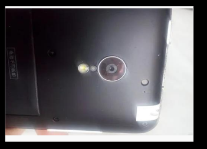

# 摄像头实验

## 前言

DNESP32S3 BOX3开发板板载了一个摄像头接口，该接口可以用来连接GC0308等摄像头模块。本章，我们将使用ESP32-S3驱动GC0308摄像头模块，实现摄像头功能。

## GC0308介绍

GC0308是一款1/6.5英寸光学格式的VGA（640×480）CMOS图像传感器，采用3.4μm像素尺寸和4晶体管像素结构。其内置10位ADC和图像信号处理器（ISP），支持YCbCr4:2:2、RGB565及Raw Bayer等多种输出格式，并具备自动曝光（AE）与自动白平衡（AWB）功能。该芯片仅需2.8V单电源供电，功耗低（工作时约70mW，待机仅10μA），最高支持30fps帧率。主要应用于手机摄像头、PC相机、视频会议、安防监控及条码识别等嵌入式视觉场景，采用20-ball CSP封装。

## 硬件设计

### 例程功能

1. 本章实验功能简介：程序下载完成，摄像头的图像数据在 LCD 显示屏上显示。

### 硬件资源

1. 正点原子2.4寸LCD屏幕
2. GC0308摄像头模块

### 原理图

CAMERA 接口与 ESP32-S3 的连接关系，如下图所示：


## 程序设计

### CAMERA 函数解析

本章实验要使用到乐鑫官方的 esp32-camera 驱动库，此驱动库承载 ESP32 系列 Soc 兼容的图像传感器驱动程序。此外，它还提供了一些工具，允许将捕获的帧数据转换为更常见的 BMP和 JPEG 格式。接下来，作者将介绍一些常用的 ESP32-S3 中的 CAMERA 函数，这些函数的描述及其作用如下：

#### 初始化摄像头驱动

该函数用于检测并配置摄像头，其函数原型如下所示

```
esp_err_t esp_camera_init(const camera_config_t *config)
```

该函数的形参描述如下表所示：

| 参数     | 描述             |
| ------ | -------------- |
| config | 这是指向摄像机配置参数的指针 |

【返回值】

返回值：ESP_OK配置成功。其他配置失败。

#### 获取摄像头图像传感器备配置

该函数用于获取指向图像传感器控制结构的指针，其函数原型如下所示：

```
sensor_t * esp_camera_sensor_get(void);
```

【返回值】

| 参数               | 描述                     |
| ---------------- | ---------------------- |
| NULL             | 返回： 0，即空               |
| &s_state->sensor | 指向结构体参数 camera_state_t |

### CAMERA 驱动解析

在IDF版的15_camera例程中，作者在```15_camera \components\Middlewares```路径下新增了一个```espressif__esp32-camera```文件夹，分别用于存放乐鑫官方的摄像头驱动文件。那么对于官方的第三方库我们这里就不做解析了。

### CMakeLists.txt文件

打开本实验的BSP文件夹下的CMakeList.txt文件，其内容如下所示：

```
set(src_dirs
            MYIIC
            MYSPI
            LCD
            AW9523B)

set(include_dirs
            MYIIC
            MYSPI
            LCD
            AW9523B)

set(requires
            driver
            esp_lcd)

idf_component_register(SRC_DIRS ${src_dirs} INCLUDE_DIRS ${include_dirs} REQUIRES ${requires})

component_compile_options(-ffast-math -O3 -Wno-error=format=-Wno-format)
```

上述代码中的驱动需要由开发者自行添加，以确保驱动能够顺利集成到构建系统中。这一步骤是必不可少的，它确保了驱动的正确性和可用性，为后续的开发工作提供了坚实的基础。

### 实验应用代码

打开main.c文件，该文件定义了工程入口函数，名为main。该函数代码如下。

```
/* 引脚配置 */
#define CAM_PIN_PWDN    GPIO_NUM_NC
#define CAM_PIN_RESET   GPIO_NUM_NC
#define CAM_PIN_VSYNC   GPIO_NUM_6
#define CAM_PIN_LREF    GPIO_NUM_46
#define CAM_PIN_PCLK    GPIO_NUM_45
#define CAM_PIN_XCLK    GPIO_NUM_NC
#define CAM_PIN_SIOD    GPIO_NUM_NC
#define CAM_PIN_SIOC    GPIO_NUM_NC
#define CAM_PIN_D0      GPIO_NUM_7
#define CAM_PIN_D1      GPIO_NUM_8
#define CAM_PIN_D2      GPIO_NUM_9
#define CAM_PIN_D3      GPIO_NUM_10
#define CAM_PIN_D4      GPIO_NUM_11
#define CAM_PIN_D5      GPIO_NUM_12
#define CAM_PIN_D6      GPIO_NUM_4
#define CAM_PIN_D7      GPIO_NUM_5

#define CAM_RST(x)          do{ x ?                                         \
                                (aw9523b_pin_write(TP_CAM_RESET, 1)):       \
                                (aw9523b_pin_write(TP_CAM_RESET, 0));       \
                            }while(0)

#define CAM_2V8_EN(x)       do{ x ?                                         \
                                (aw9523b_pin_write(VDD_2V8_EN, 1)):         \
                                (aw9523b_pin_write(VDD_2V8_EN, 0));         \    
                            }while(0)

#define CAM_VBAT_EN(x)       do{ x ?                                         \
                                (aw9523b_pin_write(VBAT_EN, 1)):         \
                                (aw9523b_pin_write(VBAT_EN, 0));         \    
                            }while(0)

/* 摄像头配置 */
static camera_config_t camera_config = {
    /* 引脚配置 */
    .pin_pwdn = CAM_PIN_PWDN,
    .pin_reset = CAM_PIN_RESET,
    .pin_xclk = CAM_PIN_XCLK,
    .pin_sccb_sda = -1,
    .pin_sccb_scl = -1,
    .sccb_i2c_port = I2C_NUM_0,
    .pin_d7 = CAM_PIN_D7,
    .pin_d6 = CAM_PIN_D6,
    .pin_d5 = CAM_PIN_D5,
    .pin_d4 = CAM_PIN_D4,
    .pin_d3 = CAM_PIN_D3,
    .pin_d2 = CAM_PIN_D2,
    .pin_d1 = CAM_PIN_D1,
    .pin_d0 = CAM_PIN_D0,
    .pin_vsync = CAM_PIN_VSYNC,
    .pin_href = CAM_PIN_LREF,
    .pin_pclk = CAM_PIN_PCLK,

    /* XCLK 20MHz or 10MHz for OV2640 double FPS (Experimental) */
    .xclk_freq_hz = 24000000,
    .ledc_timer = LEDC_TIMER_0,
    .ledc_channel = LEDC_CHANNEL_0,

    .pixel_format = PIXFORMAT_RGB565,   /* YUV422,GRAYSCALE,RGB565,JPEG */
    .frame_size = FRAMESIZE_QVGA,       /* QQVGA-UXGA, For ESP32, do not use sizes above QVGA when not JPEG. The performance of the ESP32-S series has improved a lot, but JPEG mode always gives better frame rates */

    .jpeg_quality = 12,                 /* 0-63, for OV series camera sensors, lower number means higher quality */
    .fb_count = 2,                      /* When jpeg mode is used, if fb_count more than one, the driver will work in continuous mode */
    .fb_location = CAMERA_FB_IN_PSRAM,
    .grab_mode = CAMERA_GRAB_WHEN_EMPTY,
};

/**
 * @brief       摄像头初始化
 * @param       无
 * @retval      esp_err_t
 */
static esp_err_t init_camera(void)
{
    if (CAM_PIN_PWDN == GPIO_NUM_NC)
    {
        CAM_VBAT_EN(1);
        CAM_2V8_EN(1);
    } 

    if (CAM_PIN_RESET == GPIO_NUM_NC)
    { 
        CAM_RST(0);
        vTaskDelay(pdMS_TO_TICKS(20));
        CAM_RST(1);
        vTaskDelay(pdMS_TO_TICKS(20));
    }

    /* 摄像头初始化 */
    esp_err_t err = esp_camera_init(&camera_config);

    if (err != ESP_OK)
    {
        ESP_LOGE("TAG", "Camera Init Failed");
        return err;
    }

    sensor_t * s = esp_camera_sensor_get();

    /* 如果摄像头模块是OV3660或者是OV5640，则需要以下配置 */
    if (s->id.PID == OV3660_PID)
    {
        s->set_vflip(s, 1);         /* 向后翻转 */
        s->set_brightness(s, 1);    /* 亮度提高 */
        s->set_saturation(s, -2);   /* 降低饱和度 */
    }
    else if (s->id.PID == OV5640_PID)
    {
        s->set_vflip(s, 1);         /* 向后翻转 */
    }
    else if (s->id.PID == GC0308_PID)
    {
        s->set_vflip(s, 0);         /* 垂直翻转 */
        s->set_hmirror(s, 0);       /* 水平镜像 */
        s->set_contrast(s, 0);      /* 对比度 */
    }

    return ESP_OK;
}

/**
 * @brief       程序入口
 * @param       无
 * @retval      无
 */
void app_main(void)
{
    esp_err_t ret;
    camera_fb_t *fb = NULL;

    ret = nvs_flash_init();     /* 初始化NVS */
    if (ret == ESP_ERR_NVS_NO_FREE_PAGES || ret == ESP_ERR_NVS_NEW_VERSION_FOUND)
    {
        ESP_ERROR_CHECK(nvs_flash_erase());
        ESP_ERROR_CHECK(nvs_flash_init());
    }

    my_spi_init();              /* 初始化SPI */
    myiic_init();               /* 初始化IIC */
    aw9523b_init();             /* 初始化AW9523B */
    lcd_init();                 /* 初始化LCD */

    if (init_camera() != ESP_OK) 
    {
        ESP_LOGE("TAG", "Camera initialization failed, system halted");

        while (1) 
        {
            vTaskDelay(pdMS_TO_TICKS(1000));
        }
    }

    lcd_show_string(30, 50, 200, 16, 16, "ESP32-S3", RED);
    lcd_show_string(30, 70, 200, 16, 16, "CAMERA TEST", RED);
    lcd_show_string(30, 90, 200, 16, 16, "ATOM@ALIENTEK", RED);
    vTaskDelay(pdMS_TO_TICKS(1500));

    while(1)
    {
        fb = esp_camera_fb_get();

        if (fb != NULL) 
        {
            esp_lcd_panel_draw_bitmap(panel_handle, 0, 0, fb->width, fb->height, fb->buf);
            esp_camera_fb_return(fb);
        }

        vTaskDelay(pdMS_TO_TICKS(1));  /* 添加延时，避免过度占用CPU */
    }
}
```

该代码实现ESP32-S3摄像头系统初始化与图像采集。通过AW9523B扩展器控制GC0308模组的2.8V电源和复位信号，配置8位并行DVP接口（D0-D7、VSYNC、HREF、PCLK）。摄像头初始化为RGB565格式、QVGA分辨率，主循环持续获取帧缓冲并通过LCD显示，支持多款传感器（OV3660/OV5640/GC0308）的差异化配置。

## 下载验证

程序下载到开发板后， LCD 显示屏不断更新摄像头输出的图像数据，如下图所示。


