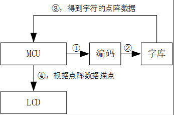
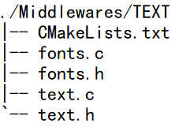
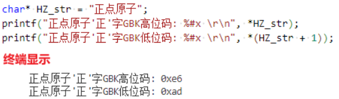
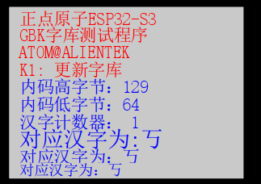

# 汉字实验

## 前言

本章，我们将介绍如何使用 ESP32 控制 LCD 显示汉字。在本章中，我们将使用通过 SD 卡更新字库。 ESP32 读取存在 SD 卡里面的字库，然后将汉字显示在 LCD 上面。

## 汉字显示原理简介

汉字的显示和ASCII显示其实是一样的原理，如下图所示：



上图显示了单个汉字显示的原理框图，单片机（MCU）先根据汉字编码（①，②）从字库里面找到该汉字的点阵数据（③），然后通过描点函数，按字库取模方式，将点阵数据在 LCD上画出来（④），就可以实现一个汉字的显示。

## 硬件设计

### 例程功能

本实验开机的时候程序通过预设值的标记位检测分区表中是否已经存在字库，如果存在，则按次序显示汉字。如果没有，则检测 SD 卡和文件系统，并查找 SYSTEM文件夹下的 FONT 文件夹，在该文件夹内查找 UNIGBK.BIN、 GBK12.FON、 GBK16.FON 和GBK24.FON 这几个文件的由来，我们在前面已经介绍过了。在检测到这些文件之后，就开始更新字库，更新完毕才开始显示汉字。通过按按键 KEY0，可以强制更新字库。

### 硬件资源

1. LED:
    LEDR-P1_1
   2.独立按键：
    K0-GPIO0
2. 正点原子2.4寸LCD屏幕
3. SD卡

### 原理图

本章实验使用的字库管理库为软件库，因此没有对应的连接原理图。

## 程序设计

### 汉字显示函数解析

正点原子提供的字库管理库包含了六个文件，分别为：convert.c、convert.h、fonts.c、fonts.h、text.c和text.h，本章实验配套实验例程中已经提供了这六个文件，并且已经针对正点原子ESP32-S3软硬件进行了移植适配，用户在使用时，仅需将这六个文件添加到自己的工程中即可，如下图所示：



### 汉字显示驱动解析

在 IDF 版的 18_chinese_display 例程中，作者在 ```18_chinese_display\components\BSP``` 路径下并未添加新的内容，而是在 ```18_chinese_display\components\Middlewares``` 路径下面，新增了一个 TEXT 文件，我们将详细解析这四个文件的实现内容。

#### 1， fonts.h 文件

```
/* 字体信息保存首地址
 * 占33个字节,第1个字节用于标记字库是否存在.后续每8个字节一组,分别保存起始地址和文件大小
 */
extern uint32_t FONTINFOADDR;

/* 字库信息结构体定义
 * 用来保存字库基本信息，地址，大小等
 */
typedef struct
{
    uint8_t fontok;             /* 字库存在标志，0XAA，字库正常；其他，字库不存在 */
    uint32_t ugbkaddr;          /* unigbk的地址 */
    uint32_t ugbksize;          /* unigbk的大小 */
    uint32_t f12addr;           /* gbk12地址 */
    uint32_t gbk12size;         /* gbk12的大小 */
    uint32_t f16addr;           /* gbk16地址 */
    uint32_t gbk16size;         /* gbk16的大小 */
    uint32_t f24addr;           /* gbk24地址 */
    uint32_t gbk24size;         /* gbk24的大小 */
} _font_info;

/* 字库信息结构体 */
extern _font_info ftinfo;
```

这个结构体占用33字节，用于记录字库的地址和大小等信息。其中，首字节指示字库状态，其余字节记录地址和文件大小。用户字库等文件存储在分区表后的12M存储storage分区。前33字节保留给_font_info，以保存其结构体数据；随后是UNIGBK.BIN、GBK12.FON、GBK16.FON和GBK24.FON文件。

#### 2， fonts.c 文件

```
/**
 * @brief       初始化字体
 * @param       无
 * @retval      0, 字库完好; 其他, 字库丢失;
 */
uint8_t fonts_init(void)
{
    uint8_t t = 0;

    storage_partition = esp_partition_find_first(ESP_PARTITION_TYPE_DATA, ESP_PARTITION_SUBTYPE_ANY, "storage");

    if (storage_partition == NULL)
    {
        ESP_LOGE(fonts_tag, "Flash partition not found.");
        return 1;
    }

    while (t < 10)  /* 连续读取10次,都是错误,说明确实是有问题,得更新字库了 */
    {
        t++;
        fonts_partition_read((uint8_t *)&ftinfo, FONTINFOADDR, sizeof(ftinfo)); /* 读出ftinfo结构体数据 */

        if (ftinfo.fontok == 0XAA)
        {
            break;
        }

        vTaskDelay(pdMS_TO_TICKS(10));
    }

    if (ftinfo.fontok != 0XAA)
    {
        return 1;
    }

    return 0;
}
```

这里就是把分区表的12M地址的33个字节数据读取出来，进而判断字库结构体ftinfo的字库标记fontok是否为AA确定字库是否完好。有人会有疑问：ftinfo.fontok是在哪里赋值AA呢？肯定是字库更新完毕后，给该标记赋值的，那下面就来看一下是不是这样子，字库更新函数定义如下：

```
/**
 * @brief     更新字体文件
 * @note      所有字库一起更新(UNIGBK,GBK12,GBK16,GBK24)
 * @param     x, y    : 提示信息的显示地址
 * @param     size    : 提示信息字体大小
 * @param     src     : 字库来源磁盘
 * @arg                 "0:", SD卡;
 * @arg                 "1:", FLASH盘
 * @param     color   : 字体颜色
 * @retval    0, 成功; 其他, 错误代码;
 */
uint8_t fonts_update_font(uint16_t x, uint16_t y, uint8_t size, uint8_t *src, uint32_t color)
{
    uint8_t *pname;
    uint32_t *buf;
    uint8_t res = 0;
    uint16_t i, j;
    FIL *fftemp;
    uint8_t rval = 0;
    res = 0XFF;
    ftinfo.fontok = 0XFF;

    pname = malloc(100);                  /* 申请100字节内存 */
    buf = malloc(4096);                   /* 申请4K字节内存 */
    fftemp = (FIL *)malloc(sizeof(FIL));  /* 分配内存 */

    if (buf == NULL || pname == NULL || fftemp == NULL)
    {
        free(fftemp);
        free(pname);
        free(buf);
        return 5;   /* 内存申请失败 */
    }

    for (i = 0; i < 4; i++) /* 先查找文件UNIGBK,GBK12,GBK16,GBK24 是否正常 */
    {
        strcpy((char *)pname, (char *)src);                     /* copy src内容到pname */
        strcat((char *)pname, (char *)FONT_GBK_PATH[i]);        /* 追加具体文件路径 */
        res = f_open(fftemp, (const TCHAR *)pname, FA_READ);    /* 尝试打开 */

        if (res)
        {
            rval |= 1 << 7; /* 标记打开文件失败 */
            break;          /* 出错了,直接退出 */
        }
    }

    free(fftemp);           /* 释放内存 */

    if (rval == 0)          /* 字库文件都存在. */
    {
        lcd_show_string(x, y, 240, 320, size, "Erasing sectors... ", color);    /* 提示正在擦除扇区 */

        for (i = 0; i < FONTSECSIZE; i++)       /* 先擦除字库区域,提高写入速度 */
        {
            fonts_progress_show(x + 20 * size / 2, y, size, FONTSECSIZE, i, color);             /* 进度显示 */
            fonts_partition_read((uint8_t *)buf, ((FONTINFOADDR / 4096) + i) * 4096, 4096);     /* 读出整个扇区的内容 */

            for (j = 0; j < 1024; j++)          /* 校验数据 */
            {
                if (buf[j] != 0XFFFFFFFF) break;/* 需要擦除 */
            }

            if (j != 1024)
            {
                fonts_partition_erase_sector(((FONTINFOADDR / 4096) + i) * 4096); /* 需要擦除的扇区 */
            }
        }

        for (i = 0; i < 4; i++) /* 依次更新UNIGBK,GBK12,GBK16,GBK24 */
        {
            lcd_show_string(x, y, 240, 320, size, (char *)FONT_UPDATE_REMIND_TBL[i], color);
            strcpy((char *)pname, (char *)src);                                     /* copy src内容到pname */
            strcat((char *)pname, (char *)FONT_GBK_PATH[i]);                        /* 追加具体文件路径 */
            res = fonts_update_fontx(x + 20 * size / 2, y, size, pname, i, color);  /* 更新字库 */

            if (res)
            {
                free(buf);
                free(pname);
                return 1 + i;
            }
        }

        /* 全部更新好了 */
        ftinfo.fontok = 0XAA;
        fonts_partition_write((uint8_t *)&ftinfo, FONTINFOADDR, sizeof(ftinfo));    /* 保存字库信息 */
    }

    free(pname);    /* 释放内存 */
    free(buf);

    return rval;
}
```

函数的实现：动态申请内存→尝试打开文件(UNIGBK、GBK12、GBK16和GBK24)，确定文件是否存在→擦除字库→依次更新UNIGBK、GBK12、GBK16和GBK24→写入ftinfo结构体信息。在字库更新函数中能直接看到的是ftinfo.fontok成员被赋值，而其他成员在单个字库更新函数中被赋值，接下来分析一下更新某个字库函数，其代码如下：

```
/**
 * @brief       更新某一个字库
 * @param       x, y    : 提示信息的显示地址
 * @param       size    : 提示信息字体大小
 * @param       fpath   : 字体路径
 * @param       fx      : 更新的内容
 * @arg                   0, ungbk;
 * @arg                   1, gbk12;
 * @arg                   2, gbk16;
 * @arg                   3, gbk24;
 * @param       color   : 字体颜色
 * @retval      0, 成功; 其他, 错误代码;
 */
static uint8_t fonts_update_fontx(uint16_t x, uint16_t y, uint8_t size, uint8_t *fpath, uint8_t fx, uint32_t color)
{
    uint32_t flashaddr = 0;
    FIL *fftemp;
    uint8_t *tempbuf;
    uint8_t res;
    uint16_t bread;
    uint32_t offx = 0;
    uint8_t rval = 0;
    fftemp = (FIL *)malloc(sizeof(FIL));  /* 分配内存 */

    if (fftemp == NULL)rval = 1;

    tempbuf = malloc(4096);               /* 分配4096个字节空间 */

    if (tempbuf == NULL) rval = 1;

    res = f_open(fftemp, (const TCHAR *)fpath, FA_READ);
    if (res) rval = 2;  /* 打开文件失败 */

    if (rval == 0)
    {
        switch (fx)
        {
            case 0:                                                 /* 更新 UNIGBK.BIN */
                ftinfo.ugbkaddr = FONTINFOADDR + sizeof(ftinfo);    /* 信息头之后，紧跟UNIGBK转换码表 */
                ftinfo.ugbksize = fftemp->obj.objsize;              /* UNIGBK大小 */
                flashaddr = ftinfo.ugbkaddr;
                break;

            case 1:                                                 /* 更新 GBK12.BIN */
                ftinfo.f12addr = ftinfo.ugbkaddr + ftinfo.ugbksize; /* UNIGBK之后，紧跟GBK12字库 */
                ftinfo.gbk12size = fftemp->obj.objsize;             /* GBK12字库大小 */
                flashaddr = ftinfo.f12addr;                         /* GBK12的起始地址 */
                break;

            case 2:                                                 /* 更新 GBK16.BIN */
                ftinfo.f16addr = ftinfo.f12addr + ftinfo.gbk12size; /* GBK12之后，紧跟GBK16字库 */
                ftinfo.gbk16size = fftemp->obj.objsize;             /* GBK16字库大小 */
                flashaddr = ftinfo.f16addr;                         /* GBK16的起始地址 */
                break;

            case 3:                                                 /* 更新 GBK24.BIN */
                ftinfo.f24addr = ftinfo.f16addr + ftinfo.gbk16size; /* GBK16之后，紧跟GBK24字库 */
                ftinfo.gbk24size = fftemp->obj.objsize;             /* GBK24字库大小 */
                flashaddr = ftinfo.f24addr;                         /* GBK24的起始地址 */
                break;
        }

        while (res == FR_OK)            /* 死循环执行 */
        {
            res = f_read(fftemp, tempbuf, 4096, (UINT *)&bread);    /* 读取数据 */

            if (res != FR_OK) break;    /* 执行错误 */

            fonts_partition_write(tempbuf, offx + flashaddr, bread);            /* 从0开始写入bread个数据 */
            offx += bread;
            fonts_progress_show(x, y, size, fftemp->obj.objsize, offx, color);  /* 进度显示 */

            if (bread != 4096) break;   /* 读完了 */
        }

        f_close(fftemp);
    }

    free(fftemp);     /* 释放内存 */
    free(tempbuf);    /* 释放内存 */

    return res;
}
```

单个字库更新函数，主要是对把字库从SD卡中读取出数据，写入分区表。同时把字库大小和起始地址保存在ftinfo结构体里，在前面的整个字库更新函数中使用函数：

```
/*保存字库信息*/
fonts_partition_write((uint8_t *)&ftinfo,FONTINFOADDR,sizeof(ftinfo));
```

结构体的所有成员一并写入到那 33 字节。有了这个字库信息结构体，就能很容易进行定位。结合前面的说到的根据地址偏移寻找汉字的点阵数据，我们就可以开始真正把汉字搬上屏幕中去了。首先我们肯定需要获得汉字的 GBK 码，这里 VSCode 已经帮我们实现了。这里用一个例子
说明：



在这里可以看出VSCode识别汉字的方式是GBK码，换句话来说就是VSCode自动会把汉字看成是两个字节表示的东西。知道了要表示的汉字和其GBK码，那么就可以去找对应的点阵数据。在这里我们就定义了一个获取汉字点阵数据的函数，其定义如下：

```
/**
 * @brief       获取汉字点阵数据
 * @param       code  : 当前汉字编码(GBK码)
 * @param       mat   : 当前汉字点阵数据存放地址
 * @param       size  : 字体大小
 * @note        size大小的字体,其点阵数据大小为: (size / 8 + ((size % 8) ? 1 : 0)) * (size)  字节
 * @retval      无
 */
static void text_get_hz_mat(unsigned char *code, unsigned char *mat, uint8_t size)
{
    unsigned char qh, ql;
    unsigned char i;
    unsigned long foffset;
    uint8_t csize;

    csize = (size / 8 + ((size % 8) ? 1 : 0)) * (size);             /* 计算字体一个字符对应点阵集所占的字节数 */
    qh = *code;
    ql = *(++code);
    if ((qh < 0x81) || (ql < 0x40) || (ql == 0xFF) || (qh == 0xFF)) /* 非常用汉字 */
    {
        for (i = 0; i < csize; i++)
        {
            *mat++ = 0x00;                                          /* 填充满格 */
        }
        return;
    }

    if (ql < 0x7F)
    {
        ql -= 0x40;
    }
    else
    {
        ql -= 0x41;
    }

    qh -= 0x81;
    foffset = ((unsigned long)190 * qh + ql) * csize;               /* 得到字库中的字节偏移量 */

    switch (size)
    {
        case 12:
        {
            fonts_partition_read(mat, foffset + ftinfo.f12addr, csize);
            break;
        }
        case 16:
        {
            fonts_partition_read(mat, foffset + ftinfo.f16addr, csize);
            break;
        }
        case 24:
        {
            fonts_partition_read(mat, foffset + ftinfo.f24addr, csize);
            break;
        }
    }
}
```

函数实现的依据就是这两条公式：
<br />当 GBKL < 0X7F 时： Hp = ((GBKH - 0x81) * 190 + GBKL - 0X40) * csize;
<br />当 GBKL > 0X80 时： Hp = ((GBKH - 0x81) * 190 + GBKL - 0X41) * csize;
<br />目标汉字的 GBK 码满足上面两条公式其一，就会得出与一个 GBK 对应的汉字点阵数据的偏移。在这个基础上，通过汉字点阵的大小，就可以从对应的字库提取目标汉字点阵数据。在获取到点阵数据后，接下来就可以进行汉字显示，下面看一下汉字显示函数，其定义如下：

```
/**
 * @brief       显示一个指定大小的汉字
 * @param       x,y   : 汉字的坐标
 * @param       font  : 汉字GBK码
 * @param       size  : 字体大小
 * @param       mode  : 显示模式
 * @note                0, 正常显示(不需要显示的点,用LCD背景色填充,即g_back_color)
 * @note                1, 叠加显示(仅显示需要显示的点, 不需要显示的点, 不做处理)
 * @param       color : 字体颜色
 * @retval      无
 */
void text_show_font(uint16_t x, uint16_t y, uint8_t *font, uint8_t size, uint8_t mode, uint32_t color)
{
    uint8_t temp, t, t1;
    uint16_t y0 = y;
    uint8_t *dzk;
    uint8_t csize;
    uint8_t font_size = size;

    csize = (font_size / 8 + ((font_size % 8) ? 1 : 0)) * (font_size);  /* 计算字体一个字符对应点阵集所占的字节数 */

    if ((font_size != 12) && (font_size != 16) && (font_size != 24))
    {
        return;
    }

    dzk = (uint8_t *)malloc(font_size * 5);             /* 申请内存 */

    if (dzk == NULL)
    {
        return;
    }

    text_get_hz_mat(font, dzk, font_size);              /* 得到相应大小的点阵数据 */

    for (t = 0; t < csize; t++)
    {
        temp = dzk[t];                                  /* 得到点阵数据 */

        for (t1 = 0; t1 < 8; t1++)
        {
            if (temp & 0x80)
            {
                lcd_draw_point(x, y, color);            /* 画需要显示的点 */
            }
            else if (mode == 0)                         /* 如果非叠加模式，不需要显示的点用背景色填充 */
            {
                lcd_draw_point(x, y, 0xFFFF);           /* 填充背景色 */
            }

            temp <<= 1;
            y++;
            if ((y - y0) == font_size)
            {
                y = y0;
                x++;
                break;
            }
        }
    }

    free(dzk);
}
```

汉字显示函数通过调用获取汉字点阵数据函数 text_get_hz_mat 就获取到点阵数据，使用 lcd画点函数把点阵数据中“1”的点都画出来，最终会在 LCD 显示你所要表示的汉字。其他函数就不多讲解，大家可以自行消化。

### CMakeLists.txt文件

打开本实验的BSP文件夹下的CMakeList.txt文件，其内容如下所示：

```
set(src_dirs
            MYIIC
            LCD
            MYSPI
            AW9523B
            SPIFFS)

set(include_dirs
            MYIIC
            LCD
            MYSPI
            AW9523B
            SPIFFS)

set(requires
            driver
            fatfs
            esp_lcd)

idf_component_register(SRC_DIRS ${src_dirs} INCLUDE_DIRS ${include_dirs} REQUIRES ${requires})

component_compile_options(-ffast-math -O3 -Wno-error=format=-Wno-format)
```

上述的fatfs依赖库需要由开发者自行添加，以确保汉字显示驱动能够顺利集成到构建系统中。这一步骤是必不可少的，它确保了汉字显示驱动的正确性和可用性，为后续的开发工作提供了坚实的基础。


### 实验应用代码

打开main.c文件，该文件定义了工程入口函数，名为main。该函数代码如下。

```
/**
 * @brief       程序入口
 * @param       无
 * @retval      无
 */
void app_main(void)
{
    esp_err_t ret;
    uint8_t t = 0;
    uint8_t key = 0;
    uint32_t fontcnt = 0;
    uint8_t i = 0;
    uint8_t j = 0;
    uint8_t fontx[2] = {0};

    ret = nvs_flash_init();                             /* 初始化NVS */

    if (ret == ESP_ERR_NVS_NO_FREE_PAGES || ret == ESP_ERR_NVS_NEW_VERSION_FOUND)
    {
        ESP_ERROR_CHECK(nvs_flash_erase());
        ESP_ERROR_CHECK(nvs_flash_init());
    }

    myiic_init();                                       /* 初始化IIC */
    my_spi_init();                                      /* 初始化SPI */
    aw9523b_init();                                     /* 初始化AW9523B */
    lcd_init();                                         /* 初始化LCD */

    while (sd_spi_init())                               /* 检测不到SD卡 */
    {
        lcd_show_string(30, 50, 200, 16, 16, "SD Card Failed!", RED);
        vTaskDelay(200);
        lcd_fill(30, 50, 200 + 30, 50 + 16, WHITE);
        vTaskDelay(200);
    }

    while (fonts_init())                                /* 检查字库 */
    {
UPD:
        lcd_clear(WHITE);                               /* 清屏 */
        lcd_show_string(30, 30, 200, 16, 16, "ESP32-S3", RED);

        key = fonts_update_font(30, 50, 16, (uint8_t *)"0:", RED);  /* 更新字库 */

        while (key)                                     /* 更新失败 */
        {
            lcd_show_string(30, 50, 200, 16, 16, "Font Update Failed!", RED);
            vTaskDelay(200);
            lcd_fill(20, 50, 200 + 20, 90 + 16, WHITE);
            vTaskDelay(200);
        }

        lcd_show_string(30, 50, 200, 16, 16, "Font Update Success!   ", RED);
        vTaskDelay(1500);
        lcd_clear(WHITE);                               /* 清屏 */
    }

    text_show_string(30, 30, 200, 16, "正点原子ESP32-S3", 16, 0, RED);
    text_show_string(30, 50, 200, 16, "GBK字库测试程序", 16, 0, RED);
    text_show_string(30, 70, 200, 16, "ATOM@ALIENTEK", 16, 0, RED);
    text_show_string(30, 90, 200, 16, "BOOT: 更新字库", 16, 0, RED);

    text_show_string(30, 110, 200, 16, "内码高字节:", 16, 0, BLUE);
    text_show_string(30, 130, 200, 16, "内码低字节:", 16, 0, BLUE);
    text_show_string(30, 150, 200, 16, "汉字计数器:", 16, 0, BLUE);

    text_show_string(30, 170, 200, 24, "对应汉字为:", 24, 0, BLUE);
    text_show_string(30, 204, 200, 16, "对应汉字为:", 16, 0, BLUE);
    text_show_string(30, 220, 200, 12, "对应汉字为:", 12, 0, BLUE);

    while (1)
    {
        fontcnt = 0;

        for (i = 0x81; i < 0xFF; i++)                                           /* GBK内码高字节范围为0x81~0xFE */
        {
            fontx[0] = i;
            lcd_show_num(118, 110, i, 3, 16, BLUE);                             /* 显示内码高字节 */

            for (j = 0x40; j < 0xFE; j ++)                                      /* GBK内码低字节范围为0x40~0x7E、0x80~0xFE) */
            {
                if (j == 0x7F)
                {
                    continue;
                }

                fontcnt++;
                lcd_show_num(118, 130, j, 3, 16, BLUE);                         /* 显示内码低字节 */
                lcd_show_num(118, 150, fontcnt, 5, 16, BLUE);                   /* 汉字计数显示 */
                fontx[1] = j;
                text_show_font(30 + 132, 180, fontx, 24, 0, BLUE);
                text_show_font(30 + 144, 204, fontx, 16, 0, BLUE);

                t = 200;

                while ((t --) != 0)                                              /* 延时，同时扫描按键 */
                {
                    vTaskDelay(1);

                    key = key_scan(0);

                    if (key == KEY0_PRES)
                    {
                        goto UPD;                                               /* 跳转到UPD位置（强制更新字库） */
                    }
                }

                LEDR_TOGGLE();
            }
        }
    }
}
```

通过上述描述得知，程序首先执行部分外设初始化，并通过while循环实现SD卡以及字库的检测，当以上两者检测无误后便可以在LCD相应区域内显示字库内的信息。

## 下载验证

本例程支持 12 * 12、16 * 16 和 24 * 24 等三种字体的显示，将程序下载到开发板后，可以看到LEDR不停的闪烁，提示程序已经在运行了。 LCD开始显示三种大小的汉字及内码如下图所示：


