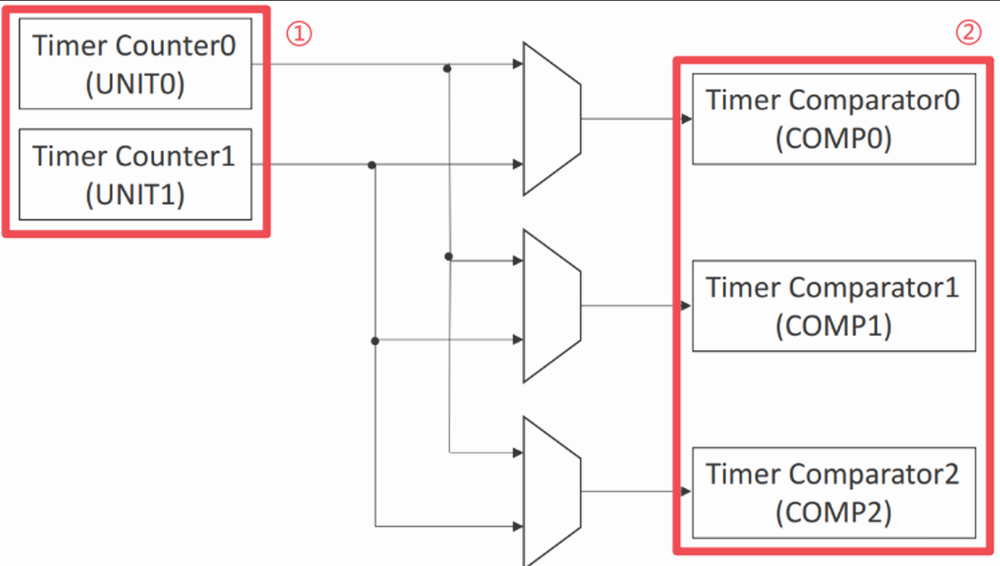
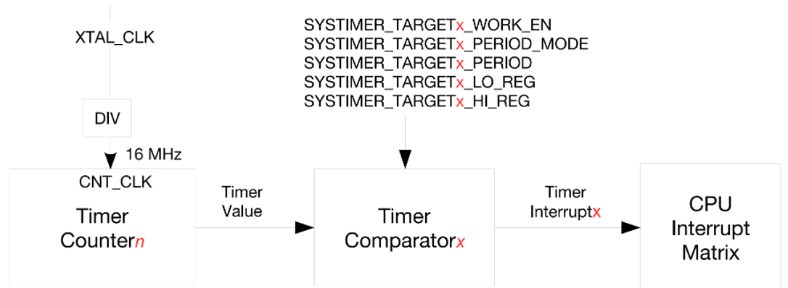

# 系统定时器实验

## 前言

ESP32-S3 芯片内置一组 52 位系统定时器。该定时器可用于生成操作系统所需的滴答定时中断，也可用作普通定时器生成周期或单次延时中断。通过本章的学习，开发者将学习到高分辨率定时器的使用。

## 定时器简介

定时器是单片机内部集成的功能，它能够通过编程进行灵活控制。单片机的定时功能依赖于内部的计数器实现，每当单片机经历一个机器周期并产生一个脉冲时，计数器就会递增。定时器的主要作用在于计时，当设定的时间到达后，它会触发中断，从而通知系统计时完成。在中断服务函数中，我们可以编写特定的程序以实现所需的功能。
<br />1，定时器能做什么
<br />定时器的主要作用包括但不限于：
<br />（1）执行定时任务：定时器常用于周期性执行特定任务。例如，若需要每 500 毫秒执行某项任务，定时器能够精准地满足这一需求。
<br />（2）时间测量：定时器能够精确测量时间，无论是代码段的执行时间还是事件发生的间隔时间，都能通过定时器进行准确的计量。
<br />（3）精确延时：对于需要微秒级精度的延时场景，定时器能够提供可靠的解决方案，确保延时的精确性。
<br />（4） PWM信号生成：通过定时器的精确控制，我们可以生成PWM（脉宽调制）信号，这对于驱动电机、调节 LED 亮度等应用至关重要。
<br />（5）事件触发与监控：定时器不仅用于触发中断，实现事件驱动的逻辑，还可用于实现看门狗功能，监控系统状态，并在必要时进行复位操作，确保系统的稳定运行。
<br />2，硬件定时器与软件定时器
定时器既可通过硬件实现，也可基于软件进行设计，二者各具特色，适用于不同场景：
<br />硬件定时器，依托微控制器的内置硬件机制，通过专门的计时/计数器电路达成定时功能。其显著优势在于高精度与高可靠性，这是因为硬件定时器的工作独立于软件任务和操作系统调度，故而不受它们的影响。在追求极高定时精确度的场合，如生成 PWM 信号或进行精确时间测量时，硬件定时器无疑是最佳选择。其工作原理确保即便主 CPU 忙于其他任务，定时器也能在预设时间准确触发相应操作。而软件定时器，则是通过操作系统或软件库模拟实现的定时功能。这类定时器的性能受系统当前负载和任务调度策略制约，因此在精度上较硬件定时器稍逊一筹。然而，软件定时器在灵活性方面更胜一筹，允许创建大量定时器，适用于对时间控制要求不那么严格的场景。值得注意的是，软件定时器在某些情况下可能面临定时精度问题，特别是在系统负载较重或存在众多高优先级任务时。不过，对于简单的非高精度延时需求，软件定时器通常已经足够应对。
<br />3， ESP32-S3 的定时器整体框架介绍下面先来简单了解一下系统定时器结构图，通过学习系统定时器结构图会有一个很好的整体掌握，同时对之后的编程也会有一个清晰的思路。



系统定时器内置两个计数器UNIT0和UNIT1(如图14-1中①所示)以及三个比较器COMP0、COMP1、COMP2(如图14-1中②所示)。比较器用于监控计数器的计数值是否达到报警值。
<br />（1）计数器
<br />UNIT0、UNIT1均为ESP32-S3系统定时器内置的52位计数器。计数器使用XTAL_CLK作为时钟源(40MHz)。XTAL_CLK经分频后，在一个计数周期生成频率为fXTAL_CLK/3的时钟信号，然后在另一个计数周期生成频率为fXTAL_CLK/2的时钟信号。因此，计数器使用的时钟CNT_CLK，其实际平均频率为fXTAL_CLK/2.5，即16MHz，见图14.1.2。每个CNT_CLK时钟周期，计数递增1/16µs，即16个周期递增1µs。用户可以通过配置寄存器SYSTIMER_CONF_REG中下面三个位来控制计数器UNITn，这三个位分别是：
<br />①：SYSTIMER_TIMER_UNITn_WORK_EN
<br />②：SYSTIMER_TIMER_UNITn_CORE0_STALL_EN
<br />③：SYSTIMER_TIMER_UNITn_CORE1_STALL_EN
<br />关于这三位的配置请参考《esp32-s3_technical_reference_manual_cn》。
<br />（2）比较器
<br />COMP0、COMP1、COMP2均为ESP32-S3系统定时器内置的52位比较器。比较器同样使用XTAL_CLK作为时钟源(40MHz)。



上图展示了系统定时器生成报警的过程。在上述过程中用到一个计数器(Timer Countern)和一个比较器(Timer Comparatorx)，比较器将根据比较结果，生成报警中断。

## 硬件设计

### 例程功能

实现现象：程序运行后配置通用定时器，在一定的周期内触发报警事件。

### 硬件资源

1. 系统定时器：
<br />1，高分辨率定时器(ESP 定时器)

### 原理图

本章实验使用的 ESP 定时器为 ESP32-S3 的片上资源，因此并没有相应的连接原理图。

## 程序设计

### ESPTIMER函数解析

ESP-IDF 提供了一套 API 来配置高精度定时器。接下来，作者将介绍一些常用的定时器函数，这些函数的描述及其作用如下：

#### 创建一个事件

该函数用于创建 ESPTIMER 实例，其函数原型如下所示：

```esp_err_t esp_timer_create(const esp_timer_create_args_t* args, esp_timer_handle_t* out_handle)```

该函数的形参描述，如下表所示：

参数  	         | 描述	         
-----------------|---------------------
  args  	 | 指向 arg 外设结构体的指针
  out_handle    | 指向 `esp_timer_handle_t` 类型变量的指针，该变量用于保存创建的定时器的句柄

【返回值】

返回值： ESP_OK 表示创建成功。其他表示创建失败。

#### 每个周期内触发一次

该函数用于使能定时器的指定中断，其函数原型如下所示：

```esp_err_t IRAM_ATTR esp_timer_start_periodic(esp_timer_handle_t timer,uint64_t period_us)```

该函数的形参描述，如下表所示：

参数  	         | 描述	         
-----------------|---------------------
  timer  	 | 使用 esp_timer_create 创建的定时器句柄
  period_us    | 计时器周期，以微秒为单位

【返回值】

返回值： ESP_OK 表示开启定时器成功。其他表示开启失败。

### ESPTIMER驱动解析

在 IDF 版的 05_esp_timer 例程中，作者在```05_esp_timer \components\BSP```路径下新增了一个ESPTIM 文件夹，用于存放 esptim.c 和 esptim.h 这两个文件。其中， esptim.h 文件负责声明ESPTIMER 相关的函数和变量，而 esptim.c 文件则实现了 ESPTIMER 的驱动代码。下面，我们将详细解析这两个文件的实现内容。

#### 1,esptim.h文件

```
/* 函数声明 */
void esptimer_init(uint64_t tps);   /* 初始化高分辨率定时器 */
```

#### 2,esptim.c文件

```
/**
 * @brief       定时器回调函数
 * @param       arg: 不携带参数
 * @retval      无
 */
void esptimer_callback(void *arg)
{
    ESP_LOGI("ESPTIMER", "ESPTIMER Callback is called!"); /* 打印日志信息 */
}

/**
 * @brief       初始化高分辨率定时器(ESP_TIMER)
 * @param       tps: 定时器周期,以微秒为单位(μs).
 *              若以一秒为定时器周期来执行一次定时器中断,那此处tps = 1s = 1000000μs
 * @retval      无
 */

void esptimer_init(uint64_t tps)
{
    esp_timer_handle_t esp_tim_handle;                      /* 定义定时器句柄  */

    /* 定义一个定时器结构体设置定时器配置参数 */
    esp_timer_create_args_t timer_arg = {
        .callback = &esptimer_callback,                     /* 计时时间到达时执行的回调函数 */
        .arg = NULL,                                        /* 传递给回调函数的参数 */
        .dispatch_method = ESP_TIMER_TASK,                  /* 进入回调方式,从定时器任务进入 */
        .name = "Timer",                                    /* 定时器名称 */
    };

    ESP_ERROR_CHECK(esp_timer_create(&timer_arg, &esp_tim_handle));     /* 创建定时器 */
    ESP_ERROR_CHECK(esp_timer_start_periodic(esp_tim_handle, tps));     /* 启动周期性定时器,tps设置定时器周期(us单位) */
}
```

从 ESPTIMER 的初始化代码中可以看到，结构体 esp_timer_create_args_t 通过其中两个结构体成员，以指针的形式调用定时器回调函数。传入的参数 tim_periodic_arg，目的在于方便后续的调用，而 esp_timer_create()函数便是通过指针的方式完成对该结构体的调用，之后再通过esp_timer_start_periodic()函数设定周期，最终完成 ESPTIMER 的初始化配置。在定时器回调函数中，我们调用了是 ESP-IDF 提供的日志打印函数，并设定，定时器的每一次计数溢出都会打印一次日志信息。 关于 ESPTIMER 结构体的介绍，请读者回顾本章节前面的内容。

### CMakeLists.txt文件

打开本实验的BSP文件夹下的CMakeList.txt文件，其内容如下所示：
```
set(src_dirs
            ESPTIMER)

set(include_dirs
            ESPTIMER)

set(requires
            driver
            esp_timer)

idf_component_register(SRC_DIRS ${src_dirs} INCLUDE_DIRS ${include_dirs} REQUIRES ${requires})

component_compile_options(-ffast-math -O3 -Wno-error=format=-Wno-format)
```
上述代码中的 ESPTIM 驱动需要由开发者自行添加，以确保 ESPTIM 驱动能够顺利集成到构建系统中。这一步骤是必不可少的，它确保了 ESPTIM 驱动的正确性和可用性，为后续的开发工作提供了坚实的基础。

###  实验应用代码

打开main.c文件，该文件定义了工程入口函数，名为main。该函数代码如下。
```
/**
 * @brief       程序入口
 * @param       无
 * @retval      无
 */
void app_main(void)
{
    esp_err_t ret;
    
    ret = nvs_flash_init();         /* 初始化NVS */

    if (ret == ESP_ERR_NVS_NO_FREE_PAGES || ret == ESP_ERR_NVS_NEW_VERSION_FOUND)
    {
        ESP_ERROR_CHECK(nvs_flash_erase());
        ESP_ERROR_CHECK(nvs_flash_init());
    }
    
    esptimer_init(1000000);       /* 初始化高分辨率定时器，此处设置定时器周期为1秒，
                                       但该函数事宜微妙为单位进行计算，
                                       故而1秒钟换算为1000000微秒 */
    while(1)
    {
        vTaskDelay(pdMS_TO_TICKS(10));  /* 延时10ms */
    }
}
```
从上面的代码中可以看到，ESP 定时器的周期值配置为 1000000，因为 ESP32-S3 高分辨率定时器的计数周期是以微秒作为基础单位进行运算，所以当我们设定计数周期为 1 秒时需要将单位换算为微秒。因此打印一次日志信息的周期为 1 秒。

## 下载验证

在完成编译和烧录操作后，系统在一定周期内通过串口打印一次日志信息。


