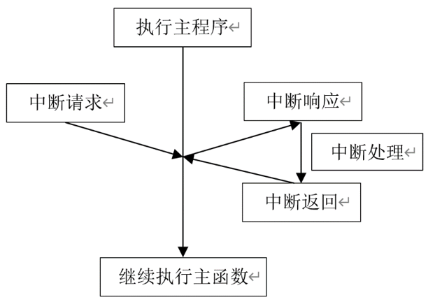

# 外部中断实验

## 前言

本章将介绍如何将GPIO引脚作为外部中断输入来使用。通过本章的学习，开发者将学习到GPIO作为外部中断输入的使用。

## 中断简介

在上一章节中，我们虽然实现了GPIO口输入功能的读取，但代码始终在检测IO输入口的变化，导致在代码量增加时，按键检测部分的轮询效率降低。尤其在某些特定场合，如按键可能一天才被按下一次，实时检测将造成大量时间浪费。为优化此问题，我们引入了外部中断的概念。外部中断即在按键被按下（触发中断）时执行相关功能，从而显著节省CPU资源，因此在实际项目中应用广泛。

#### 1，什么是外部中断

外部中断属于硬件中断，由微控制器外部事件触发。微控制器的特定引脚被设计为对特定事件（如按钮按压、传感器信号变化等）作出响应，这些引脚通常称为“外部中断引脚”。一旦外部中断事件发生，当前程序执行将立即暂停，并跳转到相应的中断服务程序（ISR）进行处理。处理完毕后，程序会恢复执行，从被中断的地方继续。下图是CPU中断处理过程。



对于嵌入式和实时系统而言，外部中断的使用至关重要，它能使系统对外部事件作出即时响应，极大提升系统效率和实时性。

#### 2，ESP32-S3外部中断

总的来说，ESP32-S3的外部中断具备两种触摸类型：
（1）电平触发：高、低电平触发，要求保持中断的电平状态直到CPU响应。
（2）边沿触发：上升沿和下降沿触发，这类型的中断一旦触发，CPU即可响应。
ESP32-S3的外部中断功能能够以非常精确的方式捕捉外部事件的触发。开发者可以通过配置中断触发方式（如上升沿、下降沿、任意电平、低电平保持、高电平保持等）来适应不同的外部事件，并在事件发生时立即中断当前程序的执行，转而执行中断服务函数。

## 硬件设计

### 例程功能

1. 按下K0按键，系统打印对应的信息。 

### 硬件资源

1. 按键 : K0-GPIO0

### 原理图

KEY0的原理图已在```按键输入实验```章节中详细阐述，为避免重复，此处不再赘述。

## 程序设计

### EXIT函数解析

接下来，作者将介绍一些常用的GPIO EXIT函数，这些函数的描述及其作用如下：

#### 注册中断函数

该函数用来注册中断服务，该函数原型如下所示：
```
void gpio_install_isr_service(esp_intr_alloc_flag_t flags)
```

该函数的形参描述如下表所示：

|参数  	  | 中断标志位	         | 中断描述
|--------- |----------------------|------------------------------------
|  flags   | ESP_INTR_FLAG_LEVEL1 | 使用 Level 1 中断级别。在中断服务程序执行期间禁用同级别的中断。
|  -   | ESP_INTR_FLAG_LEVEL2 | 使用 Level 2 中断级别。在中断服务程序执行期间禁用同级别和 Level 1 的中断。
|  -   | ESP_INTR_FLAG_EDGE   | 使用边沿触发方式。使能 GPIO 边沿触发中断。
|  -   | ESP_INTR_FLAG_LOWMED | 使用中低水平触发方式。使能 GPIO 中低电平触发中断。
|  -   | ESP_INTR_FLAG_HIGH   | 使用高电平触发方式。使能 GPIO 高电平触发中断。


【返回值】

无


#### 分配中断函数

该函数设置某个管脚的中断服务函数，该函数原型如下所示：

```esp_err_t gpio_isr_handler_add(gpio_num_t gpio_num, gpio_isr_t isr_handler, void* args)```

该函数的形参描述如下表所示：

参数  	         | 描述	         
-----------------|---------------------
  gpio_num   | GPIO 引脚号，指定要分配中断处理程序的 GPIO 引脚。 
  isr_handler   | 指向中断处理函数的函数指针。中断处理函数是一个用户定义的回调函数，将在中断发生时执行。
  args   |传递给中断处理程序的参数。这是一个指向用户特定数据的指针，可以在中断处理程序中使用。

【返回值】

ESP_OK 表示设置成功， ESP_FAIL 表示设置失败。

实现一个中断服务程序的回调函数，在函数中处理中断响应。（其中函数名可以随意起名，但是要符合 C 语言标准）中断处理函数需要声明为 IRAM_ATTR，以确保其运行在内存中的可执行区域。 下面是中断函数的模板。
```
void IRAM_ATTR gpio_isr_handler(void* arg) {
	/* 处理中断响应 */
}
```

#### 开启外部中断函数

该函数用来配置某个管脚开启外部中断，该函数原型如下所示：

```void gpio_intr_enable(gpio_num_t gpio_num)```

该函数的形参描述如下表所示：

参数  	         | 描述	         
-----------------|---------------------
  gpio_num   | GPIO 引脚号，指定要分配中断处理程序的 GPIO 引脚。 

【返回值】

无

注意： 在使用 gpio_intr_enable()函数之前， 开发者需要先通过 gpio_install_isr_service()函数和 gpio_isr_handler_add()函数来安装和注册中断处理程序。

### EXIT驱动解析

在 IDF 版的 03_exit 例程中，作者在 ```03_exit \components\BSP ```路径下新增了一个 EXIT 文件夹，用于存放 exit.c 和 exit.h 这两个文件。其中， exit.h 文件负责声明 EXIT 相关的函数和变量，而 exit.c 文件则实现了 EXIT 的驱动代码。下面，我们将详细解析这两个文件的实现内容。

#### 1，exit.h文件

```
/* 引脚定义 */
#define KEY0_INT_GPIO_PIN   GPIO_NUM_0

/*IO操作*/
#define KEY0                gpio_get_level(KEY0_INT_GPIO_PIN)

/* 函数声明 */
void exit_init(void);   /* 外部中断初始化程序 */

#endif
```

#### 2，exit.c文件

```
/**
 * @brief       外部中断服务函数
 * @param       arg：中断引脚号
 * @note        IRAM_ATTR: 这里的IRAM_ATTR属性用于将中断处理函数存储在内部RAM中，目的在于减少延迟
 * @retval      无
 */
static void IRAM_ATTR exit_gpio_isr_handler(void *arg)
{
    uint32_t gpio_num = (uint32_t) arg;
    
    if (gpio_num == KEY0_INT_GPIO_PIN)
    {
        ESP_LOGI("KEY", "KEY0 pressed");
    }
}

/**
 * @brief       外部中断初始化程序
 * @param       无
 * @retval      无
 */
void exit_init(void)
{
    gpio_config_t gpio_init_struct;

    /* 配置KEY0引脚和外部中断 */
    gpio_init_struct.mode = GPIO_MODE_INPUT;                    /* 选择为输入模式 */
    gpio_init_struct.pull_up_en = GPIO_PULLUP_ENABLE;           /* 上拉使能 */
    gpio_init_struct.pull_down_en = GPIO_PULLDOWN_DISABLE;      /* 下拉失能 */
    gpio_init_struct.intr_type = GPIO_INTR_NEGEDGE;             /* 下降沿触发 */
    gpio_init_struct.pin_bit_mask = 1ull << KEY0_INT_GPIO_PIN;  /* 配置KEY0按键引脚 */
    gpio_config(&gpio_init_struct);                             /* 配置使能 */
    
    /* 注册中断服务 */
    gpio_install_isr_service(0);
    
    /* 设置GPIO的中断回调函数 */
    gpio_isr_handler_add(KEY0_INT_GPIO_PIN, exit_gpio_isr_handler, (void*) KEY0_INT_GPIO_PIN);
}
```
 开启管脚的外部中断操作相对简便。首先，需要将管脚配置为下降沿触发和输入模式。完成配置后，需要调用gpio_install_isr_service 函数来注册中断服务，并调用 gpio_isr_handler_add 函数来注册外部中断的回调函数。最后，调用 gpio_intr_enable 函数启用外部中断功能。其中， exit_gpio_isr_handler回调函数负责实现系统打印对应的实验信息。

### CMakeLists.txt文件

打开本实验的BSP文件夹下的CMakeList.txt文件，其内容如下所示：
```
set(src_dirs
            EXIT)

set(include_dirs
            EXIT)

set(requires
            driver)

idf_component_register(SRC_DIRS ${src_dirs} INCLUDE_DIRS ${include_dirs} REQUIRES ${requires})

component_compile_options(-ffast-math -O3 -Wno-error=format=-Wno-format)
```
上述代码中的 EXIT 驱动需要由开发者自行添加，以确保 EXIT 驱动能够顺利集成到构建系统中。这一步骤是必不可少的，它确保了 EXIT 驱动的正确性和可用性，为后续的开发工作提供了坚实的基础。

###  实验应用代码

打开 main/main.c 文件，该文件定义了工程入口函数，名为"app_main",该函数代码如下。
```
/**
 * @brief       程序入口
 * @param       无
 * @retval      无
 */
void app_main(void)
{
    esp_err_t ret;
    
    ret = nvs_flash_init(); /* 初始化NVS */

    if (ret == ESP_ERR_NVS_NO_FREE_PAGES || ret == ESP_ERR_NVS_NEW_VERSION_FOUND)
    {
        ESP_ERROR_CHECK(nvs_flash_erase());
        ESP_ERROR_CHECK(nvs_flash_init());
    }
    
    exit_init();            /* 初始化按键 */
    
    while(1) 
    {
        vTaskDelay(10);
    }
}
```
可以看到应用代码中，在初始化完按键后，就进入了一个while循环，在循环中，每间隔10毫秒就调用key_scan()函数扫描以此按键的状态，如果扫描到K0按键被按下，则系统回打印相应的实验信息。

## 下载验证

在完成编译和烧录操作后，若此时按下并释放一次K0按键，则能够通过VSCode的终端或者串口助手（需选择对应的设备）看到打印出的实验信息，与预期的实验现象效果相符。


