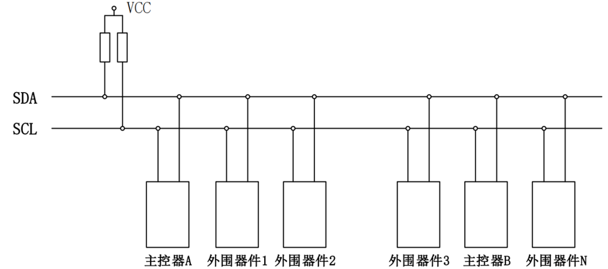
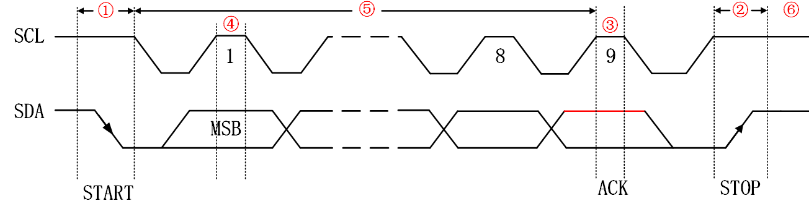
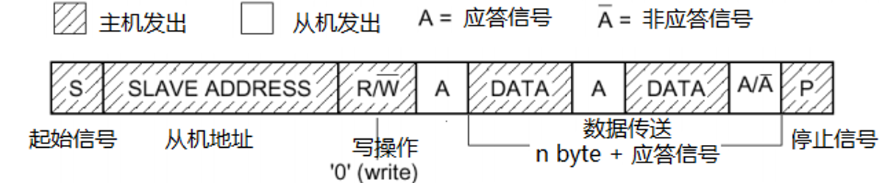
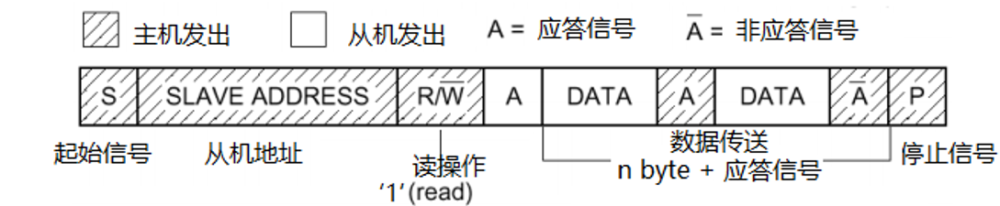
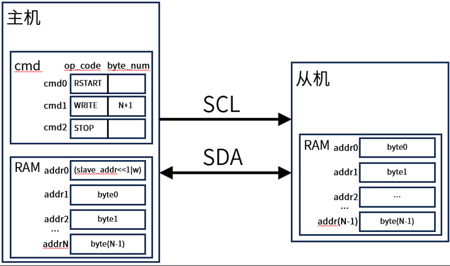
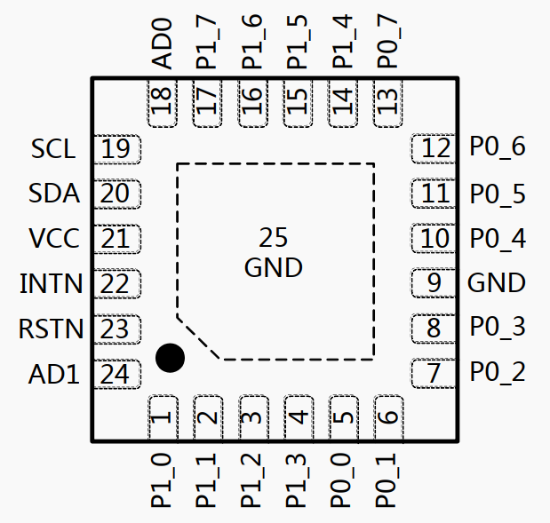
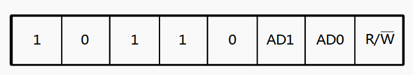
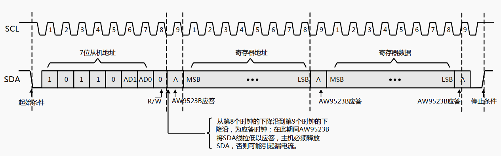
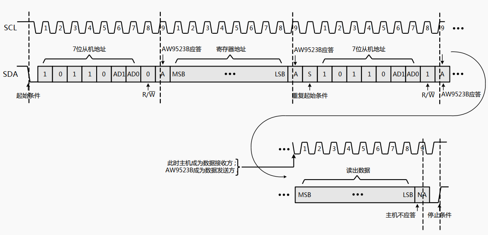
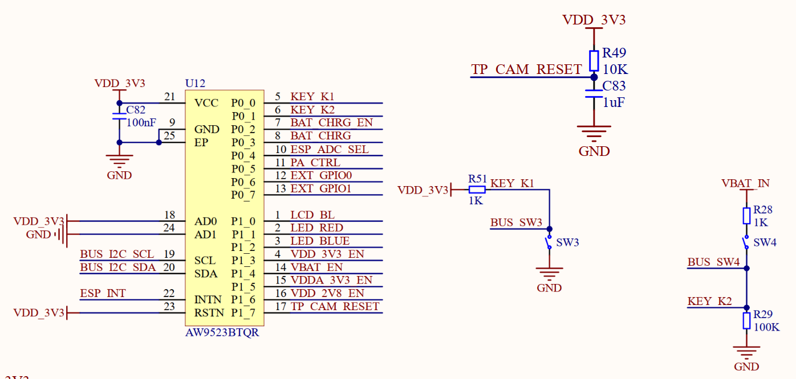

# IIC_EXIO实验

## 前言

本章，我们将使用ESP32-S3的硬件IIC接口去驱动IO扩展芯片AW9523B。在本章中，实现和AW9523B之间的双向通信，将使用其IO的输入输出功能。

## IIC简介

IIC（Inter-Integrated Circuit）总线是一种由PHILIPS公司开发的两线式串行总线，用于连接微控制器以及其外围设备。它是由数据线SDA和时钟线SCL构成的串行总线，可发送和接收数据，在CPU与被控IC之间、IC与IC之间进行双向传送。
<br />IIC总线有如下特点：
<br />①总线由数据线SDA和时钟线SCL构成的串行总线，数据线用来传输数据，时钟线用来同步数据收发。
<br />②总线上每一个器件都有一个唯一的地址识别，所以我们只需要知道器件的地址，根据时序就可以实现微控制器与器件之间的通信。
<br />③数据线SDA和时钟线SCL都是双向线路，都通过一个电流源或上拉电阻连接到正的电压，所以当总线空闲的时候，这两条线路都是高电平。
<br />④总线上数据的传输速率在标准模式下可达100kbit/s，在快速模式下可达400kbit/s，在高速模式下可达3.4Mbit/s。
<br />⑤总线支持设备连接。在使用IIC通信总线时，可以有多个具备IIC通信能力的设备挂载在上面，同时支持多个主机和多个从机，连接到总线的接口数量只由总线电容400pF的限制决定。IIC总线挂载多个器件的示意图，如下图所示：



下面来学习IIC总线协议，IIC总线时序图如下所示：


为了便于大家更好的了解IIC协议，我们从起始信号、停止信号、应答信号、数据有效性、数据传输以及空闲状态等6个方面讲解，大家需要对应上一张图的标号来理解。
<br />① 起始信号
<br />当SCL为高电平期间，SDA由高到低的跳变。起始信号是一种电平跳变时序信号，而不是一个电平信号。该信号由主机发出，在起始信号产生后，总线就处于被占用状态，准备数据传输。
<br />② 停止信号
<br />当SCL为高电平期间，SDA由低到高的跳变。停止信号也是一种电平跳变时序信号，而不是一个电平信号。该信号由主机发出，在停止信号发出后，总线就处于空闲状态。
<br />③ 应答信号
<br />发送器每发送一个字节，就在时钟脉冲9期间释放数据线，由接收器反馈一个应答信号。 应答信号为低电平时，规定为有效应答位（ACK简称应答位），表示接收器已经成功地接收了该字节；应答信号为高电平时，规定为非应答位（NACK），一般表示接收器接收该字节没有成功。观察上图标号③就可以发现，有效应答的要求是从机在第9个时钟脉冲之前的低电平期间将SDA线拉低，并且确保在该时钟的高电平期间为稳定的低电平。如果接收器是主机，则在它收到最后一个字节后，发送一个NACK信号，以通知被控发送器结束数据发送，并释放SDA线，以便主机接收器发送一个停止信号。
<br />④ 数据有效性
<br />IIC总线进行数据传送时，时钟信号为高电平期间，数据线上的数据必须保持稳定，只有在时钟线上的信号为低电平期间，数据线上的高电平或低电平状态才允许变化。数据在SCL的上升沿到来之前就需准备好。并在下降沿到来之前必须稳定。
<br />⑤ 数据传输
<br />在I2C总线上传送的每一位数据都有一个时钟脉冲相对应（或同步控制），即在SCL串行时钟的配合下，在SDA上逐位地串行传送每一位数据。数据位的传输是边沿触发。
<br />⑥ 空闲状态
<br />IIC总线的SDA和SCL两条信号线同时处于高电平时，规定为总线的空闲状态。此时各个器件的输出级场效应管均处在截止状态，即释放总线，由两条信号线各自的上拉电阻把电平拉高。
了解前面的知识后，下面介绍一下IIC的基本的读写通讯过程，包括主机写数据到从机即写操作，主机到从机读取数据即读操作。下面先看一下写操作通讯过程图，如下图所示：

主机首先在IIC总线上发送起始信号，那么这时总线上的从机都会等待接收由主机发出的数据。主机接着发送从机地址+0（写操作）组成的8bit数据，所有从机接收到该8bit数据后，自行检验是否是自己的设备的地址，假如是自己的设备地址，那么从机就会发出应答信号。主机在总线上接收到有应答信号后，才能继续向从机发送数据。注意：IIC总线上传送的数据信号是广义的，既包括地址信号，又包括真正的数据信号。接着讲解一下IIC总线的读操作过程，先看一下读操作通讯过程图，如下图所示：

主机向从机读取数据的操作，一开始的操作与写操作有点相似，观察两个图也可以发现，都是由主机发出起始信号，接着发送从机地址+1（读操作）组成的8bit数据，从机接收到数据验证是否是自身的地址。 那么在验证是自己的设备地址后，从机就会发出应答信号，并向主机返回8bit数据，发送完之后从机就会等待主机的应答信号。假如主机一直返回应答信号，那么从机可以一直发送数据，也就是图中的（n byte + 应答信号）情况，直到主机发出非应答信号，从机才会停止发送数据。

### IIC基本参数

(1)速率：I2C总线有标准模式（100kbit/s）和快速模式（400kbit/s）两种传输模式，还有更快的扩展模式和高速模式可供选择。
<br />(2)器件地址：每个设备都有唯一的7位或10位地址，可以通过地址选择来确定与谁进行通信。
<br />(3)总线状态：I2C总线有五种状态，分别是空闲状态、起始信号、结束信号、响应信号、数据传输。
<br />(4)数据格式：I2C总线有两种数据格式，标准格式和快速格式。标准格式是8位数据字节加上1位ack/nack（应答/非应答）位，快速格式允许两个字节同时传输。由于SCL和SDA线是双向的，它们也可能会由于外部原因（比如线路中的电容等）出现电平误差，而从而导致通信出错。因此，在IIC总线中，通常使用上拉电阻来保证信号线在空闲状态下的电平为高电平。

### IIC控制器介绍

ESP32-S3有两个IIC总线接口，根据用户的配置，总线接口可以用作IIC主机或从机模式。 IIC接口特点：
<br />(1)可支持标准模式（100Kbit/s）、快速模式（400Kbit/s），速度最高可达800Kbit/s，但受限于SCL和SDA上拉强度。
<br />(2)可支持7位寻址模式和10位寻址模式
<br />(3)可支持双地址（从机地址和从机寄存器地址）寻址模式
下面介绍一下ESP32S3的IIC主机写入从机，7位寻址，单次命令序列的场景，如下图所示：

在ESP32-S3硬件IIC控制器中，都有相对应的空间存放相对应的内容。比如上图中，在cmd内存区中存放的是就是命令序列，就比如前面提及到的起始信号、写过程、读过程、停止信号；在RAM内存区中存放的就是某些命令序列携带的内容。
<br />当主机在软件配置好命令序列和RAM数据后，操作寄存器启动数据传输时。控制器的行为可分为以下四步：
<br />(1)等待SCL线位高电平，以避免SCL线被其他主机或者从机占用。
<br />(2)执行RSTART命令发送START位。即发送起始信号。
<br />(3)执行WRITE命令从RAM的首地址开始取出N+1个字节并一次发送给从机，其中第一个字节为地址。这个过程中会产生对应的时序，携带数据进行发送。
<br />(4)发送STOP命令，即发送停止信号。

### AW9523B介绍

AW9523B是一款24引脚的CMOS器件，采用I²C总线接口进行通信。该器件集成了16路通用输入/输出(GPIO)端口及呼吸灯驱动功能，可连接按键、LED、传感器等外设，有效解决微控制器I/O资源不足的问题。
<br />AW9523B有如下特性：
<br />(1) I²C总线控制的16路GPIO扩展器，同时支持呼吸灯功能
<br />(2) 工作电源电压范围2.4V至5.5V
<br />(3) 超低待机电流
<br />(4) 400kHz快速I²C接口，兼容1.8V通信电平
<br />(5) 16路共阳极恒流型LED驱动，256级线性调光
<br />(6) 中断引脚(INTN)为开漏输出，输入状态变化时产生中断
<br />(7) 硬件复位引脚(RSTN)内置10μs防抖动处理
<br />(8) 2位地址选择(AD1/AD0)，单总线最多可连接4个器件

简单概括一下，AW9523B通过400kHz速率的I²C接口与微控制器连接，仅需2根通信线即可扩展16个可配置I/O。器件地址由AD1/AD0两个硬件引脚决定，允许在同一条I²C总线上挂载最多4个AW9523B，提供总共64个I/O资源。
<br />AW9523B引脚图如下图所示：





AW9523B器件总共有24个管脚，分别为电源线VCC、地线GND、GPIO口、通信线、地址线。16个IO分为了2组，一组是8个，分为是P0x和P1x，这些IO都可通过器件寄存器进行配置作为输出或者输出使用。通信线就是SDA和SCL，中断线INTN也划分过来通信线。而地址线就是A0、A1，用来决定器件地址。RSTN为芯片复位引脚。

#### 1，AW9523B寻址

要进行IIC通信，首先得知道器件地址，AW9523B器件地址是7位的，格式如下图所示：



从上图可以知道，AW9523B芯片上有两个地址选择引脚（AD1和AD0），就像给每个芯片分配不同的"门牌号"。通过这两个引脚的不同组合（00、01、10、11），我们可以在同一条I2C总线上连接最多4个AW9523B芯片而不互相干扰。I2C通信时，主控芯片会先发送8位地址来寻找目标设备，首先，前5位固定为"10110"，接下来的2位由AD1和AD0引脚的电平决定，最后1位表示操作类型：0表示写入数据，1表示读取数据。当主控发送的地址与某个AW9523B的地址匹配时，该芯片会"应答"（拉低SDA线），表示"我在这里，准备接收指令"。

#### 2，AW9523B时序介绍

ESP32-S3是通过IIC总线跟AW9523B进行通信的，对AW9523B相关寄存器进行写入配置，对其16个IO进行使用。这里的时序主要就是写寄存器时序和读寄存器时序，我们一一介绍。
<br />（1）写寄存器时序

如上图为 AW9523B 写操作时序图。主机先发送起始条件，接着发送 7 位从机地址加一位读写位‘0’ ；当发送的从机地址与某一个 AW9523B 器件地址相符合时，该 AW9523B 应答；接着，主机发送 8 位 AW9523B 寄存器地址，发送的格式为高有效位（MSB）先发送，低有效位（LSB）后发送； AW9523B 应答后，主机接着发送 8 位寄存器数据，仍然是 MSB 先发送， LSB 后发送。接着， AW9523B 应答；主机发送停止条件以结束本次传输。
<br />（2）读寄存器时序

如上图为 AW9523B 读操作时序图。主机先发送起始条件，接着发送 7 位从机地址加一位读写位‘0’ ；当发送的从机地址与某一个 AW9523B 器件地址相符合时，该 AW9523B 应答；接着，主机发送 8 位 AW9523B 寄存器地址，发送的格式为高有效位（MSB）先发送，低有效位（LSB）后发送，且 AW9523B 应答；然后，主机发送停止条件及重复起始条件，接着发送 7 位从机地址加一位读写位‘1’ ， AW9523B 应答；应答之后， AW9523B 发送 8 位寄存器数据，发送的格式仍为 MSB 在前， LSB 在后；在接下来的应答时钟，主机不应答，接着主机发送停止条件以结束本次传输。

## 硬件设计

### 例程功能

1. 通过按下 KEY_K1、 KEY_K2 按键来控制LED_BLUE开关状态， LED_RED 灯则不断闪烁。

### 硬件资源

1.LED 灯
<br />LED_RED - P1_1
<br />LED_BLUE - P1_2
<br />2.按键
<br />KEY_K1 - P0_0
<br />KEY_K2 - P0_1
<br />3.AW9523B扩展芯片
<br />IIC_SCL - GPIO_NUM_2
<br />IIC_SDA - GPIO_NUM_3

### 原理图

AW9523B器件相关原理图，如下图所示：


## 程序设计

### IIC_EXIO函数解析

ESP-IDF提供了一套API来配置IIC。那么下面作者将介绍一下在实验中调用到的API函数：

#### IIC总线初始化函数

该函数用于初始化IIC总线，其函数原型如下：

```esp_err_t

```

该函数的形参描述如下表所示：

| 参数             | 描述      |
| -------------- | ------- |
| bus_config     | IIC总线配置 |
| ret_bus_handle | IIC总线句柄 |

返回值如下：

| 返回值                 | 描述                   |
| ------------------- | -------------------- |
| ESP_OK              | 表示IIC总线初始化成功。        |
| ESP_ERR_INVALID_ARG | 表示由于错误参数，IIC总线初始化失败。 |
| ESP_ERR_NO_MEM      | 表示由于内存不足，IIC总线创建失败。  |
| ESP_ERR_NOT_FOUND   | 表示没有空闲的IIC总线 。       |

bus_config为指向IIC总线配置结构体指针，如下代码所示：

```
typedef struct {
    i2c_port_num_t i2c_port;                /* IIC端口 */
    gpio_num_t sda_io_num;                  /* SDA管脚 */
    gpio_num_t scl_io_num;                  /* SCL管脚 */
    union {
        i2c_clock_source_t clk_source;      /* 时钟源 */
#if SOC_LP_I2C_SUPPORTED
        lp_i2c_clock_source_t lp_source_clk;/* 低功耗IIC外设时钟源 */
#endif
    };
    uint8_t glitch_ignore_cnt;              /* 总线的故障周期阈值 */
    int intr_priority;                      /* IIC中断优先级 */
    size_t trans_queue_depth;               /* 内部传输队列的深度 */
    struct {
        uint32_t enable_internal_pullup: 1; /* 启用内部上拉 */
    } flags;                                /* 配置标记 */
} i2c_master_bus_config_t;                  /* IIC主机总线配置 */
```

#### 初始化IO扩展芯片的IIC引脚

在配置AW9523B芯片引脚之前，需要对IIC初始化进行一个判断。因为ESP32系统不支持同一个外设进行两次初始化，否则会出现系统不断复位的现象。因此，我们需要在IO扩展芯片的初始化前面添加IIC端口判断。对于，XL_INT引脚的初始化过程，笔者在这便不再赘述了。

#### 配置AW9523B相应IO的输入输出状态

上文提及了AW9523B将16个IO分为了2组，一组是8个，分为是P0x和P1x，这些IO都可通过器件寄存器进行配置作为输出或者输出，不同于ESP32-S3芯片上的普通IO，AW9523B芯片的IO输入输出模式需要特定函数进行配置，其函数原型如下所示：
```uint16_taw9523b_ioconfig(uint16_t config_value)```

该函数的形参描述如下表所示：

| 参数           | 描述         |
| ------------ | ---------- |
| config_value | IO配置输入或者输出 |

【返回值】

返回值：设置的数值。

aw9523b_ioconfig函数主要就是设置AW9523B某个IO的模式，可设置成输出，也可设置为输入。内部实现逻辑比较简单，在AW9523B芯片中除去IIC通信引脚以及电源引脚还有16个引脚，其中每个引脚对应不同寄存器，所以每一个引脚都有一个与之对应的16进制寄存器地址。假如我们要设置IO0_0与IO0_1以及IO1_1为输入模式，其它引脚皆为输出模式，那么只需将这三个引脚配置为“1”，其它引脚配置为“0”，对应16位的二进制数为：“0000 0010 0000 0011”，将该二进制数转换为十六进制也就是：“0x203”我们将得到的数值作为形参传进该函数中，即可完成对这三个引脚的输入模式配置。

#### 获取AW9523B的IO状态

该函数用于获取AW9523B某个IO的指定电平（高电平或低电平），其函数原型如下所示：
```int aw9523b_pin_read(uint16_t pin)```

该函数的形参描述如下表所示：

| 参数  | 描述       |
| --- | -------- |
| pin | 要获取状态的IO |

【返回值】

返回值：返回获取IO的电平数值。

#### 获取AW9523B的IO状态

该函数用于获取AW9523B某个IO的指定电平（高电平或低电平），其函数原型如下所示：
```uint16_t aw9523b_pin_write(uint16_t pin, int val)```

该函数的形参描述如下表所示：

| 参数  | 描述        |
| --- | --------- |
| pin | 要获取状态的IO  |
| val | 电平状态(0/1) |

【返回值】

返回值：16位IO状态。

### IIC_EXIO 驱动解析

在IDF版的07_iic_exio例程中，作者在```07_iic_exio \components\BSP```路径下新增了一个IIC文件夹和一个AW9523B文件夹，分别用于存放myiic.c、myiic.h和aw9523b.c以及aw9523b.h这四个文件。其中，myiic.h和aw9523b.h文件负责声明IIC以及AW9523B相关的函数和变量，而myiic.c和aw9523b.c文件则实现了IIC以及AW9523B的驱动代码。下面，我们将详细解析这四个文件的实现内容。

#### 1，myiic.h文件

```
/* 引脚与相关参数定义 */
#define IIC_NUM_PORT       I2C_NUM_0       /* IIC0 */
#define IIC_SPEED_CLK      400000          /* 速率400K */
#define IIC_SDA_GPIO_PIN   GPIO_NUM_3      /* IIC0_SDA引脚 */
#define IIC_SCL_GPIO_PIN   GPIO_NUM_2      /* IIC0_SCL引脚 */

extern i2c_master_bus_handle_t bus_handle; /* 总线句柄 */

/* 函数声明 */
esp_err_t myiic_init(void);                /* 初始化MYIIC */

#endif
```

#### 2，myiic.c文件

```
i2c_master_bus_handle_t bus_handle;        /* 总线句柄 */

/**
 * @brief       初始化MYIIC
 * @param       无
 * @retval      ESP_OK:初始化成功
 */
esp_err_t myiic_init(void)
{
    i2c_master_bus_config_t i2c_bus_config = {
        .clk_source                     = I2C_CLK_SRC_DEFAULT,  /* 时钟源 */
        .i2c_port                       = IIC_NUM_PORT,         /* I2C端口 */
        .scl_io_num                     = IIC_SCL_GPIO_PIN,     /* SCL管脚 */
        .sda_io_num                     = IIC_SDA_GPIO_PIN,     /* SDA管脚 */
        .glitch_ignore_cnt              = 7,                    /* 故障周期 */
        .flags.enable_internal_pullup   = true,                 /* 内部上拉 */
    };
    /* 新建I2C总线 */
    ESP_ERROR_CHECK(i2c_new_master_bus(&i2c_bus_config, &bus_handle));

    return ESP_OK;
}
```

与STM32不同，ESP32在IIC的配置上提供了三个IIC端口，但是在开发过程中会用到使用不同IIC端口的外设，为了保持代码的最大兼容性与减少两个IIC端口在使用过程中的冲突，我们在iic.h文件里定义了包含IIC端口的结构体参数，再激活IIC控制器驱动函数完成对IIC的初始化。IC驱动中对IIC的各种操作，例如产生IIC起始信号、产生IIC停止信号等，请读者结合IIC的时序规定查看本实验的配套实验源码。

#### 3，aw9523b.h文件

AW9523B器件有很多个寄存器，而我们在代码中只配置了13个寄存器，并且16个IO口在寄存器的位置都是固定的，基于单个IO操作单位的考虑，故这里我们也定义了对应的宏，如下所示：

```
/* 引脚与相关参数定义 */
#define AW9523B_INT_IO              GPIO_NUM_42                      /* AW9523B_INT引脚 */
#define AW9523B_INT                 gpio_get_level(AW9523B_INT_IO)   /* 读取AW9523B_INT的电平 */

/* AW9523B寄存器地址 */
#define AW9523B_INPUT_PORT0_REG      0x00                            /* 输入寄存器0地址 */
#define AW9523B_INPUT_PORT1_REG      0x01                            /* 输入寄存器1地址 */
#define AW9523B_OUTPUT_PORT0_REG     0x02                            /* 输出寄存器0地址 */
#define AW9523B_OUTPUT_PORT1_REG     0x03                            /* 输出寄存器1地址 */
#define AW9523B_CONFIG_PORT0_REG     0x04                            /* 方向配置寄存器0地址 */
#define AW9523B_CONFIG_PORT1_REG     0x05                            /* 方向配置寄存器1地址 */
#define AW9523B_INT_ENABLE_PORT0_REG 0x06                            /* 中断使能寄存器0地址 */
#define AW9523B_INT_ENABLE_PORT1_REG 0x07                            /* 中断使能寄存器1地址 */
#define AW9523B_ID_REG               0x10                            /* ID寄存器地址 */
#define AW9523B_CTL_REG              0x11                            /* 全局控制寄存器地址 */
#define AW9523B_LED_MODE_P0_REG      0x12                            /* P0口LED模式切换寄存器 */
#define AW9523B_LED_MODE_P1_REG      0x13                            /* P1口LED模式切换寄存器 */
#define AW9523B_SW_RST_REG           0x7F                            /* 软件复位寄存器 */

#define AW9523_ID                    0x23

/* AD1/AD0组合对应的地址：
   AD1=0, AD0=0: 0x58
   AD1=0, AD0=1: 0x59
   AD1=1, AD0=0: 0x5A
   AD1=1, AD0=1: 0x5B
*/
#define AW9523B_ADDR                 0x59

/* AW9523B各个IO的功能定义 - 根据实际硬件连接修改 */
/* P0端口 (P0_0 ~ P0_7) */
#define P0_0                         0x0001
#define P0_1                         0x0002  
#define P0_2                         0x0004
#define P0_3                         0x0008
#define P0_4                         0x0010
#define P0_5                         0x0020
#define P0_6                         0x0040
#define P0_7                         0x0080

/* P1端口 (P1_0 ~ P1_7) */
#define P1_0                         0x0100
#define P1_1                         0x0200
#define P1_2                         0x0400
#define P1_3                         0x0800
#define P1_4                         0x1000
#define P1_5                         0x2000
#define P1_6                         0x4000
#define P1_7                         0x8000

/* 具体功能映射 - 根据实际硬件设计修改 */
#define LCD_BL                       P1_0
#define LED_RED                      P1_1
#define LED_BLUE                     P1_2
#define VDD_3V3_EN                   P1_3
#define KEY_K1                       P0_0
#define KEY_K2                       P0_1
#define BAT_CHRG_EN                  P0_2
#define BAT_CHRG                     P0_3
#define ESP_ADC_SEL                  P0_4
#define PA_CTRL                      P0_5
#define EXT_GPIO0                    P0_6
#define EXT_GPIO1                    P0_7
#define VBAT_EN                      P1_4
#define VDDA_3V3_EN                  P1_5
#define VDD_2V8_EN                   P1_6
#define TP_CAM_RESET                 P1_7

#define KEY0                        aw9523b_pin_read(KEY_K1)        /* 读取K1引脚 */
#define KEY1                        aw9523b_pin_read(KEY_K2)        /* 读取K2引脚 */

#define KEY0_PRES                   2                               /* K1按下 */
#define KEY1_PRES                   3                               /* K2按下 */

#define LEDR_TOGGLE()    do { aw9523b_pin_write(LED_RED, !aw9523b_pin_read(LED_RED)); } while(0)  /* LEDR翻转 */

/* 函数声明 */
esp_err_t aw9523b_init(void);                                            /* 初始化AW9523B */
int aw9523b_pin_read(uint16_t pin);                                      /* 获取某个IO状态 */
uint16_t aw9523b_pin_write(uint16_t pin, int val);                       /* 控制某个IO的电平 */
esp_err_t aw9523b_read_byte(uint8_t* data, size_t len);                  /* 读取AW9523B的IO值 */
esp_err_t aw9523b_write_byte(uint8_t reg, uint8_t *data, size_t len);    /* 向AW9523B寄存器写入数据 */
uint8_t aw9523b_key_scan(uint8_t mode);                                  /* 扫描扩展按键 */
void aw9523b_int_init(void);                                             /* 初始化AW9523B的中断引脚 */
void aw9523b_ioconfig(uint16_t config_value);                            /* AW9523B的IO配置 */
esp_err_t aw9523b_soft_reset(void);                                      /* 软件复位 */

#endif
```

#### 4，aw9523b.c文件

```
/**
 * @brief       初始化AW9523B
 * @param       无
 * @retval      ESP_OK:初始化成功
 */
esp_err_t aw9523b_init(void)
{
    uint8_t r_data[2];
    uint8_t id_value;

        /* 未调用myiic_init初始化IIC */ 
    if (bus_handle == NULL)
    {
        ESP_ERROR_CHECK(myiic_init());
    }

    i2c_device_config_t aw9523b_i2c_dev_conf  = {
        .dev_addr_length = I2C_ADDR_BIT_LEN_7,  /* 从机地址长度 */
        .scl_speed_hz    = IIC_SPEED_CLK,       /* 传输速率 */
        .device_address  = AW9523B_ADDR,         /* 从机7位的地址 */
    };
    /* I2C总线上添加XL9555设备 */
    ESP_ERROR_CHECK(i2c_master_bus_add_device(bus_handle, &aw9523b_i2c_dev_conf, &aw9523b_handle));

    /* 读取ID寄存器验证设备 */
    uint8_t reg_addr = AW9523B_ID_REG;
    i2c_master_transmit_receive(aw9523b_handle, &reg_addr, 1, &id_value, 1, -1);

    if (id_value != AW9523_ID) 
    {
        ESP_LOGE(aw9523b_tag, "AW9523B ID verification failed: 0x%02X, expected 0x23", id_value);
        return ESP_FAIL;
    }
    ESP_LOGI(aw9523b_tag, "AW9523B ID verified: 0x%02X", id_value);

    /* 配置所有端口为GPIO模式（非LED模式） */
    uint8_t gpio_mode = 0xFF;
    aw9523b_write_byte(AW9523B_LED_MODE_P0_REG, &gpio_mode, 1);
    aw9523b_write_byte(AW9523B_LED_MODE_P1_REG, &gpio_mode, 1);

    /* 配置P0口为推挽输出模式 */
    uint8_t ctl_value = 0x10;  /* 设置D[4]=1，P0口为Push-Pull模式 */
    aw9523b_write_byte(AW9523B_CTL_REG, &ctl_value, 1);

    /* 输入模式下，中断才有效（读取IO电平） */
    //aw9523b_int_init();

    /* 上电先读取一次清除中断标志 */
    aw9523b_read_byte(r_data, 2);
    /* 配置那些扩展管脚为输入输出模式 */
    aw9523b_ioconfig(0x003);

    aw9523b_pin_write(PA_CTRL, 1);
    aw9523b_pin_write(VBAT_EN, 1);
    aw9523b_pin_write(VDD_3V3_EN, 1);
    aw9523b_pin_write(VDDA_3V3_EN, 1);
    aw9523b_pin_write(ESP_ADC_SEL, 1);
    
    return ESP_OK;
}
```

我们重上面的代码中可以看到，在AW9523B初始化函数中，首先对IIC初始化进行一个判断，这是因为ESP32-S3芯片对第二次初始化的函数会返回配置错误的警告，从而导致芯片一直在复位，所以为了避免重复初始化某个函数我们一般会在相应的驱动初始化代码前对其进行判断，若在此前的步骤中没有初始化某个函数那么在这个判断语句中也可以对某函数进行初始化。此举有效避免了重复初始化以及遗漏初始化的问题。然后就是对AW9523B引脚的配置了。这里需要注意的是我们在对某个引脚采取读写操作前会先读取一次清除中断表示的操作。接下来，看一下如何向AW9523B寄存器写入一个字节数据的函数aw9523b_write_byte，代码如下：

```
/**
 * @brief       向AW9523B寄存器写入数据
 * @param       reg:寄存器地址
 * @param       data:要写入数据的存储区
 * @param       len:要写入数据的大小
 * @retval      ESP_OK:写入成功; 其他:写入失败
 */
esp_err_t aw9523b_write_byte(uint8_t reg, uint8_t *data, size_t len)
{
    esp_err_t ret;

    uint8_t *buf = malloc(1 + len);
    if (buf == NULL)
    {
        ESP_LOGE(aw9523b_tag, "%s memory failed", __func__);
        return ESP_ERR_NO_MEM;      /* 分配内存失败 */
    }

    buf[0] = reg;                   /* 0号元素为寄存器数值 */
    memcpy(buf + 1, data, len);     /* 拷贝数据至存储区中 */

    ret = i2c_master_transmit(aw9523b_handle, buf, len + 1, -1);

    free(buf);                      /* 发送完成释放内存 */

    return ret;
}
```

这里的写操作流程跟前面章节中AW9523B写寄存器时序图描述的过程是一致的。该函数实现向AW9523B芯片的指定寄存器写入任意长度数据的核心功能，并返回i2c_master_transmit()，i2c_master_transmit()创建一个命令链接,将一系列待发送给从机的数据填充命令链接。继续看一下如何向AW9523B相关寄存器读取一字节数据的函数aw9523b_read_byte()，代码如下：

```
/**
 * @brief       读取AW9523B的输入状态
 * @param       data:读取数据的存储区
 * @param       len:读取数据的大小
 * @retval      ESP_OK:读取成功; 其他:读取失败
 */
esp_err_t aw9523b_read_byte(uint8_t *data, size_t len)
{
    uint8_t reg_addr = AW9523B_INPUT_PORT0_REG;

    return i2c_master_transmit_receive(aw9523b_handle, &reg_addr, 1, data, len, -1);
}
```

这里的读操作流程跟AW9523B写数据函数的过程是一致的，这里不再赘述。

### CMakeLists.txt文件

打开本实验的BSP文件夹下的CMakeList.txt文件，其内容如下所示：

```
set(src_dirs
            MYIIC
            AW9523B)

set(include_dirs
            MYIIC
            AW9523B)

set(requires
            driver)

idf_component_register(SRC_DIRS ${src_dirs} INCLUDE_DIRS ${include_dirs} REQUIRES ${requires})

component_compile_options(-ffast-math -O3 -Wno-error=format=-Wno-format)
```

上述代码中的 AW9523B 驱动需要由开发者自行添加，以确保 AW9523B 驱动能够顺利集成到构建系统中。这一步骤是必不可少的，它确保了 AW9523B 驱动的正确性和可用性，为后续的开发工作提供了坚实的基础。

### 实验应用代码

打开main.c文件，该文件定义了工程入口函数，名为main。该函数代码如下。

```
const char* iic_exio = "iic_exio";

/**
 * @brief       显示实验信息
 * @param       无
 * @retval      无
 */
void show_mesg(void)
{
    /* 串口输出实验信息 */
    ESP_LOGI(iic_exio, "********************************");
    ESP_LOGI(iic_exio, "DNESP32S3 BOX3");
    ESP_LOGI(iic_exio, "EXIO TEST");
    ESP_LOGI(iic_exio, "ATOM@ALIENTEK");
    ESP_LOGI(iic_exio, "K1: On, K2:Beep Off");
    ESP_LOGI(iic_exio, "********************************");
}

/**
 * @brief       程序入口
 * @param       无
 * @retval      无
 */
void app_main(void)
{
    uint8_t key;
    esp_err_t ret;
    esp_err_t ret1;
    uint16_t i = 0;

    ret = nvs_flash_init();             /* 初始化NVS */

    if (ret == ESP_ERR_NVS_NO_FREE_PAGES || ret == ESP_ERR_NVS_NEW_VERSION_FOUND)
    {
        ESP_ERROR_CHECK(nvs_flash_erase());
        ESP_ERROR_CHECK(nvs_flash_init());
    }

    myiic_init();                       /* 初始化IIC0 */
    aw9523b_init();                     /* 初始化AW9523B */
    show_mesg();                        /* 显示实验信息 */
    aw9523b_pin_write(LED_BLUE, 0);     /* 开启LEDB */

    while(1)
    {
        key = aw9523b_key_scan(0);

        switch (key)
        {
            case KEY1_PRES:
            {
                ESP_LOGI(iic_exio, "K1 has been pressed");
                aw9523b_pin_write(LED_BLUE, 1);
                break;
            }
            case KEY2_PRES:
            {
                ESP_LOGI(iic_exio, "K2 has been pressed");
                aw9523b_pin_write(LED_BLUE, 0);
                break;
            }
            default:
            {
                break;
            }
        }

        i++;

        if (i == 20)
        {
            LEDR_TOGGLE();              /* 双色LED交替闪烁 */
            i = 0;
        }

        vTaskDelay(10);                 /* 延时300ms */
    }
}
```

本实验通过串口进行信息显示，可以看到应用代码在初始化完AW9523B后，就进入了一个while循环，在循环中，每间隔200毫秒就调用aw9523b_key_scan()函数扫描此按键的状态，如果扫描到K1按键或K2按键被按下，则LED灯进行操作，并打印相关实验信息。

## 下载验证

下载代码完成后，按键被按下时，程序会执行特定的操作。例如:按下K1，程序会关闭LED灯；如果按下K2，程序会打开LED灯。
