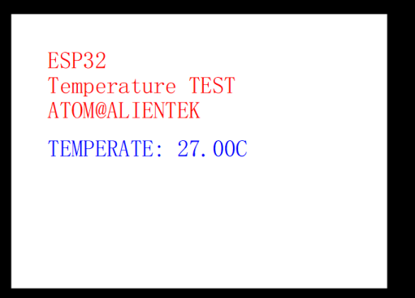

# 内部温度传感器实验

## 前言

本章，我们将介绍 ESP32-S3 的内部温度传感器并使用它来读取温度值，然后在 LCD 模块上显示出来。本章分为如下几个小节：

## 内部温度传感器简介

温度传感器生成一个随温度变化的电压。内部ADC将传感器电压转化为一个数字量。温度传感器的测量范围为–20 °C 到110 °C。温度传感器适用于监测芯片内部温度的变化，该温度值会随着微控制器时钟频率或IO负载的变化而变化。一般来讲，芯片内部温度会高于外部温度。ESP32-S3温度传感器相关内容，请看《esp32-s3_technical_reference_manual_cn.pdf》技术手册39.4章节。
温度传感器的输出值需要使用转换公式转换成实际的温度值 (°C)。转换公式如下：
T(°C) = 0.4386 * VALUE –27.88 * offset –20.52
其中 VALUE 即温度传感器的输出值，offset 由温度偏移决定。温度传感器在不同的实际使用环境（测量温度范围）下，温度偏移不同，见下表所示。

| 测量范围（°C） | 温度偏移（°C） |
| -------- | -------- |
| 50 ~ 110 | -2       |
| 20 ~ 100 | -1       |
| -10 ~ 80 | 0        |
| -15 ~ 50 | 1        |
| -20 ~ 20 | 2        |

## 硬件设计

### 例程功能

本章实验功能简介：通过 ADC 的通道读取 ESP32-S3 内部温度传感器的电压值，并将其转换为温度值，显示在 LCD 屏上。

### 硬件资源

1. 正点原子2.4寸LCD屏幕
2. 内部温度传感器

### 原理图

本章实验使用的 ADC 为 ESP32-S3 的片上资源，因此并没有相应的连接原理图。

## 程序设计

### 内部温度传感器函数解析

ESP-IDF 提供了一套 API 来配置温度传感器。接下来，作者将介绍一些常用的 ESP32-S3 中的温度传感器函数，这些函数的描述及其作用如下：

#### 设置测试温度的最大与最小值

该函数用于配置测试温度的大小范围，其函数原型如下：

```
esp_err_t temperature_sensor_install(const temperature_sensor_config_t *tsens_config, temperature_sensor_handle_t *ret_tsens)
```

该函数的形参描述如下表所示：

| 参数           | 描述           |
| ------------ | ------------ |
| tsens_config | 指向温度配置结构的指针  |
| ret_tsens    | 返回温度传感器句柄的指针 |

【返回值】

返回值：ESP_OK配置成功。其他配置失败。

#### 使能温度传感器

该函数用于使能温度传感器，其函数原型如下：

```
esp_err_t temperature_sensor_enable(temperature_sensor_handle_t tsens)
```

该函数的形参描述如下表所示：

| 参数    | 描述                                  |
| ----- | ----------------------------------- |
| tsens | 由 temperature_sensor_install()创建的句柄 |

该函数的返回值描述如下表所示：

| 返回值                   | 描述           |
| --------------------- | ------------ |
| ESP_OK                | 返回： 0，表示配置成功 |
| ESP_ERR_INVALID_STATE | 如果温度传感器已经使能  |

#### 获取传输的传感器数据

该函数用于获取传输的传感器数据，其函数原型如下：

```
esp_err_t temperature_sensor_get_celsius(temperature_sensor_handle_t tsens, float *out_celsius)
```

该函数的形参描述如下表所示：

| 参数          | 描述                                  |
| ----------- | ----------------------------------- |
| tsens       | 由 temperature_sensor_install()创建的句柄 |
| out_celsius | 度量值输出值                              |

该函数的返回值描述如下表所示：

| 返回值               | 描述           |
| ----------------- | ------------ |
| ESP_OK            | 返回： 0，表示配置成功 |
| ESP_ERR_NOT_STATE | 温度传感器未使能     |

#### 失能温度传感器

该函数用于获取传输的传感器数据，其函数原型如下：

```
esp_err_t temperature_sensor_disable(temperature_sensor_handle_t tsens)
```

该函数的形参描述如下表所示：

| 参数    | 描述                                  |
| ----- | ----------------------------------- |
| tsens | 由 temperature_sensor_install()创建的句柄 |

该函数的返回值描述如下表所示：

| 返回值               | 描述           |
| ----------------- | ------------ |
| ESP_OK            | 返回： 0，表示配置成功 |
| ESP_ERR_NOT_STATE | 温度传感器未使能     |

### 内部温度传感器驱动解析

在 IDF 版 12_internal_Temperature 例程中，作者在 ```12_internal_Temperature\components\BSP``` 路径下新增了一个 SENSOR 文件夹，分别用于存放 sensor.c、 sensor.h 这两个文件。其中，sensor.h 文件负责声明温度传感器相关的函数和变量，而 sensor.c 文件则实现了温度传感器的驱动代码。下面，我们将详细解析这两个文件的实现内容。

#### 1，sensor.h文件

```
/* 函数声明 */
esp_err_t sensor_inter_init(void);          /* 初始化内部温度传感器 */
float sensor_inter_get_temperature(void);   /* 获取内部温度传感器温度值 */
```

#### 2，sensor.c文件

```
temperature_sensor_handle_t temp_handle = NULL; /* 温度传感器句柄 */

/**
 * @brief       初始化内部温度传感器
 * @param       无
 * @retval      ESP_OK:初始化成功
 */
esp_err_t sensor_inter_init(void)
{
    temperature_sensor_config_t temp_sensor_config = TEMPERATURE_SENSOR_CONFIG_DEFAULT(10, 50);     /* 设置测试温度范围10~50 */

    ESP_ERROR_CHECK(temperature_sensor_install(&temp_sensor_config, &temp_handle));     /* 创建温度传感器模块 */

    ESP_ERROR_CHECK(temperature_sensor_enable(temp_handle));                            /* 启动温度传感器 */

    return ESP_OK;
}

/**
 * @brief       获取内部温度传感器温度值
 * @param       无
 * @retval      返回内部温度值
 */
float sensor_inter_get_temperature(void)
{
    float temperature = 0;

    ESP_ERROR_CHECK(temperature_sensor_get_celsius(temp_handle, &temperature));    /* 获取当前测量的温度值 */ 

    return temperature;
}
```

初始化内部温度传感器后，再将温度传感器使能以获取传感器数据，最终以返回值的形式将数据返回到数据处理的函数。

### CMakeLists.txt文件

打开本实验的BSP文件夹下的CMakeList.txt文件，其内容如下所示：

```
set(src_dirs
            MYIIC
            LCD
            MYSPI
            AW9523B
            SENSOR)

set(include_dirs
            MYIIC
            LCD
            MYSPI
            AW9523B
            SENSOR)

set(requires
            driver
            esp_lcd)

idf_component_register(SRC_DIRS ${src_dirs} INCLUDE_DIRS ${include_dirs} REQUIRES ${requires})

component_compile_options(-ffast-math -O3 -Wno-error=format=-Wno-format)
```

上述代码中的 SENSOR 驱动需要由开发者自行添加，以确保 SENSOR 驱动能够顺利集成到构建系统中。这一步骤是必不可少的，它确保了 SENSOR 驱动的正确性和可用性，为后续的开发工作提供了坚实的基础。

### 实验应用代码

打开main.c文件，该文件定义了工程入口函数，名为main。该函数代码如下。

```
/**
 * @brief       程序入口
 * @param       无
 * @retval      无
 */
void app_main(void)
{
    esp_err_t ret;
    float tsens_temperature = 0;
    uint32_t data_tmp = 0;

    ret = nvs_flash_init();  /* 初始化NVS */

    if (ret == ESP_ERR_NVS_NO_FREE_PAGES || ret == ESP_ERR_NVS_NEW_VERSION_FOUND)
    {
        ESP_ERROR_CHECK(nvs_flash_erase());
        ESP_ERROR_CHECK(nvs_flash_init());
    }

    my_spi_init();           /* 初始化SPI */
    myiic_init();            /* 初始化IIC */
    aw9523b_init();          /* 初始化AW9523B */
    lcd_init();              /* 初始化LCD */
    sensor_inter_init();     /* 初始化内部温度传感器 */

    lcd_show_string(30, 50, 200, 16, 16, "ESP32-S3", RED);
    lcd_show_string(30, 70, 200, 16, 16, "Internal_Temperature TEST", RED);
    lcd_show_string(30, 90, 200, 16, 16, "ATOM@ALIENTEK", RED);
    lcd_show_string(30, 120, 200, 16, 16, "TEMPERATE: 00.00C", BLUE);

    while(1)
    {
        tsens_temperature = sensor_inter_get_temperature();                     /* 得到温度值 */

        if (tsens_temperature < 0)
        {
            tsens_temperature = -tsens_temperature;
            lcd_show_string(30 + 10 * 8, 120, 16, 16, 16, "-", BLUE);           /* 显示符号 */
        }
        else
        {
            lcd_show_string(30 + 10 * 8, 120, 16, 16, 16, " ", BLUE);           /* 无符号 */
        }

        data_tmp = (uint32_t)tsens_temperature;                                 /* 取整数部分 */
        lcd_show_xnum(30 + 11 * 8, 120, data_tmp, 2, 16, 0, BLUE);              /* 显示整数部分 */
        data_tmp = (tsens_temperature - data_tmp) * 100;                        /* 取2位小数部分 */
        lcd_show_xnum(30 + 14 * 8, 120, data_tmp, 2, 16, 0x80, BLUE);           /* 显示小数部分 */

        LEDR_TOGGLE();                                                           /* LED闪烁,提示程序运行 */
        vTaskDelay(250);
    }
}
```

main 函数代码比较简单，主要是通过 sensor_get_temperature()函数读取 ESP32-S3 内部温度值，最后在 LCD 上显示。

## 下载验证

将程序下载到开发板后，实验内容如下图所示：


