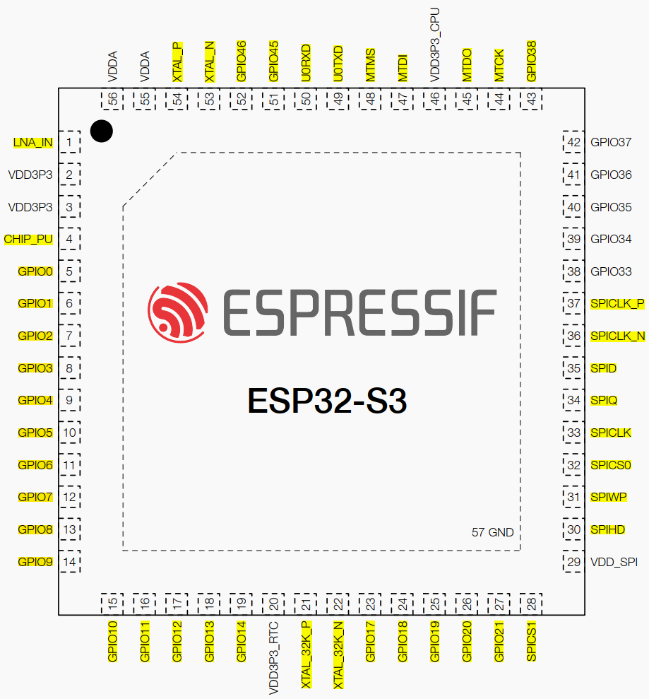
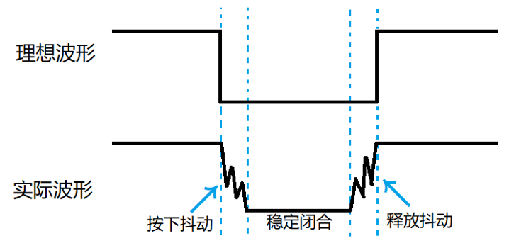

# 按键输入实验

## 前言

本章将通过一个经典的按键实验，带大家开启ESP32S3的开发之旅。同时，我们也将重点关注GPIO的输入模式配置，学会如何获取外部的输入信号，例如检测按键的状态。通过学习本章内容，开发者将能够掌握GPIO作为输入模式的使用方法，进一步扩展其在嵌入式系统开发中的应用能力。

## GPIO & 独立按键基础知识

### GPIO简介

GPIO 是负责控制或采集外部器件信息的外设，主要负责输入输出功能。ESP32S3提供45个3.3V GPIO管脚，支持数字I/O、PWM、I2C、SPI、UART、12-bit ADC和DAC。内置上拉/下拉电阻，部分引脚有启动电平限制，适用于外设控制与传感应用。另外，这些管脚，可以通过内部 IO MUX（复用矩阵）灵活复用为其他功能，这充分展现了 ESP32-S3 芯片的强大和灵活性。
关于ESP32-S3 的IO MUX 和 GPIO 交换矩阵的内容已在DNESP32S3 BOX1这款开发板的《ESP32S3 BOX 使用指南—IDF版》的第三章中详细阐述，有兴趣的读者可以自行前往阅读，此处不再赘述。以下是ESP32S3芯片的GPIO分布图。



从上面的图示中可见，黄色区域的管脚便是ESP32S3提供45个GPIO管脚。但请注意，部分IO端口可能与Flash或PSRAM等元件的管脚相关联，这就需要开发者在操作过程中参考相关技术手册，以避免潜在的问题。在正点原子的DNESP32S3 BOX3开发板中，模组的GPIO0被用来连接按键K0，因此在本章的实验中，我们将主要对GPIO0进行操作。

### 独立按键简介

独立按键是一种简洁高效的输入设备，广泛应用于各类电子设备中，实现基础的用户交互功能。其工作原理主要基于机械开关的触发机制，当用户按下按键时，便能执行相应的操作。独立按键在尺寸、形状和颜色上都具有多样性，便于用户进行辨识和使用，满足不同场景下的需求。

#### 1，独立按键原理

独立按键的原理主要依赖于机械触点和电气触点之间的相互作用。在未被按下时，触点保持分离状态，电路处于断开状态。然而，当用户按下按键时，在弹簧和导电片的共同作用下，触点会闭合，从而使电路连通。此时，微控制器能够检测到按键触发的信号，进而执行相应的操作。这种基于物理触点的设计使得独立按键既稳定又可靠，广泛应用于各种电子设备中。

#### 2，消抖措施
机械按键在闭合与分开的过程中，由于机械振动（类似于弹簧效应）的存在，可能导致开关状态在短时间内频繁切换，这种现象被称为按键抖动。下图是独立按键抖动波形图。




图中的按下抖动和释放抖动的时间一般为5~10ms，如果在抖动阶段采样，其不稳定状态可能出现一次按键动作被认为是多次按下的情况。为了避免抖动可能带来的误操作，我们要做的措施就是给按键消抖（即采样稳定闭合阶段）。为了消除这种抖动，我们通常采用软件消抖和硬件消抖两种主要方法：

（1）软件消抖：主要是通过编程的方法，设定一个延迟或计时器，确保在一定的时间内只读取一次按键状态，避免抖动对程序的影响。

（2）硬件消抖：在按键电路中加入元器件如电阻、电容组成的RC低通滤波器，对按键信号进行平滑处理，降低抖动的影响。

我们例程中使用最简单的延时消抖。检测到按键按下后，一般进行10ms延时，用于跳过抖动的时间段，如果消抖效果不好可以调整这个10ms延时，因为不同类型的按键抖动时间可能有偏差。待延时过后再检测按键状态，如果没有按下，那我们就判断这是抖动或者干扰造成的；如果还是按下，那么我们就认为这是按键真的按下了。对按键释放的判断同理。


## 硬件设计

### 例程功能

1. 按下K0按键，系统打印对应的信息。

### 硬件资源

1. 按键:
K0-GPIO0

### 原理图

本章实验使用的一个DNESP32S3 BOX3开发板板载按键：K0按键，其于板载MCU的连接原理图，如下图所示：


从上面的原理图中可以看出，K0按键的一端连接到了电源负极，而另一端分别与MCU的KEY_K0(GPIO0)引脚相连接，因此当按键被按下时，MCU对应的引脚都能够读取到低电平的状态，而当松开按键后，MCU对应的引脚读取到的电平状态却是不确定的，因此用于读取KEY_K0引脚不仅要配置为输入模式，还需要配置成上拉。

## 程序设计

### GPIO函数解析

ESP-IDF提供了丰富的 GPIO 操作函数，开发者可以在```esp-idf-v5.5.1\components\driver\gpio```路径下找到相关的 gpio.c 和 gpio.h 文件。在 gpio.h 头文件中，你可以找到 ESP32-S3 的所有 GPIO 函数定义。接下来，作者将介绍一些常用的 GPIO 函数，这些函数的描述及其作用如下：

#### GPIO 配置函数

该函数用来配置 GPIO 的模式、上下拉等功能，其函数原型如下所示：

```esp_err_t gpio_config(const gpio_config_t *pGPIOConfig)```

该函数的形参描述如下表所示：

参数  	         | 描述	         
-----------------|---------------------
  *pGPIOConfig   | GPIO 结构体 


【返回值】

ESP_OK 表示配置成功， ESP_FAIL 表示配置失败。

pGPIOConfig 为 GPIO 配置结构体指针，下面来看一下 gpio_config_t 结构体中的变量，如下所示：

```
/* GPIO 配置参数 */
typedef struct {
	uint64_t pin_bit_mask; 		/* 配置引脚位 */
	gpio_mode_t mode; 		/* 设置引脚模式 */
	gpio_pullup_t pull_up_en; 	/* 设置上拉 */
	gpio_pulldown_t pull_down_en; 	/* 设置下拉 */
	gpio_int_type_t intr_type; 	/* 中断配置 */
} gpio_config_t;
```

#### GPIO 设置管脚输出电平

该函数用于配置某个管脚输出电平，该函数原型如下所示：

```esp_err_t gpio_set_level(gpio_num_t gpio_num, uint32_t level)```

该函数的形参描述如下表所示：

参数  	         | 描述	         
-----------------|---------------------
  gpio_num   | GPIO 引脚号。（在 gpio_types.h 文件中枚举 gpio_num_t 有定义） 
  level   | GPIO 引脚输出电平。 0表示低电平， 1表示高电平。 

【返回值】

ESP_OK 表示设置成功， ESP_FAIL 表示设置失败。

#### GPIO 获取管脚电平

该函数用于获取某个管脚的电平，该函数原型如下所示：

```esp_err_t gpio_get_level(gpio_num_t gpio_num)```

该函数的形参描述如下表所示：

参数  	         | 描述	         
-----------------|---------------------
  gpio_num   | GPIO 引脚号。（在 gpio_types.h 文件中枚举 gpio_num_t 有定义）

【返回值】

ESP_OK 表示获取成功， ESP_FAIL 表示获取失败。

上述函数，便是本实验所需的核心 GPIO 函数。对于其他未提及的 GPIO 函数，我们用到了
再去了解。

### KEY驱动解析

在IDF版本的02_key例程中，作者在```02_key\components\BSP```路径下新增了一个KEY文件夹，用于存放key.c和key.h这两个文件。其中，key.h文件负责声明KEY相关的函数和变量，而key.c文件则实现了KEY的驱动代码。下面，我们将详细解析这两个文件的实现内容。

#### 1，key.h文件

```
#ifndef __KEY_H_
#define __KEY_H_

#include "freertos/FreeRTOS.h"
#include "freertos/task.h"
#include "driver/gpio.h"


/* 引脚定义 */
#define BOOT_GPIO_PIN   GPIO_NUM_0

/*IO操作*/
#define BOOT            gpio_get_level(BOOT_GPIO_PIN)

/* 按键按下定义 */
#define BOOT_PRES       1       /* BOOT按键按下 */

/* 函数声明 */
void key_init(void);            /* 初始化按键 */
uint8_t key_scan(uint8_t mode); /* 按键扫描函数 */

#endif
```

此文件的核心内容已较为明确，无需过多阐述。它主要定义了 KEY0(开发板上为 K0 按键)宏，用于获取 GPIO0 的状态，并声明了 key_init 和 key_scan 函数，以便外部文件能够调用这些函数。通过这些声明和定义，该文件为其他部分的代码提供了必要的接口和功能支持。

#### 2，key.c文件

此文件中定义了两个函数，分别为 key_init和 key_scan。接下来，我将对这两个函数进行详细的解析。

（1）key_init 函数
```
/**
 * @brief       初始化按键
 * @param       无
 * @retval      无
 */
void key_init(void)
{
    gpio_config_t gpio_init_struct;

    gpio_init_struct.intr_type = GPIO_INTR_DISABLE;         /* 失能引脚中断 */
    gpio_init_struct.mode = GPIO_MODE_INPUT;                /* 输入模式 */
    gpio_init_struct.pull_up_en = GPIO_PULLUP_ENABLE;       /* 使能上拉 */
    gpio_init_struct.pull_down_en = GPIO_PULLDOWN_DISABLE;  /* 失能下拉 */
    gpio_init_struct.pin_bit_mask = 1ull << KEY0_GPIO_PIN;  /* KEY0按键引脚 */
    gpio_config(&gpio_init_struct);                         /* 配置使能 */
}

/**
 * @brief       按键扫描函数
 * @param       mode:0 / 1, 具体含义如下:
 *              0,  不支持连续按(当按键按下不放时, 只有第一次调用会返回键值,
 *                  必须松开以后, 再次按下才会返回其他键值)
 *              1,  支持连续按(当按键按下不放时, 每次调用该函数都会返回键值)
 * @retval      键值, 定义如下:
 *              KEY0_PRES, 1, KEY0按下
 */
uint8_t key_scan(uint8_t mode)
{
    uint8_t keyval = 0;
    static uint8_t key_boot = 1;    /* 按键松开标志 */

    if(mode)
    {
        key_boot = 1;
    }

    if (key_boot && (KEY0 == 0))    /* 按键松开标志为1，且有任意一个按键按下了 */
    {
        vTaskDelay(10);             /* 去抖动 */
        key_boot = 0;

        if (KEY0 == 0)
        {
            keyval = KEY0_PRES;
        }
    }
    else if (KEY0 == 1)
    {
        key_boot = 1;
    }

    return keyval;                  /* 返回键值 */
}

```

key_init()函数主要配置 GPIO0 管脚为输入模式，这样就可以获取 GPIO0 的电平状态了。key_scan()函数只有一个形参 mode，用于设置按键是否支持连续按下模式。当 mode 为 0 时，表示按键不支持连续按下；反之，则支持连续按下。值得注意的是，该函数内部已经对按键进行了消抖延时处理，因此，在其他地方调用此函数时，无需再进行额外的按键消抖操作。

### CMakeLists.txt文件

打开本实验的BSP文件夹下的CMakeList.txt文件，其内容如下所示：
```
set(src_dirs
            KEY)

set(include_dirs
            KEY)

set(requires
            driver)

idf_component_register(SRC_DIRS ${src_dirs} INCLUDE_DIRS ${include_dirs} REQUIRES ${requires})

component_compile_options(-ffast-math -O3 -Wno-error=format=-Wno-format)
```
上述代码中的 KEY 驱动需要由开发者自行添加，以确保 KEY 驱动能够顺利集成到构建系统中。这一步骤是必不可少的，它确保了 KEY 驱动的正确性和可用性，为后续的开发工作提供了坚实的基础。

###  实验应用代码

打开 main/main.c 文件，该文件定义了工程入口函数，名为"app_main",该函数代码如下。
```
/**
 * @brief       程序入口
 * @param       无
 * @retval      无
 */
void app_main(void)
{
    uint8_t key;
    esp_err_t ret;
    
    ret = nvs_flash_init();     /* 初始化NVS */

    if (ret == ESP_ERR_NVS_NO_FREE_PAGES || ret == ESP_ERR_NVS_NEW_VERSION_FOUND)
    {
        ESP_ERROR_CHECK(nvs_flash_erase());
        ret = nvs_flash_init();
    }

    key_init();                 /* KEY初始化 */

    while(1)
    {
        key = key_scan(0);      /* 获取键值 */
        switch (key)
        {
            case KEY0_PRES:     /* KEY0被按下 */
            {
                ESP_LOGI("KEY", "KEY0 pressed");
                break;
            }
            default:
            {
                break;
            }
        }

        vTaskDelay(10);
    }
}
```
可以看到应用代码中，在初始化完按键后，就进入了一个while循环，在循环中，每间隔10毫秒就调用key_scan()函数扫描以此按键的状态，如果扫描到KEY0按键被按下，则系统回打印相应的实验信息。

## 下载验证

在完成编译和烧录操作后，若此时按下并释放一次KEY0按键，则能够通过VSCode的终端或者串口助手（需选择对应的设备）看到打印出的实验信息，与预期的实验现象效果相符。


