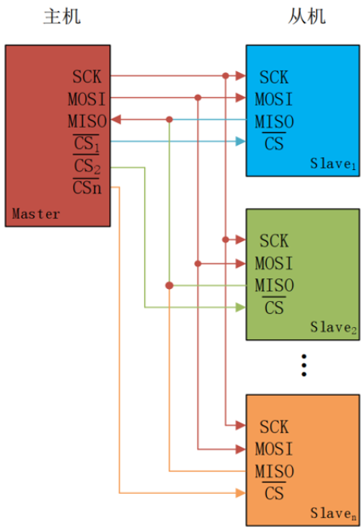
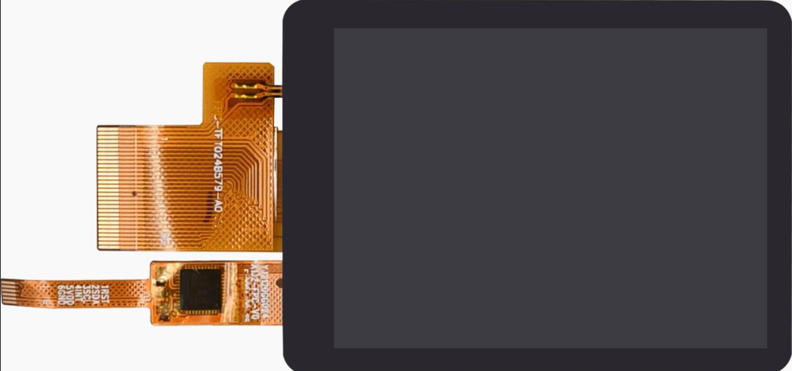
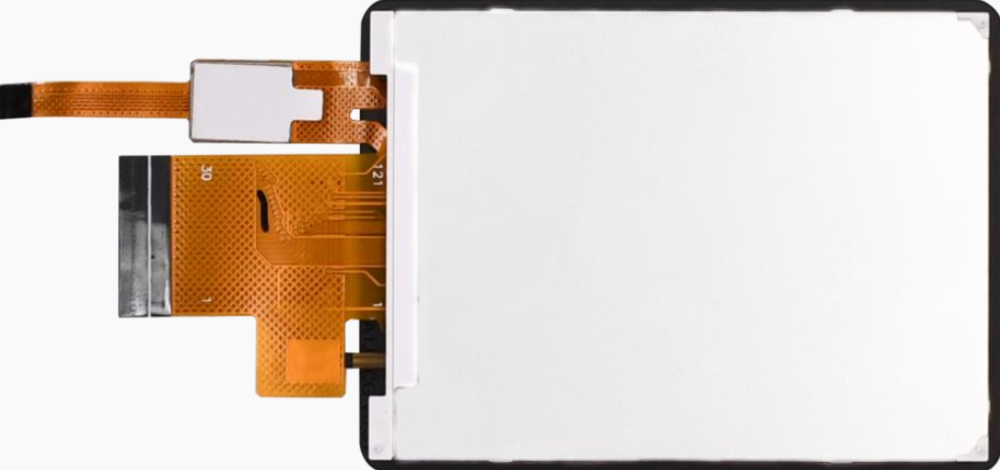
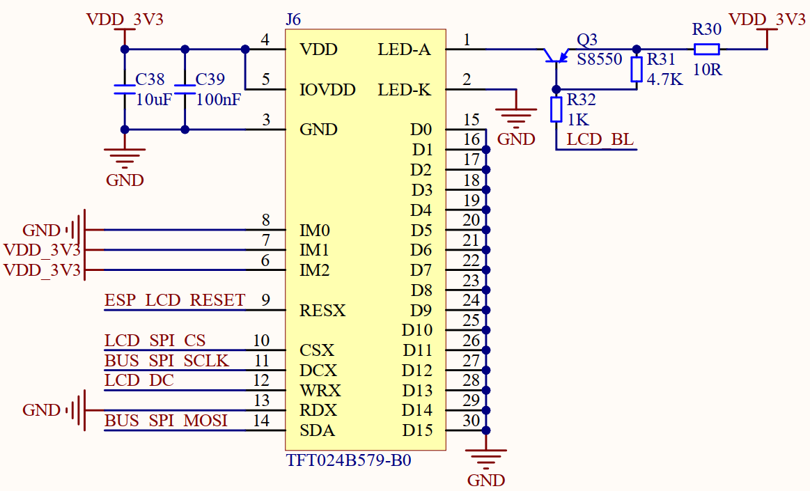
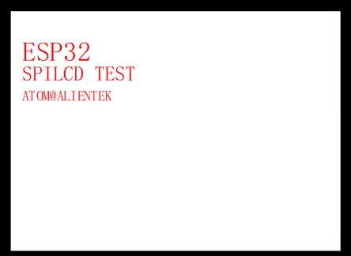

# SPI-LCD实验

## 前言

本章，我们将学习ESP32-S3的硬件SPI接口，将会大家如何使用SPI接口去驱动LCD屏。在本章中，实现和LCD屏之间的通信，实现ASCII字符、彩色、图片和图形的显示。

## SPI 及 LCD 介绍

### 1，SPI 简介

SPI， Serial Peripheral interface，顾名思义，就是串行外围设备接口，是由原摩托罗拉公司在其 MC68HCXX 系列处理器上定义的。 SPI 是一种高速的全双工、同步、串行的通信总线，已经广泛应用在众多 MCU、存储芯片、 AD 转换器和 LCD 之间。
SPI 通信跟 IIC 通信一样，通信总线上允许挂载一个主设备和一个或者多个从设备。为了跟从设备进行通信，一个主设备至少需要 4 跟数据线，分别为：

1. MOSI（Master Out / Slave In）：主数据输出，从数据输入，用于主机向从机发送数据。
2. MISO（Master In / Slave Out）：主数据输入，从数据输出，用于从机向主机发送数据。
3. SCLK（Serial Clock）：时钟信号，由主设备产生，决定通信的速率。
4. CS（Chip Select）：从设备片选信号，由主设备产生，低电平时选中从设备。多从机SPI通信网络连接如下图所示。



从上图可以知道，MOSI、MISO、SCLK引脚连接SPI总线上每一个设备，如果CS引脚为低电平，则从设备只侦听主机并与主机通信。 SPI主设备一次只能和一个从设备进行通信。如果主设备要和另外一个从设备通信，必须先终止和当前从设备通信，否则不能通信。

### 2，LCD介绍

开发板板载2.4英寸显示屏，其分辨率为 320*240，通信方式采用4线SPI。该显示屏采用 ST7789V2作为驱动芯片，其内置RAM无需外部驱动器或存储器。ESP32-S3芯片仅需通过SPI接口即可轻松驱动此显示屏。在开发板上， 屏幕通过一个1 * 30的翻盖式下接FPC座（ 0.5mm间距）同屏幕连接。 另外，屏幕带有触摸功能，并引出了 6 个引脚，关于触摸部分得内容我们在后面的章节会详细说明，在这一章节中就不再赘述。 屏幕的外观，如下图所示。





| 序号    | 名称     | 说明                                                                                                |
| ----- | ------ | ------------------------------------------------------------------------------------------------- |
| 1     | LED-A  | Backlight anode 背光正极输入端                                                                           |
| 2     | LED-k  | Backlight cathode 背光负极输入端                                                                         |
| 3     | GND    | 地                                                                                                 |
| 4     | VDD    | 系统输入电压 3.3V                                                                                       |
| 5     | IOVDD  | 可控接口电平引脚，在开发板设计中接入 3.3V。如有特殊的供电需求，该引脚可单独设置特殊需求的电压，不与 3.3V 的 VDD 引脚冲突。                             |
| 6     | IM2    | IM0、 IM1 和 IM2 引脚在液晶显示屏中主要用于配置屏幕的工作模式和接口模式。它们的具体功能取决于显示屏的型号和制造商， 因此该引脚需要配置成高电平还是低电平， 需要参考详细的数据手册。 |
| 7     | IM1    | 同上                                                                                                |
| 8     | IM0    | 同上                                                                                                |
| 9     | RESX   | 复位引脚                                                                                              |
| 10    | CSX    | 片选信号引脚                                                                                            |
| 11    | DCX    | 并行接口显示数据/命令选择引脚                                                                                   |
| 12    | WRX    | 写入信号引脚                                                                                            |
| 13    | RDX    | 读取信号引脚                                                                                            |
| 14    | SDA    | 串行数据输入/输出引脚                                                                                       |
| 15~30 | D0-D15 | 数据口。在开发板设计中D0-D15引脚全部接地。                                                                          |

2.4寸LCD屏在四线SPI通讯模式下，仅需四根信号线（CS、 SCL、 SDA、 RS（DC））就能够驱动。

## 硬件设计

### 例程功能

1. 本章实验功能简介：按下复位之后，就可以看到 LCD 屏幕不停的显示一些信息并不断切换底色。 

### 硬件资源

1. 正点原子2.4寸LCD屏幕

### 原理图

本章实验使用了正点原子的 LCD 屏幕，该模块与板载的 30PinFPC 座进行连接，该接口与 MCU 的连接原理图，如下图所示：



## 程序设计

### LCD函数解析

ESP-IDF提供了一套API来配置SPI。接下来，作者将介绍一些常用的ESP32-S3中的SPI函数，以及IO扩展芯片中用到的函数，这些函数的描述及其作用如下：

#### 初始化和配置

该函数用于初始化SPI总线，并配置其GPIO引脚和主模式下的时钟等参数，该函数原型如下所示：

```
esp_err_t spi_bus_initialize(spi_host_device_t host_id, const spi_bus_config_t *bus_config,spi_dma_chan_t dma_chan)
```

该函数的形参描述如下表所示：

| 参数         | 描述                                                         |
| ---------- | ---------------------------------------------------------- |
| host_id    | 指定SPI总线的主机设备ID                                             |
| bus_config | 指向spi_bus_config_t结构体的指针，用于配置SPI总线的SCLK、MISO、MOSI等引脚以及其他参数 |
| dma_chan   | 指定使用哪个DMA通道。有效值为：SPI_DMA_CH_AUTO，SPI_DMA_DISABLED或1至2之间的数字 |

【返回值】

返回值：ESP_OK配置成功。其他配置失败。

```
typedef struct {
    int miso_io_num;        /* MISO引脚号 */     
    int mosi_io_num;        /* MOSI引脚号 */     
    int sclk_io_num;        /* 时钟引脚号 */   
    int quadwp_io_num;      /* 用于Quad模式的WP引脚号，未使用时设置为-1 */  
    int quadhd_io_num;      /* 用于Quad模式的HD引脚号，未使用时设置为-1 */  
int max_transfer_sz;    /* 最大传输大小 */ 
…                         /* 其他特定的配置参数 */
} spi_bus_config_t;

```

完成上述结构体参数配置之后，可以将结构传递给 spi_bus_initialize () 函数，用以实例化SPI。

#### 设备配置

该函数用于在SPI总线上分配设备，函数原型如下所示：

```
esp_err_t spi_bus_add_device(spi_host_device_t host_id,const spi_device_interface_config_t *dev_config,spi_device_handle_t *handle)
```

该函数的形参描述如下表所示：

| 参数         | 描述                                                                |
| ---------- | ----------------------------------------------------------------- |
| host_id    | 指定SPI总线的主机设备ID                                                    |
| dev_config | 指向spi_device_interface_config_t结构体的指针，用于配置SPI设备的通信参数，如时钟速率、SPI模式等 |
| handle     | 返回创建的设备句柄                                                         |

【返回值】

返回值：ESP_OK配置成功。其他配置失败。

该函数使用spi_host_device_t类型以及spi_device_interface_config_t类型的结构体变量传入SPI外围设备的配置参数，该结构体的定义如下所示：

```
/**
 * @brief 带有三个SPI外围设备的枚举，这些外围设备可通过软件访问
 */
typedef enum {
    /* SPI1只能在ESP32上用作GPSPI */
    SPI1_HOST = 0,    /* SPI1 */
    SPI2_HOST = 1,    /* SPI2 */
#if SOC_SPI_PERIPH_NUM > 2
    SPI3_HOST = 2,    /* SPI3 */
#endif
SPI_HOST_MAX,   /* 无效的主机值 */
}spi_host_device_t

typedef struct {
    uint32_t command_bits;      /* 命令阶段的位数 */ 
    uint32_t address_bits;      /* 地址阶段的位数 */ 
    uint32_t dummy_bits;        /* 虚拟阶段的位数 */ 
    int clock_speed_hz;         /* 时钟速率 */ 
    uint32_t mode;              /* SPI模式（0-3） */ 
    int spics_io_num;           /* CS引脚号 */ 
    ...                         /* 其他设备特定的配置参数 */ 
} spi_device_interface_config_t;

```

#### 数据传输

根据函数功能，以下函数可以归为一类进行讲解，下面将以表格的形式逐个介绍这些函数的作用与参数，如下所示：
函数               | 描述             
-----------------|---------------------
  spi_device_transmit()       | 该函数用于发送一个SPI事务，等待它完成，并返回结果。handle：设备的句柄。trans_desc：指向spi_transaction_t结构体的指针，描述了要发送的事务详情。
  spi_device_polling_transmit()    | 该函数用于发送一个轮询事务，等待它完成，并返回结果。handle：设备的句柄。trans_desc：指向spi_transaction_t结构体的指针，描述了要发送的事务详情。

### SPI LCD驱动解析

在IDF版的08_spilcd例程中，作者在```08_spilcd \components\BSP```路径下新增了一个MYSPI文件夹和一个LCD文件夹，分别用于存放my_spi.c、my_spi.h和lcd.c以及lcd.h这四个文件。其中，my_spi.h和lcd.h文件负责声明MYSPI以及LCD相关的函数和变量，而my_spi.c和lcd.c文件则实现了MYSPI以及LCD的驱动代码。下面，我们将详细解析这四个文件的实现内容。

#### 1，my_spi.h文件

```
/* SPI驱动管脚 */
#define SPI_SCLK_PIN        GPIO_NUM_15
#define SPI_MOSI_PIN        GPIO_NUM_16
#define SPI_MISO_PIN        GPIO_NUM_17
/* 总线设备引脚定义 */
#define SD_CS_PIN           GPIO_NUM_18
/* SPI端口 */
#define MY_SPI_HOST         SPI2_HOST
/* 设备句柄 */
extern spi_device_handle_t MY_SD_Handle;   /* SD卡句柄 */

/* 函数声明 */
esp_err_t my_spi_init(void);    /* SPI初始化 */
```

该文件下定义了SPI的时钟引脚与通讯引脚。

#### 2，my_spi.c文件

```
/* SD卡设备句柄 */
spi_device_handle_t MY_SD_Handle = NULL;

/**
 * @brief       spi初始化
 * @param       无
 * @retval      esp_err_t
 */
esp_err_t my_spi_init(void)
{
    spi_bus_config_t buscfg = {
        .sclk_io_num     = SPI_SCLK_PIN,    /* 时钟引脚 */
        .mosi_io_num     = SPI_MOSI_PIN,    /* 主机输出从机输入引脚 */
        .miso_io_num     = SPI_MISO_PIN,    /* 主机输入从机输出引脚 */
        .quadwp_io_num   = -1,              /* 用于Quad模式的WP引脚,未使用时设置为-1 */
        .quadhd_io_num   = -1,              /* 用于Quad模式的HD引脚,未使用时设置为-1 */
        .max_transfer_sz = 320 * 240 * sizeof(uint16_t),   /* 最大传输大小(整屏(RGB565格式)) */
    };
    /* 初始化SPI总线 */
    ESP_ERROR_CHECK(spi_bus_initialize(MY_SPI_HOST, &buscfg, SPI_DMA_CH_AUTO));

    /* SPI驱动接口配置,SPISD卡时钟是20-25MHz */
    spi_device_interface_config_t devcfg = {
        .clock_speed_hz = 20 * 1000 * 1000, /* SPI时钟 */
        .mode = 0,                          /* SPI模式0 */
        .spics_io_num = SD_CS_PIN,          /* 片选引脚 */
        .queue_size = 7,                    /* 事务队列尺寸 7个 */
    };

    /* 添加SPI总线设备 */
    ESP_ERROR_CHECK(spi_bus_add_device(MY_SPI_HOST, &devcfg, &MY_SD_Handle));

    return ESP_OK;
}
```

在my_spi_init()函数中主要工作就是对于SPI参数的配置，如SPI管脚配置和数据传输大小以及SPI总线配置等，通过该函数就可以完成SPI初始化。
<br />lcd.c和lcd.h文件是驱动函数和引脚接口宏定义以及函数声明等。lcdfont.h头文件存放了4种字体大小不一样的ASCII字符集（12*12、16*16、24*24和32*32）。这个跟oledfont.h头文件一样的，只是这里多了32*32的ASCII字符集，制作方法请回顾OLED实验。

#### 3，lcd.h文件

下面我们还是先介绍lcd.h文件，首先是LCD的引脚定义：

```
/* 引脚定义 */
#define LCD_NUM_CS      GPIO_NUM_47
#define LCD_NUM_DC      GPIO_NUM_48
#define LCD_NUM_RST     GPIO_NUM_NC
#define LCD_NUM_RD      GPIO_NUM_NC
#define LCD_NUM_WR      GPIO_NUM_NC

#define GPIO_LCD_D0     GPIO_NUM_NC
#define GPIO_LCD_D1     GPIO_NUM_NC
#define GPIO_LCD_D2     GPIO_NUM_NC
#define GPIO_LCD_D3     GPIO_NUM_NC
#define GPIO_LCD_D4     GPIO_NUM_NC
#define GPIO_LCD_D5     GPIO_NUM_NC
#define GPIO_LCD_D6     GPIO_NUM_NC
#define GPIO_LCD_D7     GPIO_NUM_NC

#define LCD_RST(x)      do { x ?                                \
                             gpio_set_level(LCD_NUM_RST, 1):   \
                             gpio_set_level(LCD_NUM_RST, 0);   \
                        } while(0)

/* RGB_BL */
#define ESP_LCD_BL(x)   do { x ?                               \
                             aw9523b_pin_write(LCD_BL, 1):     \
                             aw9523b_pin_write(LCD_BL, 0);     \
                        } while(0)

#define LCD_HOST            SPI2_HOST

/* 常用颜色值 */
#define WHITE           0xFFFF      /* 白色 */
#define BLACK           0x0000      /* 黑色 */
#define RED             0xF800      /* 红色 */
#define GREEN           0x07E0      /* 绿色 */
#define BLUE            0x001F      /* 蓝色 */ 
#define MAGENTA         0XF81F      /* 品红色/紫红色 = BLUE + RED */
#define YELLOW          0XFFE0      /* 黄色 = GREEN + RED */
#define CYAN            0X07FF      /* 青色 = GREEN + BLUE */  

/* 非常用颜色 */
#define BROWN           0XBC40      /* 棕色 */
#define BRRED           0XFC07      /* 棕红色 */
#define GRAY            0X8430      /* 灰色 */ 
#define DARKBLUE        0X01CF      /* 深蓝色 */
#define LIGHTBLUE       0X7D7C      /* 浅蓝色 */ 
#define GRAYBLUE        0X5458      /* 灰蓝色 */ 
#define LIGHTGREEN      0X841F      /* 浅绿色 */  
#define LGRAY           0XC618      /* 浅灰色(PANNEL),窗体背景色 */ 
#define LGRAYBLUE       0XA651      /* 浅灰蓝色(中间层颜色) */ 
#define LBBLUE          0X2B12      /* 浅棕蓝色(选择条目的反色) */ 

/* LCD信息结构体 */
typedef struct _lcd_obj_t
{
    uint32_t pwidth;    /* 临时设定值（宽度） */
    uint32_t pheight;   /* 临时设定值（高度） */
    uint8_t  dir;       /* 屏幕方向 */
    uint16_t width;     /* 宽度 */
    uint16_t height;    /* 高度 */
} lcd_obj_t;

/* 导出相关变量 */
extern lcd_obj_t lcddev;;
extern esp_lcd_panel_handle_t panel_handle;
```

第一部分的宏定义是对WR/CS引脚的定义，第二部分宏定义是LCD_WR/CS/PWR/RST 引脚操作的定义，接下来的部分是对一些常用颜色的RGB数值以及LCD信息结构体的定义。

#### 4，lcd.c文件

```
/**
 * @brief       lcd初始化
 * @param       无
 * @retval      ESP_OK:初始化成功
 */
esp_err_t lcd_init(void)
{
    esp_lcd_panel_io_handle_t io_handle = NULL;     /* LCD IO设备句柄 */
    /* spi配置 */
    esp_lcd_panel_io_spi_config_t io_config = {
        .dc_gpio_num         = LCD_NUM_DC,          /* DC IO */
        .cs_gpio_num         = LCD_NUM_CS,          /* CS IO */
        .pclk_hz             = 60 * 1000 * 1000,    /* PCLK为60MHz */
        .lcd_cmd_bits        = 8,                   /* 命令位宽 */
        .lcd_param_bits      = 8,                   /* LCD参数位宽 */
        .spi_mode            = 0,                   /* SPI模式 */
        .trans_queue_depth   = 7,                   /* 传输队列 */
    };
    /* 将LCD设备挂载至SPI总线上 */
    ESP_ERROR_CHECK(esp_lcd_new_panel_io_spi((esp_lcd_spi_bus_handle_t)LCD_HOST, &io_config, &io_handle));

    lcddev.pheight = lcd_height;  /* 高度 */
    lcddev.pwidth  = lcd_width;   /* 宽度 */

    /* LCD设备配置 */
    esp_lcd_panel_dev_config_t panel_config = {
        .reset_gpio_num = LCD_NUM_RST,                  /* RTS IO */
        .rgb_ele_order  = COLOR_RGB_ELEMENT_ORDER_RGB,  /* RGB颜色格式 */
        .bits_per_pixel = 16,                           /* 颜色深度 */
        .data_endian    = LCD_RGB_DATA_ENDIAN_BIG,      /* 大端顺序 */
    };
    /* 为ST7789创建LCD面板句柄，并指定SPI IO设备句柄 */
    ESP_ERROR_CHECK(esp_lcd_new_panel_st7789(io_handle, &panel_config, &panel_handle));
    /* 复位LCD */
    ESP_ERROR_CHECK(esp_lcd_panel_reset(panel_handle));
    /* 反显 */
    ESP_ERROR_CHECK(esp_lcd_panel_invert_color(panel_handle, true));
    /* 初始化LCD句柄 */
    ESP_ERROR_CHECK(esp_lcd_panel_init(panel_handle));
    /* 打开屏幕 */
    ESP_ERROR_CHECK(esp_lcd_panel_disp_on_off(panel_handle, true));

    const esp_lcd_panel_io_callbacks_t cbs = {
        .on_color_trans_done = notify_lcd_flush_ready,
    };
    /* 注册屏幕刷新完成回调函数 */
    ESP_ERROR_CHECK(esp_lcd_panel_io_register_event_callbacks(io_handle, &cbs, NULL));

    lcd_display_dir(1);      /* 横屏显示 */

    lcd_clear(WHITE);        /* 清屏 */
    ESP_LCD_BL(0);
    return ESP_OK;
}
```

从上的代码中可以看出，本章实验的LCD驱动是兼容了正点原子的2.4寸LCD屏幕的，因此在加载完SPI设备后，会与LCD进行通讯，确定LCD的型号，然后根据型号针对性地对LCD屏幕进行配置。

### CMakeLists.txt文件

打开本实验的BSP文件夹下的CMakeList.txt文件，其内容如下所示：

```
set(src_dirs
            MYIIC
            MYSPI
            LCD
            AW9523B)

set(include_dirs
            MYIIC
            MYSPI
            LCD
            AW9523B)

set(requires
            driver
            esp_lcd)

idf_component_register(SRC_DIRS ${src_dirs} INCLUDE_DIRS ${include_dirs} REQUIRES ${requires})

component_compile_options(-ffast-math -O3 -Wno-error=format=-Wno-format)
```

上述代码中的 LCD 驱动需要由开发者自行添加，以确保 LCD 驱动能够顺利集成到构建系统中。这一步骤是必不可少的，它确保了 LCD 驱动的正确性和可用性，为后续的开发工作提供了坚实的基础。

### 实验应用代码

打开main.c文件，该文件定义了工程入口函数，名为main。该函数代码如下。

```
/**
 * @brief       程序入口
 * @param       无
 * @retval      无
 */
void app_main(void)
{
    uint8_t x = 0;
    esp_err_t ret;

    ret = nvs_flash_init();             /* 初始化NVS */

    if (ret == ESP_ERR_NVS_NO_FREE_PAGES || ret == ESP_ERR_NVS_NEW_VERSION_FOUND)
    {
        ESP_ERROR_CHECK(nvs_flash_erase());
        ESP_ERROR_CHECK(nvs_flash_init());
    }

    my_spi_init();                      /* 初始化SPI */
    myiic_init();                       /* 初始化IIC */
    aw9523b_init();                     /* 初始化AW9523B */
    lcd_init();                         /* 初始化LCD */

    while (1)
    {
        switch (x)
        {
            case 0:
            {
                lcd_clear(WHITE);
                break;
            }
            case 1:
            {
                lcd_clear(BLACK);
                break;
            }
            case 2:
            {
                lcd_clear(BLUE);
                break;
            }
            case 3:
            {
                lcd_clear(RED);
                break;
            }
            case 4:
            {
                lcd_clear(MAGENTA);
                break;
            }
            case 5:
            {
                lcd_clear(GREEN);
                break;
            }
            case 6:
            {
                lcd_clear(CYAN);
                break;
            }
            case 7:
            {
                lcd_clear(YELLOW);
                break;
            }
            case 8:
            {
                lcd_clear(BRRED);
                break;
            }
            case 9:
            {
                lcd_clear(GRAY);
                break;
            }
            case 10:
            {
                lcd_clear(LGRAY);
                break;
            }
            case 11:
            {
                lcd_clear(BROWN);
                break;
            }
        }

        lcd_show_string(10, 40, 240, 32, 32, "ESP32", RED);
        lcd_show_string(10, 80, 240, 24, 24, "LCD TEST", RED);
        lcd_show_string(10, 110, 240, 16, 16, "ATOM@ALIENTEK", RED);
        x++;

        if (x == 12)
        {
            x = 0;
        }

        LEDR_TOGGLE();
        vTaskDelay(500);
    }
}
```

从上面的代码中可以看出，在初始化完LCD后，便在LCD上显示一些本实验的相关信息，随后便每间隔500毫秒就更换一次LCD屏幕显示的背景色。

## 下载验证

在完成编译和烧录操作后，可以看到LCD上不断变换着不同的颜色，LED灯闪烁。


