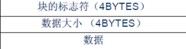
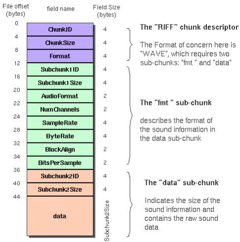
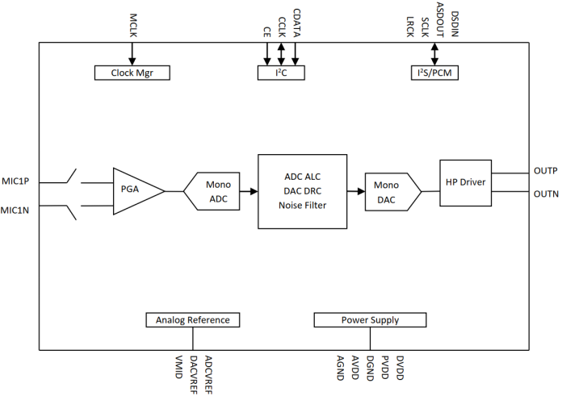
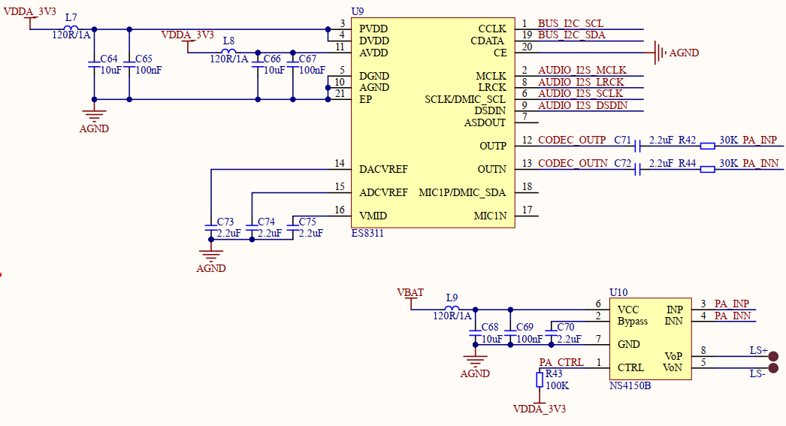
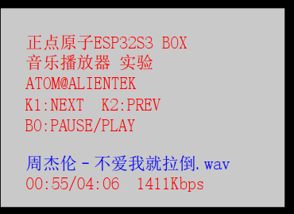

# 音乐实验

## 前言

正点原子 DNESP32S3B 开发板拥有串行音频接口（SAI），支持 SAI、 LSB/MSB 对齐、PCM/DSP、 TDM 和 AC’ 97 等协议，且外扩了一颗音频芯片： NS4168，支持录音（下一章介绍）本章，我们将利用 DNESP32S3B 开发板实现一个简单的音乐播放器（仅支持 WAV 播放）。

## WAV简介

WAV 即 WAVE 文件， WAV 是计算机领域最常用的数字化声音文件格式之一，它是微软专门为 Windows 系统定义的波形文件格式（Waveform Audio），由于其扩展名为"*.wav"。它符合RIFF(Resource Interchange File Format)文件规范，用于保存 Windows 平台的音频信息资源，被
Windows 平台及其应用程序所广泛支持，该格式也支持 MSADPCM， CCITT A LAW 等多种压缩运算法，支持多种音频数字，取样频率和声道，标准格式化的 WAV 文件和 CD 格式一样，也是44.1K 的取样频率， 16 位量化数字，因此在声音文件质量和 CD 相差无几！WAV 一般采用线性 PCM（脉冲编码调制）编码，本章，我们也主要讨论 PCM 的播放，因为这个最简单。WAV 文件是由若干个 Chunk 组成的。按照在文件中的出现位置包括： RIFF WAVE Chunk、Format Chunk、 Fact Chunk(可选)和 Data Chunk。每个 Chunk 由块标识符、数据大小和数据三部分组成，如下图所示：



对于一个基本的 WAVE 文件而言，以下三种 Chunk 是必不可少的：文件中第一个 Chunk 是RIFF Chunk，然后是 FMT Chunk，最后是 Data Chunk。对于其他的 Chunk，顺序没有严格的限制。使用 WAVE 文件的应用程序必须具有读取以上三种 chunk 信息的能力，如果程序想要复制WAVE 文件，必须拷贝文件中所有的 chunk。本章，我们主要讨论 PCM，因为这个最简单，它只包含 3 个 Chunk，我们看一下它的文件构成，如下图所示：



可以看到，不同的 Chunk 有不同的长度，编码文件时，按照 Chunk 的字节和位序排列好之后写入文件头，加上 wav 的后缀，就可以生成一个能被正确解析的 wav 文件了，对于 PCM 结构，我们只需要把获取到的音频数据填充到 Data Chunk 中即可。我们将利用 ES8311 实现 16 位，8Khz 采样率的单声道 WAV 录音(PCM 格式)。

## ES8311简介

ES8311 是一款低功耗单声道音频编解码器，集成 24 位 ADC 和 DAC，支持 8-96kHz 采样率， ADC 信噪比 100dB， DAC 信噪比 110dB，具备 I2S/PCM 主从模式、 I2C 配置接口及动态范围压缩（DRC）功能。其 1.8V-3.3V 宽电压工作和 14mW 低功耗特性适用于汽车、玩具、安防等领域，通过寄存器配置可灵活控制麦克风增益、音量、时钟模式及低功耗状态。

| 模块   | 参数            | 说明                                           |
| ---- | ------------- | -------------------------------------------- |
| ADC  | 24 位， 8-96kHz | 信噪比 100dB， THD+N -93dB，支持差分输入、 PGA增益（0-30dB） |
| DAC  | 24 位， 8-96kHz | 信噪比 110dB， THD+N -80dB，支持耳机驱动和差分输出           |
| 低功耗  | 14mW          | 支持 1.8V-3.3V 供电，待机电流极低                       |
| 信号处理 | ALC、 DRC、噪声门  | 信噪比 100dB， THD+N -93dB，支持差分输入、 PGA增益（0-30dB） |

ES8311 的框图如下所示：



这是 ES8311 音频编解码器的内部功能框图，展示其信号处理与模块架构：
<br />输入路径： 模拟麦克风信号（MIC1P/MIC1N）输入后，先经 PGA（可编程增益放大器）放大，再通过 Mono ADC（单声道模数转换器）转为数字信号。
<br />核心处理模块： 数字信号进入 ADC ALC（自动电平控制）、 DAC DRC（动态范围压缩）及Noise Filter（噪声滤波器），实现音频信号的动态调节与降噪。
<br />输出路径： 处理后的信号经 Mono DAC（单声道数模转换器）转回模拟信号，再通过 HPDriver（耳机驱动）输出差分信号（OUTP/OUTN）。
<br />外围模块： 时钟管理（Clock Mgr）：通过 MCLK 接入主时钟，协调芯片工作时序。
<br />通信接口： I²C：通过 CE、 CCLK、 CDATA 引脚配置芯片寄存器。
<br />I²S/PCM： 经 LRCK、 SCLK、 ASDOUT、 DSIN 引脚实现音频数据传输。
<br />电源与参考： 包含模拟参考（VMID、 DACVREF、 ADCVREF）及电源模块（AVDD、DVDD 等），为芯片提供稳定供电与参考电压。

## I2S 控制器介绍

I2S(Inter-IC Sound，集成电路内置音频总线)是一种同步串行通信协议，通常用于两个数字音频设备之间传输音频数据。 DNESP32S3 内置两个 I2S 接口(I2S0 和 I2S1)，为多媒体应用，尤其是为数字音频应用提供了灵活的数据通信接口。I2S 标准总线定义了三种信号：串行时钟信号 BCK、字选择信号 WS 和串行数据信号 SD。一个基本的 I2S 数据总线有一个主机和一个从机。主机和从机的角色在通信过程中保持不变。DNESP32S3 的 I2S 模块包含独立的发送单元和接收单元，能够保证优良的通信性能。
<br />I2S 有如下功能：
<br />主机模式： I2Sn 作为主机， BCK/WS 向外部输出，向从机发送或从其接收数据。从机模式： I2Sn 作为从机， BCK/WS 从外部输入，从主机接收或向其发送数据。
<br />全双工： 主机与从机之间的发送线和接收线各自独立，发送数据和接收数据同时进行。
<br />半双工： 主机和从机只能有一方先发送数据，另一方接收数据。发送数据和接收数据不能同时进行。
<br />TDM RX 模式： 利用时分复用方式接收脉冲编码调制(PCM)数据，并将其通过 DMA 存入储存器的模式。信号线包括 BCK、 WS 和 DATA。可以接收最多 16 个通道的数据。通过用户配置，可支持 TDM Philips 格式、 TDM MSB 对齐格式、 TDM PCM 格式等。
<br />PDM RX 模式： 接收脉冲密度调制(PDM)数据，并将其通过 DMA 存入储存器的模式。信号线包括 WS 和 DATA。通过用户配置，可支持 PDM 标准格式等。
<br />TDM TX 模式： 通过 DMA 从储存器中取得脉冲编码调制(PCM)数据，并利用时分复用方式将其发送的模式。信号线包括 BCK、 WS 和 DATA，可以发送最多 16 个通道的数据。通过用户配置，可支持 TDM Philips 格式、 TDM MSB 对齐格式、 TDM PCM 格式等。
<br />PDM TX 模式： 通过 DMA 从储存器中取得脉冲密度调制(PDM)数据，并将其发送的模式。信号线包括 WS 和 DATA。通过用户配置，可支持 PDM 标准格式等。
<br />PCMtoPDM TX 模式（仅对 I²S0 有效）： 通过 DMA 从储存器中取得脉冲编码调制(PCM)数据，将其转换为脉冲密度调制(PDM)数据，并将其发送的主机模式。信号线包括 WS 和 DATA。通过用户配置，可支持 PDM 标准格式等。
<br />PDMtoPCM RX 模式（仅对 I²S0 有效）： 接收脉冲密度调制(PDM)数据，将其转换为脉冲编码调制(PCM)数据，并将其通过 DMA 存入储存器的主机模式或从机模式。信号线包括 WS 和DATA。通过用户配置，可支持 PDM 标准格式等。
<br />更详细的内容请大家参考《ESP32-S3 技术参考手册.pdf》第 28 章。

## 硬件设计

### 例程功能

本章实验功能简介：开机后，先初始化各外设，然后检测字库是否存在，如果检测无问题，则开始循环播放 SD 卡 MUSIC 文件夹里面的歌曲（必须在 SD 卡根目录建立一个 MUSIC 文件夹，并存放歌曲在里面），在 LCD 上显示歌曲名字、播放时间、歌曲总时间、歌曲总数目、当前歌曲的编号等信息。 K1用于选择下一曲， K2用于选择上一曲， K0用来控制暂停/继续播放。LEDR 闪烁，提示程序运行状态。

### 硬件资源

本实验，大家需要准备 1 个 SD 卡（在里面新建一个 MUSIC 文件夹，并存放一些歌曲在MUSIC 文件夹下），插入 SD 卡接口，然后下载本实验就可以通过板载喇叭来听歌了。实验用到的硬件资源如下：
<br />1.LED:
<br />LEDR-P1_1
<br />2.独立按键：
<br />K0-GPIO0
<br />K1-P0_0
<br />K2-P0_1
<br />3.正点原子2.4寸LCD屏幕
<br />4.SD
<br />5.ES8311 音频芯片（I2C 端口 0）

### 原理图

本章实验使用的原理图如下：



## 程序设计

### I2S 函数解析

ESP-IDF 提供了一套 API 来配置 I2S。接下来，作者将介绍一些常用的 ESP32-S3 中的 I2S 函数，这些函数的描述及其作用如下：

#### 1， 分配新的 I2S 通道（一个或多个）

该函数用给定的配置，来配置 I2S 总线，该函数原型如下所示：

```
esp_err_t i2s_new_channel(const i2s_chan_config_t *chan_cfg, i2s_chan_handle_t *tx_handle, i2s_chan_handle_t *rx_handle)
```

该函数的形参描述如下表所示：

| 参数            | 描述                     |
| ------------- | ---------------------- |
| chan_cfg      | I2S控制器通道配置参数           |
| ret_tx_handle | I2S发送通道句柄（可选，用于发送操作管理） |
| ret_rx_handle | I2S接收通道句柄（可选，用于接收操作管理） |

【返回值】

| 返回值                   | 描述                              |
| --------------------- | ------------------------------- |
| ESP_OK                | 成功分配新通道                         |
| ESP_ERR_NOT_SUPPORTED | 当前芯片不支持该通信模式                    |
| ESP_ERR_INVALID_ARG   | `i2s_chan_config_t` 中存在空指针或非法参数 |
| ESP_ERR_NOT_FOUND     | 无可用 I2S 通道                      |

#### 2， 将 I2S 通道初始化为标准模式

该函数将 I2S 通道初始化为标准模式，该函数原型如下所示：

```
esp_err_t i2s_channel_init_std_mode(i2s_chan_handle_t handle, const i2s_std_config_t *std_cfg)
```

该函数的形参描述如下表所示：

| 参数      | 描述                                             |
| ------- | ---------------------------------------------- |
| handle  | I2S 通道句柄                                       |
| clk_cfg | 标准模式时钟配置（可通过宏 `I2S_STD_CLK_DEFAULT_CONFIG` 生成） |

【返回值】

| 返回值                   | 描述                 |
| --------------------- | ------------------ |
| ESP_OK                | 时钟配置设置成功           |
| ESP_ERR_INVALID_STATE | 通道未初始化或未处于停止状态     |
| ESP_ERR_INVALID_ARG   | 空指针、配置参数无效或通道非标准模式 |

#### 3， 使能 I2S 通道

该函数用于使能 I2S 通道，该函数原型如下所示：

```
esp_err_t i2s_channel_enable(i2s_chan_handle_t handle)
```

该函数的形参描述如下表所示：

| 参数     | 描述       |
| ------ | -------- |
| handle | I2S 通道句柄 |

【返回值】

| 返回值                   | 描述             |
| --------------------- | -------------- |
| ESP_OK                | 使能成功           |
| ESP_ERR_INVALID_STATE | 通道未初始化或已处于启动状态 |
| ESP_ERR_INVALID_ARG   | 空指针            |

#### 4，失能 I2S 通道

该函数用于失能 I2S 通道，该函数原型如下所示：

```
esp_err_t i2s_channel_disable(i2s_chan_handle_t handle)
```

该函数的形参描述如下表所示：

| 参数     | 描述       |
| ------ | -------- |
| handle | I2S 通道句柄 |

【返回值】

| 返回值                   | 描述             |
| --------------------- | -------------- |
| ESP_OK                | 使能成功           |
| ESP_ERR_INVALID_STATE | 通道未初始化或已处于启动状态 |
| ESP_ERR_INVALID_ARG   | 空指针            |

#### 5，删除 I2S 通道

该函数用于删除 I2S 通道，该函数原型如下所示：

```
esp_err_t i2s_del_channel(i2s_chan_handle_t handle)
```

该函数的形参描述如下表所示：

| 参数     | 描述       |
| ------ | -------- |
| handle | I2S 通道句柄 |

【返回值】

| 返回值                 | 描述   |
| ------------------- | ---- |
| ESP_OK              | 删除成功 |
| ESP_ERR_INVALID_ARG | 空指针  |

#### 6， I2S 写数据

该函数用于向I2S通道写入数据，该函数原型如下所示：

```
esp_err_t i2s_channel_write(i2s_chan_handle_t handle, const void *src, size_t size, size_t *bytes_written, uint32_t timeout_ms)
```

该函数的形参描述如下表所示：

| 参数            | 描述       |
| ------------- | -------- |
| handle        | I2S 通道句柄 |
| src           | I2S 通道句柄 |
| size          | I2S 通道句柄 |
| bytes_written | I2S 通道句柄 |
| timeout_ms    | I2S 通道句柄 |

【返回值】

| 返回值                 | 描述   |
| ------------------- | ---- |
| ESP_OK              | 删除成功 |
| ESP_ERR_INVALID_ARG | 空指针  |

### 音频播放驱动解析

在 IDF 版的 20_music(ES8311) 例程中，作者在 ```20_music(ES8311) \components\BSP``` 路径下新增了一个 MYI2S文件夹与 ES8311文件夹， 分别存放 myi2s.c、 myi2s.h与 es8311.c、 es8311.h这四个文件。其中，myi2s.h 和 es8311.h 文件负责声明 I2S 和 ES8311 相关的函数和变量，而 myi2s.c 和 es8311.c 文件则实现了 MYI2S 和 ES8311 的驱动代码。下面，我们将详细解析这四个文件的实现内容。

#### 1，myi2s 驱动

音乐文件我们要通过SD卡来传给单片机，那我们自然要用到文件系统。由于播放功能涉及到多个外设的配合使用，用文件系统读音频文件，做播放控制等，所以我们把 ES8311 的硬件驱动放到 components\BSP 目录下，播放功能作为 APP放到 main 目录下。这里我们只讲解核心代码，详细的源码请大家参考光盘本实验对应源码， I2S 的驱动主要包括两个文件： myi2s.c 和 myi2s.h。

```
#define I2S_NUM                 (I2S_NUM_0)                 /* I2S port */
#define I2S_BCK_IO              (GPIO_NUM_38)               /* 设置串行时钟引脚，IIS_SCLK */
#define I2S_WS_IO               (GPIO_NUM_39)               /* 设置左右声道的时钟引脚，IIS_LRCK */
#define I2S_DO_IO               (GPIO_NUM_40)               /* IIS_SDIN  */
#define I2S_DI_IO               (GPIO_NUM_41)               /* IIS_SDOUT  */
#define I2S_MCK_IO              (GPIO_NUM_21)               /* IIS_MCLK  */
#define I2S_RECV_BUF_SIZE       (2400)                      /* 接收大小 */
#define I2S_SAMPLE_RATE         (44100)                     /* 采样率 */
#define I2S_MCLK_MULTIPLE       (256)                       /* 如果不使用24位数据宽度，256应该足够了 */

extern i2s_chan_handle_t tx_handle;
extern i2s_chan_handle_t rx_handle;
```

#### 2，myi2s.c 驱动

接下来开始介绍 myi2s.c，主要是 I2S 的初始化代码如下：

```
i2s_chan_handle_t tx_handle = NULL;     /* I2S发送通道句柄 */
i2s_chan_handle_t rx_handle = NULL;     /* I2S接收通道句柄 */
i2s_std_config_t my_std_cfg;            /* 标准模式配置结构体 */
/* 添加全局增益变量（可根据需求调整为参数或配置项） */
#define AUDIO_GAIN_FACTOR       1.0f    /* 该增益最大范围不能超过3.0f */
/* 定义录音增益因子 */
#define RECORER_GAIN_FACTOR     1.0f

int my_data_bit_width = I2S_DATA_BIT_WIDTH_16BIT;  /* 采样数据位宽 */

/*
* @brief       初始化I2S
* @param       无
* @retval      ESP_OK:初始化成功;其他:失败
*/
esp_err_t myi2s_init(void)
{
    i2s_chan_config_t chan_cfg = {
        .id = I2S_NUM_0,
        .role = I2S_ROLE_MASTER,
        .dma_desc_num = 6,
        .dma_frame_num = 240,
        .auto_clear_after_cb = true,
        .auto_clear_before_cb = false,
        .intr_priority = 0,
    };
    ESP_ERROR_CHECK(i2s_new_channel(&chan_cfg, &tx_handle, &rx_handle));

    i2s_std_config_t std_cfg = {    /* 标准通信模式配置 */
        .clk_cfg  = {               /* 时钟配置 可用I2S_STD_CLK_DEFAULT_CONFIG(I2S_SAMPLE_RATE)宏函数辅助配置 */
            .sample_rate_hz = I2S_SAMPLE_RATE,              /* I2S采样率 */
            .clk_src        = I2S_CLK_SRC_DEFAULT,          /* I2S时钟源 */
            .mclk_multiple  = I2S_MCLK_MULTIPLE,            /* I2S主时钟MCLK相对于采样率的倍数(默认256) */
        },

        .slot_cfg = {               /* 声道配置,可用I2S_STD_PHILIPS_SLOT_DEFAULT_CONFIG(I2S_DATA_BIT_WIDTH_16BIT, I2S_SLOT_MODE_STEREO)宏函数辅助配置(支持16位宽采样数据) */
            .data_bit_width = my_data_bit_width,            /* 声道支持16位宽的采样数据 */
            .slot_bit_width = I2S_SLOT_BIT_WIDTH_AUTO,      /* 通道位宽 */


            .slot_mode      = I2S_SLOT_MODE_STEREO,         /* 立体声 */
            .slot_mask      = I2S_STD_SLOT_BOTH,            /* 启用通道 */
            .ws_width       = my_data_bit_width,            /* WS信号位宽 */
            .ws_pol         = false,                        /* WS信号极性 */
            .bit_shift      = true,                         /* 位移位(Philips模式下配置) */
            .left_align     = true,                         /* 左对齐 */
            .big_endian     = false,                        /* 小端模式 */
            .bit_order_lsb  = false                         /* MSB */
        }, 

        .gpio_cfg = {                                       /* 引脚配置 */
            .mclk = I2S_MCK_IO,                             /* 主时钟线 */
            .bclk = I2S_BCK_IO,                             /* 位时钟线 */
            .ws   = I2S_WS_IO,                              /* 字(声道)选择线 */
            .dout = I2S_DO_IO,                              /* 串行数据输出线 */
            .din  = I2S_GPIO_UNUSED,                        /* 串行数据输入线 */
            .invert_flags = {                               /* 引脚翻转(不反相) */
                .mclk_inv = false,
                .bclk_inv = false,
                .ws_inv   = false,
            },
        },
    };

    my_std_cfg = std_cfg;

    ESP_ERROR_CHECK(i2s_channel_init_std_mode(tx_handle, &std_cfg));    /* 初始化TX通道 */
    ESP_ERROR_CHECK(i2s_channel_init_std_mode(rx_handle, &std_cfg));    /* 初始化RX通道 */
    ESP_ERROR_CHECK(i2s_channel_enable(tx_handle));                     /* 启用TX通道 */
    ESP_ERROR_CHECK(i2s_channel_enable(rx_handle));                     /* 启用RX通道 */

    return ESP_OK;
}
/...代码过多，省略部分代码.../
```

代码实现 I2S 驱动功能，定义发送 / 接收句柄、配置结构体及增益宏，包含初始化（配时钟/ 声道 / 引脚）、启停、卸载函数，支持设置采样率与位宽，实现 I2S 数据读写操作。 以上是对 I2S 驱动文件下部分函数的功能概述，具体内容请参照该驱动文件。

#### 3，ES8311.h 驱动

为了方便调用，以及提升代码的可读性，es8311.h 文件定义了 ES8311 的 IIC 通信地址以及一些需要配置的寄存器地址。

```
#define ES8311_ADDR                     0x18    /* ES8311的器件地址,芯片地址必须是001100x，其中x等于CE（输入引脚：1表示数字输入高电平，0表示数字输入低电平） */

/* 定义MCLK的时钟源 */
#define FROM_MCLK_PIN                   0
#define FROM_SCLK_PIN                   1
#define MCLK_SOURCE                     1

/* MCLK_DIV_FRE是LRCLK的分频系数 */
#define MCLK_DIV_FRE                    32

/* 定义是否翻转时钟 */
#define INVERT_MCLK                     0       /* 设置为0时：默认状态，MCLK 信号正常，即按照芯片内部默认的电平逻辑进行输出/设置为1时：将 MCLK 信号进行反转，原本的高电平变为低电平，低电平变为高电平。在某些硬件连接或特定通信协议要求下，可能需要反转时钟信号电平来保证数据传输的正确性 */
#define INVERT_SCLK                     0        /* 设置为0时：默认状态，BCLK 信号正常，即按照芯片内部默认的电平逻辑进行输出/设置为1时：将 BCLK 信号进行反转，原本的高电平变为低电平，低电平变为高电平。在某些硬件连接或特定通信协议要求下，可能需要反转时钟信号电平来保证数据传输的正确性 */

#define IS_DMIC                         0        /* 设置为0时：禁用 DMIC，MIC1P 引脚作为模拟麦克风输入/设置为1时：启用 DMIC，MIC1P 引脚用作 DMIC 的 SDA 信号线 */

/* ES8311寄存器 寄存器名称 寄存器地址 */
#define ES8311_RESET_REG00              0x00    /* 复位数字电路、芯片状态机、时钟管理器等 */

/* 时钟方案寄存器定义 */
#define ES8311_CLK_MANAGER_REG01        0x01    /* 为MCLK选择时钟源，为编解码器启用时钟 */
#define ES8311_CLK_MANAGER_REG02        0x02    /* 时钟分频器和时钟倍频器 */
#define ES8311_CLK_MANAGER_REG03        0x03    /* ADC帧同步模式和过采样率 */
#define ES8311_CLK_MANAGER_REG04        0x04    /* DAC过采样率 */
#define ES8311_CLK_MANAGER_REG05        0x05    /* ADC和DAC的时钟分频器 */
#define ES8311_CLK_MANAGER_REG06        0x06    /* BCLK反相器和分频器 */
#define ES8311_CLK_MANAGER_REG07        0x07    /* 三态控制，LRCK分频器 */
#define ES8311_CLK_MANAGER_REG08        0x08    /* LRCK分频器 */

/* 串行数字端口（SDP） */
#define ES8311_SDPIN_REG09              0x09    /* DAC串行数字端口配置 */
#define ES8311_SDPOUT_REG0A             0x0A    /* ADC串行数字端口配置 */

/* 系统控制 */
#define ES8311_SYSTEM_REG0B             0x0B    /* 系统配置 */
#define ES8311_SYSTEM_REG0C             0x0C    /* 系统配置 */
#define ES8311_SYSTEM_REG0D             0x0D    /* 系统上电/掉电控制 */
#define ES8311_SYSTEM_REG0E             0x0E    /* 系统电源管理 */
#define ES8311_SYSTEM_REG0F             0x0F    /* 系统低功耗模式配置 */
#define ES8311_SYSTEM_REG10             0x10    /* 系统配置 */
#define ES8311_SYSTEM_REG11             0x11    /* 系统配置 */
#define ES8311_SYSTEM_REG12             0x12    /* 启用DAC输出 */
#define ES8311_SYSTEM_REG13             0x13    /* 系统配置 */
#define ES8311_SYSTEM_REG14             0x14    /* 选择数字麦克风，配置模拟PGA增益 */

/* ADC配置 */
#define ES8311_ADC_REG15                0x15    /* ADC斜坡速率设置，数字麦克风信号检测 */
#define ES8311_ADC_REG16                0x16    /* ADC配置 */
#define ES8311_ADC_REG17                0x17    /* ADC音量控制 */
#define ES8311_ADC_REG18                0x18    /* 自动电平控制（ALC）使能及窗口大小 */
#define ES8311_ADC_REG19                0x19    /* ALC最大电平设置 */
#define ES8311_ADC_REG1A                0x1A    /* ALC自动静音功能 */
#define ES8311_ADC_REG1B                0x1B    /* ALC自动静音，ADC高通滤波器设置1 */
#define ES8311_ADC_REG1C                0x1C    /* ADC均衡器，高通滤波器设置2 */

/* DAC配置 */
#define ES8311_DAC_REG31                0x31    /* DAC静音控制 */
#define ES8311_DAC_REG32                0x32    /* DAC音量控制 */ 
#define ES8311_DAC_REG33                0x33    /* DAC输出偏移校准*/
#define ES8311_DAC_REG34                0x34    /* 动态范围压缩（DRC）使能及窗口大小 */
#define ES8311_DAC_REG35                0x35    /* DRC最大/最小电平设置 */
#define ES8311_DAC_REG37                0x37    /* DAC斜坡速率控制 */

/* GPIO配置 */
#define ES8311_GPIO_REG44               0x44    /* GPIO功能配置，用于测试DAC转ADC路径 */
#define ES8311_GP_REG45                 0x45    /* 通用控制寄存器 */

/* 芯片信息 */
#define ES8311_CHD1_REGFD               0xFD    /* 芯片ID1（0x83）*/
#define ES8311_CHD2_REGFE               0xFE    /* 芯片ID2（0x11）*/
#define ES8311_CHVER_REGFF              0xFF    /* 芯片版本号 */

typedef enum {
    ES8311_MIC_GAIN_MIN = -1,
    ES8311_MIC_GAIN_0DB,
    ES8311_MIC_GAIN_6DB,
    ES8311_MIC_GAIN_12DB,
    ES8311_MIC_GAIN_18DB,
    ES8311_MIC_GAIN_24DB,
    ES8311_MIC_GAIN_30DB,
    ES8311_MIC_GAIN_36DB,
    ES8311_MIC_GAIN_42DB,
    ES8311_MIC_GAIN_MAX
} es8311_mic_gain_t;

typedef enum {
    ES_MODULE_MIN = -1,
    ES_MODULE_ADC = 0x01,
    ES_MODULE_DAC = 0x02,
    ES_MODULE_ADC_DAC = 0x03,
    ES_MODULE_LINE = 0x04,
    ES_MODULE_MAX
} es_module_t;

typedef enum {
    ES_I2S_MIN = -1,
    ES_I2S_NORMAL = 0,
    ES_I2S_LEFT = 1,
    ES_I2S_RIGHT = 2,
    ES_I2S_DSP = 3,
    ES_I2S_MAX
} es_i2s_fmt_t;
```

#### 4，ES8311.c 驱动

```
/**
 * @brief       ES8311写寄存器
 * @param       reg_addr:寄存器地址
 * @param       data:写入的数据
 * @retval      无
 */
esp_err_t es8311_write_reg(uint8_t reg_addr, uint8_t data)
{
    esp_err_t ret;
    uint8_t *buf = malloc(2);

    if (buf == NULL)
    {
        ESP_LOGE(es8311_tag, "%s memory failed", __func__);
        return ESP_ERR_NO_MEM;      /* 分配内存失败 */
    }

    buf[0] = reg_addr;              
    buf[1] = data;                  /* 拷贝数据至存储区当中 */

    do 
    {
        i2c_master_bus_wait_all_done(bus_handle, 1000);
        ret = i2c_master_transmit(es8311_handle, buf, 2, 1000);   
    } while (ret != ESP_OK);

    free(buf);                      /* 发送完成释放内存 */

    return ret;
}

/**
 * @brief       ES8311读寄存器
 * @param       reg_add:寄存器地址
 * @retval      无
 */
esp_err_t es8311_read_reg(uint8_t reg_addr)
{
    uint8_t reg_data = 0;
    i2c_master_transmit_receive(es8311_handle, &reg_addr, 1, &reg_data, 1, -1);
    return reg_data;
}
/...代码过多，省略部分代码.../
/**
 * @brief       ES8311初始化
 * @param       sample_fre:采样率
 * @retval      0,初始化正常
 *              其他,错误代码
 */
esp_err_t es8311_init(int sample_fre)
{
    int coeff;
    esp_err_t ret = ESP_OK;
    uint8_t adc_iface, dac_iface, datmp, regv;

    if (sample_fre <= 8000) 
    {
        ESP_LOGE(es8311_tag, "es8311 init need  > 8000Hz frq ,such as 32000Hz, 44100kHz");
        return ESP_FAIL;
    }

    /* 未调用myiic_init初始化IIC */
    if (bus_handle == NULL)
    {
        ESP_ERROR_CHECK(myiic_init());
    }

    i2c_device_config_t es8311_i2c_dev_conf = {
        .dev_addr_length = I2C_ADDR_BIT_LEN_7,  /* 从机地址长度 */
        .scl_speed_hz    = IIC_SPEED_CLK,       /* 传输速率 */
        .device_address  = ES8311_ADDR,         /* 从机7位的地址 */
    };

    /* I2C总线上添加es8311设备 */
    ESP_ERROR_CHECK(i2c_master_bus_add_device(bus_handle, &es8311_i2c_dev_conf, &es8311_handle));
    ESP_ERROR_CHECK(i2c_master_bus_wait_all_done(bus_handle,1000));

    ret |= es8311_write_reg(ES8311_GP_REG45, 0x00);
    ret |= es8311_write_reg(ES8311_CLK_MANAGER_REG01, 0x30);
    ret |= es8311_write_reg(ES8311_CLK_MANAGER_REG02, 0x00);
    ret |= es8311_write_reg(ES8311_CLK_MANAGER_REG03, 0x10);
    ret |= es8311_write_reg(ES8311_ADC_REG16, 0x24);
    ret |= es8311_write_reg(ES8311_CLK_MANAGER_REG04, 0x10);
    ret |= es8311_write_reg(ES8311_CLK_MANAGER_REG05, 0x00);
    ret |= es8311_write_reg(ES8311_SYSTEM_REG0B, 0x00);
    ret |= es8311_write_reg(ES8311_SYSTEM_REG0C, 0x00);
    ret |= es8311_write_reg(ES8311_SYSTEM_REG10, 0x1F);
    ret |= es8311_write_reg(ES8311_SYSTEM_REG11, 0x7F);
    ret |= es8311_write_reg(ES8311_RESET_REG00, 0x80);
    vTaskDelay(pdMS_TO_TICKS(80));

    /* 设置主从模式 */
    regv  = es8311_read_reg(ES8311_RESET_REG00);
    regv &= 0xBF;
    ret  |= es8311_write_reg(ES8311_RESET_REG00, regv);
    ret  |= es8311_write_reg(ES8311_SYSTEM_REG0D, 0x01);
    ret  |= es8311_write_reg(ES8311_CLK_MANAGER_REG01, 0x3F);
    ESP_LOGI(es8311_tag, "ES8311 in Slave mode\n");

    /* 选择内部MCLK的时钟源 */
    regv  = es8311_read_reg(ES8311_CLK_MANAGER_REG01);
    regv |= 0x80;
    ret  |= es8311_write_reg(ES8311_CLK_MANAGER_REG01, regv);

    int mclk_fre = 0;
    mclk_fre = sample_fre * MCLK_DIV_FRE;
    coeff = get_coeff(mclk_fre, sample_fre);

    if (coeff < 0) 
    {
        ESP_LOGE(es8311_tag, "Unable to configure sample rate %dHz with %dHz MCLK\n", sample_fre, mclk_fre);
        return ESP_FAIL;
    }

    /* 设置时钟参数 */
    if (coeff >= 0) 
    {
        regv = es8311_read_reg(ES8311_CLK_MANAGER_REG02) & 0x07;
        regv |= (coeff_div[coeff].pre_div - 1) << 5;
        datmp = 0;

        switch (coeff_div[coeff].pre_multi) 
        {
            case 1:
            {
                datmp = 0;
                break;
            }

            case 2:
            {
                datmp = 1;
                break;
            }

            case 4:
            {
                datmp = 2;
                break;
            }

            case 8:
            {
                datmp = 3;
                break;
            }

            default:
            {
                break;
            }
        }

        regv |= (datmp) << 3;
        ret  |= es8311_write_reg(ES8311_CLK_MANAGER_REG02, regv);

        regv  = es8311_read_reg(ES8311_CLK_MANAGER_REG05) & 0x00;
        regv |= (coeff_div[coeff].adc_div - 1) << 4;
        regv |= (coeff_div[coeff].dac_div - 1) << 0;
        ret  |= es8311_write_reg(ES8311_CLK_MANAGER_REG05, regv);

        regv  = es8311_read_reg(ES8311_CLK_MANAGER_REG03) & 0x80;
        regv |= coeff_div[coeff].fs_mode << 6;
        regv |= coeff_div[coeff].adc_osr << 0;
        ret  |= es8311_write_reg(ES8311_CLK_MANAGER_REG03, regv);

        regv  = es8311_read_reg(ES8311_CLK_MANAGER_REG04) & 0x80;
        regv |= coeff_div[coeff].dac_osr << 0;
        ret  |= es8311_write_reg(ES8311_CLK_MANAGER_REG04, regv);

        regv  = es8311_read_reg(ES8311_CLK_MANAGER_REG07) & 0xC0;
        regv |= coeff_div[coeff].lrck_h << 0;
        ret  |= es8311_write_reg(ES8311_CLK_MANAGER_REG07, regv);

        regv  = es8311_read_reg(ES8311_CLK_MANAGER_REG08) & 0x00;
        regv |= coeff_div[coeff].lrck_l << 0;
        ret  |= es8311_write_reg(ES8311_CLK_MANAGER_REG08, regv);

        regv  = es8311_read_reg(ES8311_CLK_MANAGER_REG06) & 0xE0;
        vTaskDelay(pdMS_TO_TICKS(80));

        if (coeff_div[coeff].bclk_div < 19) 
        {
            regv |= (coeff_div[coeff].bclk_div - 1) << 0;
        } 
        else 
        {
            regv |= (coeff_div[coeff].bclk_div) << 0;
        }

        ret |= es8311_write_reg(ES8311_CLK_MANAGER_REG06, regv);
    }

    /* DAC/ADC接口，DAC/ADC分辨率 */
    dac_iface = es8311_read_reg(ES8311_SDPIN_REG09) & 0xC0;
    adc_iface = es8311_read_reg(ES8311_SDPOUT_REG0A) & 0xC0;

    /* bit size */
    dac_iface |= 0x0c;
    adc_iface |= 0x0c;

    /* 设置接口格式 */
    dac_iface &= 0xFC;
    adc_iface &= 0xFC;

    /* 设置iface */
    ret |= es8311_write_reg(ES8311_SDPIN_REG09, dac_iface);
    ret |= es8311_write_reg(ES8311_SDPOUT_REG0A, adc_iface);
    ESP_LOGI(es8311_tag, "ES8311 in I2S Format\n");

    /* MCLK时钟翻转 */
    if (INVERT_MCLK == 1) 
    {
        regv  = es8311_read_reg(ES8311_CLK_MANAGER_REG01);
        regv |= 0x40;
        ret  |= es8311_write_reg(ES8311_CLK_MANAGER_REG01, regv);
    } 
    else 
    {
        regv  = es8311_read_reg(ES8311_CLK_MANAGER_REG01);
        regv &= ~(0x40);
        ret  |= es8311_write_reg(ES8311_CLK_MANAGER_REG01, regv);
    }

    /* SCLK时钟翻转 */
    if (INVERT_SCLK == 1) 
    {
        regv  = es8311_read_reg(ES8311_CLK_MANAGER_REG06);
        regv |= 0x20;
        ret  |= es8311_write_reg(ES8311_CLK_MANAGER_REG06, regv);
    } 
    else 
    {
        regv  = es8311_read_reg(ES8311_CLK_MANAGER_REG06);
        regv &= ~(0x20);
        ret  |= es8311_write_reg(ES8311_CLK_MANAGER_REG06, regv);
    }

    ret |= es8311_write_reg(ES8311_SYSTEM_REG14, 0x1A);

    /* 禁用/使能数字麦克风 */
    if (IS_DMIC == 1)
    {
        regv  = es8311_read_reg(ES8311_SYSTEM_REG14);
        regv |= 0x40;
        ret  |= es8311_write_reg(ES8311_SYSTEM_REG14, regv);
    } 
    else
    {
        regv  = es8311_read_reg(ES8311_SYSTEM_REG14);
        regv &= ~(0x40);
        ret  |= es8311_write_reg(ES8311_SYSTEM_REG14, regv);
    }

    ret |= es8311_write_reg(ES8311_SYSTEM_REG12, 0x00);
    ret |= es8311_write_reg(ES8311_SYSTEM_REG13, 0x10);
    ret |= es8311_write_reg(ES8311_SYSTEM_REG0E, 0x02);
    ret |= es8311_write_reg(ES8311_ADC_REG15, 0x40);
    ret |= es8311_write_reg(ES8311_ADC_REG1B, 0x0A);
    ret |= es8311_write_reg(ES8311_ADC_REG1C, 0x6A);
    ret |= es8311_write_reg(ES8311_DAC_REG37, 0x48);
    ret |= es8311_write_reg(ES8311_GPIO_REG44, 0x08);
    ret |= es8311_write_reg(ES8311_ADC_REG17, 0xBF);
    ret |= es8311_write_reg(ES8311_DAC_REG32, 0xBF);

    if (ret != ESP_OK)
    {
        ESP_LOGI(es8311_tag, "ES8311 fail");
        return 1;
    }
    else
    {
        ESP_LOGI(es8311_tag, "ES8311 success");
        vTaskDelay(pdMS_TO_TICKS(100));
        return 0;
    }

    es8311_set_voice_volume(0); /* 设置喇叭音量 */
    es8311_set_voice_mute(1);   /* DAC静音 */

    return ESP_OK;
}
```

由于代码过多，我们就不一一介绍了。首先，es8311_write_reg()和es8311_read_reg()实现了对I2C读写寄存器的读写操作以及用于配置ES8311芯片的始化函数es8311_init()，实现了如：get_coeff()查找时钟配置、es8311_set_tristate()设置三态模式以及es8311_mute()设置静音等函数在内的辅助函数。

### CMakeLists.txt文件

打开本实验的Middlewares文件夹下的CMakeList.txt文件，其内容如下所示：

```
set(src_dirs
            KEY
            MYIIC
            LCD
            SPI_SD
            MYSPI
            AW9523B
            MYI2S
            ES8311)

set(include_dirs
            KEY
            MYIIC
            LCD
            SPI_SD
            MYSPI
            AW9523B
            MYI2S
            ES8311)

set(requires
            driver
            fatfs
            esp_lcd)

idf_component_register(SRC_DIRS ${src_dirs} INCLUDE_DIRS ${include_dirs} REQUIRES ${requires})

component_compile_options(-ffast-math -O3 -Wno-error=format=-Wno-format)
```

上述代码中的 MYI2S 以及ES8311等依赖库需要由开发者自行添加，以确保 MUSIC 驱动能够顺利集成到构建系统中。这一步骤是必不可少的，它确保了 MUSIC 驱动的正确性和可用性，为后续的开发工作提供了坚实的基础。
打开本实验 main 文件下的 CMakeLists.txt 文件，其内容如下所示：

```
idf_component_register(
    SRC_DIRS 
        "."
        "APP"
        "APP/AUDIO"
    INCLUDE_DIRS 
        "."
        "APP"
        "APP/AUDIO"
    )
```

述的驱动需要由开发者自行添加， 在此便不做赘述了。

### 实验应用代码

打开main.c文件，该文件定义了工程入口函数，名为main。该函数代码如下。

```
/**
 * @brief       程序入口
 * @param       无
 * @retval      无
 */
void app_main(void)
{
   uint8_t key = 0;
    esp_err_t res;

    res = nvs_flash_init();                             /* 初始化NVS */

    if (res == ESP_ERR_NVS_NO_FREE_PAGES || res == ESP_ERR_NVS_NEW_VERSION_FOUND)
    {
        ESP_ERROR_CHECK(nvs_flash_erase());
        ESP_ERROR_CHECK(nvs_flash_init());
    }

    key_init();                                         /* 初始化按键 */
    my_spi_init();                                      /* 初始化SPI */
    myiic_init();                                       /* 初始化IIC */
    aw9523b_init();                                     /* 初始化AW9523B */
    lcd_init();                                         /* 初始化LCD */
    es8311_init(I2S_SAMPLE_RATE);                       /* ES8311初始化 */

    while (sd_spi_init())                               /* 检测不到SD卡 */
    {
        lcd_show_string(30, 120, 200, 16, 16, "SD Card Error!", RED);
        vTaskDelay(500);
        lcd_show_string(30, 140, 200, 16, 16, "Please Check! ", RED);
        vTaskDelay(500);
    }

    while (fonts_init())                                /* 检查字库 */
    {
        lcd_clear(WHITE);                               /* 清屏 */
        lcd_show_string(30, 30, 200, 16, 16, "ESP32-S3", RED);

        key = fonts_update_font(30, 50, 16, (uint8_t *)"0:", RED);  /* 更新字库 */

        while (key)                                     /* 更新失败 */
        {
            lcd_show_string(30, 50, 200, 16, 16, "Font Update Failed!", RED);
            vTaskDelay(200);
            lcd_fill(20, 50, 200 + 20, 90 + 16, WHITE);
            vTaskDelay(200);
        }

        lcd_show_string(30, 50, 200, 16, 16, "Font Update Success!   ", RED);
        vTaskDelay(1500);
        lcd_clear(WHITE);                               /* 清屏 */
    }

    res = exfuns_init();                                /* 为fatfs相关变量申请内存 */
    vTaskDelay(500);                                    /* 实验信息显示延时 */

    text_show_string(30, 50, 200, 16, "正点原子ESP32S3 BOX", 16, 0, RED);
    text_show_string(30, 70, 200, 16, "音乐播放器实验", 16, 0, RED);
    text_show_string(30, 90, 200, 16, "ATOM@ALIENTEK", 16, 0, RED);

    while (1)
    {
       audio_play();   /* 播放音乐 */
    }
}
```

到这里本实验的代码基本就编写完成了，我们准备好音乐文件放到 SD 卡根目录下的《MUSIC》夹下测试本实验的代码。

## 下载验证

在代码编译成功之后，我们下载代码到开发板上，程序先执行字库检测，然后当检测到 SD卡根目录的 MUSIC 文件夹有音频文件（WAV 格式音频）的时候，就开始自动播放歌曲了，如下图所示：



从上图可以看出，总共1首歌曲，当前正在播放第1首歌曲，歌曲名、播放时间、总时长、码率等也都有显示。此时 LEDB 会随着音乐的播放而闪烁。此时我们便可以听到开发板板载喇叭播放出来的音乐了。同时，我们可以通过按 K1 和 K2 来切换下一曲和上一曲，通过 K0 暂停和继续播放。
