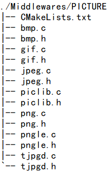

# 图片实验

## 前言

在开发产品的时候，很多时候，我们都会用到图片解码，在本章中，我们将向大家介绍如何通过 ESP32-S3 来解码 BMP/JPG/JPEG/PNG 等图片，并在 LCD 上显示出来。

## 图片格式介绍

我们常用的图片格式有很多，一般最常用的有三种： JPEG（或 JPG）、 BMP、 PNG。其中JPEG（或 JPG）、 PNG 和 BMP 是静态图片。由于篇幅所限，感兴趣的读者可以查阅正点原子其它开发板开发指南中与图片显示有关的章节，作者在此不再过多赘述。

## 硬件设计

### 例程功能

开机的时候先检测字库，然后检测SD卡是否存在，如果SD卡存在，则开始查找SD卡根目录下的PICTURE文件夹，如果找到则显示该文件夹下面的图片文件（支持 bmp、 jpg、 jpeg、png 格式），循环显示，通过按K1和K2可以快速浏览下一张和上一张， K0按键用于暂停/继续播放， LEDR用于指示当前是否处于暂停状态。如果未找到 PICTURE 文件夹/任何图片文件，则提示错误。同样我们也是用LEDR来指示程序正在运行。

### 硬件资源

1. LED:
    LEDR-P1_1
2. 独立按键：
   <br />K0-GPIO0
   <br />K1-P0_0
   <br />K2-P0_1
3. 正点原子2.4寸LCD屏幕
4. SD卡

### 原理图

本章实验使用的图片解码库为软件库，因此没有对应的连接原理图。

## 程序设计

### 图片显示函数驱动解析

正点原子提供的 PICTURE 驱动源码包括以下文件，并且已经针对正点原子 ESP32-S3 软硬件进行了移植适配，用户在使用时，仅需将这以下文件添加到自己的工程中即可，如下图所示：



其中：bmp.c 和 bmp.h用于实现对bmp文件的解码；tjpgd.c和tjpgd.h用于实现对jpeg/jpg文件的解码；gif.c和 gif.h用于实现对gif文件的解码；这几个代码太长了，而且也有规定的标准，需要结合各个图片编码的格式来编写，所以我们在这里不贴出来，大家查看光盘中的源码的实现过程即可。

### 图片显示函数解析

在 IDF 版的 19_pitures 例程中，作者在 ```19_pitures \components\BSP``` 路径下并未添加新的内容，而是在 ```19_pitures\components\Middlewares```路径下面，新增了一个PICTURE文件，我们将挑出部分内容进行讲解。

#### 1，解码库的控制句柄_pic_phy 和_pic_info

我们使用这个接口，把解码后的图形数据与LCD的实际操作对应起来。为了方便去显示图片，我们需要将图片的信息与我们的LCD联系上。这里我们定义了_pic_phy 和_pic_info 分别用于定义图片解码库的LCD操作和存放解码后的图片尺寸颜色信息。它们的定义如下：

```
#define PIC_FORMAT_ERR      0x27    /* 格式错误 */
#define PIC_SIZE_ERR        0x28    /* 图片尺寸错误 */
#define PIC_WINDOW_ERR      0x29    /* 窗口设定错误 */
#define PIC_MEM_ERR         0x11    /* 内存错误 */

/* 判断 TRUE 和 FALSE 是否已经定义了? 没有则要定义! */
#ifndef TRUE
#define TRUE    1
#endif
#ifndef FALSE
#define FALSE   0
#endif

#define rgb565(r, g, b) (((r & 0xF8) << 8) | ((g & 0xFC) << 3) | (b >> 3))

/* 图片显示物理层接口 */
/* 在移植的时候,必须由用户自己实现这几个函数 */
typedef struct
{
    /* void draw_point(uint16_t x,uint16_t y,uint32_t color) 画点函数 */
    void(*draw_point)(uint16_t, uint16_t, uint16_t);

    /* void fill(uint16_t sx,uint16_t sy,uint16_t ex,uint16_t ey,uint32_t color) 单色填充函数 */
    void(*fill)(uint16_t, uint16_t, uint16_t, uint16_t, uint16_t);

    /* void draw_hline(uint16_t x0,uint16_t y0,uint16_t len,uint16_t color) 画水平线函数 */
    void(*draw_hline)(uint16_t, uint16_t, uint16_t, uint16_t);

    /* void piclib_multi_color(uint16_t x, uint16_t y, uint16_t width, uint16_t *color) 多点填充 */
    void(*multicolor)(uint16_t, uint16_t, uint16_t, uint16_t *);
} _pic_phy;

extern _pic_phy pic_phy;


/* 图像信息 */
typedef struct
{
    uint16_t lcdwidth;      /* LCD的宽度 */
    uint16_t lcdheight;     /* LCD的高度 */
} _pic_info;

extern _pic_info picinfo;   /* 图像信息 */
```

#### 2，piclib_init 函数

piclib_init 函数，该函数用于初始化图片解码的相关信息，用于定义解码后的 LCD 操作。具体定义如下：

```
/**
 * @brief       画图初始化
 *   @note      在画图之前,必须先调用此函数, 指定相关函数
 * @param       无
 * @retval      无
 */
void piclib_init(void)
{
    pic_phy.draw_point = lcd_draw_point;         /* 画点函数实现,仅GIF需要 */
    pic_phy.fill = lcd_fill;                     /* 填充函数实现,仅GIF需要 */
    pic_phy.draw_hline = lcd_draw_hline;         /* 画线函数实现,仅GIF需要 */
    pic_phy.multicolor = piclib_multi_color;     /* 颜色填充函数实现,JPEG、BMP、PNG需要 */

    picinfo.lcdwidth = lcddev.width;             /* 得到LCD的宽度像素 */
    picinfo.lcdheight = lcddev.height;           /* 得到LCD的高度像素 */
}
```

#### 3，piclib_ai_load_picfile 函数

piclib_ai_load_picfile 帮助我们得到需要显示的图片信息并助于下一步的绘制。本函数需要结合文件系统来操作，图片根据后缀区分并且在文件夹在保存是我们在 PC下的习分类，也是我们处理和分类图片的最方便的方式。

```
/**
 * @brief       智能画图
 * @note        图片仅在x,y和width, height限定的区域内显示.
 * @param       filename      : 包含路径的文件名(.bmp/.jpg/.jpeg/.gif等)
 * @param       x, y          : 起始坐标
 * @param       width, height : 显示区域
 * @param       fast          : 使能快速解码
 * @arg                         0, 不使能
 * @arg                         1, 使能
 * @note                        图片尺寸小于等于液晶分辨率,才支持快速解码
 * @retval      无
 */
uint8_t piclib_ai_load_picfile(char *filename, uint16_t x, uint16_t y, uint16_t width, uint16_t height)
{
    uint8_t    res = 0;/* 返回值 */
    uint8_t temp;

    if ((x + width) > picinfo.lcdwidth)return PIC_WINDOW_ERR;   /* x坐标超范围了 */

    if ((y + height) > picinfo.lcdheight)return PIC_WINDOW_ERR; /* y坐标超范围了 */

    /* 得到显示方框大小 */
    if (width == 0 || height == 0)return PIC_WINDOW_ERR;        /* 窗口设定错误 */

    /* 文件名传递 */
    temp = exfuns_file_type(filename);   /* 得到文件的类型 */
    ESP_LOGI("here","temp:%#x ", temp);
    switch (temp)
    {
        case T_BMP:
            ESP_LOGI("here","enter");
            res = bmp_decode(filename,width, height);           /* 解码BMP */
            break;

        case T_JPG:
        case T_JPEG:
            res = jpeg_decode(filename,width, height);          /* 解码JPG/JPEG */
            break;

        case T_GIF:
            res = gif_decode(filename, x, y, width, height);    /* 解码gif */
            break;

        case T_PNG:
            res = png_decode(filename, width, height);          /* 解码PNG */
            break;

        default:
            res = PIC_FORMAT_ERR;                               /* 非图片格式!!! */
            break;
    }

    return res;
}
```

piclib_ai_load_picfile 函数，整个图片显示的对外接口，外部程序，通过调用该函数，可以实现 bmp、 jpg/jpeg、 png 和 gif 的显示，该函数根据输入文件的后缀名，判断文件格式，然后交给相应的解码程序（bmp 解码/jpeg 解码/gif 解码/png 解码），执行解码，完成图片显示。这里用到的 exfuns_file_type()函数是我们用来判断文件类型，方便我们进行程序设计。由于图片显示需要用到大内存，我们使用动态内存分配来实现，我们仍使用我们自定的内存管理函数来管理程序内存。申请内存函数 piclib_mem_malloc()和内存释放函数 piclib_mem_free()的实现就比较简单了，大家参考光盘的源码即可。

### CMakeLists.txt文件

打开本实验的Middlewares文件夹下的CMakeList.txt文件，其内容如下所示：

```
list(APPEND srcs    bmp.c
                    gif.c
                    jpeg.c
                    piclib.c
                    png.c
                    pngle.c
                    tjpgd.c
                    )

idf_component_register(SRCS "piclib.c" "pngle.c" "jpeg.c" "bmp.c" "${srcs}"
                    INCLUDE_DIRS "."
                    REQUIRES BSP
                             MYFATFS
                             esp_driver_jpeg
                             fatfs
                             )
```

上述代码中的 fatfs以及esp_driver_jpeg等依赖库需要由开发者自行添加，以确保 PICTURE 驱动能够顺利集成到构建系统中。这一步骤是必不可少的，它确保了 PICTURE 驱动的正确性和可用性，为后续的开发工作提供了坚实的基础。

### 实验应用代码

打开main.c文件，该文件定义了工程入口函数，名为main。该函数代码如下。

```
/**
 * @brief       程序入口
 * @param       无
 * @retval      无
 */
void app_main(void)
{
    esp_err_t ret;
    FF_DIR picdir; 
    FILINFO *picfileinfo;
    char *pname;
    uint16_t totpicnum;
    uint16_t curindex = 0;
    uint8_t key = 0;
    uint8_t key1 = 0; 
    uint8_t pause = 0;                                  /* 暂停标记 */
    uint8_t t;
    uint16_t temp;
    uint32_t *picoffsettbl;

    ret = nvs_flash_init();                             /* 初始化NVS */

    if (ret == ESP_ERR_NVS_NO_FREE_PAGES || ret == ESP_ERR_NVS_NEW_VERSION_FOUND)
    {
        ESP_ERROR_CHECK(nvs_flash_erase());
        ESP_ERROR_CHECK(nvs_flash_init());
    }

    key_init();                                         /* 初始化按键 */
    myiic_init();                                       /* 初始化IIC */
    my_spi_init();                                      /* 初始化SPI */
    aw9523b_init();                                     /* 初始化AW9523B */ 
    lcd_init();                                         /* 初始化LCD */

    while (sd_spi_init())                               /* 检测不到SD卡 */
    {
        lcd_show_string(30, 110, 200, 16, 16, "SD Card Error!", RED);
        vTaskDelay(pdMS_TO_TICKS(500));
        lcd_show_string(30, 130, 200, 16, 16, "Please Check! ", RED);
        vTaskDelay(pdMS_TO_TICKS(500));
    }

    ret = exfuns_init();                                /* 为fatfs相关变量申请内存 */

    while (fonts_init())                                /* 检查字库 */
    {
        lcd_clear(WHITE);                               /* 清屏 */
        lcd_show_string(30, 30, 200, 16, 16, "ESP32-S3", RED);

        key = fonts_update_font(30, 50, 16, (uint8_t *)"0:", RED);  /* 更新字库 */

        while (key)                                     /* 更新失败 */
        {
            lcd_show_string(30, 50, 200, 16, 16, "Font Update Failed!", RED);
            vTaskDelay(pdMS_TO_TICKS(200));
            lcd_fill(20, 50, 200 + 20, 90 + 16, WHITE);
            vTaskDelay(pdMS_TO_TICKS(200));
        }

        lcd_show_string(30, 50, 200, 16, 16, "Font Update Success!   ", RED);
        vTaskDelay(pdMS_TO_TICKS(1000));
        lcd_clear(WHITE);                               /* 清屏 */
    }

    text_show_string(30, 50, 200, 16, "正点原子ESP32-S3",16,0, RED);
    text_show_string(30, 70, 200, 16, "图片显示 实验", 16, 0, RED);
    text_show_string(30, 90, 200, 16, "正点原子@ALIENTEK", 16, 0, RED);
    text_show_string(30, 110, 200, 16, "K1:NEXT K2:PREV", 16, 0, RED);
    text_show_string(30, 130, 200, 16, "K0:PAUSE:", 16, 0, RED);

    while (f_opendir(&picdir, "0:/PICTURE"))            /* 打开图片文件夹 */
    {
        text_show_string(30, 150, 240, 16, "PICTURE文件夹错误!", 16, 0, RED);
        vTaskDelay(pdMS_TO_TICKS(200));
        lcd_fill(30, 150, 240, 186, WHITE);             /* 清除显示 */
        vTaskDelay(pdMS_TO_TICKS(200));
    }

    totpicnum = pic_get_tnum("0:/PICTURE");             /* 得到总有效文件数 */

    while (totpicnum == NULL)                           /* 图片文件为0 */
    {
        text_show_string(30, 150, 240, 16, "没有图片文件!", 16, 0, RED);
        vTaskDelay(pdMS_TO_TICKS(200));
        lcd_fill(30, 150, 240, 186, WHITE);             /* 清除显示 */
        vTaskDelay(pdMS_TO_TICKS(200));
    }

    picfileinfo = (FILINFO *)malloc(sizeof(FILINFO));   /* 申请内存 */
    pname = malloc(255 * 2 + 1);                        /* 为带路径的文件名分配内存 */
    picoffsettbl = malloc(4 * totpicnum);               /* 申请4*totpicnum个字节的内存,用于存放图片索引 */

    while (!picfileinfo || !pname || !picoffsettbl)     /* 内存分配出错 */
    {
        text_show_string(30, 150, 240, 16, "内存分配失败!", 16, 0, RED);
        vTaskDelay(pdMS_TO_TICKS(200));
        lcd_fill(30, 150, 240, 186, WHITE);             /* 清除显示 */
        vTaskDelay(pdMS_TO_TICKS(200));
    }

    /* 记录索引 */
    ret = f_opendir(&picdir, "0:/PICTURE");             /* 打开目录 */

    if (ret == FR_OK)
    {
        curindex = 0;                                   /* 当前索引为0 */

        while (1)                                       /* 全部查询一遍 */
        {
            temp = picdir.dptr;                         /* 记录当前dptr偏移 */
            ret = f_readdir(&picdir, picfileinfo);      /* 读取目录下的一个文件 */
            if (ret != FR_OK || picfileinfo->fname[0] == 0)break;   /* 错误了/到末尾了,退出 */

            ret = exfuns_file_type(picfileinfo->fname);

            if ((ret & 0X0F) != 0X00)                   /* 取高四位,看看是不是图片文件 */
            {
                picoffsettbl[curindex] = temp;          /* 记录索引 */
                curindex++;
            }
        }
    }

    text_show_string(30, 150, 240, 16, "图片开始显示...", 16, 0, RED);
    vTaskDelay(pdMS_TO_TICKS(1000));
    piclib_init();                                                              /* 初始化画图 */
    curindex = 0;                                                               /* 从0开始显示 */
    ret = f_opendir(&picdir, (const TCHAR *)"0:/PICTURE");                      /* 打开目录 */

    while (ret == FR_OK)                                                        /* 打开成功 */
    {
        atk_dir_sdi(&picdir, picoffsettbl[curindex]);                           /* 改变当前目录索引 */
        ret = f_readdir(&picdir, picfileinfo);                                  /* 读取目录下的一个文件 */

        if (ret != FR_OK || picfileinfo->fname[0] == 0)
        {
            picdir.dptr = picoffsettbl[curindex];
            ret = f_readdir(&picdir, picfileinfo);                              /* 读取目录下的一个文件 */
            if (ret != FR_OK || picfileinfo->fname[0] == 0)
            {
                ESP_LOGE(__FUNCTION__, "Read Failed");
                break;                                                          /* 错误了/到末尾了,退出 */
            }
        }

        strcpy((char *)pname, "0:/PICTURE/");                                   /* 复制路径(目录) */
        strcat((char *)pname, (const char *)picfileinfo->fname);                /* 将文件名接在后面 */
        lcd_clear(BLACK);

        piclib_ai_load_picfile(pname, 0, 0, lcddev.width, lcddev.height);     /* 显示图片 */
        text_show_string(2, 2, lcddev.width, 16, (char *)pname, 16, 0, RED);   /* 显示图片名字 */
        t = 0;

        while (1)
        {
            t ++;
            key = aw9523b_key_scan(0);   /* 扫描按键 */
            key1 = key_scan(0);         /* 扫描按键 */

            if (t > 250)key = 1;        /* 模拟一次按下KEY0 */

            if ((t % 20) == 0)
            {
                LEDR_TOGGLE();           /* LED闪烁,提示程序正在运行. */
            }

            if (key == KEY1_PRES)       /* 上一张 */
            {
                if (curindex)
                {
                    curindex--;
                }
                else
                {
                    curindex = totpicnum - 1;
                }

                break;
            }
            else if (key == KEY2_PRES)      /* 下一张 */
            {
                curindex++;

                if (curindex >= totpicnum)
                {
                    curindex = 0;           /* 到末尾的时候,自动从头开始 */
                }

                break;
            }
            else if (key1 == KEY0)
            {
                LEDR_TOGGLE();
            }

            if (pause == 0)t++;

            vTaskDelay(pdMS_TO_TICKS(10));
        }

        ret = 0;
    }

    free(picfileinfo);    /* 释放内存 */
    free(pname);          /* 释放内存 */
    free(picoffsettbl);   /* 释放内存 */
}
```

可以看到整个设计思路是跟据图片解码库来设计的， piclib_ai_load_picfile()是这套代码的核心，其它的交互是围绕它和图片解码后的图片信息作的显示。大家再仔细对照光盘中的源码进一步了解整个设置思路。另外，我们的程序中只分配了 4 个文件索引，故更多数量的图片无法直接在本程序下演示，大家根据自己的需要再进行修改即可。

## 下载验证

在代码编译成功之后，我们下载代码到开发板上，可以看到 LCD 开始显示图片（假设 SD卡及文件都准备好了，即：在 SD 卡根目录新建： PICTURE 文件夹，并存放一些图片文件(.bmp/.jpg/.png)在该文件夹内），如图所示：


