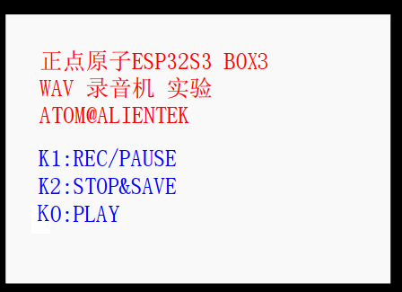
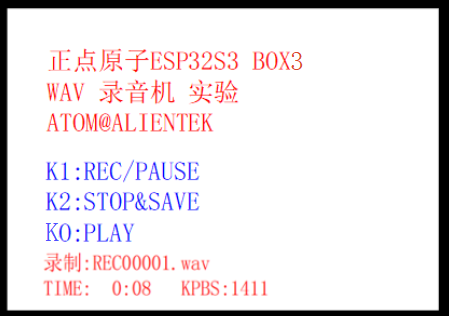

# 录音机实验

## 前言

上一章，我们实现了一个简单的音乐播放器，本章我们将在上一章的基础上，使用ES7210实现一个简单的录音机，录制 WAV 格式的录音。

## ES7210简介

本章涉及的知识点基本上在上一章都有介绍。本章要实现 WAV 录音，还是和上一章一样，要了解： WAV文件格式、ES7210 和 I²S。ES7210是一款高性能的四通道音频模数转换器（ADC），采用多比特Δ-Σ架构。其核心特性包括高达102dB的信噪比（SNR）和-85dB的总谐波失真加噪声（THD+N），支持24位分辨率及8kHz至100kHz的宽采样率范围。该芯片提供I²S/PCM主从模式及TDM接口，兼容多种标准与非标准音频时钟（如256/384Fs、USB 12/24MHz等），并具备低功耗待机模式。其主要应用于麦克风阵列、智能音箱和远场语音捕捉等需要高保真、多通道音频采集的场景。芯片采用QFN-32封装，工作温度范围为-40°C至+85°C。

ES7210 的框图如下所示：


该框图展示了ES7210四通道音频ADC的内部功能架构，其核心流程为：
<br />输入路径： 4路差分麦克风输入（MIC1P/N 至 MIC4P/N），接入多比特Δ-Σ调制器，完成模拟信号→数字比特流的高精度转换。
<br />数字处理链：调制器输出送入DSP模块，用于执行数字滤波、降采样及噪声整形等关键算法。
<br />时钟管理：外部主时钟（MCLK）输入至时钟管理与采样率检测模块，实现自动采样率识别与系统时序同步。
<br />数据输出：经DSP处理后的音频数据由音频数据接口输出，支持双通道I²S/PCM（SDOUT1/TDMOUT + SDOUT2/TDMIN）及标准LRCK/SCLK时钟信号。
<br />控制接口：通过I²C接口（引脚：CCLK, CDATA, AD0, AD1）配置寄存器、设置工作模式与参数（如增益、滤波器特性等）。

## I2S 控制器介绍

I2S控制器在上一个章节已经陈述过了，再次不再赘述。

## 硬件设计

### 例程功能

本章实验功能简介： 先初始化各外设，然后检测字库是否存在，如果检测无问题，再检测SD 卡根目录是否存在 RECORDER 文件夹，如果不存在则创建，如果创建失败，则报错。在找
到 SD 卡的 RECORDER 文件夹后，即进入录音模式，此时可以在喇叭听到采集到的音频。 K1 用于开始/暂停录音，K2 用于保存并停止录音，KO 用于播放最近一次的录音。LED 闪烁，指示程序运行状态。 LED 长亮，指示录音运行状态。

### 硬件资源

本实验，大家需要准备 1 个 SD 卡（在里面新建一个 MUSIC 文件夹，并存放一些歌曲在MUSIC 文件夹下），插入 SD 卡接口，然后下载本实验就可以通过板载喇叭来听歌了。实验用到的硬件资源如下：
<br />1.LED:
<br />LEDR-P1_1
<br />2.独立按键：
<br />K0-GPIO0
<br />K1-P0_0
<br />K2-P0_1
<br />3.正点原子2.4寸LCD屏幕
<br />4.SD
<br />5.ES8311 音频芯片（用于输出）
<br />6.ES7210 音频芯片（用于采集）

### 原理图

本章实验使用的原理图如下：


## 程序设计

### I2S 函数解析

I2S 的API函数解析，请参考上一章。

### ES7210驱动解析

在 IDF 版的 21_recoding(ES7210) 例程中，作者在 ```21_recoding(ES7210) \components\BSP``` 路径下新增了一个ES7210 文件夹， 分别存放 es7210.c、 es7210.h这几个文件。其中， es7210.h 文件负责声明 ES7210 相关的函数和变量，而 es7210.c 文件则实现了 ES7210 的应用驱动。下面，我们将解析这个文件内容。

#### es7210.hj 驱动

音乐文件我们要通过SD卡来传给单片机，那我们自然要用到文件系统。由于播放功能涉及到多个外设的配合使用，用文件系统读音频文件，做播放控制等，所以我们把 ES7210 的硬件驱动放到 components\BSP 目录下，播放功能作为 APP 放到 main 目录下。这里我们只讲解核心代码，详细的源码请大家参考光盘本实验对应源码。

```
/* ES7210的IIC通信地址 */
#define  ES7210_ADDRRES                     0x40

/* 常用寄存器声明 */
#define  ES7210_RESET_REG00                 0x00        /* 复位控制 */
#define  ES7210_CLOCK_OFF_REG01             0x01        /* 用于关闭ADC时钟 */
#define  ES7210_MAINCLK_REG02               0x02        /* 设置ADC时钟分频 */
#define  ES7210_MASTER_CLK_REG03            0x03        /* MCLK源和SCLK分频 */
#define  ES7210_LRCK_DIVH_REG04             0x04        /* LRCK分频高位 */
#define  ES7210_LRCK_DIVL_REG05             0x05        /* LRCK分频低位 */
#define  ES7210_POWER_DOWN_REG06            0x06        /* 电源关闭 */
#define  ES7210_OSR_REG07                   0x07
#define  ES7210_MODE_CONFIG_REG08           0x08        /* 设置主从模式和通道数 */
#define  ES7210_TIME_CONTROL0_REG09         0x09        /* 设置芯片初始化状态周期 */
#define  ES7210_TIME_CONTROL1_REG0A         0x0A        /* 设置上电状态周期 */
#define  ES7210_SDP_INTERFACE1_REG11        0x11        /* 设置采样和格式 */
#define  ES7210_SDP_INTERFACE2_REG12        0x12        /* 引脚状态 */

#define  ES7210_ADC_AUTOMUTE_REG13          0x13        /* 设置静音 */
#define  ES7210_ADC34_MUTERANGE_REG14       0x14        /* 设置静音范围 */
#define  ES7210_ALC_SEL_REG16               0x16        /* 设置ALC模式 */
#define  ES7210_ADC1_DIRECT_DB_REG1B        0x1B
#define  ES7210_ADC2_DIRECT_DB_REG1C        0x1C
#define  ES7210_ADC3_DIRECT_DB_REG1D        0x1D
#define  ES7210_ADC4_DIRECT_DB_REG1E        0x1E        /* ALC关闭时为ADC直接dB，ALC打开时为最大增益 */
#define  ES7210_ADC34_HPF2_REG20            0x20        /* 高通滤波器 */
#define  ES7210_ADC34_HPF1_REG21            0x21
#define  ES7210_ADC12_HPF2_REG22            0x22
#define  ES7210_ADC12_HPF1_REG23            0x23
#define  ES7210_ANALOG_REG40                0x40        /* 模拟电源 */

#define  ES7210_MIC12_BIAS_REG41            0x41
#define  ES7210_MIC34_BIAS_REG42            0x42
#define  ES7210_MIC1_GAIN_REG43             0x43
#define  ES7210_MIC2_GAIN_REG44             0x44
#define  ES7210_MIC3_GAIN_REG45             0x45
#define  ES7210_MIC4_GAIN_REG46             0x46
#define  ES7210_MIC1_POWER_REG47            0x47
#define  ES7210_MIC2_POWER_REG48            0x48
#define  ES7210_MIC3_POWER_REG49            0x49
#define  ES7210_MIC4_POWER_REG4A            0x4A
#define  ES7210_MIC12_POWER_REG4B           0x4B        /* MIC偏置、ADC和PGA电源 */
#define  ES7210_MIC34_POWER_REG4C           0x4C

typedef enum {
    ES7210_I2S_FMT_I2S   = 0x00,
    ES7210_I2S_FMT_LJ    = 0x01,
    ES7210_I2S_FMT_DSP_A = 0x03,
    ES7210_I2S_FMT_DSP_B = 0x13
} es7210_i2s_fmt_t;

typedef enum {
    ES7210_I2S_BITS_16B = 16,
    ES7210_I2S_BITS_18B = 18,
    ES7210_I2S_BITS_20B = 20,
    ES7210_I2S_BITS_24B = 24,
    ES7210_I2S_BITS_32B = 32
} es7210_i2s_bits_t;

typedef enum {
    ES7210_MIC_GAIN_0DB  = 0,
    ES7210_MIC_GAIN_3DB  = 1,
    ES7210_MIC_GAIN_6DB  = 2,
    ES7210_MIC_GAIN_9DB  = 3,
    ES7210_MIC_GAIN_12DB = 4,
    ES7210_MIC_GAIN_15DB = 5,
    ES7210_MIC_GAIN_18DB = 6,
    ES7210_MIC_GAIN_21DB = 7,
    ES7210_MIC_GAIN_24DB = 8,
    ES7210_MIC_GAIN_27DB = 9,
    ES7210_MIC_GAIN_30DB = 10,
    ES7210_MIC_GAIN_33DB = 11,
    ES7210_MIC_GAIN_34_5DB = 12,
    ES7210_MIC_GAIN_36DB = 13,
    ES7210_MIC_GAIN_37_5DB = 14
} es7210_mic_gain_t;

typedef enum {
    ES7210_MIC_BIAS_2V18 = 0x00,
    ES7210_MIC_BIAS_2V26 = 0x10,
    ES7210_MIC_BIAS_2V36 = 0x20,
    ES7210_MIC_BIAS_2V45 = 0x30,
    ES7210_MIC_BIAS_2V55 = 0x40,
    ES7210_MIC_BIAS_2V66 = 0x50,
    ES7210_MIC_BIAS_2V78 = 0x60,
    ES7210_MIC_BIAS_2V87 = 0x70
} es7210_mic_bias_t;

typedef struct {
    uint32_t sample_rate_hz;
    uint32_t mclk_ratio;
    es7210_i2s_fmt_t i2s_format;
    es7210_i2s_bits_t bit_width;
    es7210_mic_bias_t mic_bias; 
    es7210_mic_gain_t mic_gain; 
    struct {
        uint32_t tdm_enable: 1; 
    } flags;
} es7210_codec_config_t;

/* 声明函数 */
esp_err_t es7210_config_codec(const es7210_codec_config_t *codec_conf);
esp_err_t es7210_config_volume(int8_t volume_db);
void es7210_init(bool is_tdm);
```

#### 2，es7210.c 驱动

```
/**
 * @brief       ES7210写寄存器
 * @param       reg_addr: 寄存器地址
 * @param       data: 写入的数据
 * @retval      无
 */
esp_err_t es7210_write_reg(uint8_t reg_addr, uint8_t data)
{
    esp_err_t ret;
    uint8_t *buf = malloc(2);

    if (buf == NULL)
    {
        ESP_LOGE(es7210_tag, "%s memory failed", __func__);
        return ESP_ERR_NO_MEM;      /* 分配内存失败 */
    }

    buf[0] = reg_addr;              
    buf[1] = data;                  /* 拷贝数据至存储区当中 */

    do 
    {
        i2c_master_bus_wait_all_done(bus_handle, 1000);
        ret = i2c_master_transmit(es7210_handle, buf, 2, 1000);   
    } while (ret != ESP_OK);

    free(buf);                      /* 发送完成释放内存 */

    return ret;
}

/**
 * @brief       ES7210读寄存器
 * @param       reg_add:寄存器地址
 * @retval      无
 */
esp_err_t es7210_read_reg(uint8_t reg_addr)
{
    uint8_t reg_data = 0;

    i2c_master_transmit_receive(es7210_handle, &reg_addr, 1, &reg_data, 1, -1);

    return reg_data;
}
/...代码过多，省略部分代码.../
```

该代码实现了ES7210四通道音频ADC的ESP-IDF驱动，支持I²S/TDM接口。通过预定义时钟参数表自动配置MCLK、LRCK及过采样率，适配8k–96kHz采样率。提供I2S格式（标准I2S/LJ/DSP）、位宽（16–32bit）、TDM模式、麦克风偏置电压、增益（最高37.5dB）及数字音量调节功能。初始化流程包括软复位、电源管理、HPF配置和通道使能，适用于多麦克风语音采集系统。

### CMakeLists.txt文件

打开本实验的Middlewares文件夹下的CMakeList.txt文件，其内容如下所示：

```
set(src_dirs
            KEY
            MYIIC
            LCD
            SPI_SD
            MYSPI
            AW9523B
            MYI2S
            ES7210
            ES8311)

set(include_dirs
            KEY
            MYIIC
            LCD
            SPI_SD
            MYSPI
            AW9523B
            MYI2S
            ES7210
            ES8311)

set(requires
            driver
            fatfs
            esp_lcd    
            esp_driver_i2s)

idf_component_register(SRC_DIRS ${src_dirs} INCLUDE_DIRS ${include_dirs} REQUIRES ${requires})

component_compile_options(-ffast-math -O3 -Wno-error=format=-Wno-format)
```

上述代码中的 MYI2S 以及ES8311等依赖库需要由开发者自行添加，以确保 MUSIC 驱动能够顺利集成到构建系统中。这一步骤是必不可少的，它确保了 MUSIC 驱动的正确性和可用性，为后续的开发工作提供了坚实的基础。
打开本实验 main 文件下的 CMakeLists.txt 文件，其内容如下所示：

```
idf_component_register(
    SRC_DIRS 
        "."
        "APP"
        "APP/AUDIO"
    INCLUDE_DIRS 
        "."
        "APP"
        "APP/AUDIO"
    )
```

述的驱动需要由开发者自行添加， 在此便不做赘述了。

### 实验应用代码

打开main.c文件，该文件定义了工程入口函数，名为main。该函数代码如下。

```
/**
 * @brief       程序入口
 * @param       无
 * @retval      无
 */
void app_main(void)
{
   uint8_t key = 0;
    esp_err_t res;

    res = nvs_flash_init();                             /* 初始化NVS */

    if (res == ESP_ERR_NVS_NO_FREE_PAGES || res == ESP_ERR_NVS_NEW_VERSION_FOUND)
    {
        ESP_ERROR_CHECK(nvs_flash_erase());
        ESP_ERROR_CHECK(nvs_flash_init());
    }

    key_init();                                         /* 初始化按键 */
    my_spi_init();                                      /* 初始化SPI */
    myiic_init();                                       /* 初始化IIC */
    aw9523b_init();                                     /* 初始化AW9523B */
    lcd_init();                                         /* 初始化LCD */
    es8311_init(I2S_SAMPLE_RATE);                       /* ES8311初始化 */

    while (sd_spi_init())                               /* 检测不到SD卡 */
    {
        lcd_show_string(30, 120, 200, 16, 16, "SD Card Error!", RED);
        vTaskDelay(500);
        lcd_show_string(30, 140, 200, 16, 16, "Please Check! ", RED);
        vTaskDelay(500);
    }

    while (fonts_init())                                /* 检查字库 */
    {
        lcd_clear(WHITE);                               /* 清屏 */
        lcd_show_string(30, 30, 200, 16, 16, "ESP32-S3", RED);

        key = fonts_update_font(30, 50, 16, (uint8_t *)"0:", RED);  /* 更新字库 */

        while (key)                                     /* 更新失败 */
        {
            lcd_show_string(30, 50, 200, 16, 16, "Font Update Failed!", RED);
            vTaskDelay(200);
            lcd_fill(20, 50, 200 + 20, 90 + 16, WHITE);
            vTaskDelay(200);
        }

        lcd_show_string(30, 50, 200, 16, 16, "Font Update Success!   ", RED);
        vTaskDelay(1500);
        lcd_clear(WHITE);                               /* 清屏 */
    }

    res = exfuns_init();                                /* 为fatfs相关变量申请内存 */
    vTaskDelay(500);                                    /* 实验信息显示延时 */

    text_show_string(30, 50, 200, 16, "正点原子ESP32S3 BOX", 16, 0, RED);
    text_show_string(30, 70, 200, 16, "音乐播放器实验", 16, 0, RED);
    text_show_string(30, 90, 200, 16, "ATOM@ALIENTEK", 16, 0, RED);

    while (1)
    {
       audio_play();   /* 播放音乐 */
    }
}
```

可以看到 main 函数与音乐播放器实验十分类似，封装好了 APP， main 函数会精简很多。

## 下载验证

在代码编译成功之后，我们下载代码到正点原子 DNESP32S3 BOX3 开发板上，先初始化各外设，然后检测字库是否存在，如果检测无问题，再检测 SD 卡根目录是否存在 RECORDER 文件夹，如果不存在则创建，如果创建失败，则报错。在找到 SD 卡的 RECORDER 文件夹后，即进入录音模式（包括配置 I²S 等），此时可以在耳机（或喇叭）听到采集到的音频。 K1 用于开始/暂停录音， K2 用于保存并停止录音， KO 用于播放最近一次的录音。



此时，我们按下 K1就开始录音了，此时看到屏幕显示录音文件的名字以及录音时长，如图所示：



在录音的时候按下 K1 则执行暂停/继续录音的切换，通过 LEDB 指示录音暂停。通过按下K2，可以停止当前录音，并保存录音文件。在完成一次录音文件保存之后，我们可以通过按
K0 按键，来实现播放这个录音文件（即播放最近一次的录音文件），实现试听。
