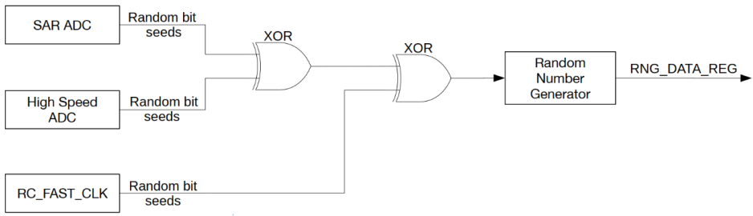
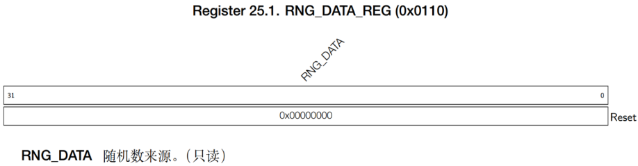
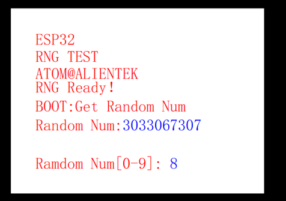

# RNG随机数实验

## 前言

本章，我们将介绍 ESP32-S3 的硬件随机数发生器。我们使用 K0 按键来获取硬件随机数，并且将获取到的随机数值显示在 LCD 上面。同时，使用 LED 指示程序运行状态。

## 随机数发生器简介

ESP32-S3 内置一个真随机数发生器（RNG），其生成的 32 位随机数可作为加密等操作的基础。 ESP32-S3 的随机数发生器可通过物理过程而非算法生成真随机数，所有生成的随机数在特定范围内出现的概率完全一致。

### RNG 功能描述

下面先来了解噪声源，通过学习噪声源会有一个很好的整体掌握，同时对之后的编程也会有一个清晰的思路。 EDP32- S3 的随机数发生器噪声源如下图示：

系统可以从随机数发生器的寄存器 RNG_DATA_REG 中读取随机数，每个读到的 32 位随机数都是真随机数，噪声源为系统中的热噪声和异步时钟。具体来说，这些热噪声可以来自SARADC或高速 ADC或两者兼有。当芯片的 SARADC 或高速 ADC工作时，就会产生比特流，并 通 过 (XOR逻 辑 运 算 作 为 随 机 数 种 子 进 入 随 机 数 生 成 器 。 当 为 数 字 内 核 使 能RC_FAST_CLK 时钟时，随机数发生器也会对 RC_FAST_CLK(20MHz)进行采样，作为随机数种子。 RC_FAST_CLK 是一种异步时钟源，由于存在电路亚稳态，因此可以提高随机数发生器的墒值。然而，为了保证随机数发生器可以获得最大熵值，仍建议在使用随机数发生器时至少使能一路 ADC 作为随机数种子。

### RNG 随机数寄存器

RND 随机数寄存器描述如下所示：
名称               | 描述            |  地址  | 操作  |
-----------------|--------------|------|------|
  RNG_DATA_REG   |随机数数据    | 0x0110 |   只读|



需要注意的是，这里的地址都是相对于随机数发生器基地址的地址偏移量。

## 硬件设计

### 例程功能

本实验使用 ESP32-S3 自带的硬件随机数生成器（RNG），获取随机数，并显示在 LCD 屏幕上。按 K0 按键可以获取一次随机数。同时程序自动获取 0~9范围内的随机数，显示在屏幕上。LED 闪烁用于提示程序正在运行。

### 硬件资源

1. LED:
   LEDR - P1_1
2. 按键:
   KEY0-GPIO0
3. 正点原子2.4寸LCD屏幕
4. RNG（硬件随机数发生器）

### 原理图

RNG 属于 ESP32-S3 内部资源，通过软件设置好就可以了。本实验通过配合按键获取随机数和通过 LCD 显示。

## 程序设计

### RNG函数解析

ESP-IDF 提供了一套 API 来配置 RNG。。接下来，作者将介绍一些常用的SPI函数，这些函数的描述及其作用如下：

#### 得到随机数

该函数用于获取一个 32 位的硬件随机数，其函数原型如下：

```
uint32_t esp_random(void)
```

| 参数  | 描述  |
| --- | --- |
| 无   | 无   |

该函数的返回值描述，如下表所示：

| 返回值                             | 描述                    |
| ------------------------------- | --------------------- |
| result ^ REG_READ(WDEV_RND_REG) | 0 和 UINT32_MAX 之间的随机值 |

### RNG 驱动解析

在 IDF 版 11_rng 例程中，作者在 ```11_rng\components\BSP``` 路径下新增了一个 RNG 文件夹，分别用于存放 rng.c、 rng.h 这两个文件。其中， rng.h 文件负责声明 RNG 相关的函数和变量，而rng.c 文件则实现了 RNG 的驱动代码。下面，我们将详细解析这两个文件的实现内容。

#### 1，rng.h文件

```
/* 函数声明 */
uint32_t rng_get_random_num(void);          /* 得到随机数 */
int rng_get_random_range(int min, int max);  /* 得到某个范围内的随机数 */
```

#### 2，rng.c文件

```
/**
 * @brief       得到随机数
 * @param       无
 * @retval      获取到的随机数(32bit)
 */
uint32_t rng_get_random_num(void)
{
    uint32_t randomnum;

    randomnum = esp_random();

    return randomnum;
}

/**
 * @brief       得到某个范围内的随机数
 * @param       min,max: 最小,最大值.
 * @retval      得到的随机数(rval),满足:min<=rval<=max
 */
int rng_get_random_range(int min, int max)
{ 
    uint32_t randomnum;

    randomnum = esp_random();

    return randomnum % (max - min + 1) + min;
}
```

从上述代码中，我们不难看出，对于 RNG 我们并没有相应的初始化函数， ESP32 IDF 提供了相应的 API 函数，我们只需调用即可，具体的在上一小节我们已经介绍过了，在此不做出赘述。

### CMakeLists.txt文件

打开本实验的BSP文件夹下的CMakeList.txt文件，其内容如下所示：

```
set(src_dirs
            MYIIC
            MYSPI
            KEY
            LCD
            RNG
            AW9523B)

set(include_dirs
            MYIIC
            MYSPI
            KEY
            LCD
            RNG
            AW9523B)

set(requires
            driver
            esp_lcd)

idf_component_register(SRC_DIRS ${src_dirs} INCLUDE_DIRS ${include_dirs} REQUIRES ${requires})

component_compile_options(-ffast-math -O3 -Wno-error=format=-Wno-format)

```

上述代码中的 RNG 驱动需要由开发者自行添加，以确保 RNG 驱动能够顺利集成到构建系统中。这一步骤是必不可少的，它确保了 RNG 驱动的正确性和可用性，为后续的开发工作提供了坚实的基础。

### 实验应用代码

打开main.c文件，该文件定义了工程入口函数，名为main。该函数代码如下。

```
/**
 * @brief       程序入口
 * @param       无
 * @retval      无
 */
void app_main(void)
{
    uint8_t key;
    uint32_t random;
    uint8_t t = 0;
    esp_err_t ret;

    ret = nvs_flash_init();                                         /* 初始化NVS */

    if (ret == ESP_ERR_NVS_NO_FREE_PAGES || ret == ESP_ERR_NVS_NEW_VERSION_FOUND)
    {
        ESP_ERROR_CHECK(nvs_flash_erase());
        ESP_ERROR_CHECK(nvs_flash_init());
    }

    my_spi_init();                                                  /* 初始化SPI */
    myiic_init();                                                   /* 初始化IIC */
    aw9523b_init();                                                 /* 初始化按键 */
    lcd_init();                                                     /* 初始化LCD */
    key_init();                                                     /* 初始化按键 */

    lcd_show_string(30, 50, 200, 16, 16, "ESP32-S3", RED);
    lcd_show_string(30, 70, 200, 16, 16, "RNG TEST", RED);
    lcd_show_string(30, 90, 200, 16, 16, "ATOM@ALIENTEK", RED);

    lcd_show_string(30, 110, 200, 16, 16, "RNG Ready!   ", RED);
    lcd_show_string(30, 130, 200, 16, 16, "K0:Get Random Num", RED);
    lcd_show_string(30, 150, 200, 16, 16, "Random Num:", RED);
    lcd_show_string(30, 180, 200, 16, 16, "Random Num[0-9]:", RED);

    while(1)
    {
        key = key_scan(0);

        if (key == KEY0)                                            /* 获取随机数并显示至LCD */
        {
            random = rng_get_random_num();
            lcd_show_num(30 + 8 * 11, 150, random, 10, 16, BLUE);
        }

        if ((t % 20) == 0)                                          /* 获取0~9间的随机数并显示至LCD */
        {
            LEDR_TOGGLE();                                          /* 每200ms,翻转一次LED */
            random = rng_get_random_range(0, 9);                    /* 取[0,9]区间的随机数 */
            lcd_show_num(30 + 8 * 16, 180, random, 1, 16, BLUE);    /* 显示随机数 */
        }

        vTaskDelay(10);
        t++;
    }
}
```

该部分代码也比较简单，在所有外设初始化成功后，进入死循环，等待 K0 按键按下，如果按下，则调用 rng_get_random_num 函数，读取随机数值，并将读到的随机数显示在 LCD 上面。每隔 200ms 获取一次区间[0,9]的随机数，并实时显示在液晶上。同时 LED，周期性闪烁，400ms 闪烁一次。

## 下载验证

将程序下载到开发板后，可以看到 LED 不停的闪烁，提示程序已经在运行了。然后我们按下 K0，就可以在屏幕上看到获取到的随机数。同时，就算不按 K0，程序也会自动的获取 0~9区间的随机数显示在 LCD 上面。实验结果如下图所示：


