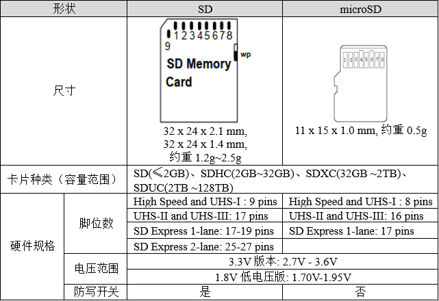
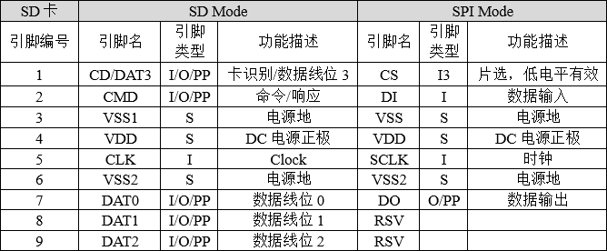
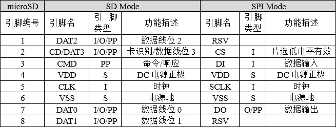
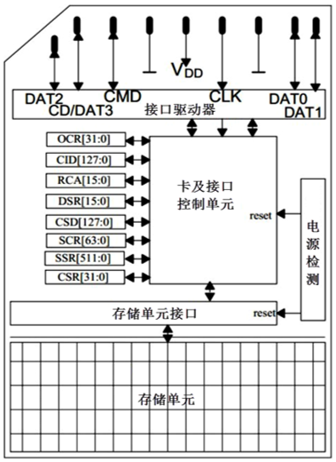
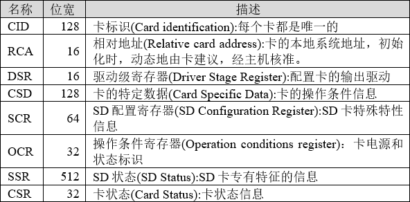
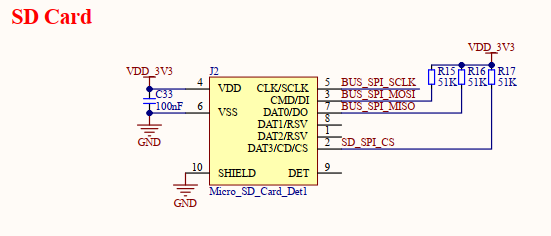
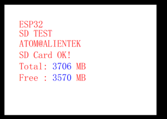

# SPI_SDCARD实验

## 前言

很多单片机系统都需要大容量存储设备，以存储数据。目前常用的有U盘，FLASH芯片，SD卡等。他们各有优点，综合比较，最适合单片机系统的莫过于SD卡了，它不仅容量可以做到很大（32GB以上），支持SPI/SDIO驱动，而且有多种体积的尺寸可供选择（标准的SD卡尺寸及Micro SD卡尺寸等），能满足不同应用的要求。只需要少数几个IO口即可外扩一个高达32GB或以上的外部存储器，容量从几十M到几十G选择范围很大，更换也很方便，编程也简单，是单片机大容量外部存储器的首选。
正点原子DNESP32S3 BOX3开发板使用的接口是Micro SD卡接口，卡座带自锁功能。SPI主机驱动程序将处理来自不同任务的独占访问。在本章中，我们将向大家介绍，如何在正点原子DNESP32S3 BOX3开发板上实现Micro SD卡的读取。

## SD卡简介

### 1，SD卡物理结构

SD卡的规范由SD卡协会明确，可以访问https://www.sdcard.org查阅更多标准。SD卡主要有SD、Mini SD和microSD(原名TF卡，2004年正式更名为Micro SD Card，为方便本文用microSD表示)三种类型，Mini SD已经被microSD取代，使用得不多，根据最新的SD卡规格列出的参数如下所示：



上述表格的“脚位数”，对应于实卡上的“金手指”数，不同类型的卡的触点数量不同，访问的速度也不相同。SD卡允许了不同的接口来访问它的内部存储单元。最常见的是SDIO模式和SPI模式，根据这两种接口模式，我们也列出SD卡引脚对应于这两种不同的电路模式的引脚功能定义，如下所示：



我们对比着来看一下microSD引脚，可见只比SD卡少了一个电源引脚VSS2，其它的引脚功能类似。



SD卡和Micro SD只有引脚和形状大小不同，内部结构类似，操作时序完全相同，可以使用完全相同的代码驱动，下面以9’Pin SD卡的内部结构为为例，展示SD卡的存储结构。



SD卡有自己的寄存器，但它不能直接进行读写操作，需要通过命令来控制，SDIO协议定义了一些命令用于实现某一特定功能，SD卡根据收到的命令要求对内部寄存器进行修改。下图中描述的SD卡的寄存器是我们和SD卡进行数据通讯的主要通道，如下：



关于SD卡的更多信息和硬件设计规范可以参考SD卡协议《Physical Layer Simplified Specification Version 2.00》的相关章节。

## 硬件设计

### 例程功能

1. 本章实验功能简介：经过一系列初始化之后，通过一个while循环以SD卡初始化为条件，以检测SD卡是否初始化成功，若初始化SD卡成功，则会通过串口或者VSCode终端输出SD卡的相关参数，并在LCD上显示SD卡的总容量以及剩余容量。此时LED闪烁，表示程序正在运行。

### 硬件资源

1. LED:
    LEDR-P1_1
2. 正点原子2.4寸LCD屏幕
3. SD卡

### 原理图

本章实验使用 SPI 接口与 SD 卡进行连接，开发板板载了一个 Micro SD 卡座用于连接 SD卡， SD 卡与 ESP32-S3 的连接原理图，如下图所示：



## 程序设计

### SPI_SD卡函数解析

ESP-IDF 提供了一套 API 来配置 SD 卡。接下来，作者将介绍一些常用的SPI函数，这些函数的描述及其作用如下：

#### 挂载 SD 卡

该函数用给定的配置，挂载 SD 卡，该函数原型如下所示：

```
esp_err_t esp_vfs_fat_sdspi_mount(const char* base_path,const sdmmc_host_t* host_config_input,const sdspi_device_config_t* slot_config,const esp_vfs_fat_mount_config_t*mount_config,sdmmc_card_t** out_card);
```

该函数的形参描述如下表所示：

| 参数                | 描述                                                                                     |
| ----------------- | -------------------------------------------------------------------------------------- |
| base_path         | 应该注册分区的路径（例如“/sdcard”）                                                                 |
| host_config_input | 指向描述 SDMMC 主机的结构的指针。此结构可以使用SDSPI_HOST_DEFAULT宏初始化。                                     |
| slot_config       | 指向具有插槽配置的结构的指针,对于SPI外设，将指针传递到使用sdspi_device_config_DEFAULT初始化的sdspi_device_config_t结构。 |
| mount_config      | 如果分区无法安装，则来自 SDMMC 或 SPI 驱动程序、SDMMC 协议或 FATFS 驱动程序的其他错误代码                              |

该函数的返回值描述，如下表所示：

| 返回值                   | 描述                              |
| --------------------- | ------------------------------- |
| ESP_OK                | 返回： 0，配置成功                      |
| ESP_ERR_INVALID_STATE | 如果已经调用了 esp_vfs_fat_sdmmc_mount |
| ESP_ERR_NO_MEM        | 如果无法分配内存                        |
| ESP_FAIL              | 指向具有用于安装 FATFS 的额外参数的结构的指针。     |

#### 取消挂载 SD 卡

该函数用于取消挂载 SD 卡，该函数原型如下所示：

```
esp_err_t esp_vfs_fat_sdcard_unmount(const char* base_path, sdmmc_card_t *card)
```

该函数的形参描述如下表所示：

| 参数        | 描述                     |
| --------- | ---------------------- |
| base_path | 应该注册分区的路径（例如“/sdcard”） |
| card      | SD / MMC 卡结构           |

该函数的返回值描述，如下表所示：

| 返回值                   | 描述                             |
| --------------------- | ------------------------------ |
| ESP_OK                | 返回： 0，配置成功                     |
| ESP_ERR_INVALID_ARG   | 如果 card 参数未注册                  |
| ESP_ERR_INVALID_STATE | 如果尚未调用 esp_vfs_fat_sdmmc_mount |

### SPI_SD卡驱动解析

在 IDF 版的 16_sd例程中，作者在```16_sd\components\BSP```路径下新增了一个 SDIO 文件夹，用于存放 spi_sdcard.c、 spi_sdcard.h 这两个文件。其中， spi_sdcard.h 文件负责声明 SDIO 相关的函数和变量，而 spi_sdcard.c 文件则实现了 SDIO 的驱动代码。下面，我们将详细解析这两个文件的实现内容。

#### 1，spi_sd.c文件

sd_pi_init 的设计就比较简单了，我们只需要填充 SPI 结构体的控制句柄， 然后添加 SPI 总线设备并配置文件系统挂载即可， 根据外设的情况，我们可以设置 SPI 的使用端口为 SPI2 端口。另外一个函数用于获取 SD 卡相关信息，比如容量大小，以及剩余容量，如下所示：

```
sdmmc_card_t *card;                                                 /* SD / MMC卡结构 */
const char mount_point[] = MOUNT_POINT;                             /* 挂载点/根目录 */
esp_err_t ret = ESP_OK;
esp_err_t mount_ret = ESP_FAIL;

/**
 * @brief       SD卡初始化
 * @param       无
 * @retval      esp_err_t
 */
esp_err_t sd_spi_init(void)
{   
    ret = ESP_OK;

    if (MY_SD_Handle != NULL)                                       /* 再一次挂载或者初始化SD卡 */
    {
        if (mount_ret == ESP_OK)
        {
            esp_vfs_fat_sdcard_unmount(mount_point, card);          /* 取消挂载 */
            mount_ret = ESP_FAIL;
        }
    }
    else if (MY_SD_Handle == NULL)                                  /* 未初始化SPI驱动 */
    {
        my_spi_init();                                              /* 初始化SPI驱动 */
    }

    /* 文件系统挂载配置 */
    esp_vfs_fat_sdmmc_mount_config_t mount_config = {
        .format_if_mount_failed = false,                            /* 如果挂载失败：true会重新分区和格式化/false不会重新分区和格式化 */
        .max_files = 5,                                             /* 打开文件最大数量 */
        .allocation_unit_size = 4 * 1024 * sizeof(uint8_t)          /* 硬盘分区簇的大小 */
    };

    /* SD卡参数配置 */
    sdmmc_host_t host = SDSPI_HOST_DEFAULT();
    /* SD卡引脚配置 */
    sdspi_device_config_t slot_config = {0};
    slot_config.host_id   = host.slot;
    slot_config.gpio_cs   = SD_NUM_CS;
    slot_config.gpio_cd   = GPIO_NUM_NC;
    slot_config.gpio_wp   = GPIO_NUM_NC;
    slot_config.gpio_int  = GPIO_NUM_NC;
    mount_ret = esp_vfs_fat_sdspi_mount(mount_point, &host, &slot_config, &mount_config, &card);      /* 挂载文件系统 */
    ret |= mount_ret;
    vTaskDelay(pdMS_TO_TICKS(10));
    return ret;
}

/**
 * @brief       获取SD卡相关信息
 * @param       out_total_bytes：总大小
 * @param       out_free_bytes：剩余大小
 * @retval      无
 */
void sd_get_fatfs_usage(size_t *out_total_bytes, size_t *out_free_bytes)
{
    FATFS *fs;
    size_t free_clusters;
    int res = f_getfree("0:", (DWORD *)&free_clusters, &fs);
    assert(res == FR_OK);
    size_t total_sectors = (fs->n_fatent - 2) * fs->csize;
    size_t free_sectors = free_clusters * fs->csize;

    size_t sd_total = total_sectors / 1024;
    size_t sd_total_KB = sd_total * fs->ssize;
    size_t sd_free = free_sectors / 1024;
    size_t sd_free_KB = sd_free*fs->ssize;

    /* 假设总大小小于4GiB，对于SPI Flash应该为true */
    if (out_total_bytes != NULL)
    {
        *out_total_bytes = sd_total_KB;
    }

    if (out_free_bytes != NULL)
    {
        *out_free_bytes = sd_free_KB;
    }
}
```

### CMakeLists.txt文件

打开本实验的BSP文件夹下的CMakeList.txt文件，其内容如下所示：

```
set(src_dirs
            MYIIC
            LCD
            SPI_SD
            MYSPI
            AW9523B)

set(include_dirs
            MYIIC
            LCD
            SPI_SD
            MYSPI
            AW9523B)

set(requires
            driver
            fatfs
            esp_lcd)

idf_component_register(SRC_DIRS ${src_dirs} INCLUDE_DIRS ${include_dirs} REQUIRES ${requires})

component_compile_options(-ffast-math -O3 -Wno-error=format=-Wno-format)
```

上述代码中的 SPI_SD 驱动需要由开发者自行添加，以确保 SPI_SD 驱动能够顺利集成到构建系统中。这一步骤是必不可少的，它确保了 SPI_SD 驱动的正确性和可用性，为后续的开发工作提供了坚实的基础。

### 实验应用代码

打开main.c文件，该文件定义了工程入口函数，名为main。该函数代码如下。

```
extern sdmmc_card_t *card;  /* SD / MMC卡结构 */

/**
 * @brief       程序入口
 * @param       无
 * @retval      无
 */
void app_main(void)
{
    esp_err_t ret;
    size_t bytes_total, bytes_free;                     /* SD卡的总空间与剩余空间 */

    ret = nvs_flash_init();                             /* 初始化NVS */

    if (ret == ESP_ERR_NVS_NO_FREE_PAGES || ret == ESP_ERR_NVS_NEW_VERSION_FOUND)
    {
        ESP_ERROR_CHECK(nvs_flash_erase());
        ESP_ERROR_CHECK(nvs_flash_init());
    }

    my_spi_init();                                      /* 初始化SPI */
    myiic_init();                                       /* 初始化IIC */
    aw9523b_init();                                     /* 初始化AW9523B */
    lcd_init();                                         /* 初始化LCD */

    lcd_show_string(30, 50, 200, 16, 16, "ESP32-S3", RED);
    lcd_show_string(30, 70, 200, 16, 16, "SD TEST", RED);
    lcd_show_string(30, 90, 200, 16, 16, "ATOM@ALIENTEK", RED);

    while (sd_spi_init())                               /* 检测不到SD卡 */
    {
        lcd_show_string(30, 110, 200, 16, 16, "SD Card Error!", RED);
        vTaskDelay(500);
        lcd_show_string(30, 130, 200, 16, 16, "Please Check! ", RED);
        vTaskDelay(500);
    }

    lcd_show_string(30, 110, 200, 16, 16, "SD Card OK!", RED);
    lcd_show_string(116, 110, 200, 16, 16, "           ", RED);
    lcd_show_string(30, 130, 200, 16, 16, "Total:      MB", RED);
    lcd_show_string(30, 150, 200, 16, 16, "Free :      MB", RED);

    sd_get_fatfs_usage(&bytes_total, &bytes_free);
    lcd_show_num(80, 130,(int)bytes_total / 1024,5,16,BLUE);
    lcd_show_num(80, 150,(int)bytes_free / 1024,5,16,BLUE);

    while (1)
    {
        LEDR_TOGGLE();
        vTaskDelay(500);
    }
}
```

可以看到，本实验的应用代码中，通过初始化 SD 卡判断与 SD 卡的连接是否有误， SD 卡初始化成功后便通过函数 sd_get_fatfs_usage()获取容量等信息，同时也在 LCD 上显示了 SD的容量信息。

## 下载验证

程序下载到开发板后，可以看到 LCD 显示 SD 卡的总容量与剩余容量，如下图所示。


