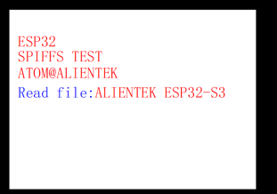

# SPIFFS 实验

## 前言

上一章实验中已经成功驱动 SD 卡，并可对 SD 卡进行读写操作，但读写 SD 卡时都是直接读出或写入二进制数据，这样使用起来显得十分不方便，因此本章将介绍 SPIFFS， SPIFFS是一个用于 SPI NOR flash 设备的嵌入式文件系统，支持磨损均衡以及文件系统一致性检查等功能。
通过本章的学习，读者将学习到 SPIFFS 的基本使用。

## SPIFFS 介绍

SPIFFS 是一个用于嵌入式目标上的 SPI NOR flash 设备的文件系统，并且有如下特点：
<br />1.小目标，没有堆的少量 RAM
<br />2.只有大范围的数据块才能被擦除
<br />3.擦除会将块中的所有位重置为 1
<br />4.写操作将 1 置 0
<br />5.0 只能被擦除成 1
<br />6.磨损均衡
<br />以上几点是 SPIFFS 的特点，下面则说明了 SPIFFS 具体能做些什么：
<br />7.专门为低 ram 使用而设计
<br />8.使用静态大小的 ram 缓冲区，与文件的数量无关
<br />9.类可移植操作系统接口:打开、关闭、读、写、查找、统计等
<br />10.它可以在任何 NOR 闪存上运行，不仅是 SPI 闪存，理论上也可以在微处理器的嵌入式闪存上运行
<br />11.多个 spiffs 配置可以在相同的目标上运行—甚至可以在相同的 SPI 闪存设备上运行
<br />12.实现静态磨损调平（也就是 flash 的寿命维护）
<br />13.内置文件系统一致性检查
<br />14.高度可配置的

## 硬件设计

### 例程功能

1.在 nor flash 指定区域新建 holle.txt 文件，然后对这文件进行读写操作
2. LEDR 闪烁，指示程序正在运行

### 硬件资源

1. LED:
    LEDR-P1_1
2. 正点原子2.4寸LCD屏幕
3. SPIFFS

### 原理图

本章实验使用的 SPIFFS 为软件库，因此没有对应的连接原理图。

## 程序设计

### SPI_SD卡函数解析

SPIFFS 涉及到的文件并不算多，主要调用到了 C 库的函数，关于 C 库的函数我们在这里就不过多介绍了，主要介绍一下调用到 ESP32 IDF 库中的函数。

#### 注册装载 SPIFFS

该函数使用给定的路径前缀将 SPIFFS 注册并装载到 VFS，其函数原型如下所示：

```
esp_err_t esp_vfs_spiffs_register(const esp_vfs_spiffs_conf_t * conf)
```

该函数的形参描述如下表所示：

| 参数   | 描述                               |
| ---- | -------------------------------- |
| conf | 指向 esp_vfs_spiffs_conf_t 配置结构的指针 |

该函数的返回值描述，如下表所示：

| 返回值                   | 描述               |
| --------------------- | ---------------- |
| ESP_OK                | 返回： 0，配置成功       |
| ESP_ERR_NO_MEM        | 如果无法分配对象         |
| ESP_ERR_INVALID_STATE | 如果已安装或分区已加密      |
| ESP_ERR_NOT_FOUND     | 如果找不到 SPIFFS 的分区 |
| ESP_FAIL              | 如果装载或格式化失败       |

#### 获取 SPIFFS 的信息

该函数用于获取 SPIFFS 的信息，其函数原型如下所示：

```
esp_err_t esp_spiffs_info(const char* partition_label,size_t *total_bytes,size_t *used_bytes)
```

该函数的形参描述如下表所示：

| 参数              | 描述              |
| --------------- | --------------- |
| partition_label | 指向分区标签的指针，分区表名称 |
| total_bytes     | 文件系统的大小         |
| used_bytes      | 文件系统中当前使用的字节数   |

该函数的返回值描述，如下表所示：

| 返回值      | 描述         |
| -------- | ---------- |
| ESP_OK   | 返回： 0，配置成功 |
| ESP_FAIL | 如果装载失败     |

#### 注销和卸载 SPIFFS

该函数从 VFS 注销和卸载 SPIFFS，其函数原型如下所示：

```
esp_err_t esp_vfs_spiffs_unregister(const char* partition_label)
```

该函数的形参描述如下表所示：

| 参数              | 描述              |
| --------------- | --------------- |
| partition_label | 指向分区标签的指针，分区表名称 |

该函数的返回值描述，如下表所示：

| 返回值                   | 描述         |
| --------------------- | ---------- |
| ESP_OK                | 返回： 0，配置成功 |
| ESP_ERR_INVALID_STATE | 已注销        |

### SPIFFS 驱动解析

在 IDF 版的 16_spiffs 例程中，作者 在分区表中添加 了 SPIFFS 的内容，分区表内容如下：

```
# ESP-IDF Partition Table
# Name,     Type,     SubType,     Offset,     Size,         Flags
  nvs,      data,     nvs,         0x9000,     0x6000,     ,
  phy_init, data,     phy,         0xf000,     0x1000,     ,
  factory,     app,     factory,     0x10000,     0x1F0000,     ,
  vfs,         data,     fat,         0x200000,     0xA00000,     ,
  storage,     data,     spiffs,     0xc00000,     0x400000,     ,
```

在 IDF 版的 17_spiffs例程中，作者在```17_spiffs\components\BSP```路径下新增了一个 SPIFFS 文件夹，用于存放 my_spiffs.c、 my_spiffs.h 这两个文件。其中， my_spiffs.h 文件负责声明 SPIFFS 相关的函数和变量，而 my_spiffs.c 文件则实现了 SPIFFS 的驱动代码。下面，我们将详细解析这两个文件的实现内容。

#### 1，my_spiffs.c文件

spiffs_init 的设计就比较简单了，我们只需要填充 SPIFFS 结构体的控制句柄， 然后添配置spiffs文件系统的参数并挂载SPIFFS分区即可，如下所示：

```
static const char *spiffs_tag = "spiffs";

/**
 * @brief       spiffs初始化
 * @param       partition_label:分区表的分区名称
 * @param       mount_point:文件系统关联的文件路径前缀
 * @param       max_files:可以同时打开的最大文件数
 * @retval      ESP_OK:成功; ESP_FAIL:失败
 */
esp_err_t spiffs_init(char *partition_label, char *mount_point, size_t max_files)
{
    size_t total = 0;   /* SPIFFS总容量 */
    size_t used = 0;    /* SPIFFS已使用的容量 */

    esp_vfs_spiffs_conf_t spiffs_conf = {           /* 配置spiffs文件系统的参数 */
        .base_path              = mount_point,      /* 磁盘路径,比如"0:","1:" */
        .partition_label        = partition_label,  /* 分区表的分区名称 */
        .max_files              = max_files,        /* 最大可同时打开的文件数 */
        .format_if_mount_failed = true,             /* 挂载失败则格式化文件系统 */
    };

    esp_err_t ret = esp_vfs_spiffs_register(&spiffs_conf);  /* 初始化和挂载SPIFFS分区 */
    if (ret != ESP_OK)
    {
        if (ret == ESP_FAIL)
        {
            ESP_LOGE(spiffs_tag, "Failed to mount or format filesystem");
        }
        else if (ret == ESP_ERR_NOT_FOUND)
        {
            ESP_LOGE(spiffs_tag, "Failed to find SPIFFS partition");
        }
        else
        {
            ESP_LOGE(spiffs_tag, "Failed to initialize SPIFFS (%s)", esp_err_to_name(ret));
        }

        return ESP_FAIL;
    }

    ret = esp_spiffs_info(spiffs_conf.partition_label, &total, &used);  /* 获取SPIFFS的总容量和已使用的容量 */
    if (ret != ESP_OK)
    {
        ESP_LOGI(spiffs_tag, "Failed to get SPIFFS partition information (%s)", esp_err_to_name(ret));
    }
    else
    {
        ESP_LOGI(spiffs_tag, "Partition size: total: %d Bytes, used: %d Bytes", total, used);
    }

    return ret;
}

/**
 * @brief       注销spiffs
 * @param       partition_label:分区表的分区名称
 * @retval      ESP_OK:注销成功; 其他:失败
 */
esp_err_t spiffs_deinit(char *partition_label)
{
    return esp_vfs_spiffs_unregister(partition_label);
}
```

### CMakeLists.txt文件

打开本实验的BSP文件夹下的CMakeList.txt文件，其内容如下所示：

```
set(src_dirs
            MYIIC
            LCD
            MYSPI
            AW9523B
            SPIFFS)

set(include_dirs
            MYIIC
            LCD
            MYSPI
            AW9523B
            SPIFFS)

set(requires
            driver
            esp_lcd
            spiffs)

idf_component_register(SRC_DIRS ${src_dirs} INCLUDE_DIRS ${include_dirs} REQUIRES ${requires})

component_compile_options(-ffast-math -O3 -Wno-error=format=-Wno-format)
```

上述代码中的 SPIFFS 驱动需要由开发者自行添加，以确保 SPIFFS 驱动能够顺利集成到构建系统中。这一步骤是必不可少的，它确保了 SPIFFS 驱动的正确性和可用性，为后续的开发工作提供了坚实的基础。

### 实验应用代码

打开main.c文件，该文件定义了工程入口函数，名为main。该函数代码如下。

```
/**
 * @brief       程序入口
 * @param       无
 * @retval      无
 */
void app_main(void)
{
    esp_err_t ret;

    ret = nvs_flash_init();                                         /* 初始化NVS */

    if (ret == ESP_ERR_NVS_NO_FREE_PAGES || ret == ESP_ERR_NVS_NEW_VERSION_FOUND)
    {
        ESP_ERROR_CHECK(nvs_flash_erase());
        ESP_ERROR_CHECK(nvs_flash_init());
    }

    myiic_init();                                                   /* 初始化IIC */
    my_spi_init();                                                  /* 初始化SPI */
    aw9523b_init();                                                 /* 初始化AW9523B */
    lcd_init();                                                     /* 初始化LCD */
    ESP_ERROR_CHECK(spiffs_init("storage", DEFAULT_MOUNT_POINT, DEFAULT_FD_NUM));    /* 初始化SPIFFS */

    /* 显示实验信息 */
    lcd_show_string(10, 50, 200, 16, 16, "ESP32-S3", RED);
    lcd_show_string(10, 70, 200, 16, 16, "SPIFFS TEST", RED);
    lcd_show_string(10, 90, 200, 16, 16, "ATOM@ALIENTEK", RED);
    lcd_show_string(10, 110, 200, 16, 16, "Read file:", BLUE);

    spiffs_test();                                                  /* SPIFFS测试 */

    while (1)
    {
        LEDR_TOGGLE();
        vTaskDelay(500);
    }
}
```

可以看到，本实验的应用代码中，在一系列初始化之后，配置 spiffs文件系统各个参数，再建立一个名为/spiffs/hello.txt 的只写文件， LEDR 闪烁表明程序正在运行。

## 下载验证

在完成编译和烧录操作后，在指定区域新建 hello.txt 文件，然后对这文件进行读写操作。


