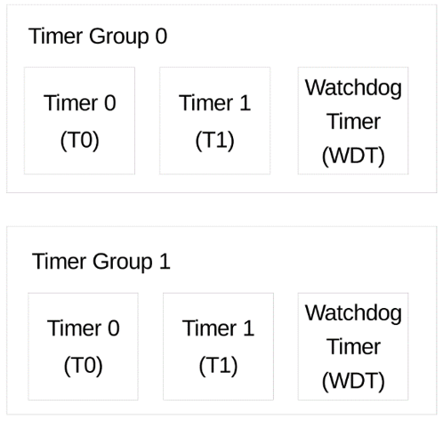
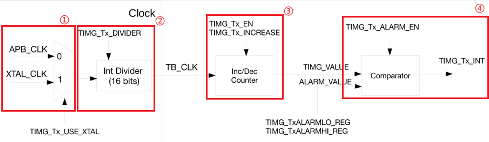

# 通用定时器实验

## 前言

通用定时器可用于准确设定时间间隔、在一定间隔后触发（周期或非周期的）中断或充当硬件时钟。通过本章的学习，开发者将学习到通用定时器的使用。

## 定时器简介

通用定时器可用于精确计时、在特定时间后触发中断（可周期性或非周期性）或作为硬件时钟。ESP32-S3芯片包含两个定时器组，分别是定时器组0和定时器组1（以下简称TIMGn，其中n可以是0或1）。每个定时器组由两个通用定时器（以下简称Tx，其中x可以是0或1）和一个主系统看门狗定时器（MWDT）组成，如下图为TIMG定时器组的简图。



TIMG定时器组定时器的特性总结如下：
<br />（1）54位时间基准计数器：支持递增或递减配置，提供高精度的时间计量。
<br />（2）多种时钟源：可选择PLL_F80M_CLK、XTAL_CLK或RC_FAST_CLK作为时钟源。
<br />（3）16位时钟预分频器：预分频器范围从2到65536，允许用户根据具体要求调整计时精度。
<br />（4）实时计数器读取：可以实时读取时间基准计数器的当前值，方便监控和控制。
<br />（5）暂停与恢复功能：支持在需要时暂停和恢复计数器的计数，适应动态场景需求。
<br />（6）可编程报警生成：能够根据计时值生成可编程的报警，提高应用的灵活性。
<br />（7）定时器值重载：支持在报警时自动重载或通过软件控制进行即时重载。 
<br />（8）时钟频率计算：根据晶体时钟测得的频率，可计算并生成TIMG0_CALI_CLK。
<br />（9）电平中断生成：能够生成电平中断，便于与其他系统组件进行有效协作。
<br />（10）支持多任务和事件：可同时支持多个ETM任务和事件，提升系统的并行处理能力。

### 定时器组的结构和原理

我们先来学习通用定时器架构，通过学习通用定时器框图会有一个很好的整体掌握，同时对之后的编程也会有一个清晰的思路。


（1）时钟选择器
<br />每个定时器可通过配置寄存器TIMG_TxCONFIG_REG的TIMG_Tx_USE_XTAL字段，选择APB时钟(APB_CLK)或外部时钟(XTAL_CLK)作为时钟源。
<br />（2）16位预分频器
<br />时钟源经过16位预分频器分频，产生时基计数器使用的时基计数器时钟(TB_CLK)。16位预分频器的分频系数可通过TIMG_Tx_DIVIDER字段配置，选取从2到65536之间的任意值。注意，将TIMG_Tx_DIVIDER置0后，分频系数会变为65536。TIMG_Tx_DIVIDER置1时，实际分频系数为2，计数器的值为实际时间的一半。
需要注意的是：定时器必须关闭（即TIMG_Tx_EN必须清零），才能更改16位预分频器。在定时器使能时更改16位预分频器会造成不可预知的结果。
<br />（3）54位时基计数器
<br />54位时基计数器基于TB_CLK，可通过TIMG_Tx_INCREASE字段配置为递增或递减。时基计数器可通过置位或清零TIMG_Tx_EN字段使能或关闭。使能时，时基计数器的值会在每个TB_CLK周期递增或递减。关闭时，时基计数器暂停计数。注意，TIMG_Tx_EN置位后，TIMG_Tx_INCREASE字段还可以更改，时基计数器可立即改变计数方向。时基计数器54位定时器的当前值必须被锁入两个寄存器，才能被CPU读取（因为CPU为32位）。向TIMG_TxUPDATE_REG写入任意值时，54位定时器的值开始被锁入寄存器TIMG_TxLO_REG和TIMG_TxHI_REG，两个寄存器分别锁存低32位和高22位。当TIMG_TxUPDATE_REG被硬件清零，表明锁存操作已经完成，可以从这两个寄存器中读取当前计数值。在TIMG_TxUPDATE_REG被写入新值之前，保持寄存器TIMG_TxLO_REG和TIMG_TxHI_REG的值不变，以供32位的CPU读值。
<br />（4）比较器
<br />定时器可配置为在当前值与报警值相同时触发报警。报警会产生中断，（可选择）让定时器的当前值自动重新加载。54位报警值可在TIMG_TxALARMLO_REG和TIMG_TxALARMHI_REG配置，两者分别代表报警值的低32位和高22位。但是，只有置位TIMG_Tx_ALARM_EN字段使能报警功能后，配置的报警值才会生效。为解决报警使能“过晚”（即报警使能时，定时器的值已过报警值），可逆计数器向上计数时，若定时器的当前值高于报警值（在一定范围内），或可逆计数器向下计数时，定时器的当前值低于报警值（在一定范围内），硬件都会立即触发报警。

## 硬件设计

### 例程功能

实现现象：程序运行后配置通用定时器，在一定的周期内触发报警事件。

### 硬件资源

1. 通用定时器

### 原理图

本章实验使用的通用定时器为ESP32-S3的片上资源，因此没有对应的连接原理图。

## 程序设计

### TIMG函数解析

ESP-IDF提供了一套API来配置通用定时器。接下来，作者将介绍一些常用的定时器函数，这些函数的描述及其作用如下：

#### 配置通用定时器

该函数用于配置通用定时器，其函数原型如下所示：

```esp_err_t gptimer_new_timer(const gptimer_config_t *config, gptimer_handle_t *ret_timer)
```

该函数的形参描述，如下表所示：

参数  	         | 描述	         
-----------------|---------------------
  config  	 | 指向配置通用定时器的指针
  ret_timer    | 通用定时器句柄类型。如果没有特定需求一般设置为NULL

【返回值】

返回值： ESP_OK 表示创建成功。其他表示创建失败。

#### 计数值以及定时器周期

该函数用于使能定时器的指定中断，其函数原型如下所示：

```esp_err_t gptimer_set_raw_count(gptimer_handle_t timer,unsigned long long value)```

该函数的形参描述，如下表所示：

参数  	         | 描述	         
-----------------|---------------------
  timer  	 | 计时器句柄由gptimer_new_timer创建
  value    | 要设置的计数值

【返回值】

返回值： ESP_OK 表示开启定时器成功。其他表示开启失败。

#### 注册用户回调函数

该函数用于注册用户回调函数，其结构体原型如下所示：

```esp_err_t gptimer_register_event_callbacks(gptimer_handle_t timer, const gptimer_event_callbacks_t *cbs, void *user_data)```

该函数的形参描述，如下表所示：

参数  	         | 描述	         
-----------------|---------------------
  timer  	 | 计时器句柄由gptimer_new_timer创建
  cbs    | 需要绑定的回调函数
  user_data    | 用户的数据，将直接传递给回调函数

【返回值】

返回值： ESP_OK 表示开启定时器成功。其他表示开启失败。

当定时器启动后，可动态产生特定事件（如“警报事件”）。如需在事件发生时调用某些函数，便可通过该函数将函数挂载至中断服务例程(ISR)。

#### 定时器报警，设置报警动作

该函数用于配置通用定时器报事件警，其函数原型如下所示：

```esp_err_t gptimer_set_alarm_action(gptimer_handle_t timer,const gptimer_alarm_config_t *config)```

该函数的形参描述，如下表所示：

参数  	         | 描述	         
-----------------|---------------------
  timer  	 | 计时器句柄由gptimer_new_timer创建
  config    | 指向通用定时器报警配置的指针类型。报警配置，尤其是将配置设置为NULL意味着禁用报警功能

【返回值】

返回值： ESP_OK 表示开启定时器成功。其他表示开启失败。

该函数使用gptimer_alarm_config_t类型的结构体变量传入gptimer外设的报警配置参数，该结构体的定义如下所示：
```
/**
 * @brief 通用定时器报警配置
 */
typedef struct {
    uint64_t alarm_count;                  /* 报警目标计数值 */
    uint64_t reload_count;                 /* 报警重新加载计数值 */
    struct {
        uint32_t auto_reload_on_alarm: 1;/* 报警事件发生后立即通过硬件重新加载计数值 */
    } flags;								/* 报警配置标志 */
} gptimer_alarm_config_t;
```

#### 使能定时器

该函数用于配置通用定时器报事件警，其函数原型如下所示：

```esp_err_t gptimer_enable(gptimer_handle_t timer)```

该函数的形参描述，如下表所示：

参数  	         | 描述	         
-----------------|---------------------
  timer  	 | 计时器句柄由gptimer_new_timer创建

【返回值】

返回值： ESP_OK 表示开启定时器成功。其他表示开启失败。

此函数将把定时器驱动程序的状态从初始化切换为使能状态，如果 gptimer_register_event_callbacks() 已经延迟安装回调服务函数，此函数将使能回调服务函数。

#### 启动定时器

该函数用于配置通用定时器报事件警，其函数原型如下所示：

```esp_err_t gptimer_start(gptimer_handle_t timer)```

该函数的形参描述，如下表所示：

参数  	         | 描述	         
-----------------|---------------------
  timer  	 | 计时器句柄由gptimer_new_timer创建

【返回值】

返回值： ESP_OK 表示开启定时器成功。其他表示开启失败。

我们使能了定时器之后，并没有代表定时器已经开始运行，还需要通过调用 gptimer_start() 函数使内部计数器开始工作。

### TIMG驱动解析

在IDF版的06_gp_timer例程中，作者在```06_gp_timer \components\BSP```路径下新增了一个GPTIM文件夹，用于存放gptim.c和gptim.h这两个文件。其中，gptim.h文件负责声明GPTIM相关的函数和变量，而gptim.c文件则实现了GPTIM的驱动代码。下面，我们将详细解析这两个文件的实现内容。

#### 1,gptim.h文件

```
/* 定时器配置结构体 */
typedef struct
{
    timer_src_clk_t clk_src;            /* 时钟源选择（GPTIMER_CLK_SRC_XTAL\GPTIMER_CLK_SRC_PLL_F80M(默认)\GPTIMER_CLK_SRC_RC_FAST） */
    int timer_group;                    /* 定时器组（TIMER_GROUP_0~TIMER_GROUP_1） */
    int timer_idx;                      /* 定时器组的那个定时器（TIMER_0~TIMER_1） */
    uint64_t timing_time;               /* 定时时间 */
    uint64_t alarm_value;               /* 警报值 */
    timer_autoreload_t auto_reload;     /* 启动自动装载 */
    uint64_t timer_count_value;         /* 计数器当前值 */
} timg_config_t;

/* 函数声明 */
void timg_init(timg_config_t *timgr_config);
```

#### 2,gptim.c文件

```
/* 选择定时器回调方式 */
#define SELECT_CALLBACK     1

#if SELECT_CALLBACK == 0
/**
 * @brief       定时器组回调函数（不常用）
 * @param       args: 传入参数
 * @retval      默认返回1
 */
void not_timer_group_isr_callback(void *args) 
{
    timg_config_t *user_data = (timg_config_t *) args;
    /* 获取定时器分组0中的哪个定时器产生中断*/
    uint32_t timer_intr = timer_group_get_intr_status_in_isr(user_data->timer_group); 
    /* 获取中断状态 */
    if (timer_intr & TIMER_INTR_T0) 
    {
        /* 清除中断状态 */
        timer_group_clr_intr_status_in_isr(user_data->timer_group,user_data->timer_idx);

        /* 用户实现代码 */ 
        /* 存储当前计数值变量清零 */
        user_data->timer_count_value = 0;
        /* 获取当前计数值 */
        user_data->timer_count_value = timer_group_get_counter_value_in_isr(user_data->timer_group, user_data->timer_idx);

        /* 如果没有开启重装载，那么想要周期警报，必须设置警报值为t0 += t0 */
        if (!user_data->auto_reload)
        {
            user_data->alarm_value += user_data->timing_time;
            /* 设置警报值（ISR类型函数） */
            timer_group_set_alarm_value_in_isr(user_data->timer_group, user_data->timer_idx, user_data->alarm_value);
        }

        /* 重新使能定时器中断 */ 
        timer_group_enable_alarm_in_isr(user_data->timer_group, user_data->timer_idx);
    }
    else if (timer_intr & TIMER_INTR_T1)
    {
        /* 定时器1中断 */
    }
    else if (timer_intr & TIMER_INTR_WDT)
    {
        /* 看门狗定时器中断 */
    }
    else
    {

    }
}
#else
/**
 * @brief       定时器组回调函数（常用）
 * @param       args: 传入参数
 * @retval      默认返回1
 */
static bool IRAM_ATTR timer_group_isr_callback(void *args)
{
    timg_config_t *user_data = (timg_config_t *) args;
    /* 存储当前计数值变量清零 */
    user_data->timer_count_value = 0;
    /* 获取当前计数值 */
    user_data->timer_count_value = timer_group_get_counter_value_in_isr(user_data->timer_group, user_data->timer_idx);
	
    /* 如果没有开启重装载，那么想要周期警报，必须设置警报值为t0 += t0 */
    if (!user_data->auto_reload)
    {
        user_data->alarm_value += user_data->timing_time;
        /* 设置警报值（ISR类型函数） */
        timer_group_set_alarm_value_in_isr(user_data->timer_group, user_data->timer_idx, user_data->alarm_value);
    }

    return 1;
}
#endif

/**
 * @brief       初始化定时器组
 * @param       timg_config: 定时器配置结构体
 * @retval      无
 */
void timg_init(timg_config_t *timg_config)
{
    uint32_t clk_src_hz = 0;
    timer_config_t timer_config = {0};
    /* 获取时钟频率数值 */
    ESP_ERROR_CHECK(esp_clk_tree_src_get_freq_hz((soc_module_clk_t)timg_config->clk_src, ESP_CLK_TREE_SRC_FREQ_PRECISION_CACHED, &clk_src_hz));
    
    timer_config.alarm_en = TIMER_ALARM_EN;                   /* 警报使能 */
    timer_config.auto_reload = timg_config->auto_reload;      /* 自动重装载值 */
    timer_config.clk_src = timg_config->clk_src;              /* 设置时钟源 */
    timer_config.counter_dir = TIMER_COUNT_UP;                /* 向上计数 */
    timer_config.counter_en = TIMER_PAUSE;                    /* 停止定时器 */
    timer_config.divider = clk_src_hz / 1000000;              /* 预分频(1us) */
    
    /* 选择那个定时器组，组内那个定时器，并配置定时器 */
    ESP_ERROR_CHECK(timer_init(timg_config->timer_group, timg_config->timer_idx, &timer_config));
    /* 设置当前计数值 */
    ESP_ERROR_CHECK(timer_set_counter_value(timg_config->timer_group, timg_config->timer_idx, 0));
    /* 设置警报值 */
    ESP_ERROR_CHECK(timer_set_alarm_value(timg_config->timer_group, timg_config->timer_idx, timg_config->alarm_value));
    /* 使能定时器中断 */
    ESP_ERROR_CHECK(timer_enable_intr(timg_config->timer_group, timg_config->timer_idx));
    /* 添加定时器回调函数 */
#if SELECT_CALLBACK == 0
    ESP_ERROR_CHECK(timer_isr_register(timg_config->timer_group, timg_config->timer_idx, not_timer_group_isr_callback, timg_config, 0,NULL));
#else
    ESP_ERROR_CHECK(timer_isr_callback_add(timg_config->timer_group, timg_config->timer_idx, timer_group_isr_callback, timg_config, 0));
#endif
    /* 开启定时器 */
    ESP_ERROR_CHECK(timer_start(timg_config->timer_group, timg_config->timer_idx));
}
```

对于大多数通用定时器使用场景而言，应在启动定时器之前设置警报动作，但不包括简单的挂钟场景，该场景仅需自由运行的定时器。设置警报动作，需要根据如何使用警报事件来配置gptimer_alarm_config_t的不同参数：
<br />①：gptimer_alarm_config_t::alarm_count设置触发警报事件的目标计数值。设置警报值时还需考虑计数方向。尤其是当gptimer_alarm_config_t::auto_reload_on_alarm为true时，gptimer_alarm_config_t::alarm_count和gptimer_alarm_config_t::reload_count不能设置为相同的值，因为警报值和重载值相同时没有意义。
<br />②：gptimer_alarm_config_t::reload_count代表警报事件发生时要重载的计数值。此配置仅在gptimer_alarm_config_t::auto_reload_on_alarm设置为true时生效。
<br />③：gptimer_alarm_config_t::auto_reload_on_alarm标志设置是否使能自动重载功能。如果使能，硬件定时器将在警报事件发生时立即将gptimer_alarm_config_t::reload_count的值重载到计数器中。

要使警报配置生效，需要调用gptimer_set_alarm_action()。特别是当gptimer_alarm_config_t设置为NULL时，报警功能将被禁用。

定时器启动后，可动态产生特定事件（如“警报事件”）。如需在事件发生时调用某些函数，请通过gptimer_register_event_callbacks()将函数挂载到中断服务例程(ISR)。gptimer_event_callbacks_t中列出了所有支持的事件回调函数：gptimer_event_callbacks_t设置警报事件的回调函数。由于此函数在ISR上下文中调用，必须确保该函数不会试图阻塞（例如，确保仅从函数内调用具有ISR后缀的FreeRTOSAPI）。函数原型在gptimer_alarm_cb_t中有所声明。也可以通过参数user_data，将自己的上下文保存到gptimer_register_event_callbacks()中。用户数据将直接传递给回调函数。
此功能将为定时器延迟安装中断服务，但不使能中断服务。所以，请在gptimer_enable()之前调用这一函数，否则将返回ESP_ERR_INVALID_STATE错误。


### CMakeLists.txt文件

打开本实验的BSP文件夹下的CMakeList.txt文件，其内容如下所示：
```
set(src_dirs
            TIMG)

set(include_dirs
            TIMG)

set(requires
            driver)

idf_component_register(SRC_DIRS ${src_dirs} INCLUDE_DIRS ${include_dirs} REQUIRES ${requires})

component_compile_options(-ffast-math -O3 -Wno-error=format=-Wno-format)
```
上述代码中的 GPTIM 驱动需要由开发者自行添加，以确保 GPTIM 驱动能够顺利集成到构建系统中。这一步骤是必不可少的，它确保了 GPTIM 驱动的正确性和可用性，为后续的开发工作提供了坚实的基础。

###  实验应用代码

打开main/main.c文件，该文件定义了工程入口函数，名为app_main。该函数代码如下。
```
/**
 * @brief       程序入口
 * @param       无
 * @retval      无
 */
void app_main(void)
{
    esp_err_t ret;
    timg_config_t *timgr_config = malloc(sizeof(timg_config_t));

    ret = nvs_flash_init();     /* 初始化NVS */
    if (ret == ESP_ERR_NVS_NO_FREE_PAGES || ret == ESP_ERR_NVS_NEW_VERSION_FOUND)
    {
        ESP_ERROR_CHECK(nvs_flash_erase());
        ESP_ERROR_CHECK(nvs_flash_init());
    }

    led_init();                 /* 初始化LED */

    timgr_config->timer_count_value = 0;                            /* 记录计数值 */
    timgr_config->clk_src           = GPTIMER_CLK_SRC_DEFAULT;      /* 时钟源选择（GPTIMER_CLK_SRC_XTAL\GPTIMER_CLK_SRC_PLL_F80M(默认)\GPTIMER_CLK_SRC_RC_FAST） */
    timgr_config->timer_group       = TIMER_GROUP_0;                /* 定时器组0（TIMER_GROUP_0~TIMER_GROUP_1） */
    timgr_config->timer_idx         = TIMER_0;                      /* 定时器组0的定时器0（TIMER_0~TIMER_1） */
    timgr_config->timing_time       = 1 * 1000000;                  /* 定时时间 */
    timgr_config->alarm_value       = timgr_config->timing_time;    /* 设置警报值(us秒为单位)等于定时时间 */
    timgr_config->auto_reload       = TIMER_ALARM_EN;               /* 自动重装载 */
    timg_init(timgr_config);                                        /* 定时器初始化 */

    while(1)
    {
        if (timgr_config->timer_count_value != 0)
        {
            ESP_LOGI("Timer:", "Timer auto reloaded, count value in ISR: %llu", timgr_config->timer_count_value);
            timgr_config->timer_count_value = 0;    /* 清零 */
        }

        vTaskDelay(pdMS_TO_TICKS(10));              /* 延时10ms */
    }
}
```
从上面的代码中可以看到，通用定时器的计数值为100，定时器周期设置为1000000微秒并通过创建消息队列的方式引入一个定时器事件。

## 下载验证

在完成编译和烧录操作后，在一定周期内串口打印输出定时器报警事件，报警值以及计数值等信息。


