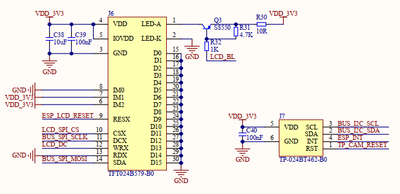

# 触摸实验

## 前言

本章，作者将介绍如何使用ESP32-S3来驱动触摸屏，我们通过外接带触摸屏的LCD屏幕，
来实现触摸屏控制。在本章中，我们将向大家介绍 ESP32-S3 控制正点原子 LCD 屏幕，实现触
摸屏驱动（电容触摸），最终实现一个手写板的功能。

### 电容式触摸屏

现在几乎所有智能手机，包括平板电脑都是采用电容屏作为触摸屏，电容屏是利用人体感应进行触点检测控制，不需要直接接触或只需要轻微接触，通过检测感应电流来定位触摸坐标。下面简单介绍下电容式触摸屏的原理。
电容式触摸屏主要分为两种：
<br />1、表面电容式电容触摸屏。
表面电容式触摸屏技术是利用 ITO(铟锡氧化物，是一种透明的导电材料)导电膜，通过电场感应方式感测屏幕表面的触摸行为进行。但是表面电容式触摸屏有一些局限性，它只能识别一
个手指或者一次触摸。
<br />2、投射式电容触摸屏。
投射电容式触摸屏是传感器利用触摸屏电极发射出静电场线。一般用于投射电容传感技术
的电容类型有两种：自我电容和交互电容。

### 触摸控制原理

电容触摸屏一般都需要一个驱动 IC 来检测电容触摸，正点原子的 2.4 寸电容触摸屏使用的是 IIC 接口输出触摸数据的触摸芯片， 采用的是 CHSC5432 作为驱动 IC。不同型号感应通道和驱动通道数量都不一样，详看数据手册，但是这些驱动 IC 驱动方式都类似，这里我们以CHSC5432 为例给大家做介绍，其他的大家参考着学习即可。CHSC5432 与 MCU 通过 4 根线连接： SDA、 SCL、 RST 和 INT。 CHSC5432 的 IIC 通信读写过程中设备地址分别为： 7 位地址为 0x2E。向左移一位后写通信地址为 0x5C，读通信地址为0x5D。 不同于传统 IC， CHSC5432 使用直接地址模式， 进行复位后， 从 0x20000080 这一地址处读取触摸 IC 的 ID。 CHSC5432 相关讲解到这里，更详细的资料，请参考：Application Note for CTPM_CHSC5xxx.pdf 这个文档。CHSC5432 只需要经过简单的初始化就可以正常使用了，初始化流程：复位触摸屏→从0x20000080 地址读取 ID→打印触摸芯片 ID。此时 CHSC5432 即可正常使用了。然后，我们通过 0x2000002C 这一地址不断查询触摸事件，判断是否有有效触点，如果有，则读取坐标数据，得到触点坐标。屏 幕 触 摸 相 关 内 容 ， 可 参 考 资 料 里 提 供 的 《DS_CHSC5432_v1.1.0.pdf》 和 《Application Note for CTPM_CHSC5xxx.pdf》，在这两个手册中，已经详细说明了触摸 IC 的工作原理及相关参数信息。温馨提示：我们可通过 IIC 协议读取显示屏的触摸点。

## 硬件设计

### 例程功能

本章实验功能简介：经过一系列的初始化之后，进入电容触摸屏测试程序，用户可在画板上绘画字符、线条等，在测试界面的右上角会有一个清空的操作区域（RST），点击这个地方就会将输入全部清除，恢复白板状态。

### 硬件资源

1. LED 灯
2. 正点原子2.4寸LCD屏幕
3. CHSC5432

### 原理图

屏幕接口、触摸接口与 ESP32-S3 的连接关系，如下图所示：


## 程序设计

### 触摸屏函数解析

这一章节除了涉及到 GPIO、 IIC 的 API 函数，便没有再涉及到其他 API 函数。因此，有关GPIO 和 IIC 的 API 函数介绍，请读者回顾此前章节的内容。接下来，笔者将直接介绍触摸屏的驱动代码。

### 触摸屏驱动解析

在 IDF 版例程 14_touch 中，作者在 ```14_touch\components\BSP``` 路径下新增了一个 TOUCH 文件夹，分别用于存放 chsc5xxx.c、 chsc5xxx.h 和 touch.c 以及 touch.h 这四个文件。其中，chsc5xxx.h 和 touch.h 文件负责声明 TOUCH 相关的函数和变量，而 chsc5xxx.c 和 touch.c 文件则实现了 TOUCH 的驱动代码。下面，我们将详细解析这四个文件的实现内容。

#### 1， chsc5xxx.h 和 touch.h 文件

我们希望能方便地调用不同触摸芯片的坐标扫描函数，这里我们定义了一个函数指针(*scan)(uint8_t)，我们只要把相应的芯片的初始化函数指针赋值给它，就可以使用这个通用接口方便地调用不同芯片的描述函数得到相应的触点坐标参数。同时，为了方便管理触摸，我们定义一个用于管理触摸信息的结构体类型。在前面的理论介绍时我们已经提到过，触摸芯片正常工作后，能在触摸点采集到本次触摸对应的 AD 信息，编程时需要用到，所以可以在 chsc5xxx.h和 touch.h 中定义下面的结构体：

```
/* 触摸屏复位 */
#define CT_RST(x)       do { x ?                                  \
                            aw9523b_pin_write(TP_CAM_RESET, 1):   \
                            aw9523b_pin_write(TP_CAM_RESET, 0);   \
                        } while(0)

#define CHSC5432_ADDR                        0x2E        /* 7位地址->请看《Application Note for CTPM_CHSC5xxx》 */

/* CHSC5XXX 寄存器  */
#define CHSC5XXX_CTRL_REG                    0x2000002C  /* 触摸事件 */
#define CHSC5XXX_PID_REG                     0x20000080  /* 读取ID */

以下是touch.h文件：

#define TP_PRES_DOWN    0x8000  /* 触屏被按下 */
#define TP_CATH_PRES    0x4000  /* 有按键按下了 */
#define CT_MAX_TOUCH    10      /* 电容屏支持的点数,固定为5点 */

/* 触摸屏控制器 */
typedef struct
{
    esp_err_t (*init)(void);    /* 初始化触摸屏控制器 */
    uint8_t (*scan)(uint8_t);   /* 扫描触摸屏.0,屏幕扫描;1,物理坐标; */
    uint16_t x[CT_MAX_TOUCH];   /* 当前坐标 */
    uint16_t y[CT_MAX_TOUCH];   /* 电容屏有最多10组坐标,电阻屏则用x[0],y[0]代表:此次扫描时,触屏的坐标,用
                                 * x[9],y[9]存储第一次按下时的坐标.
                                 */

    uint16_t sta;               /* 笔的状态
                                 * b15:按下1/松开0;
                                 * b14:0,没有按键按下;1,有按键按下.
                                 * b13~b10:保留
                                 * b9~b0:电容触摸屏按下的点数(0,表示未按下,1表示按下)
                                 */
    /* 新增的参数,当触摸屏的左右上下完全颠倒时需要用到.
     * b0:0, 竖屏(适合左右为X坐标,上下为Y坐标的TP)
     *    1, 横屏(适合左右为Y坐标,上下为X坐标的TP)
     * b1~6: 保留.
     * b7:0, 电阻屏
     *    1, 电容屏
     */
    uint8_t touchtype;
} _m_tp_dev;

extern _m_tp_dev tp_dev;        /* 触屏控制器在touch.c里面定义 */
```

在上述代码中，用于保存一些触摸屏重要参数信息，比如 IIC 命令和 CHSC5XXX 部分寄存器地址的宏定义以及触摸屏校准参数等。

#### 2，chsc5xxx.c 和 touch.c 文件

电容触摸芯片我们使用的是 IIC 接口的触摸 IC。 IIC 接口部分代码，我们可以参考 myiic.c 和myiic.h 的代码。chscxxx_init 的实现也比较简单，我们调用其 IIC 初始化接口即可。这里不重复介绍。这里我们介绍一下触摸屏的扫描函数：我们通过 IIC 来读取触摸点的物理坐标，参数已经保存在 chsc5xxx 芯片的内部了，我们只需要按手册推荐的 IIC 时序把对应的 XY 坐标读出来，转换成 LCD 的像素坐标即可。 chsc5xxx 系列可以通过中断或轮询方式读限，我们使用的是轮询方式。 这样，chsc5xxx_scan()函数的实现如下：

```
/**
 * @brief       扫描触摸屏(采用查询方式)
 * @param       mode : 电容屏未用到次参数, 为了兼容电阻屏
 * @retval      当前触屏状态
 *   @arg       0, 触屏无触摸; 
 *   @arg       1, 触屏有触摸;
 */
uint8_t chsc5xxx_scan(uint8_t mode)
{
    uint8_t buf[28];
    uint8_t i = 0;
    uint8_t res = 0;
    uint16_t temp;
    uint16_t tempsta;
    static uint8_t t = 0;                            /* 控制查询间隔,从而降低CPU占用率 */
    t++;

    if ((t % 5) == 0 || t < 5)                       /* 空闲时,每进入10次CTP_Scan函数才检测1次,从而节省CPU使用率 */
    {
        chsc5xxx_rd_reg(CHSC5XXX_CTRL_REG, buf, 28); /* 官方建议一次读取28字节，然后在分析触摸坐标 */
        mode = 0x80 + buf[1];
        //ESP_LOGI(touch_name, "mode:%d", mode);

        /* 判断是否有触摸按下 */
        if ((mode & 0XF) && ((mode & 0XF) <= g_chsc_tnum))
        {
            temp = 0XFFFF << (mode & 0XF);
            tempsta = tp_dev.sta;
            tp_dev.sta = (~temp) | TP_PRES_DOWN | TP_CATH_PRES;
            tp_dev.x[g_chsc_tnum - 1] = tp_dev.x[0];
            tp_dev.y[g_chsc_tnum - 1] = tp_dev.y[0];
            /* 获取触摸坐标 */
            for (i = 0; i < g_chsc_tnum; i++)
            {
                if (tp_dev.sta & (1 << i))
                {
                    if (tp_dev.touchtype & 0X01)                        /* 横屏 */
                    {
                        tp_dev.x[i] = ((uint16_t)(buf[5 + i * 5] >> 4 ) << 8) + buf[3 + i * 5];
                        tp_dev.y[i] = lcddev.height - (((uint16_t)(buf[5 + i * 5] & 0x0F) << 8) + buf[2 + i * 5]);
                    }
                    else                                                /* 竖屏 */
                    {
                        tp_dev.x[i] = ((uint16_t)(buf[5 + i * 5] & 0x0F) << 8) + buf[2 + i * 5];
                        tp_dev.y[i] = ((uint16_t)((buf[5 + i * 5] & 0xF0) >> 4 ) << 8) + buf[3 + i * 5];
                    }

                    // ESP_LOGI(touch_name, "x[%d]:%d, y[%d]:%d", tp_dev.x[i], i, tp_dev.y[i]);
                }
            }
            res = 1;
            /* 触摸坐标超出屏幕范围 */
            if (tp_dev.x[0] > lcddev.width || tp_dev.y[0] > lcddev.height)
            {
                /* 触摸数量是否大于1~5 */
                if ((mode & 0XF) > 1)
                {
                    tp_dev.x[0] = tp_dev.x[1];
                    tp_dev.y[0] = tp_dev.y[1];
                    t = 0;
                }
                else    /* 超出范围且未检测到触摸点 */
                {
                    tp_dev.x[0] = tp_dev.x[g_chsc_tnum - 1];
                    tp_dev.y[0] = tp_dev.y[g_chsc_tnum - 1];
                    mode = 0X80;
                    tp_dev.sta = tempsta;
                }
            }
            else 
            {
                t = 0;
            }
        }
    }

    //printf("x[0]:%d,y[0]:%d\r\n", tp_dev.x[0], tp_dev.y[0]);

    /* 超出触摸范围 */
    if ((mode & 0X8F) == 0X80)
    {
        if (tp_dev.sta & TP_PRES_DOWN)
        {
            tp_dev.sta &= ~TP_PRES_DOWN;
        }
        else
        {
            tp_dev.x[0] = 0xffff;
            tp_dev.y[0] = 0xffff;
            tp_dev.sta &= 0XE000;
        }
    }

    if (t > 240)
    {
        t = 10;
    }

    return res;
}
```

接下来是触摸初始化的核心程序，我们根据前面介绍的知识点，可以知道触摸的参数与屏幕大小和使用的触摸芯片有关，我们的 2.4 寸屏使用的是基合半导体的 CHSCxxx 系列触摸屏驱动 IC，这是一个 IIC 接口的驱动芯片，我们要编写 chscxxx系列芯片的初始化程序，并编写一个坐标扫描程序，这里我们先预留这两个接口分别为 chscxxx_init()和 chscxxx_scan()，在 chscxxx.c文件中再专门实现这两个驱动，标记使用的为电容屏。

```
/**
 * @brief       触摸屏初始化
 * @param       无
 * @retval      0,触摸屏初始化成功
 *              1,触摸屏有问题
 */
esp_err_t tp_init(void)
{
    tp_dev.touchtype = 0;                       /* 默认设置(电阻屏 & 竖屏) */
    tp_dev.touchtype |= lcddev.dir & 0X01;     /* 根据LCD判定是横屏还是竖屏 */

    chsc5xxx_init();
    tp_dev.scan = chsc5xxx_scan;                /* 扫描函数指向CHSC5xxx触摸屏扫描 */
    tp_dev.touchtype |= 0X80;
    return ESP_OK;
}
```

正点原子的电容屏在出厂时已经由厂家较对好参数了，通过上面的触摸初始化后，我们就可以读取相关的触点信息用于显示编程了。

### CMakeLists.txt文件

打开本实验的BSP文件夹下的CMakeList.txt文件，其内容如下所示：

```
set(src_dirs
            MYIIC
            LCD
            MYSPI
            TOUCH
            AW9523B)

set(include_dirs
            MYIIC
            LCD
            MYSPI
            TOUCH
            AW9523B)

set(requires
            driver
            esp_lcd)

idf_component_register(SRC_DIRS ${src_dirs} INCLUDE_DIRS ${include_dirs} REQUIRES ${requires})

component_compile_options(-ffast-math -O3 -Wno-error=format=-Wno-format)
```

上述代码中的 TOUCH 驱动需要由开发者自行添加，以确保 TOUCH 驱动能够顺利集成到构建系统中。这一步骤是必不可少的，它确保了 TOUCH 驱动的正确性和可用性，为后续的开发工作提供了坚实的基础。

### 实验应用代码

打开main.c文件，该文件定义了工程入口函数，名为main。该函数代码如下。

```
/**
 * @brief       程序入口
 * @param       无
 * @retval      无
 */
void app_main(void)
{
    esp_err_t ret;

    ret = nvs_flash_init();     /* 初始化NVS */

    if (ret == ESP_ERR_NVS_NO_FREE_PAGES || ret == ESP_ERR_NVS_NEW_VERSION_FOUND)
    {
        ESP_ERROR_CHECK(nvs_flash_erase());
        ESP_ERROR_CHECK(nvs_flash_init());
    }

    my_spi_init();              /* 初始化SPI */
    myiic_init();               /* 初始化IIC */
    aw9523b_init();             /* 初始化AW9523B */
    lcd_init();                 /* 初始化LCD */
    tp_dev.init();              /* 初始化触摸屏 */
    load_draw_dialog();
    ctp_test();
}
```

以上就是 main 函数的主要组成部分。在 main 函数中，我们首先初始化了 NVS 存储器，然后依次调用了 SPI、 IIC、 AW9523B、 LCD 和触摸屏的初始化函数。最后，我们调用了 load_draw_dialog() 函数加载绘图界面，并调用 ctp_test() 函数进入触摸屏测试程序。

## 下载验证

将程序下载到开发板后，实验内容如下图所示：


