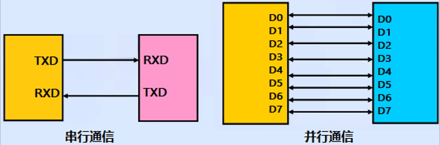
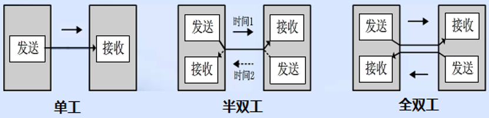
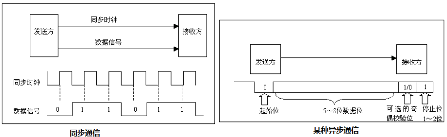
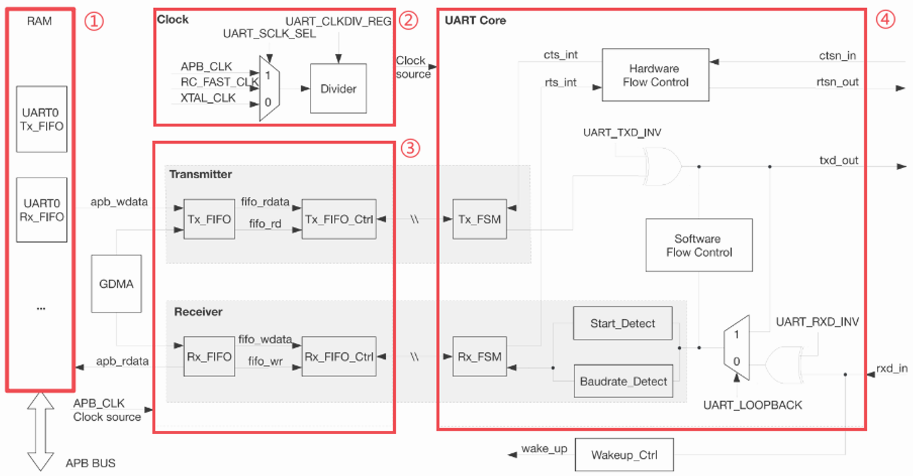
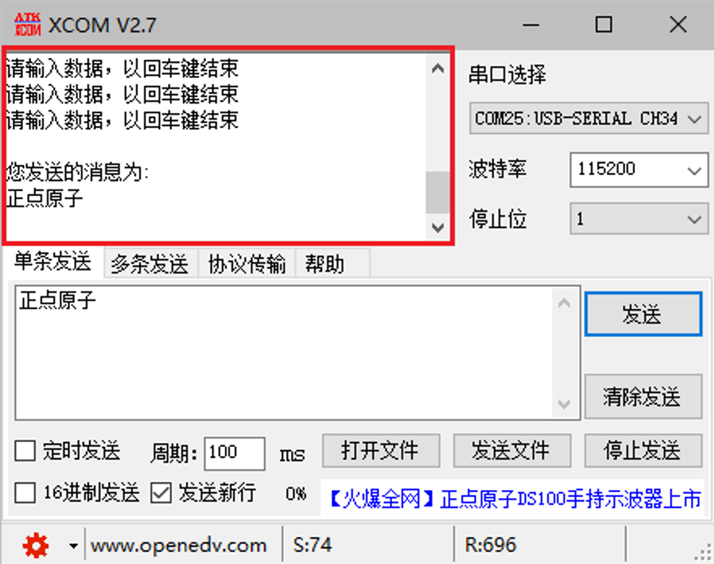

# 串口实验

## 前言

本章将介绍使用串口进行数据的收发操作，具体实现 ESP32-S3 与上位机软件的数据通信，ESP32-S3 将接受自上位机软件的数据原原本本地发送回给上位机软件。通过本章的学习，开发者将学习到 UART 和 GPIO 引脚的使用。

## 串口简介

学习串口前，我们先来了解一下数据通信的一些基础概念。

### 数据通信的基础概念

在单片机的应用中，数据通信是必不可少的一部分，比如：单片机和上位机、单片机和外围器件之间，它们都有数据通信的需求。由于设备之间的电气特性、传输速率、可靠性要求各不相同，于是就有了各种通信类型、通信协议，我们最常的有：USART、IIC、SPI、CAN、USB等。

#### 1，数据通信方式

按数据通信方式分类，可分为串行通信和并行通信两种。串行和并行的对比如下图所示：



串行通信的基本特征是数据逐位顺序依次传输，优点是传输线少、布线成本低、灵活度高等优点，一般用于近距离人机交互，特殊处理后也可以用于远距离，缺点就是传输速率低。
而并行通信是数据各位可以通过多条线同时传输，优点是传输速率高，缺点就是布线成本高，抗干扰能力差因而适用于短距离、高速率的通信。

#### 2，数据传输方向
根据数据传输方向，通信又可分为全双工、半双工和单工通信。全双工、半双工和单工通信的比较如下图所示：



单工是指数据传输仅能沿一个方向，不能实现反方向传输，如校园广播。
半双工是指数据传输可以沿着两个方向，但是需要分时进行，如对讲机。
全双工是指数据可以同时进行双向传输，日常的打电话属于这种情形。
这里注意全双工和半双工通信的区别：半双工通信是共用一条线路实现双向通信，而全双工是利用两条线路，一条用于发送数据，另一条用于接收数据。

#### 3，数据同步方式

根据数据同步方式，通信又可分为同步通信和异步通信。同步通信和异步通信比较如下图所示：



同步通信要求通信双方共用同一时钟信号，在总线上保持统一的时序和周期完成信息传输。优点：可以实现高速率、大容量的数据传输，以及点对多点传输。缺点：要求发送时钟和接收时钟保持严格同步，收发双方时钟允许的误差较小，同时硬件复杂。
异步通信不需要时钟信号，而是在数据信号中加入开始位和停止位等一些同步信号，以便使接收端能够正确地将每一个字符接收下来，某些通信中还需要双方约定传输速率。优点：没有时钟信号硬件简单，双方时钟可允许一定误差。缺点：通信速率较低，只适用点对点传输。

#### 4，通信速率

在数字通信系统中，通信速率（传输速率）指数据在信道中传输的速度，它分为两种：传信率和传码率。

```传信率```:每秒钟传输的信息量，即每秒钟传输的二进制位数，单位为bit/s（即比特每秒），因而又称为比特率。

```传码率```：每秒钟传输的码元个数，单位为Baud（即波特每秒），因而又称为波特率。

另外，比特率和波特率也是有一定的关系的。
比特率和波特率的关系可以用以下式子表示：```比特率 = 波特率 * log2M```，其中M表示码元承载的信息量。我们也可以理解M为码元的进制数。

### ESP32-S3 的 UART 简介

ESP32-S3 芯片中有三个 UART 控制器可供使用，并且兼容不同的 UART 设备。此外，UART 还可以用作红外数据交换(IrDA)或 RS485 调制解调器。三个 UART 控制器分别有一组功能相同的寄存器，分别为 UART0、 UART1、 UART2，在该实验中我们用到了 UART0。UART 是一种以字符为导向的通用数据链，可以实现设备间的通信。异步通信不需要在发送数据的过程中添加时钟信息，但这也要求发送端和接收端的速率、停止位以及奇偶校验位等参数的配置要相同，唯有如此通信才能成功。UART 数据帧始于一个起始位，接着是有效数据，然后是奇偶校验位，最后才是停止位。ESP32-S3 芯片上的 UART 控制器支持多种字符长度和停止位。另外，控制器还支持软、硬件控制流和 GDMA，可以实现无缝高速的数据传输。

### ESP32-S3的UART框架图介绍

下面先来学习如下图所示的UART框架图。通过框架图引出UART的相关知识，从而有一个很好的整体掌握，对之后的代码开发也会有一个清晰的思路。



为了方便大家理解，我们把整个框图分成几个部分来介绍。
<br />①：RAM
<br />ESP32-S3芯片中三个UART控制器(UART0、UART1、UART2)共用1024×8-bit的RAM空间，图中①处仅列出了UART0的情况。通过配置UART_TX_SIZE可以对三个UART控制器中的其中一个的Tx_FIFO以1block为单位进行扩展。同理，配置UART_RX_SIZE也是一样的。具体的请参考《esp32-s3_technical_reference_manual_cn》。
<br />②：Clock
<br />UART作为异步通信的外设，它的寄存器配置模块与TX/RX/FIFO都工作在APB_CLK时钟域内，而控制UART接收与发送的Core模块工作在UARTCore时钟域。Clock有三个时钟源，如图13.1.4.1中的②所示，分别为：APB_CLK、RC_FAST_CLK以及晶振时钟XTAL_CLK，他们可以通过配置寄存器UART_SCLK_SEL来选择使用哪个时钟作为时钟源。选择后的时钟源通过预分频器(Divider)分频后进入UART Core模块。该分频器支持小数分频，分频系数为：
```UART_SCLK_DIV_NUM+(UART_SCLK_DIV_B)/(UART_SCLK_DIV_A)```
支持的分频范围为：1~256。
<br />③：UART 控制器模块
<br />UART控制器可以分为两个功能块，分别为：发送块(Transmitter)以及接收块(Receiver)。
发送块包含一个发送FIFO用于缓存待发送的数据。软件可以通过APB总线向Tx_FIFO写数据，也可以通过GDMA将数据传入Tx_FIFO。Tx_FIFO_Ctrl，用于控制Tx_FIFO的读写过程，当Tx_FIFO非空时，Tx_FSM通过Tx_FIFO_Ctrl读取数据，并将数据按照配置的帧格式转化成比特流。比特流输出信号txd_out可以通过配置UART_TXD_INV寄存器实现取反功能。接收块包含一个接收FIFO用于缓存待处理的数据。输入比特流rxd_in可以输入到UART控制器。可以通过UART_RXD_INV寄存器实现取反。Baudrate_Detect通过检测最小比特流输入信号的脉宽来测量输入信号的波特率。Start_Detect用于检测数据的START位，当检测到START位之后，Rx_FSM通过Rx_FIFO_Ctrl将帧解析后的数据存入Rx_FIFO中。软件可以通过APB总线读取Rx_FIFO中的数据也可以使用GDMA方式进行数据接收。
<br />④：UART Core
<br />HW_Flow_Ctrl 通过标准 UART RTS 和 CTS（rtsn_out 和 ctsn_in）流控信号来控制 rxd_in 和 txd_out 的数据流。SW_Flow_Ctrl 通过在发送数据流中插入特殊字符以及在接收数据流中检测特殊字符来进行数据流的控制。


## 硬件设计

### 例程功能

1. 回显串口接收到的数据
2. 每间隔一定时间，串口发送一段提示信息

### 硬件资源

1. uart0:
	<br />U0TXD-IO43
	<br />U0RXD-IO44


### 原理图

ESP32-S3芯片直接引出两个管脚到J3上 ，其原理图如下图所示：


从以上原理图可以看出，J3排针的P1_IO0(TXD)引脚和P1_IO1(RXD)引脚分别作为发送和接收引脚分别与ESP32-S3芯片的接收和发送引脚进行连接。此时，我们需要外接一个USB串口模块到上位机，从而实现开发板与上位机之间的串口通信。另外ESP32-S3芯片有三个串口，即 UART_NUM_0、UART_NUM_1和UART_NUM_2，这里我们使用的是UART_NUM_0。

## 程序设计

### UART函数解析

ESP-IDF 提供了一套 API 来配置串口。接下来，作者将介绍一些常用的 UART 函数，这些函数的描述及其作用如下：

#### 配置 UART 端口

该函数用来设置指定 UART 端口的通信参数，该函数原型如下所示：

```esp_err_t uart_param_config(uart_port_t uart_num, const uart_config_t *uart_config)```

该函数的形参描述如下表所示：

参数  	         | 描述	         
-----------------|---------------------
  uart_num  	 | UART 外设端口号。例如： UART_NUM_0、 UART_NUM_1 等（在 uart.h 文件中有定义）
  uart_config    | 指向 uart_config_t 结构体的指针，包含了 UART 的参数配置信息，需自行定义，并根据 UART 的参数配置填充结构体中的成员变量

【返回值】

返回值： ESP_OK 表示设置成功， ESP_FAIL 表示设置失败。

#### 配置 UART 引脚

该函数设置某个管脚的中断服务函数，该函数原型如下所示：

```esp_err_t uart_set_pin(uart_port_t uart_num,int tx_io_num,int rx_io_num, int rts_io_num,int cts_io_num)```

该函数的形参描述如下表所示：

参数  	         | 描述	         
-----------------|---------------------
  uart_num  	 | UART 外设端口号。例如： UART_NUM_0、 UART_NUM_1 等（在 uart.h 文件中有定义）
  tx_io_num      | UART 发送引脚的 GPIO 号。若不需要此功能，可将此参数设为-1。
  rx_io_num      | UART 接收引脚的 GPIO 号。若不需要此功能，可将此参数设为-1。
  rts_io_num     | UART 请求发送(RTS)引脚的 GPIO 号。若不需要此功能，可将此参数设为-1，例如： UART_PIN_NO_CHANGE = -1。
  cts_io_num     | UART 清除发送(CTS)引脚的 GPIO 号。若不需要此功能，可将此参数设为-1，例如： UART_PIN_NO_CHANGE = -1。

【返回值】

返回值： ESP_OK 表示设置成功， ESP_FAIL 表示设置失败。


#### 安装驱动程序

该函数用于安装 UART 驱动程序，并指定发送和接收缓冲区的大小，其函数原型如下所示：

```esp_err_t uart_driver_install(uart_port_t uart_num,int rx_buffer_size,int tx_buffer_size,int event_queue_size,QueueHandle_t *uart_queue,int intr_alloc_flags)```

该函数的形参描述如下表所示：

参数  	         	| 描述	         
--------------------|---------------------
  uart_num  	 	| UART 外设端口号。例如： UART_NUM_0、 UART_NUM_1 等（在 uart.h 文件中有定义）
  rx_buffer_size    | UART 接收环形缓冲区大小，用于存储接收到的数据。
  tx_buffer_size    | UART 发送环形缓冲区大小，用于存储有待发送的数据。
  queue_size     	| UART 驱动程序内部缓冲队列的大小，用于存储待处理的接收和发送数据。
  uart_queue     	| 指向用户定义的用于接收数据的队列句柄，在接收数据时，接收到的数据会存储在这个队列中。
  intr_alloc_flags  | UART 中断分配标志，用于配置中断分配策略。

【返回值】

返回值： ESP_OK 表示设置成功， ESP_FAIL 表示设置失败。

使用 uart_driver_install ()函数可以方便地初始化 UART，并且指定相应的缓冲区和队列大小以及其他参数。

#### 获取数据长度

该函数用于获取接收环形缓冲区中缓存的数据长度，其函数原型如下所示：

```esp_err_t uart_get_buffered_data_len(uart_port_t uart_num, size_t* size)```

该函数的形参描述如下表所示：

参数  	         | 描述	         
-----------------|---------------------
  uart_num  	 | UART 外设端口号。例如： UART_NUM_0、 UART_NUM_1 等（在 uart.h 文件中有定义）
  size    		 | 结构体 size_t 指针所接受缓存的数据长度

【返回值】

返回值： ESP_OK 表示设置成功， ESP_FAIL 表示设置失败。

#### 接收数据

该函数从 UART 接收缓冲区中读取数据，其函数原型如下所示：

```int uart_read_bytes(uart_port_t uart_num,void *buf,uint32_t length,TickType_t ticks_to_wait)```

该函数的形参描述如下表所示：

参数  	         | 描述	         
-----------------|---------------------
  uart_num  	 | UART 外设端口号。例如： UART_NUM_0、 UART_NUM_1 等（在 uart.h 文件中有定义）
  buf      		 | 指向缓冲区的指针
  length      	 | 数据长度
  ticks_to_wait  | 超时等待， RTOS 节拍计数

【返回值】

返回值： ESP_OK 表示设置成功， ESP_FAIL 表示设置失败。

#### 发送数据

该函数将指定的数据写入到 UART 发送缓冲区，并触发数据的发送，其函数原型如下所示：

```int uart_write_bytes(uart_port_t uart_num, const void *src, size_t size)```

该函数的形参描述如下表所示：

参数  	         | 描述	         
-----------------|---------------------
  uart_num  	 | UART 外设端口号。例如： UART_NUM_0、 UART_NUM_1 等（在 uart.h 文件中有定义）
  src      		 | 指向源数据缓冲区的指针，包含要发送的数据
  size      	 | 要发送的数据长度

【返回值】

返回值： ESP_OK 表示设置成功， ESP_FAIL 表示设置失败。

在使用 uart_write_bytes()函数发送数据时，重要的是要理解该函数的执行机制：数据首先被复制到 UART 发送缓冲区，随后函数会返回，并不会等待数据完全发送完成。因此，若需确保数据完整无误地发送成功，应当调用 uart_wait_tx_done()函数进行同步等待，直至发送过程完全结束。在确认 UART 已成功初始化，并且已经配置了正确的波特率及其他相关参数之后，即可调用 uart_write_bytes()函数，将数据准确无误地发送至 UART 设备。

### UART驱动解析

在 IDF 版的 04_uart 例程中，作者在```04_uart \components\BSP```路径下新增了一个 UART 文件夹，用于存放 uart.c和 uart.h这两个文件。其中， uart.h文件负责声明UART相关的函数和变量，而 uart.c 文件则实现了 UART 的驱动代码。下面，我们将详细解析这两个文件的实现内容。

#### 1，uart.h文件

```
/* 引脚和串口定义 */
#define USART_UX            UART_NUM_0
#define USART_TX_GPIO_PIN   GPIO_NUM_43
#define USART_RX_GPIO_PIN   GPIO_NUM_44

/* 串口接收相关定义 */
#define RX_BUF_SIZE         1024    /* 环形缓冲区大小 */

/* 函数声明 */
void usart_init(uint32_t baudrate); /* 初始化串口 */

#endif
```

#### 2，uart.c文件

```
/**
 * @brief       初始化串口
 * @param       baudrate: 波特率, 根据自己需要设置波特率值
 * @note        注意: 必须设置正确的时钟源, 否则串口波特率就会设置异常.
 * @retval      无
 */
void usart_init(uint32_t baudrate)
{
    uart_config_t uart_config = {
        .baud_rate = baudrate,
        .data_bits = UART_DATA_8_BITS,
        .parity = UART_PARITY_DISABLE,
        .stop_bits = UART_STOP_BITS_1,
        .flow_ctrl = UART_HW_FLOWCTRL_DISABLE,
        .rx_flow_ctrl_thresh = 122,
    };

    /* 配置uart参数 */
    ESP_ERROR_CHECK(uart_param_config(USART_UX, &uart_config));

    /* 配置uart引脚 */
    ESP_ERROR_CHECK(uart_set_pin(USART_UX, USART_TX_GPIO_PIN, USART_RX_GPIO_PIN, UART_PIN_NO_CHANGE, UART_PIN_NO_CHANGE));

    /* 安装串口驱动 */
    uart_driver_install(USART_UX, RX_BUF_SIZE * 2, RX_BUF_SIZE * 2, 10, &uart_queue, 0);
}
```

uart_config 是结构体 uart_config_t 类型的全局变量，关于 uart_config_t 结构体成员的含义以及可选陪的参数，可以回顾本章节的内容。波特率我们通过传参的方式，赋值给uart_config.baud_rate 这个成员，其他成员也可以通过相应的步骤进行配置。接着，在配置 UART0 作为串口通信端口，并且将 GPIO44 与 GPIO43 引脚作为收发引脚后，调用安装串口驱动函数，便完成了 UART 的初始化配置。ESP32-S3 的串口通讯驱动不需要为 UART0 编写中断回调函数，因为在 ESP32-S3 IDF 库中已经封装了数据读写函数。 UART0 通过函数获取 RX 环形缓冲区缓存的数据长度，并判断该数据长度非空后，将其逐一通过读写函数进行操作。

### CMakeLists.txt文件

打开本实验的BSP文件夹下的CMakeList.txt文件，其内容如下所示：
```
set(src_dirs
            USART)

set(include_dirs
            USART)

set(requires
            driver)

idf_component_register(SRC_DIRS ${src_dirs} INCLUDE_DIRS ${include_dirs} REQUIRES ${requires})

component_compile_options(-ffast-math -O3 -Wno-error=format=-Wno-format)
```
上述代码中的 UART 驱动需要由开发者自行添加，以确保 UART 驱动能够顺利集成到构建系统中。这一步骤是必不可少的，它确保了 UART 驱动的正确性和可用性，为后续的开发工作提供了坚实的基础。

###  实验应用代码

打开main.c文件，该文件定义了工程入口函数，名为main。该函数代码如下。
```
const char* uart = "uart";

/**
 * @brief       程序入口
 * @param       无
 * @retval      无
 */
void app_main(void)
{
    esp_err_t ret;
    uint8_t len = 0;
    uint16_t times = 0;
    unsigned char data[RX_BUF_SIZE] = {0};

    ret = nvs_flash_init();                                                             /* 初始化NVS */

    if (ret == ESP_ERR_NVS_NO_FREE_PAGES || ret == ESP_ERR_NVS_NEW_VERSION_FOUND)
    {
        ESP_ERROR_CHECK(nvs_flash_erase());
        ESP_ERROR_CHECK(nvs_flash_init());
    }
    
    usart_init(115200);                                                                 /* 初始化串口 */

    while(1)
    {
        uart_get_buffered_data_len(USART_UX, (size_t*) &len);                           /* 获取环形缓冲区数据长度 */

        if (len > 0)                                                                    /* 判断数据长度 */
        {
            memset(data, 0, RX_BUF_SIZE);                                               /* 对缓冲区清零 */
            ESP_LOGI(uart, "您发送的消息为:");
            uart_read_bytes(USART_UX, data, len, 100);                                  /* 读数据 */
            uart_write_bytes(USART_UX, (const char*)data, strlen((const char*)data));   /* 写数据 */
        }
        else
        {
            times++;

            if (times % 5000 == 0)
            {
                ESP_LOGI(uart, "正点原子 ATK-DNESP32S3B3 串口实验");
                ESP_LOGI(uart, "正点原子@ALIENTEK");
            }

            if (times % 200 == 0)
            {
                ESP_LOGI(uart, "输入数据，以回车键结束");
            }

            vTaskDelay(10);
        }
    }
}
```
本实验的实验代码很简单，在完成初始化后，就不断地通过串口通信驱动提供的数据接收并判断数据长度大小，若还未完成数据接收，则每间隔一段时间就使用 ESP_LOGI 函数通过UART0 打印一段提示信息，若数据接收完毕，则将数据原原本本地使用 ESP_LOGI 函数通过 UART0 打印出去，实现数据的回显功能

## 下载验证

在完成编译和烧录操作后，需要将J3排针的P1_IO0(TXD)引脚和P1_IO1(RXD)引脚通过USB串口模块与PC的USB接口通过具有数据传输功能的数据线进行连接。接着打开PC上的ATK-XCOM串口调试助手软件，选择好正确的COM端口和相关的配置后，就能看到串口调试助手上每间隔一段时间就打印一次“请输出数据，以回车键结束”，接下来就可以根据提示通过串口调试助手发送一段任意的数据（以回车换行结束），随后立马就能看到串口调试助手上显示发送出去的数据，这就是本实验实现的数据回显功能。



