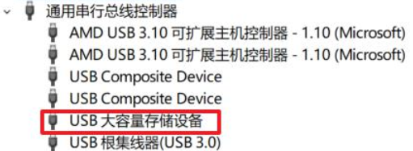
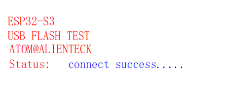
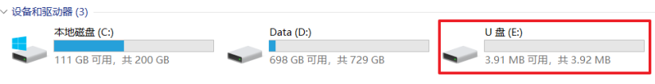

# Flash 模拟 U 盘实验

## 前言

本章我们介绍 ESP32S3 的 USB HOST 应用，即通过 USB HOST 功能，将某个分区表实现模拟 U 盘/读卡器等大容量 USB 存储设备。

## Flash 模拟 U 盘简介

所谓 Flash 模拟 U 盘，就类似于我们平常使用的 U 盘， 我们只不过是将单片机与电脑通过USB 数据线进行连接，从而进行数据传输。 电脑能够识别出单片机通过外部 Flash 模拟出的 U盘，在电脑上能够对该 U 盘进行文件的相互拷贝，并且重新上电后数据不丢失。通过对 USB 的
了解， USB 分设备（Device）模式和主机（Host）模式，使用单片机模拟 U 盘是让 USB 工作在设备（Device）模式下。我们可以利用 ESP32 自带的 USB 功能，来实现一个 Flash 模拟 U 盘，从而通过 USB，实现电脑与 ESP32 的数据互传。上位机无需编写专门的 USB 程序，只需要一个串口调试助手即可调试，非常实用。

## 硬件设计

### 例程功能

本实验利用 ESP32自带的 USB功能，通过 USB连接电脑后，子分区会在电脑上进行加载，并显示该子分区的容量，我们可测试子分区数据的读写了。LED 闪烁，提示程序运行， USB 和电脑连接成功。

### 硬件资源

1.LED:
LEDR-P1_1
<br />2.正点原子2.4寸LCD屏幕
<br />3.USB

### 原理图

USB与板载MCU的连接原理图，如下图所示：


## 程序设计

### Flash 模拟 U 盘函数解析

ESP-IDF提供了一套API来配置USB。那么下面作者将介绍一下在实验中调用到的API函数：

#### 挂载分区函数

该函数用给定的配置，来挂载分区，该函数原型如下所示：

```
esp_err_t esp_vfs_fat_spiflash_mount_rw_wl(const char* base_path,const char* partition_label,const esp_vfs_fat_mount_config_t*mount_config,wl_handle_t* wl_handle);
```

该函数的形参描述如下表所示：

| 参数              | 描述                        |
| --------------- | ------------------------- |
| base_path       | 应该挂载 FATFS 分区的路径          |
| partition_label | 应该使用的分区的标签                |
| mount_config    | 指向带有附加参数的结构的指针，用于挂载 FATFS |
| wl_handle       | 磨损均衡驱动句柄                  |

该函数的返回值描述，如下表所示：

| 返回值                 | 描述                       |
| ------------------- | ------------------------ |
| ESP_OK              | 返回： 0，配置成功               |
| ESP_ERR_INVALID_ARG | 参数错误                     |
| ESP_FAIL            | 配置错误                     |
| ESP_ERR_NO_MEM      | 如果无法分配内存                 |
| ESP_ERR_NOT_FOUND   | 如果分区表不包含带有给定标签的 FATFS 分区 |

更多有关 USB 函数的介绍，请读者们回顾上一章节的内容。

### CMakeLists.txt文件

打开本实验 BSP 下的 CMakeLists.txt 文件，其内容如下所示：

```
set(src_dirs
            MYIIC
            LCD
            MYSPI
            AW9523B)

set(include_dirs
            MYIIC
            LCD
            MYSPI
            AW9523B)

set(requires
            driver
            esp_lcd)

idf_component_register(SRC_DIRS ${src_dirs} INCLUDE_DIRS ${include_dirs} REQUIRES ${requires})

component_compile_options(-ffast-math -O3 -Wno-error=format=-Wno-format)
```

上述的驱动需要由开发者自行添加，以确保 USB 驱动能够顺利集成到构建系统中。这一步骤是必不可少的，它确保了 USB 驱动的正确性和可用性，为后续的开发工作提供了坚实的基础。

### 实验应用代码

打开main.c文件，该文件定义了工程入口函数，名为main。该函数代码如下。

```
/**
 * @brief       程序入口
 * @param       无
 * @retval      无
 */
void app_main(void)
{
    esp_err_t ret;

    ret = nvs_flash_init();                             /* 初始化NVS */

    if (ret == ESP_ERR_NVS_NO_FREE_PAGES || ret == ESP_ERR_NVS_NEW_VERSION_FOUND)
    {
        ESP_ERROR_CHECK(nvs_flash_erase());
        ESP_ERROR_CHECK(nvs_flash_init());
    }

    my_spi_init();                                      /* 初始化SPI */
    myiic_init();                                       /* 初始化IIC */
    aw9523b_init();                                     /* 初始化AW9523B */ 
    lcd_init();                                         /* 初始化LCD */

    /* 显示实验信息 */
    lcd_show_string(30, 50, 200, 16, 16, "ESP32-S3", RED);
    lcd_show_string(30, 70, 200, 16, 16, "USB FLASH TEST", RED);
    lcd_show_string(30, 90, 200, 16, 16, "ATOM@ALIENTEK", RED);

    static wl_handle_t wl_handle = WL_INVALID_HANDLE;
    ESP_ERROR_CHECK(storage_init_spiflash(&wl_handle));

    const tinyusb_msc_spiflash_config_t config_spi = {
        .wl_handle = wl_handle,
        .callback_mount_changed = NULL,
        .mount_config.max_files = 5,
    };
    ESP_ERROR_CHECK(tinyusb_msc_storage_init_spiflash(&config_spi));
    ESP_ERROR_CHECK(tinyusb_msc_register_callback(TINYUSB_MSC_EVENT_MOUNT_CHANGED, NULL));

    /* 挂载设备 */
    ESP_ERROR_CHECK(tinyusb_msc_storage_mount(BASE_PATH));
    /* 配置USB */
    const tinyusb_config_t tusb_cfg = {
        .device_descriptor = &descriptor_config,    /* 设备描述符 */
        .string_descriptor = string_desc_arr,       /* 字符串描述符 */
        .string_descriptor_count = sizeof(string_desc_arr) / sizeof(string_desc_arr[0]),    /* 字符串描述符大小 */
        .external_phy = false,                      /* 使用内部USB PHY */
        .configuration_descriptor = msc_fs_configuration_desc,      /* 配置描述符 */
    };
    /* 初始化USB */
    ESP_ERROR_CHECK(tinyusb_driver_install(&tusb_cfg));

    while(1)
    {
        LEDR_TOGGLE();
        vTaskDelay(pdMS_TO_TICKS(500));
    }
}
```

此部分代码比较简单，通过 tud_usb_flash()等函数初始化USB。由于该实验例程需要系统将storage 分区模拟成 U 盘，所以在该函数中需要初始化 SPIFFS 分区，其次是用 USB 设备安装函数，用以 USB 设备登记。同时， LCD 显示实验信息， LED 闪烁以示程序正在运行。

## 下载验证

将程序下载到开发板后，我们打开设备管理器（我用的是 WIN10），在端口（COM 和 LPT）里面可以发现多出了一个COM25 的设备，这就是 USB 虚拟的串口设备端口，如下图所示：



如上图， ESP32 通过 Flash 模拟 U 盘，被电脑识别了，通用串行总线控制器显示的是：USB 大容量存储设备（其实也不算大，也就差不多 4MB...）。此时，开发板的 LED 在闪烁，提示程序运行。开发板的 LCD 显示“connect success.....”，如下图所示：



然后我们打开“我的电脑”，可以看见界面显示了通过 Flash 模拟 U 盘后的容量大小，如下图所示：



至此， Flash 模拟 U 盘实验就完成了，通过本实验，我们就可以利用 ESP32 的 Flash 进行 U盘模拟。
