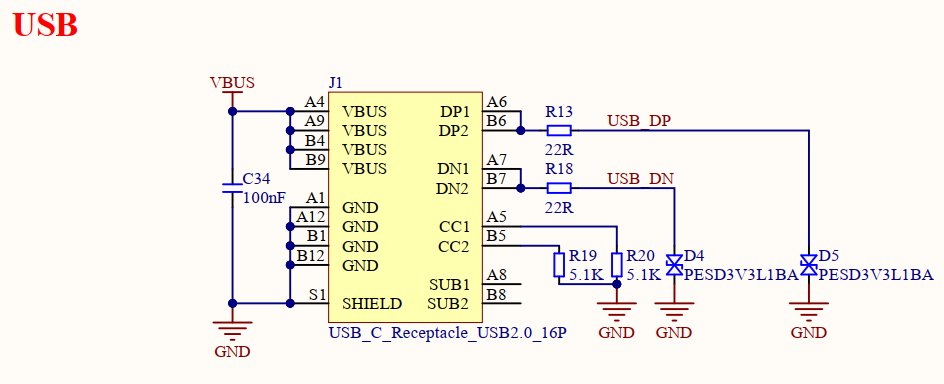
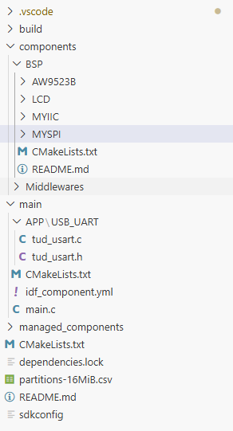
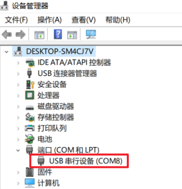
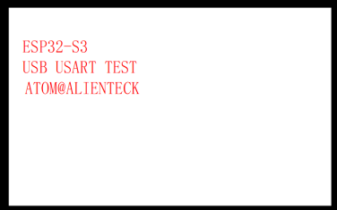
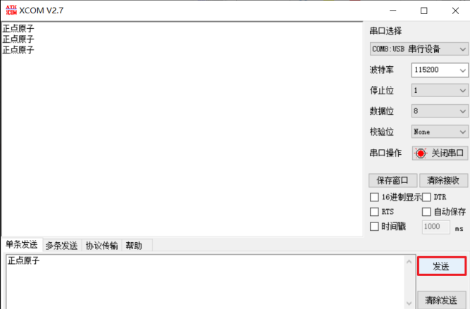

# USB虚拟串口实验

## 前言

本章，我们将向大家介绍如何利用 USB 在开发板实现一个 USB 虚拟串口，通过 USB 与电脑数据数据交互。

## USB虚拟串口介绍

USB 虚拟串口，简称 VCP，是 Virtual COM Port 的简写，它是利用 USB 的 CDC 类来实现的一种通信接口。 CDC(Communication Device Class)类是 USB2.0 标准下的一个设备类，定义了通信相关设备的抽象集合。我们可以利用 ESP32 自带的 USB 功能，来实现一个 USB 虚拟串口，从而通过 USB，实现电脑与 ESP32 的数据互传。上位机无需编写专门的 USB 程序，只需要一个串口调试助手即可调试，非常实用。

## 硬件设计

### 例程功能

本实验利用 ESP32 自带的 USB 功能，连接电脑 USB，虚拟出一个 USB 串口，实现电脑和开发板的数据通信。本例程功能完全同串口通信实验，只不过串口变成了 ESP32 的USB 虚拟串口。当 USB 连接电脑（USB 线插入 USB 接口），开发板将通过 USB 和电脑建立连接，并虚拟出一个串口。同时，LED 闪烁，提示程序运行。

### 硬件资源

1.LED:
LEDR-P1_1
<br />2.正点原子2.4寸LCD屏幕
<br />3.USB

### 原理图

USB与板载MCU的连接原理图，如下图所示：



## 程序设计

### USB 虚拟串口函数解析

ESP-IDF提供了一套API来配置USB。那么下面作者将介绍一下在实验中调用到的API函数：

#### USB设备登记

该函数用给定的配置，来配置 USB 设备，该函数原型如下所示：

```
esp_err_t tinyusb_driver_install(const tinyusb_config_t *config);
```

该函数的形参描述如下表所示：

| 参数     | 描述             |
| ------ | -------------- |
| config | Tinyusb 堆栈特定配置 |

该函数的返回值描述，如下表所示：

| 返回值                 | 描述         |
| ------------------- | ---------- |
| ESP_OK              | 返回： 0，配置成功 |
| ESP_ERR_INVALID_ARG | 参数错误       |
| ESP_FAIL            | 配置错误       |

#### USB 设备初始化

该函数用给定的配置，来初始化 USB 设备，该函数原型如下所示：

```
esp_err_t tusb_cdc_acm_init(const tinyusb_config_cdcacm_t *cfg);
```

该函数的形参描述如下表所示：

| 参数  | 描述                |
| --- | ----------------- |
| cfg | 指向 USB 设备初始化配置结构体 |

该函数的返回值描述，如下表所示：

| 返回值    | 描述         |
| ------ | ---------- |
| ESP_OK | 返回： 0，配置成功 |

#### 注册回调函数

该步骤用以注册回调函数，该函数原型如下所示：

```
esp_err_t tinyusb_cdcacm_register_callback(tinyusb_cdcacm_itf_t itf, cdcacm_event_type_t event_type);
```

该函数的形参描述如下表所示：

| 参数         | 描述         |
| ---------- | ---------- |
| itf        | CDC 对象的编号  |
| event_type | 回调所注册事件的类型 |

该函数的返回值描述，如下表所示：

| 返回值                 | 描述         |
| ------------------- | ---------- |
| ESP_OK              | 返回： 0，配置成功 |
| ESP_ERR_INVALID_ARG | 参数错误       |

#### 发送数据 1

该函数将数据从字节数组写入写入缓冲区，该函数原型如下所示：

```
size_t tinyusb_cdcacm_write_queue(tinyusb_cdcacm_itf_t itf,const uint8_t *in_buf,size_t in_size);
```

该函数的形参描述如下表所示：

| 参数      | 描述            |
| ------- | ------------- |
| itf     | CDC 对象的编号     |
| in_buf  | 源数组           |
| in_size | 从 SRC 数组写入的大小 |

该函数的返回值描述，如下表所示：

| 返回值                 | 描述         |
| ------------------- | ---------- |
| ESP_OK              | 返回： 0，配置成功 |
| ESP_ERR_INVALID_ARG | 参数错误       |

#### 发送数据 2

该函数从写缓冲区发送所有数据，该函数原型如下所示：

```
esp_err_t tinyusb_cdcacm_write_flush(tinyusb_cdcacm_itf_t itf, uint32_t timeout_ticks);
```

该函数的形参描述如下表所示：

| 参数            | 描述         |
| ------------- | ---------- |
| itf           | CDC 对象的编号  |
| timeout_ticks | 等待刷新将被视为失败 |

该函数的返回值描述，如下表所示：

| 返回值                 | 描述         |
| ------------------- | ---------- |
| ESP_OK              | 返回： 0，配置成功 |
| ESP_ERR_INVALID_ARG | 参数错误       |

### USB 虚拟串口驱动解析

在 IDF 版的 23_usb_uart 例程中，作者在 ```23_usb_uart \components``` 路径下新增了 USB 驱动文件。这里我们只讲解核心代码，详细的源码请大家参考光盘本实验对应源码。本实验，我们将相 TinyUSB库文件拷贝到 components文件夹下，在 APP文件夹下的文件则是我们基于 TinyUSB 自行编写的代码。最终得到如下图所示的工程：



上图中位于 components 文件夹下的是我们自己编写的一些外设驱动， main 文件夹下包含了一个 APP 文件与一个后缀为.yml 的文件。 APP 文件夹下包含的是 USB 模拟串口代码，而后缀为.yml 的文件其主要作用是将项目中各组件的依赖项定义在单独的清单文件中，并以上图所示的方式进行命名。在我们的例程中提现出的作用就是简化了整个工程结构。我们在编译的过程中 ， 系 统 便 会 帮 我 们 自 动 生 成 USB 外 设 所 需 要 的 依 赖 库 ： espressif_esp_tinyusb 以 及espressif_tinyusb。 做到了即能简化项目工程，又能有效规避了在编译中遇到的错误，但前提是运行时得确保个人的电脑处于联网状态。

### CMakeLists.txt文件

打开本实验 BSP 下的 CMakeLists.txt 文件，其内容如下所示：

```
set(src_dirs
            MYIIC
            LCD
            MYSPI
            AW9523B)

set(include_dirs
            MYIIC
            LCD
            MYSPI
            AW9523B)

set(requires
            driver
            esp_lcd)

idf_component_register(SRC_DIRS ${src_dirs} INCLUDE_DIRS ${include_dirs} REQUIRES ${requires})

component_compile_options(-ffast-math -O3 -Wno-error=format=-Wno-format)
```

该路径下的 CmakeList 文件并没有新增内容，主要变化在于 main 文件。打开本实验 main 文件下的 CMakeLists.txt 文件，其内容如下所示：

```
idf_component_register(
    SRC_DIRS 
        "."
        "APP"
        "APP/USB_UART"
    INCLUDE_DIRS 
        "."
        "APP"
        "APP/USB_UART")
```

上述的驱动需要由开发者自行添加，以确保 USB 驱动能够顺利集成到构建系统中。这一步骤是必不可少的，它确保了 USB 驱动的正确性和可用性，为后续的开发工作提供了坚实的基础。

### 实验应用代码

打开main.c文件，该文件定义了工程入口函数，名为main。该函数代码如下。

```
/**
 * @brief       程序入口
 * @param       无
 * @retval      无
 */
void app_main(void)
{
    esp_err_t ret;

    ret = nvs_flash_init();                             /* 初始化NVS */

    if (ret == ESP_ERR_NVS_NO_FREE_PAGES || ret == ESP_ERR_NVS_NEW_VERSION_FOUND)
    {
        ESP_ERROR_CHECK(nvs_flash_erase());
        ESP_ERROR_CHECK(nvs_flash_init());
    }

    my_spi_init();                                      /* 初始化SPI */
    myiic_init();                                       /* 初始化IIC */
    aw9523b_init();                                     /* 初始化AW9523B */ 
    lcd_init();                                         /* 初始化LCD */

    /* 显示实验信息 */
    lcd_show_string(30, 50, 200, 16, 16, "ESP32-S3", RED);
    lcd_show_string(30, 70, 200, 16, 16, "USB USART TEST", RED);
    lcd_show_string(30, 90, 200, 16, 16, "ATOM@ALIENTEK", RED);

    tud_usb_usart();                                    /* 初始化USB */

    while(1)
    {
        LEDR_TOGGLE();
        vTaskDelay(500);
    }
}
```

此部分代码比较简单，通过 tud_usb_usart()等函数初始化USB，在该函数中需要注册一个调用 CDC事件的回调函数。此时，如果回调已经注册，那么它将会被覆盖。同时， LCD显示实验信息， LED 闪烁以示程序正在运行。

## 下载验证

本例程的测试，不需要安装特定的 USB 驱动，开发者只需用数据线将 USB 接口 与 PC端连接起来即可，并打开串口助手，选择对应的端口号进行数据发送操作。我们打开设备管理器（我用的是 WIN10），在端口（COM 和 LPT）里面可以发现多出了一个COM8 的设备，这就是 USB 虚拟的串口设备端口，如图所示：



如上图， ESP32 通过 USB 虚拟的串口，被电脑识别了，端口号为： COM8（可变），字符串名字为： USB 串行设备（COM8）。此时，开发板的 LED 闪烁，提示程序运行，如下图所示：



然后我们打开 XCOM，选择 COM8（需根据自己的电脑识别到的串口号选择），并打开串口（注意：波特率可以随意设置），就可以进行测试了，如下图所示：



可以看到，我们的串口调试助手，按发送按钮，可以收到电脑发送给 ESP32 的数据（原样返回），说明我们的实验是成功的。至此， USB 虚拟串口实验就完成了，通过本实验，我们就可以利用 ESP32 的 USB，直接和电脑进行数据互传了，具有广泛的应用前景。
