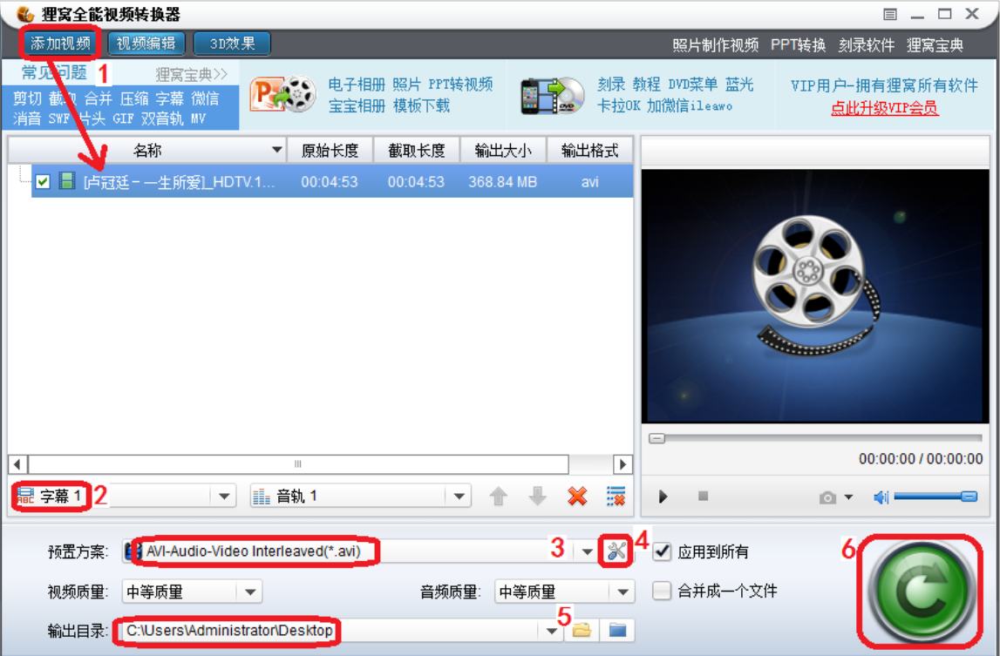
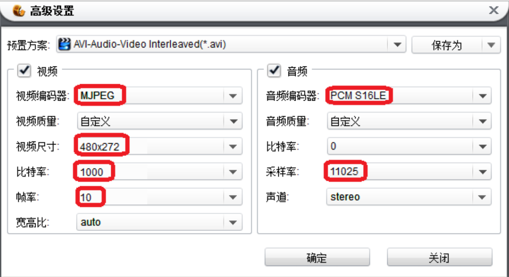
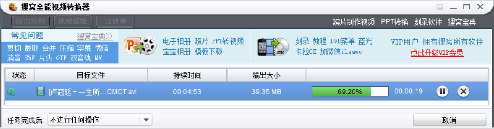
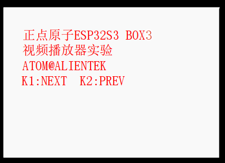
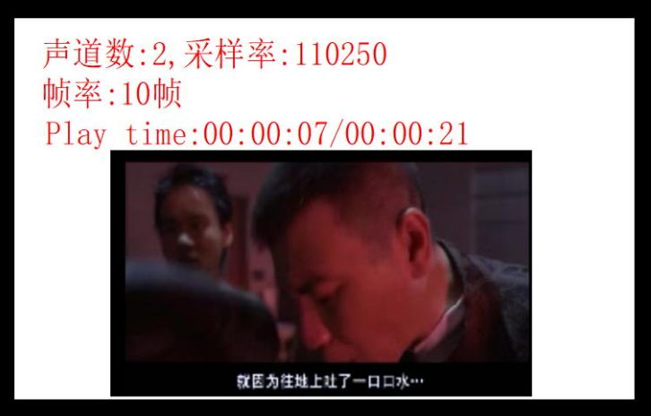

# 视频播放器实验

## 前言

ESP32S3 的处理能力，不仅可以软解码音频，还可以用来播放视频！本章，我们将使用DNESP32S3B3 开发板来播放 AVI 视频，本章我们将实现一个简单的视频播放器。

## AVI & libjpeg 简介

<br />AVI 是音频视频交错(Audio Video Interleaved)的英文缩写，它是微软开发的一种符合 RIFF文件规范的数字音频与视频文件格式，原先用于 Microsoft Video for Windows (简称 VFW)环境，现在已被多数操作系统直接支持。AVI 格式允许视频和音频交错在一起同步播放，支持 256 色和 RLE 压缩，但 AVI 文件并未限定压缩标准， AVI 仅仅是一个容器，用不同压缩算法生成的 AVI 文件，必须使用相应的解压缩算法才能播放出来。比如本章，我们使用的 AVI，其音频数据采用 16 位线性 PCM 格式（未压缩），而视频数据，则采用 MJPEG 编码方式。
<br />libjpeg 是一个完全用 C 语言编写的库，包含了广泛使用的 JPEG 解码、 JPEG 编码和其他的JPEG 功能的实现。这个 IJG 库由组织（Independent JPEG Group（独立 JPEG 小组））提供并维护。 libjepg，目前最新版本为 v9f，可以在[**这里**](https://www.ijg.org/files/)下载。 libjpeg 具有稳定、兼容性强和解码速度较快等优点。
本章，我们使用 libjpeg 来实现 MJPEG 数据流的解码， MJPEG 数据流，其实就是一张张的JPEG 图片拼起来的图片视频流，只要能快速解码 JPEG 图片，就可以实现视频播放。

## 硬件设计

### 例程功能

1、 本实验开机后，先初始化各外设，然后检测字库是否存在，如果检测无问题，则开始播放 SD 卡 VIDEO 文件夹里面的视频（.avi 格式）。注意：自备 SD 卡一张，并在 SD 卡根目录建立一个 VIDEO 文件夹，存放 AVI 视频（仅支持 MJPEG 视频，音频必须是 PCM，且视频分辨率必须小于等于屏幕分辨率）在里面。例程所需视频，可以通过：狸窝全能视频转换器，转换后得到，具体步骤见本章节。视频播放时， LCD 上会显示视频名字、当前视频编号、总视频数、声道数、音频采样率、帧率、播放时间和总时间等信息。 K1 用于选择下一个视频， K2 用于选择上一个视频。
<br />2、 LED 闪烁，提示程序运行。

### 硬件资源
<br />1.LED:
<br />LEDR-P1_1
<br />2.独立按键：
<br />K0-GPIO0
<br />K1-P0_0
<br />K2-P0_1
<br />3.正点原子2.4寸LCD屏幕
<br />4.SD
<br />5.ES8311 音频芯片

### 原理图

本实验相关的原理图同上一章节。

## 程序设计

### 视频播放实验函数解析

本章实验所使用 ESP32-S3 的 API 函数在音乐播放器章节中已经讲述过了，在此不再赘述。

### CMakeLists.txt文件

打开本实验的Middlewares文件夹下的CMakeList.txt文件，其内容如下所示：

```
set(src_dirs
            KEY
            MYIIC
            LCD
            SPI_SD
            MYSPI
            AW9523B
            MYI2S
            ES8311)

set(include_dirs
            KEY
            MYIIC
            LCD
            SPI_SD
            MYSPI
            AW9523B
            MYI2S
            ES8311)

set(requires
            driver
            fatfs
            esp_lcd)

idf_component_register(SRC_DIRS ${src_dirs} INCLUDE_DIRS ${include_dirs} REQUIRES ${requires})

component_compile_options(-ffast-math -O3 -Wno-error=format=-Wno-format)
```

上述代码中的 MYI2S 以及ES8311等依赖库需要由开发者自行添加，以确保 VIDEO 驱动能够顺利集成到构建系统中。这一步骤是必不可少的，它确保了 VIDEO 驱动的正确性和可用性，为后续的开发工作提供了坚实的基础。
打开本实验 main 文件下的 CMakeLists.txt 文件，其内容如下所示：

```
idf_component_register(
    SRC_DIRS 
        "."
        "APP"
        "APP/AUDIO"
    INCLUDE_DIRS 
        "."
        "APP"
        "APP/AUDIO"
    )
```

述的驱动需要由开发者自行添加， 在此便不做赘述了。

### 实验应用代码

打开main.c文件，该文件定义了工程入口函数，名为main。该函数代码如下。

```
/**
 * @brief       程序入口
 * @param       无
 * @retval      无
 */
void app_main(void)
{
    esp_err_t ret = 0;
    uint8_t key = 0;

    ret = nvs_flash_init();                             /* 初始化NVS */

    if (ret == ESP_ERR_NVS_NO_FREE_PAGES || ret == ESP_ERR_NVS_NEW_VERSION_FOUND)
    {
        ESP_ERROR_CHECK(nvs_flash_erase());
        ESP_ERROR_CHECK(nvs_flash_init());
    }

    key_init();                                         /* 初始化按键 */
    myiic_init();                                       /* 初始化IIC */
    my_spi_init();                                      /* 初始化SPI */
    aw9523b_init();                                     /* 初始化AW9523B */ 
    lcd_init();                                         /* 初始化LCD */
    myi2s_init();                                       /* 初始化I2S */
    es8311_init(I2S_SAMPLE_RATE);                       /* 初始化ES8311 */
    es8311_set_voice_volume(65);                        /* 设置喇叭音量，建议不超过65 */
    es8311_set_voice_mute(0);                           /* 打开DAC */

    while (sd_spi_init())                               /* 检测不到SD卡 */
    {
        lcd_clear(WHITE);                               /* 清屏 */
        lcd_show_string(30, 110, 200, 16, 16, "SD Card Error!", RED);
        vTaskDelay(500);
        lcd_show_string(30, 130, 200, 16, 16, "Please Check! ", RED);
        vTaskDelay(500);
    }

    while (fonts_init())                                /* 检查字库 */
    {
        lcd_clear(WHITE);                               /* 清屏 */
        lcd_show_string(30, 30, 200, 16, 16, "ESP32-S3", RED);

        key = fonts_update_font(30, 50, 16, (uint8_t *)"0:", RED);  /* 更新字库 */

        while (key)                                     /* 更新失败 */
        {
            lcd_show_string(30, 50, 200, 16, 16, "Font Update Failed!", RED);
            vTaskDelay(200);
            lcd_fill(20, 50, 200 + 20, 90 + 16, WHITE);
            vTaskDelay(200);
        }

        lcd_show_string(30, 50, 200, 16, 16, "Font Update Success!   ", RED);
        vTaskDelay(1500);
        lcd_clear(WHITE);                               /* 清屏 */
    }

    if (key_scan(0) == KEY0_PRES)
    {
        fonts_update_font(30, 50, 16, (uint8_t *)"0:", RED);  /* 更新字库 */
    }

    ret = exfuns_init();        /* 为fatfs相关变量申请内存 */

    text_show_string(30, 30, 200, 16, "正点原子ESP32S3 BOX", 16, 0, RED);
    text_show_string(30, 50, 200, 16, "视频播放器实验", 16, 0, RED);
    text_show_string(30, 70, 200, 16, "ATOM@ALIENTEK", 16, 0, RED);
    text_show_string(30, 90, 200, 16, "K1:NEXT K2:PREV ", 16, 0, RED);

    vTaskDelay(pdMS_TO_TICKS(1000));           /* 实验信息显示延时 */

    while (1)
    {
        video_play();
    }
}
```

main 函数只是经过一系列的外设初始化后，检查字库是否已经更新，然后显示实验的信息，就通过调用 video_play 函数，执行视频播放的程序了。

## 下载验证

本章，我们例程仅支持 MJPEG 编码的 avi 格式视频，且音频必须是 PCM 格式，另外视频分辨率不能大于 LCD 分辨率。要满足这些要求，现成的 avi 文件是很难找到的，所以我们需要用软件，将通用视频（任何视频都可以）转换为我们需要的格式，这里我们通过：狸窝全能视频转换器，这款软件来实现（路径：光盘： 6，软件资料→1，软件→7，其他软件.zip→视频转换软件→狸窝全能视频转换器.exe）。安装完后，打开，然后进行相关设置，软件设置如下图所示：





首先，如上面第一张图所示，点击 1 处，添加视频，找到你要转换的视频，添加进来。有的视频可能有独立字幕， 比如我们打开的这个视频就有， 所以在 2 处选择下字幕（如果没有的，可以忽略此步）。然后在 3 处，点击▼图标，选择预制方案： AVI-Audio-Video Interleaved(*.avi)，即生成.avi 文件，然后点击 4 处的高级设置按钮，进入上面第二章所示的界面，设置详细参数如下：视频编码器：选择 MJPEG。本例程仅支持 MJPEG 视频解码，所以选择这个编码器。视频尺寸： 480x272。这里得根据所用 LCD 分辨率来选择，假设我们用 800*480 的 4.3 寸电容屏模块，则这里最大可以设置： 480x272。 PS:如果是 2.8 屏，最大宽度只能是 240）。比特率： 1000。这里设置越大，视频质量越好，解码就越慢（可能会卡），我们设置为1000，可以得到比较好的视频质量，同时也不怎么会卡。
帧率： 10。即每秒钟 10 帧。对于 480*272 的视频，本例程最高能播放 30 帧左右的视频，如果要想提高帧率，有几个办法： 1，降低分辨率； 2，降低比特率； 3，降低音频采样率。音频编码器： PCMS16LE。本例程只支持 PCM 音频，所以选择音频编码器为这个。采样率：这里设置为 110250，即 11.025Khz 的采样率。这里越高，声音质量越好，不过，转换后的文件就越大，而且视频可能会卡。其他设置，采用默认的即可。设置完以后，点击确定，即可完成设置。点击上面第一张图的5处的文件夹图标，设置转换后视频的输出路径，这里我们设置到了桌面，这样转换后的视频，会保存在桌面。最后，点击图中 6处的按钮，即可开始转换了，如下图所示：



等转换完成后，将转换后的.avi文件，拷贝到 SD 卡→VIDEO 文件夹下，然后插入开发板的SD 卡接口，就可以开始测试本章例程了。将程序下载到开发板后，程序先检测字库，只有字库已经更新才可以继续执行后面的程序。字库已更新，就可以看到 LCD 首先显示一些实验相关的信息，如下图所示：



显示了上图的信息后，检测 SD 卡的 VIDEO 文件夹，并查找 avi 视频文件，在找到有效视频文件后，便开始播放视频，如下图所示：



可以看到，屏幕显示了文件名、索引、声道数、采样率、帧率和播放时间等参数。然后，我们按 K1/K2，可以切换到下一个/上一个视频。至此，本例程介绍就结束了。
