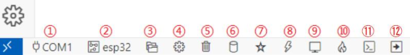

## 调试相关工具介绍

下面我们重点来讲解VS Code 软件提供用户调试相关的工具有哪些，如下所示：

1，选择串口（插头）：即连接开发板的下载串口号， VS 会列出当前连接电脑的所有串口让你选择，这个会记录，再新打开 VSCode 不用重新选择，开发过程中尽量不要更换 USB 线的电脑插口，否则串口号会变。
 2，选择目标芯片：对应 idf 命令 idf.py set-target xxxx。即你当前这个工程是要下载到什么芯片上面，如 ESP32 S2,S3,C2,C3 等等，工程要与芯片相匹配，这个选择是写入当前工程配置的，一般不用更改，工程下配置文件基本已经选择好的。
 3，选择当前工程目录（文件夹）：也不用修改，一般打开工程时会默认操作都在这个工程目录下。
 4，工程配置菜单（齿轮）：对应 idf 命令 idf.py menuconifg，用来配置当前工程的一些设置，配置项非常多，建议使用到再修改。一般代码工程都是配置好的，且不用修改。
 5，清除工程（垃圾桶）：清除工程编译文件，一般用于压缩拷贝工程文件时用到，清除后工程目录占用空间会占用非常小， KB 级，编译后为百 MB 级，还有一些编译过程中奇奇怪怪的问题也可以先清除编译后再编译。
 6，编译工程（圆柱体）：编译当前工程，只是编译，没有下载功能。
 7，选择下载模式（五角星）：一般都是选择串口 UART 方式下载。
 8，下载（闪电）：下载编译好的固件到设备芯片上，这里只是下载，没有编译功能，修改代码后要先编译再点这个下载，所做的修改才有效。
 9，串口监控（小电视）：打开与设备连接的串口，打印设备串口信息。
 10，编译/下载/监控（一团火）：最常用的一个，它将编译下载和打开串口监控做在了一起，点一次全部搞定。
 11，打开命令行：打开命令行窗口，且会定位在当前项目路径下，可以执行 idf 的一些命令。

以上是 ESP-IDF 插件提供的调试工具，一般我们只用到 1、 2、 4、 5、 6 和 8 即可完成程序开发。 

## ESP-IDF项目的编译

当我们编写完一段代码或者拿到一个工程需要验证时，我们点击上述内容中描述的**6，编译工程**即可。

## ESP-IDF项目的下载

下面， 作者以一个新建工程为例， 简单讲解一下工程的下载流程，如下流程所示：
 1，使用 USB 线的 Type-C 接口连接 DNESP32S3 BOX3 开发板的 USB端口，并将USB A口连接到电脑，使得电脑与开发板建立连接。
 2，在设备管理器中，查看 USB 串口的端口号，并在 VS Code 软件左下角调试区域设置端口号（插头）。
 3，点击“Set Espressif Device Target”选择目标芯片，这里我们选择 ESP32-S3.
 4，选择“select flash Method”下载方式（五角星），如 UART 或者 JTAG
 5，点击“Full Clean”擦除工程（垃圾桶）。
 6，点击“Build Project”编译工程（圆柱形）。
 7，编译完成后， 点击“ESP-IDF: Flash Device”下载代码（闪电）。

编译工程成功后， 工程目录下出现 build 文件夹，这个文件夹是由 ESP-IDF 编译器生产的文件，如 log、固件、 map 等下载和调试文件。 至此，环境部署与新建工程的流程便是讲解完毕，感谢各位读者能够耐心的看到此处。