# ESP-IDF安装

## 概述

[**ESP-IDF**](https://docs.espressif.com/projects/esp-idf/zh_CN/v6.0/esp32s3/get-started/index.html) 是乐鑫科技为其 ESP32 系列芯片提供的官方开发框架。

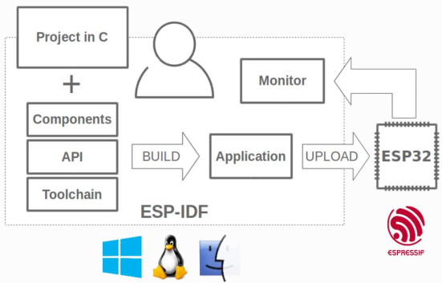

### ESP-IDF 库框架结构解析

下面我们从 gitee 仓库下克隆 ESP-IDF 物联网开发框架的源代码，并在此分析各个文件的作用。克隆 ESP-IDF 源码库流程如下图所示:

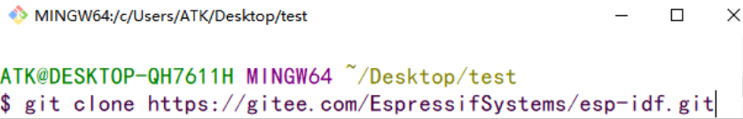

克隆成功后，在上图路径下找到 esp-idf 文件夹，此文件夹就是 ESP-IDF 物联网开发框架的源码库，如下图所示：

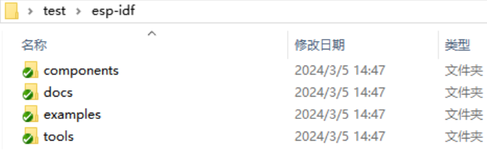

下面作者来讲解一下这些文件夹的作用及特点，如下表所示：

文件名称  	         | 描述	         
-----------------|---------------------
  components  	 | 提供了模块化、可配置、可重用和可扩展的代码组织方式，使得 ESP32 和其他Espressif 芯片的开发变得更加高效和灵活
  docs  	 | ESP-IDF 相关的文档和指南，旨在帮助开发者更好地理解和使用 ESP-IDF
  examples  	 | 为开发者提供了丰富的学习资源、原型开发工具和功能演示
  tools  	 | 提供了开发 ESP-IDF 项目所需的各种工具和脚本，帮助开发者更高效地完成开发、构建和部署任务

正如上图所示那样， 在编译 ESP32 的例程时，确保 components 和 tools 目录的完整性是非常重要的。 components 目录包含了项目所需的所有源代码和库文件，而 tools 目录则提供了编译和链接这些代码所需的工具链，这样才能做到自给自足的构建项目。另外，我们提供的 ESP32S3 例程需要使用的 ESP-IDF 要求为 v5.3.x及以上版本，建议使用最新版本的 ESP-IDF，可以通过[**这里**](https://github.com/espressif/esp-idf)下载最新版本的 ESP-IDF 安装包。如果登录GIT HUB有困难的读者也可以在[**这里**](https://dl.espressif.cn/dl/esp-idf/)下载ESP-IDF离线安装包。

## 安装

在这里，我们推荐下载离线的安装包并以此为例进行讲解。虽然安装速度可能会稍慢一些，但它能够确保安装的成功率。相比之下，在线的安装包需要稳定的网络支持，如果网络状况不佳，可能会导致安装失败。 当然，也可以在A盘→6，软件资料→1，软件→1， IDF开发工具→04-ESP32-IDF Offline Installer路径下找到 v5.5.3 离线安装包。 ESP_IDF物联网开发框架安装包如下图所示：

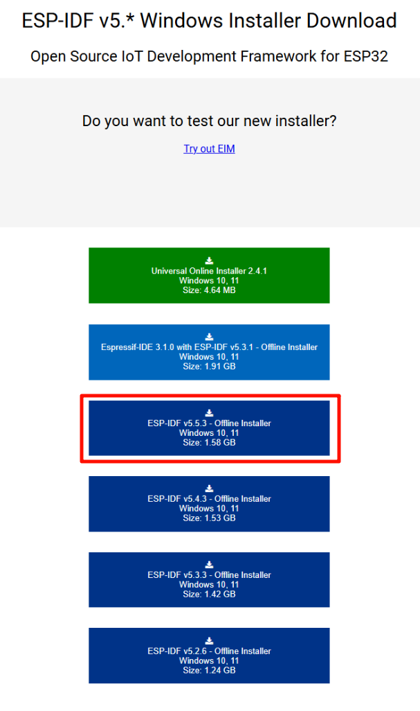

下载成功后， 在安装程序上单击右键选择"以管理员身份运行"运行 **esp-idf-tools-setup-offline-5.5.3.exe** 文件，如下图所示：

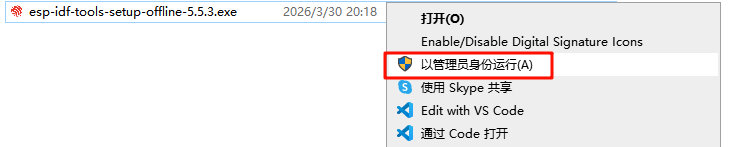

打开安装程序后选择简体中文安装，如下图所示:

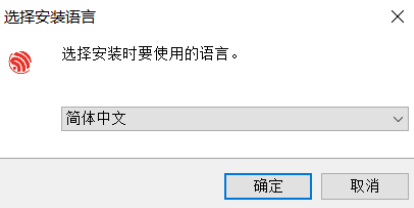

之后根据安装向导的提示进行操作，即可完成ESP-IDF离线包的安装。至此，ESP-IDF 安装完毕。

## 配置ESP-IDF插件

打开VS Code软件，然后按下快捷键“Ctrl+Shift+X”进入应用商城，在搜索栏下搜索ESP-IDF插件，点击安装即可。

至此ESP-IDF插件就算安装好了，接下来我们来看看插件的配置。

快捷键 ctrl+shift+p 呼出命令栏，在弹如下提示框后，搜索“配置 ESP-IDF 插件”，或者在使用快捷键 ctrl+shift+p 呼出命令栏后，在搜索框输入配置命令： Configure ESP-IDF。

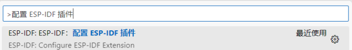

回车后， 进入配置 ESP-IDF 插件界面，如下图所示：

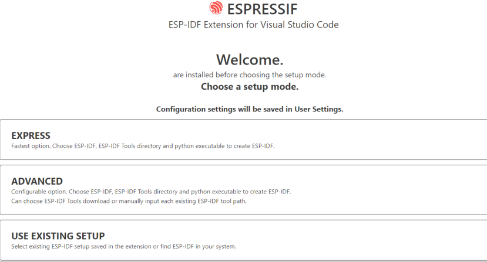

在上图中，点击**ADVANCED**进入高级配置界面，如下图所示：

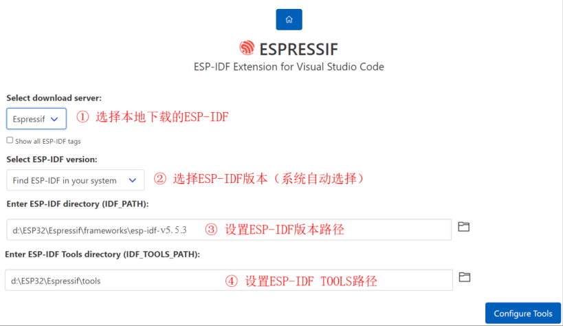

配置 ESP-IDF 插件完成后，点击上图**Configure Tools**选项执行配置操作，此时需要等待系统配置成功，如下图所示：

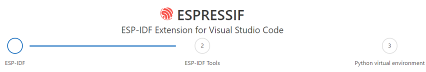

注意：如果出现“python5.5.3.exe -m pip is not valid” 错误，大概是 python 环境搭建原因。从上图可以看到，配置 ESP-IDF 插件需要进行三个流程， 等待第一个流程配置完成，此时进入 ESP-IDF Tools 配置流程，如下图所示：

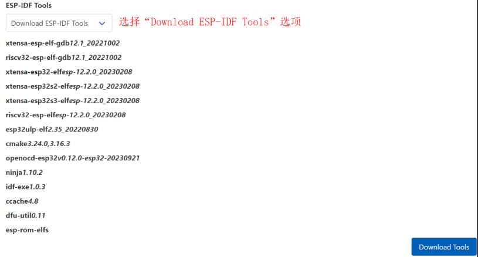

接着点击**Download Tools**选项下载工具（需要网络加持），如下图所示：

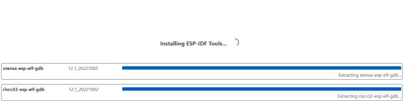

下载成功后，系统进入第三个流程 Python 环境搭建，如下图所示：

三个流程完成后，系统提示如下信息，如下图所示：

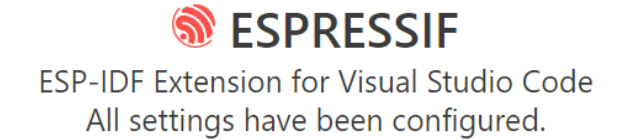

接下来，作者将讲解插件默认的配置参数，如串口下载的波特率和下载方式，配置流程如下所示：

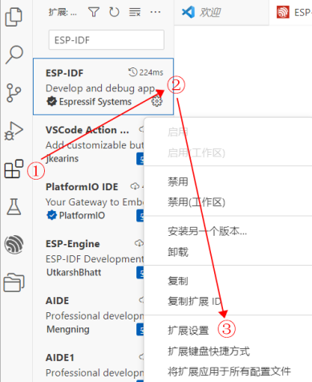

点击**扩展设置**选项，进入配置插件界面， 然后找到**Flash Baud Rate**和**Flash Type**选项， 如下图所示：

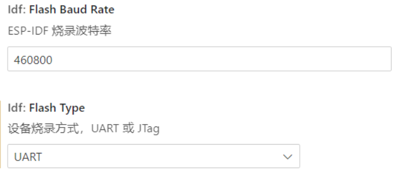

到了这里，我们已经配置 ESP-IDF 插件完成。
