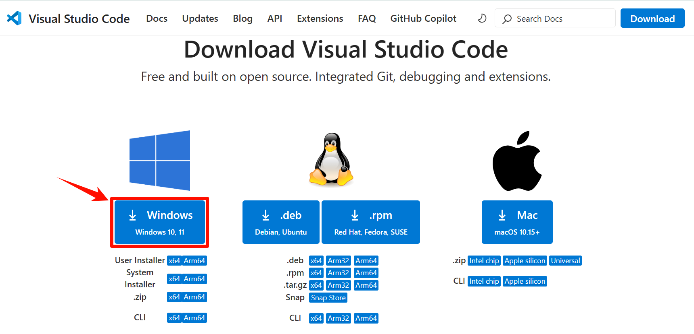
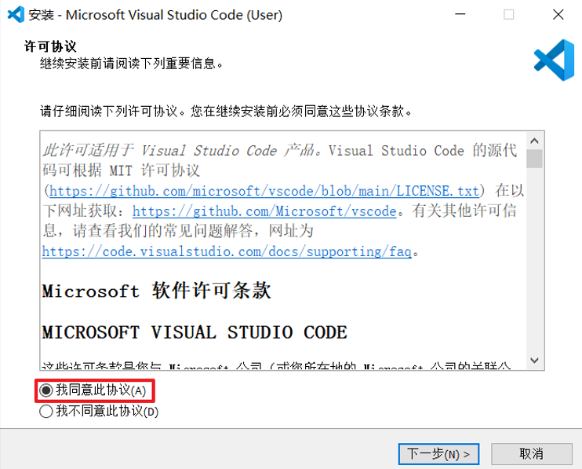
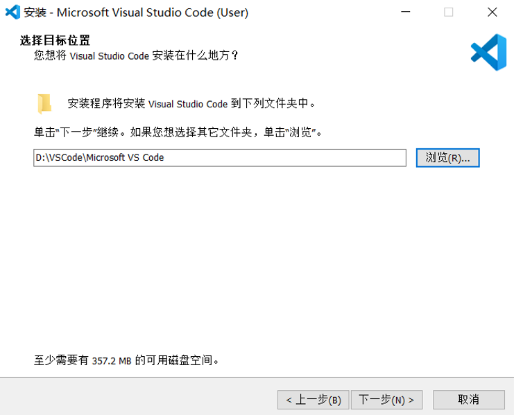
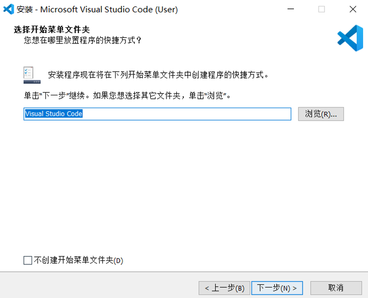
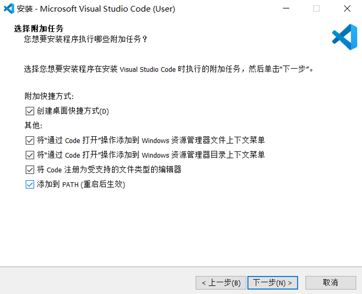
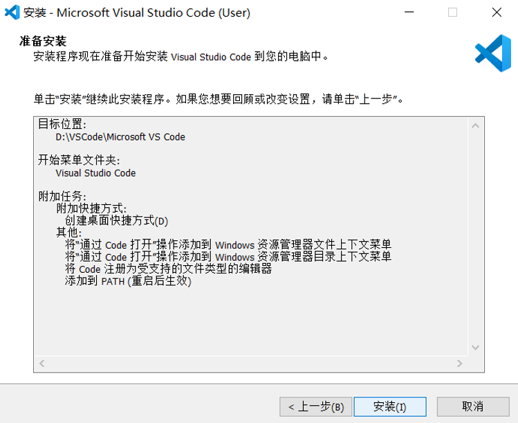
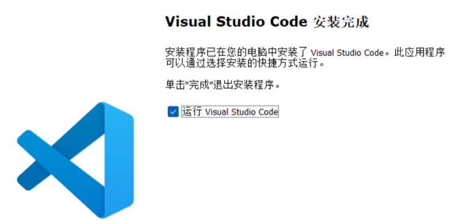
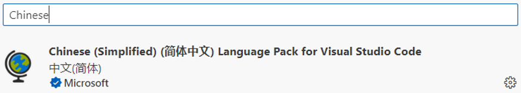
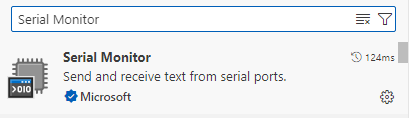

# 前言

Visual Studio Code（VS Code）是一款轻量级且功能强大的跨平台源代码编辑器，支持 Windows、macOS 和 Linux 系统。其核心功能包括语法高亮、智能代码补全（IntelliSense）、代码重构及定义跳转，并集成终端和 Git 版本控制。原生支持 JavaScript、TypeScript 和 Node.js，同时通过扩展生态系统提供对 C++、C#、Java、Python、PHP、Go 及 .NET 等多种语言和运行时的支持。

## 下载

首先，我们先进入[**VSCode官方网站**](https://code.visualstudio.com/Download) 的下载页面。开发者可以根据所用的电脑操作系统选择对应的VSCode版本下载：



这里，我们选择Windows版本进行下载。因为，我们是在Windows环境下进行的开发，故在此介绍Windows版本的下载步骤。不出意外，其它版本的下载方式应该也是一样的。这里我们不多废话，直接点击下载。

下载完后，我们按照如下所示步骤进行即可：





在该步骤中，路径如需更改的，请您点击“浏览”进行更改，但请注意：修改的路径最好不要出现中文，以避免在往后的开发过程中遇到问题而导致重装软件，这对您来说就得不偿失了。



如需修改，同样点击“浏览”进行设置，无需修改的话直接点击“下一步”即可。



这一步骤同样是有需求的都勾上，我们建议是都勾上。



点击“安装”后，您只需静候佳音即可。



到这一步便可以开始运行VSCode了。打开VS Code，在扩展商店的搜索区域输入```Chinese```安装中文插件，如下图所示：



另外，我们还需要安装一个串口调试插件。同样的操作，我们在扩展商店的搜索区域输入```Serial Monitor```安装串口调试插件，如下所示：



至此，VSCode的安装与配置便算是大功告成了。感谢您能耐心看到此处。

