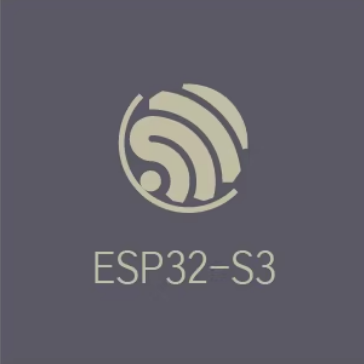
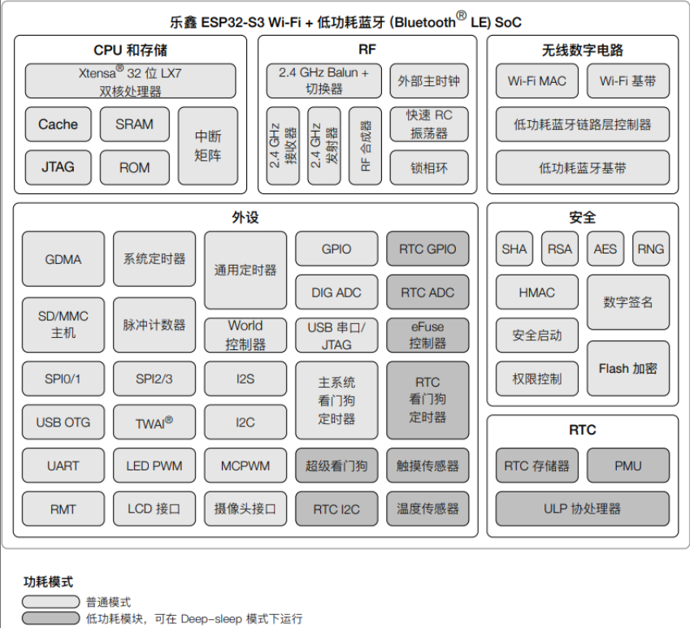
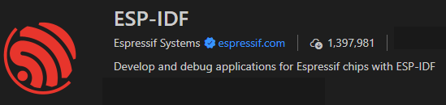

# ESP32S3与ESP-IDF介绍

## ESP32S3介绍

ESP32-S3是乐鑫科技推出的一款高性能AIoT微控制器，该芯片基于Xtensa架构，采用双核Xtensa LX7处理器设计，主频高达240MHz。芯片集成了专用的向量指令扩展单元，为AI推理任务提供硬件加速能力，完美支持TensorFlow Lite for Microcontrollers等主流边缘AI框架，在典型机器学习模型上的执行效率显著提升。

该芯片同时具备丰富多样的外设接口，包括USB OTG、摄像头接口、LCD接口以及多种传统接口，内置硬件加速器可对图像处理、音频识别、传感器数据融合等多种边缘计算任务进行高效处理。ESP32-S3集成了2.4GHz Wi-Fi和低功耗蓝牙5.0双模通信技术，具备低延迟、高性能、低功耗、快速唤醒、高安全性（包括flash加密与安全启动）等多项特性，是智能物联网设备的理想选择。

### 功能框图

### 核心参数

| 参数   | 描述                                                                                                                                       |
| ---- | ---------------------------------------------------------------------------------------------------------------------------------------- |
| CPU  | ESP32-S3 采用 Xtensa® LX7 CPU，这是一个哈佛结构的双核系统。它具有独立的指令总线和数据总线，所有的内部存储器、外部存储器以及外设都分布在这两条总线上。这种架构使得 CPU 可以同时读取指令和数据，从而提高了处理速度。                 |
| 存储   | ESP32-S3 具有丰富的存储空间。它内部有 384 KB 的内部 ROM， 512 KB 的内部SRAM，以及 8 KB 的 RTC 快速存储器和 8 KB 的 RTC 慢速存储器。 此外，它还支持最大 1 GB 的片外 FLASH 和最大 1 GB 的片外 RAM。 |
| 外设   | ESP32-S3 具有许多外设，总计有 45 个模块/外设。其中 11 个具有 GDMA（Generic DMA）功能，可以用来进行数据块的传输，减轻 CPU 的负担，提高整体性能。                                              |
| 通信   | ESP32-S3 同时支持 WIFI 和蓝牙功能，应用领域贯穿移动设备、可穿戴电子设备、智能家居等。在 2.4GHz 频带支持 20MHz 和 40MHz 频宽。                                                        |
| 向量指令 | ESP32-S3 增加了用于加速神经网络计算和信号处理等工作的向量指令。                                                                                                     |

## ESP-IDF介绍

[**ESP-IDF**](https://docs.espressif.com/projects/esp-idf/zh_CN/stable/esp32/) （Espressif IoT Development Framework）是乐鑫（Espressif Systems）为 ESP 系列芯片开发的物联网开发框架。它支持 ESP32、 ESP32-S、 ESP32-C 和 ESP32-H 系列 SoC，基于C/C++语言提供了一个自给自足的 SDK，方便用户在这些平台上开发通用应用程序。
