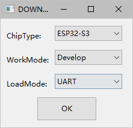
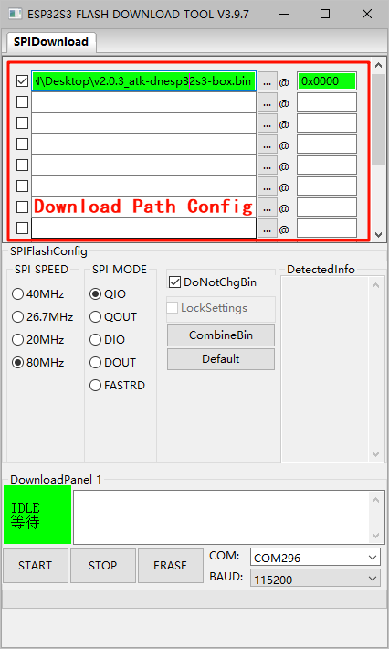
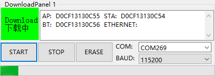
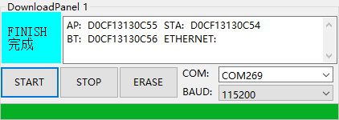

# 固件烧录

## 前言

DNESP32S3 BOX3 在出厂前默认都会在其内部的 Flash 上提前烧录好固件，用户无需烧录固件即可直接上手使用。

一般情况下，用户无需主动固件烧录，只有在需要更新固件等情况时，才需要进行固件烧录。

## 固件说明

用户可从 DNESP32S3 BOX3 的资料盘中获取编译好的固件，存放固件的目录路径为`资料盘/4，程序源码/v_5.5版本例程/`。

> 目录下存放的是基础例程与小智AI工程，后者需要解压后使用

固件的描述如下：

| 固件                                                         | 描述                     |
| ------------------------------------------------------------ | ------------------------ |
| v2.0.3_atk-dnesp32s3-box.bin | 小智AI固件 |
| xiaoling_atk-dnesp32s3-box_v1.2.1.bin | 聆思AI固件    |

## 固件烧录工具

本教程使用的 DNESP32S3 BOX3 固件烧录工具为 **flash_download_tool**，软件是乐鑫科技官方提供的用于 ESP32S3 固件烧录的图形化软件，可以通过[**这里**](https://docs.espressif.com/projects/esp-test-tools/zh_CN/latest/esp32/production_stage/tools/flash_download_tool.html)进行下载。

### 安装

> 本章以 Windows 环境为例，介绍使用 flash_download_tool 的安装

在[**Flash 下载工具用户指南**](https://docs.espressif.com/projects/esp-test-tools/zh_CN/latest/esp32/production_stage/tools/flash_download_tool.html)点击**Flash 下载工具**下载 **flash_download_tool.zip**，解压后即可直接使用，无需安装。

### 使用

乐鑫科技官方提供了 flash_download_tool 的使用说明，可以通过指南界面的介绍进行下载与使用。

## 固件烧录

>
>  > DNESP32S3 BOX3 的调试信息可通过板载的USB口输出，并借助相应的上位机软件进行观察。
>  >

### 1. 打开 flash_download_tool.exe

双击打开下载好的 `flash_download_tool.exe` 烧录软件

### 2. 选择固件文件

请参考[固件说明](#固件说明)并在"Download Path Config"中包含固件加载路径，固件下载地址，以 16 进制格式填写，比如 0x0000。其它配置按照下图所示配置即可。

**选择错误的固件以及输入了错误的十六进制下载地址可能导致设备运行异常，甚至可能导致不可逆的硬件损坏。**

                                     |

### 3. 开始烧录

> **固件烧录会损坏目标介质中的数据，如有需要，请在开始烧录前，做好目标介质中数据的备份工作。**

配置好“固件文件”后，其余的配置项按照上图所示配置，点击“START”按钮后，即可开始对 DNESP32S3 BOX3 进行固件烧录。

固件烧录时，软件底部的信息框会显示固件烧录进度

固件烧录成功后，软件底部的信息框会显示固件烧录结果

### 4. 运行固件

DNESP32S3 BOX3 在烧录完成后会呈现黑屏的状态，此时需要按下 DNESP32S3 BOX3 上方的**RST**按键才能正常运行固件。