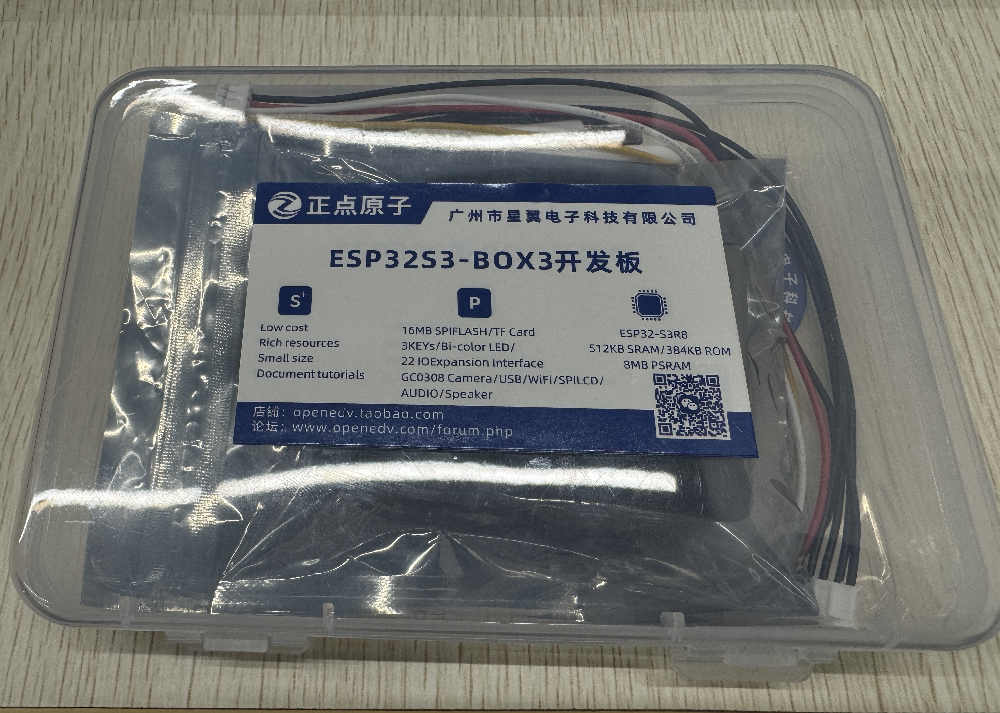
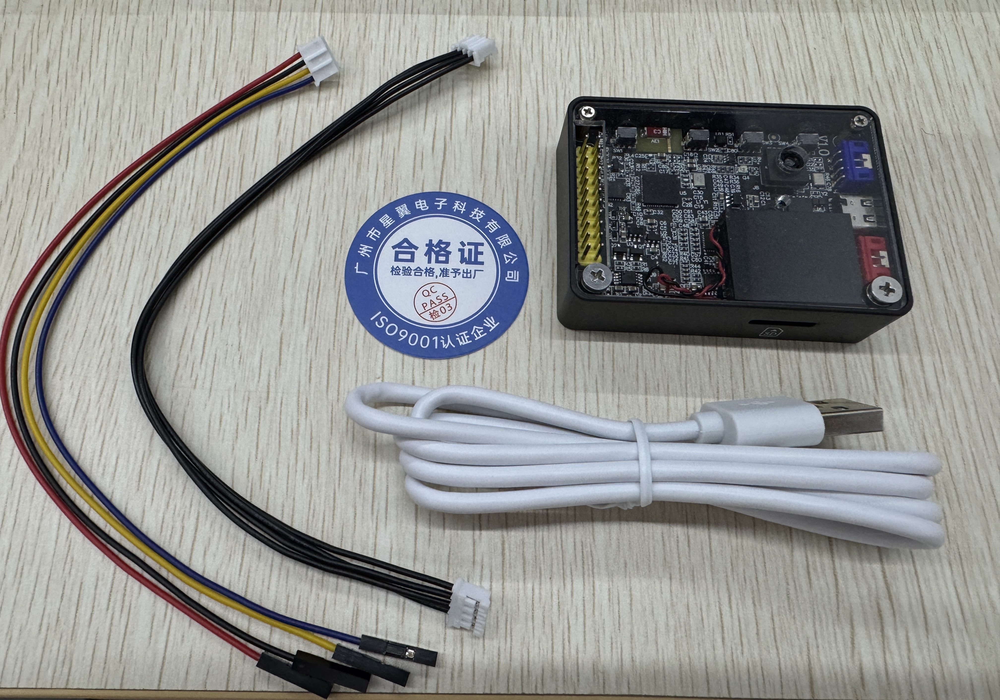

# 产品验收

在收到产品包裹后，请先根据自己的购买清单，核对收到的货物（通常情况下，产品包裹中会提供有发货单）。

## 外观检查

DNESP32S3 BOX3 采用透明塑料盒进行包装，如下

透明塑料盒中包含了 DNESP32S3 BOX3 标配套餐中的所有物品，如还购买了其他产品，请单独验收。

在确认透明塑料盒外观误损坏后，打开透明塑料盒并取出其中的所有物品进行清点、检查

透明塑料盒中应包含如下物品

1. DNESP32S3 BOX3（默认含一个摄像头）
2. USB 线数据线（Type-A to Type-C）
3. PH2.0 排线 - 4P
4. PH2.0 转杜邦彩排线 - 4P
5. 合格证

请依次检查透明塑料盒中物品的数量和外观是否无异。

## 功能测试

我们已经在发货前进行过出场测试例程了，确保每个用户拿到手的是自动运行的小智AI。

上电进入小智AI后，用户可以通过语音唤醒的方式（语音唤醒词默认设置为：你好小智）测试小智AI的各项功能，重点观察屏幕显示、按键、摄像头、腔体喇叭等原器件是否正常。

如在使用过程中遇到任何问题，请与我们联系。
